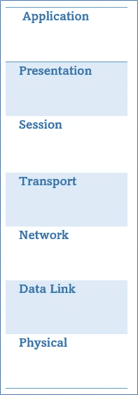
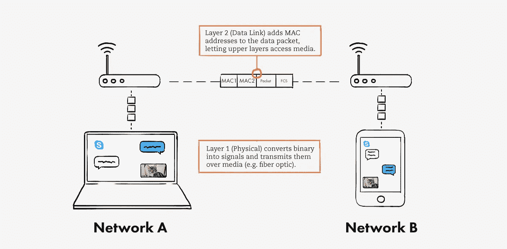
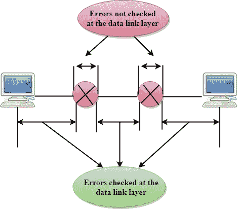
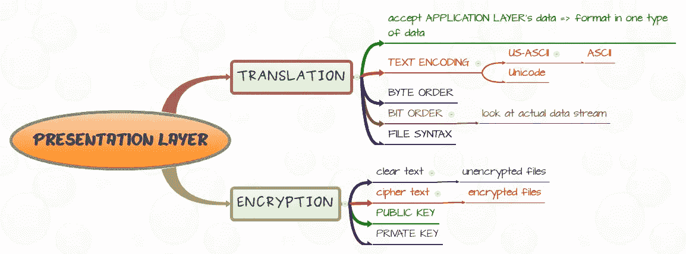

# 网络系统的功能:OSI 模型

> 原文：<https://levelup.gitconnected.com/functions-of-networking-system-osi-model-e596705f0f6c>

## 开放系统互连(OSI)模型是用于描述网络系统功能的概念框架。

照片由[在](https://unsplash.com/@comparefibre?utm_source=unsplash&utm_medium=referral&utm_content=creditCopyText) [Unsplash](https://unsplash.com/s/photos/networking?utm_source=unsplash&utm_medium=referral&utm_content=creditCopyText) 上对比纤维

OSI 模型，T4 模型，开放系统互连模型由七个独立且不同的层组成，这些层描述了计算机网络之间通信时的一组特定的功能和行为。

尽管用于通信的每个协议都适合这七层中的一层，但并不是所有的通信流都会使用下面的层。理解 OSI 模型的七层时，顺序很重要。

> **P**租约**D**o**N**ot**T**ell**S**ecret**P**asswords**A**N 更多

上面一行是用一句话记住所有 OSI 模型层的方法。

OSI 模型的 7 层

# 第 1 层:物理层

OSI 模型的最低层。使用这一层，位通过物理介质离开一端到达另一个端点。这种物理介质可以是有线的，也可以是无线的。在这一层中，我们可以找到上述物理设备和资源，如中继器、网络集线器、电缆、调制解调器和网络适配器。

这些都是管理物理通信的协议。作为物理层协议的例子，可以考虑 10BaseT、10Base2、100BaseTX 和 1000BaseT。它们决定了如何处理脉冲。

# 第 2 层:数据链路层

数据链路层使用第 2 层地址、 **MAC 地址**来识别网络上的网络接口，这被称为媒体访问控制。因此，通信可以在本地网络中从一个系统传到另一个系统。在这一层中，直接连接的节点用于节点到节点的数据传输，其中数据被打包成小帧。数据链路层可以纠正物理层可能出现的错误。MAC 地址为网络传输提供流控制和多路复用，逻辑链路控制(LLC)在物理介质和协议中提供流错误控制。

地址解析协议(ARP)、虚拟局域网(VLANs)、以太网和帧中继用作数据链路层协议。它们负责格式化要在传输介质上发送的数据。

# 第 3 层:网络层

网络层负责寻址并将数据包从一个端点路由到另一个端点。这一层使用逻辑地址找到端点。IP(互联网协议)是存在于该层的主要协议。路由器是一个至关重要的物理组件，用于在网络间路由信息。

## 对网络层的解释

照片来自[https://www.plixer.com/blog/network-layers-explained/](https://www.plixer.com/blog/network-layers-explained/)

# 第 4 层:传输层

传输层管理数据传输的分段消息。此外，它还负责通信的多路复用。让我们假设你需要向你的朋友发送 100MB 的数据。你的笔记本电脑能够处理你的数据量。但是你朋友的设备不能处理数据接收。在这种情况下，传输层决定问题并减慢传输速度。在这个缓慢的过程中，数据将被处理成段，然后发送到其他设备。但是不会发生数据丢失。当你的朋友发回回复时，sever 会提高传输速率，提高准确率。传输控制协议和用户数据报协议是主要的传输协议。这些协议使用端口进行寻址，因此接收系统知道将流量传递给哪个应用程序。

https://www.javatpoint.com/computer-network-transport-layer

# 第 5 层:会话层

会话层管理端点之间的通信。端点可以定义为客户端或服务器。远程过程调用(RPC)是会话层功能的一个例子。文件共享的一些组件也位于会话层，因为端点之间需要进行通信协商。会话层充当对话控制器。它以半双工或全双工模式通信。

# 第 6 层:表示层

表示层是 OSI 模型的第六层。它负责为应用层准备数据。表示层的主要功能是将数据从用户相关格式编码为公共格式，还负责在公共信道中传输之前对敏感数据进行加密和解密。使用通用格式的原因是，如果使用不同的格式，系统将无法通信。JPEG 和 ASCII 代码是表示层协议的两个主要例子。

图片来源:[https://www . router-switch . com/FAQ/what-is-presentation-layer-and-function . html](https://www.router-switch.com/faq/what-is-presentation-layer-and-function.html)

# 第 7 层:应用层

应用层是最重要的，也是最接近最终用户的。但它不是应用程序本身。应用层协议管理应用程序的通信需求。他们可以识别资源并管理与这些资源的交互。例如，当您访问一个网站时，超文本传输协议(HTTP)负责在客户端和服务器之间协商资源。HTTP 是一种应用层协议

以下功能可被确定为应用层的主要方面:

1.  识别通信伙伴——这一层识别等待数据传输的应用程序的通信伙伴的可用性。
2.  确定资源可用性-请求的通信必须有可用的资源来传输。所以这个函数确定是否有足够的资源可用。
3.  同步通信——所有通信都需要由应用层管理的同步协作。

如上所述，OSI 模型是开发任何类型网络模型的适当指南，它支持面向连接的服务和无连接服务。但主要缺点是 OSI 模型是一个纯理论模型，没有考虑技术的可用性。因此很难实施这种 model.TCP/IP 模型可以被认为是比这种 OSI 模型更好的解决方案。

查看关于计算机网络的基本介绍[这里](https://medium.com/geekculture/a-basic-introduction-to-the-computer-network-3b25f4f7d754)