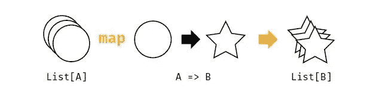
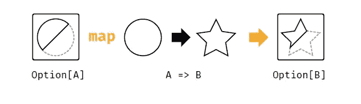
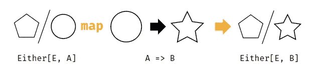
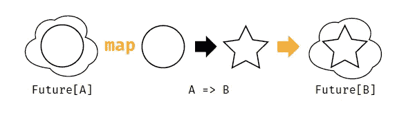

# 函数式编程中的函子

> 原文：<https://levelup.gitconnected.com/functors-in-functional-programming-dfaba4cfb2ed>


[斯卡拉与猫](https://www.scalawithcats.com/)

# 1.概观

在本教程中，我们将看看 [*仿子*](https://typelevel.org/cats/typeclasses/functor.html) 类中的 [*猫*](https://typelevel.org/cats/) 。*函子*的思想是“可以映射的东西”，我们将会看到实际映射了什么以及如何映射。在函数式编程中，当我们将类型或值包装在上下文或容器中时， ***函子*开始发挥作用。我们不需要知道那些上下文或容器本身的任何实现细节。**

# 2.SBT 属地

首先，让我们将 Cats 库添加到我们的依赖项中:

```
libraryDependencies += "org.typelevel" %% "cats-core" % "2.2.0"
```

这里我们使用的是 Cats 库的 2.2.0 版本。

# 3.什么是函子？

就函数式编程而言， **a *Functor* 是一种可以被函数映射的容器。**它基本上是一个抽象，允许我们编写通用代码，可用于*期货*、*期权*、*列表*、*、*或任何其他可映射类型。

简单来说，**任何定义了映射函数的类型，最好是“恒等函数”，都是*函子*。**

标准库没有本地基本特征/类型来表示这一点，所以我们可以写:

```
def calcBudget(orders: List[LineItem]) = orders.map(...) def calcBudget(maybeOrder: Option[LineItem]) = maybeOrder.map(...) def calcBudget(eventualOrder: Future[LineItem]) = eventualOrder.map(...)
```

但是我们不能笼统地这样写:

```
def calcBudget(order: Functor[LineItem]) = order.map(...)
```

# 4.Cats 仿函数类型类

然而，使用 cats 的*仿函数*类型类，我们可以编写一个通用代码，用于*期货*、*选项*、*列表*、*或者*或者任何其他可映射类型。

但在此之前，让我们看看*函子*类型类的定义。用映射操作 *(A = > B) = > F[B]* 将*仿函数*定义为 *F[A]* :

```
package cats trait Functor[F[_]] { 
  def map[A, B](fa: F[A])(f: A => B): F[B] 
}
```

现在让我们使用*仿函数*重写*计算预算*:

```
import cats.Functor case class LineItem(price: Double) def calcBudget[F[_]](order: F[LineItem])(implicit functorEvidence: Functor[F]): F[LineItem] = { 
  Functor[F].map(order)(o => o.copy(price = o.price * 1.2))
}
```

让我们解码这个方法签名。

*calcBudget* 方法基于 *F[_]* 的类型进行参数化。这里的 *F[_]* 表示任何可映射的类型，例如*选项*、*列表*、*未来*等。参数*订单*本身属于类型*F【LineItem】*，即包装 *LineItem* 的任何类型。

隐式参数*Functor evidence:Functor[F]*意味着我们必须有一个*类型的类实现*，它允许我们将 *F* 视为 *Functor* 。

在方法体中，我们称*为函子[F]。map()* 即我们使用隐式证据 *functorEvidence* 为 *F* 创建一个函子，并将其称为 *map* 方法。

# 5.函子定律

如果我们正在创建自己的*函子*，那么那些*函子*必须遵守一些规则，叫做*函子定律*:

## 5.1.同一律

当一个*函子*被 identity 函数(返回其参数不变的函数)映射时，那么我们必须取回原来的*函子*(容器及其内容保持不变)。

```
Functor[X].map(x => identity(x)) == Functor[X]
```

## 5.2.合成定律

当一个*函子*映射到两个函数的组合上时，那么它应该与一个函数映射到另一个函数上是一样的。

```
Functor[X].map(f).map(g) == Functor[X].map(x => g(f(x))
```

# 6.Scala 中函子的例子

在 Scala 中，我们知道*仿函数的* *映射*函数来处理效果。 **Cats 为*函子*** 提供了各种类型类实现，对于预定义的类型如*列表*、*期货*、*选项*、*要么*等。

## 6.1.列为函子

现在，让我们看看*列表*如何充当*仿函数*:



*列表*被认为是*仿函数*，因为它有一个*映射*方法。当使用*映射*方法迭代*列表*时，我们应该认为它是一次性转换列表中的所有值，而不改变*列表*的结构。

我们可以使用以下示例来实现上述概念:

```
import cats.Functor object ListFunctor { 
  def transformList(list: List[Int]): List[Int] = { 
    Functor[List].map(list)(_ * 2) 
  } 
} val list: List[Int] = List(1, 2, 3, 4, 5) 
val transformedList = List(2, 4, 6, 8, 10) 
assert(ListFunctor.transformList(list) == transformedList)
```

## 6.2.作为函子的选项

现在，让我们看看*选项*如何充当*仿函数*:



*选项*也被认为是*仿函数*，因为它也有一个*映射*方法。当我们映射一个*选项*时，我们转换了内容，但保留了*的一些*或*无*上下文不变。

我们可以使用以下示例来实现上述概念:

```
import cats.Functor object OptionFunctor { 
  def transformOption(option: Option[Int]): Option[String] = { 
    Functor[Option].map(option)(_.toString) 
  } 
} val option: Option[Int] = Some(10) 
val transformedOption = Some("10")
assert(OptionFunctor.transformOption(option) == transformedOption)
```

## 6.3.要么作为函子

现在，让我们看看*或者*如何充当*仿函数*:



*任一*也被认为是*函子*，因为它也有一个*映射*方法。当我们映射一个*或者*时，我们转换了内容，但是保持*左*或者*右*上下文不变。

我们可以使用以下示例来实现上述概念:

```
import cats.Functor object EitherFunctor { 
  def transformEither(either: Either[Int, String]): Either[Int, Int] = { 
    Functor[Either].left.map(either)(_.size) 
  } 
} val either: Either[Int, String] = Left("Baeldung") 
val transformedEither = Left(8)
assert(EitherFunctor.transformedEither(either) == transformedEither)
```

## 6.4.作为函子的未来

现在，让我们看看*未来*如何充当*仿子*:



*Future* 是一个*函子*，它通过对异步计算进行排队，并在它们的前任完成时应用它们，从而对异步计算进行排序。它的 *map* 方法的类型签名与上面的签名具有相同的形状。然而，行为是非常不同的。**在*未来*的情况下，打包的计算可能正在进行、已完成或被拒绝。**如果*未来*完成，我们的映射函数可以立即调用。如果没有，一些底层线程池将函数调用排队，稍后再返回。我们不知道我们的函数什么时候被调用，但是我们知道它们被调用的顺序。这样， ***Future* 提供了与*列表*、*选项*、*任一*** 相同的排序行为。

我们可以使用以下示例来实现上述概念:

```
import cats.Functor object FutureFunctor { 
  def transformFuture(future: Future[Int]): Future[Int] = { 
    Functor[Future].map(future)(_ + 1) 
  } 
} val future: Future[Int] = Future{10} 
val transformedFutureResult = 11
FutureFunctor.transformFuture(future).map(result => assert(result == transformedFutureResult))
```

# 7.函子的重要性

通过使用函子，我们不局限于标准库中的类型，因此我们可以抽象任何可映射的东西。通过使用*语法*或*扩展*方法的概念，我们可以定义一个映射方法到我们自己的类型。这个概念允许我们写 *order.map(…)* 而不是*Functor【F】。地图(顺序)(…)* 。我们还可以通过指定 type *F[_]* 是一个*仿函数*来删除隐式证据参数:

```
import cats.syntax.functor._ //for map def calcBudget[F[_]: Functor](order: F[LineItem]): F[LineItem] = {
  order.map(o => o.copy(price = o.price * 1.2)) 
}
```

但是我们也可以构建一个高阶函数，它可以处理任何类型并执行任何映射操作:

```
def withFunctor[A, B, F[_]](item: F[A], op: A => B)(implicit functorEvidence: Functor[F]): F[_] = {
  Functor[F].map(item)(op) 
}val lineItemsList = List(LineItem(10.0), LineItem(20.0)) 
val result = FunctorSyntax.withFunctor(lineItemsList, calcBudget) 
assert(result == List(LineItem(10.0), LineItem(20.0)))
```

在上面的例子中， *A* ， *B* & *F* 可以是任何东西，只要方法的调用者:

*   提供证据证明 *F* 是*函子*
*   知道如何从 *A* 映射到 *B*

# 8.摘要

在本文中，我们已经研究了 Scala 的 Cats 库提供的*函子*。*函子*是一种提供映射函数来表示排序行为的容器。我们讨论了什么是*函子*的需求，以及如何定义它们。然后我们学习了两个*函子*必须遵守的定律。然后我们看到，我们可以为 Scala 生态系统*中存在的所有*可映射*类型编写*仿函数*类型类实现，比如* *期货*、*选项*、*列表、*等等。我们不局限于标准库中的类型。我们也可以通过使用*语法*或*扩展*方法的概念来定义*映射*方法到我们自己的类型。

所有的代码实现都可以在 GitHub 的[上获得。](https://github.com/mansi7babbar/functors-in-functional-programming)

# 类似文章-

你也可以看看我关于 *Scala Cats* 系列的其他文章

*   【Scala 猫入门
*   [潜入 Scala 猫—半群](/diving-into-scala-cats-semigroups-732ef2432042)
*   [潜入 Scala 猫——幺半群](/diving-into-scala-cats-monoids-82e744b9e518)
*   [深入 Scala 猫——函子](/diving-into-scala-cats-functors-c957285d7009)