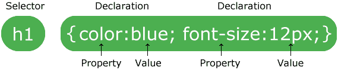
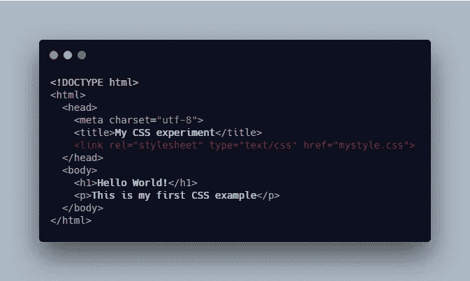
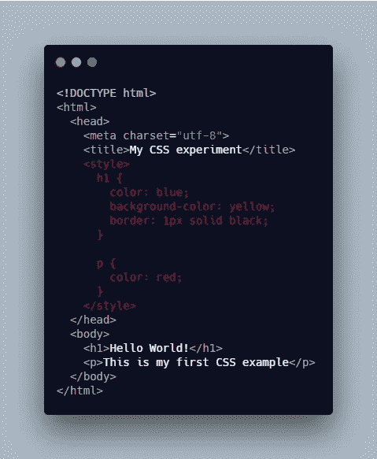
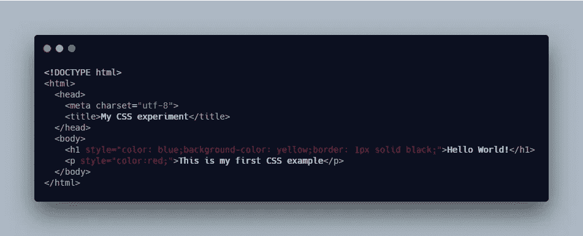
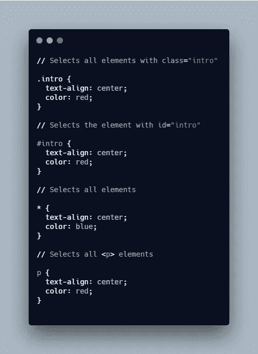
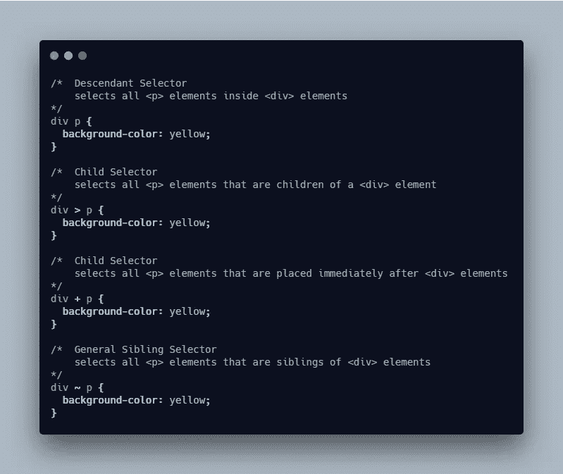
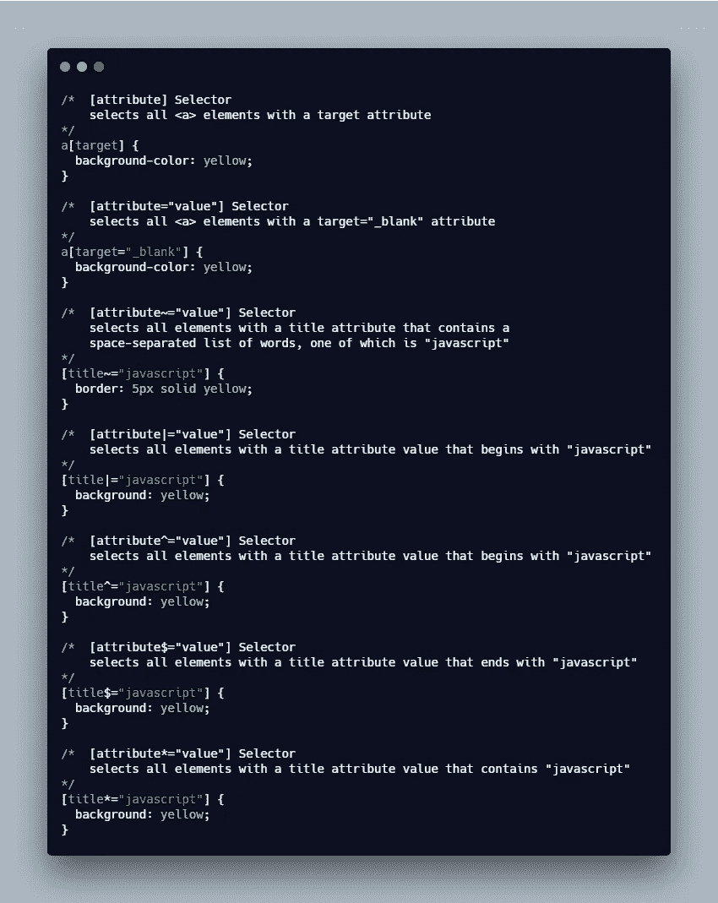

# 初学者的基本 CSS

> 原文：<https://levelup.gitconnected.com/fundamental-css-for-beginners-f44e8b9a5da5>

## HTML CSS

## CSS 基本知识的总结，如何在 HTML 文档中添加 CSS，以及 CSS 选择器的概述。

由 [Ashkan Forouzani](https://unsplash.com/@ashkfor121?utm_source=unsplash&utm_medium=referral&utm_content=creditCopyText) 在 [Unsplash](https://unsplash.com/s/photos/coffee-cup?utm_source=unsplash&utm_medium=referral&utm_content=creditCopyText) 拍摄

在这篇文章中，我将分享一些关于 CSS 的基本知识，这些知识是每个初学前端开发的人都需要知道的:

1.  什么是 CSS？
2.  添加 CSS 的三种方法
3.  五种选择器

*更多类似内容，请查看*[*https://betterfullstack.com*](https://betterfullstack.com)

# 什么是 CSS？

CSS 是一种描述 HTML 文档风格的语言。它代表**级联样式表**。

CSS 用于定义网页的样式，包括设计、布局以及不同设备和屏幕尺寸的显示变化。

## 语法:

规则以一个[选择器](https://developer.mozilla.org/en-US/docs/Glossary/CSS_Selector)打开。这个*选择*我们将要样式化的 HTML 元素。

css 语法

然后我们有了一组花括号`{ }`。其中将有一个或多个**声明**，它们采用**属性**和**值**对的形式。

# 添加 CSS 的三种方法

将 CSS 放入文档有三种方法:

1.  外部样式表
2.  内部样式表
3.  内嵌样式

## 外部样式表

这是将 CSS 附加到文档的最常见和最有用的方法，因为您可以将 CSS 链接到多个页面，从而允许您使用相同的样式表来设置它们的样式。

这意味着你可以通过改变一个文件来改变整个网站的外观。

将外部 css 导入 index.html

## 内部样式表

内部样式表是指没有外部 CSS 文件，而是将 CSS 放在包含在 HTML `[<head>](https://developer.mozilla.org/en-US/docs/Web/HTML/Element/head)`中的`[<style>](https://developer.mozilla.org/en-US/docs/Web/HTML/Element/style)`元素中。

index.html 的内部样式表

## 内嵌样式

内嵌样式是只影响一个元素的 CSS 声明，包含在一个`style`属性中。

index.html 的嵌入式风格

基于[#my-id {}](/how-to-understand-css-specificity-2caabc5f67a9#</code>，后跟元素的 id。Ex <code class=)

*   [**通用选择器** `*`选择页面上的所有 HTML 元素。](/how-to-understand-css-specificity-2caabc5f67a9#</code>，后跟元素的 id。Ex <code class=)*   [**元素选择器**选择指定元素名称的所有元素。Ex `div {}`或`span {}`](/how-to-understand-css-specificity-2caabc5f67a9#</code>，后跟元素的 id。Ex <code class=)

[简单选择器示例](/how-to-understand-css-specificity-2caabc5f67a9#</code>，后跟元素的 id。Ex <code class=)

## [组合选择器](/how-to-understand-css-specificity-2caabc5f67a9#</code>，后跟元素的 id。Ex <code class=)

[CSS 中有四种不同的组合子:](/how-to-understand-css-specificity-2caabc5f67a9#</code>，后跟元素的 id。Ex <code class=)

1.  [**后代选择器**匹配指定元素的所有后代元素。](/how-to-understand-css-specificity-2caabc5f67a9#</code>，后跟元素的 id。Ex <code class=)
2.  [**子选择器**选择指定元素的所有子元素。](/how-to-understand-css-specificity-2caabc5f67a9#</code>，后跟元素的 id。Ex <code class=)
3.  [**相邻兄弟选择器**选择指定元素的所有相邻兄弟元素。兄弟元素必须有相同的父元素，“相邻”意味着“紧随其后”。](/how-to-understand-css-specificity-2caabc5f67a9#</code>，后跟元素的 id。Ex <code class=)
4.  [**通用兄弟选择器**选择指定元素的所有兄弟元素。](/how-to-understand-css-specificity-2caabc5f67a9#</code>，后跟元素的 id。Ex <code class=)

[组合选择器示例](/how-to-understand-css-specificity-2caabc5f67a9#</code>，后跟元素的 id。Ex <code class=)

## [伪类选择器](/how-to-understand-css-specificity-2caabc5f67a9#</code>，后跟元素的 id。Ex <code class=)

[伪类用于定义元素的特殊状态。](/how-to-understand-css-specificity-2caabc5f67a9#</code>，后跟元素的 id。Ex <code class=)

[元素的“状态”是什么？](/how-to-understand-css-specificity-2caabc5f67a9#</code>，后跟元素的 id。Ex <code class=)

*   [它是当用户将光标移到按钮上或移出时按钮的一种状态。](/how-to-understand-css-specificity-2caabc5f67a9#</code>，后跟元素的 id。Ex <code class=)
*   [它是链接被点击前后的状态。](/how-to-understand-css-specificity-2caabc5f67a9#</code>，后跟元素的 id。Ex <code class=)
*   [它是输入被聚焦时的一种状态。](/how-to-understand-css-specificity-2caabc5f67a9#</code>，后跟元素的 id。Ex <code class=)

[有一些常见的伪类选择器有:](/how-to-understand-css-specificity-2caabc5f67a9#</code>，后跟元素的 id。Ex <code class=)

1.  [**锚标签:**`link``visited``hover``active`。此处举例](/how-to-understand-css-specificity-2caabc5f67a9#</code>，后跟元素的 id。Ex <code class=)[。](https://www.w3schools.com/css/tryit.asp?filename=trycss_link2)
2.  **元素:**`first-child``last-child``nth-child(n)`。这里的例子。
3.  **元素:** `hover`。此处举例[。](https://www.w3schools.com/css/tryit.asp?filename=trycss_pseudo-class_hover_div)
4.  **输入:** `focus`。这里的例子[是](https://www.w3schools.com/css/tryit.asp?filename=trycss_link_focus)。
5.  **输入:** `checked`。这里的[举例](https://www.w3schools.com/cssref/tryit.asp?filename=trycss3_checked)。

## 伪元素选择器

CSS 伪元素用于样式化元素的指定部分。

什么是元素的指定部分？

*   样式元素的第一个字母或第一行。此处举例[。](https://www.w3schools.com/css/tryit.asp?filename=trycss_firstline)
*   在元素内容之前或之后插入内容。更多细节[此处](/understand-before-and-after-pseudo-elements-98eae657ae10?source=friends_link&sk=2d83e852000875b82abbca85d4bd0942)。

## 属性选择器

有 7 个属性选择器:

属性选择器示例

1.  `[attribute]`选择器用于选择具有指定属性的元素。
2.  `[attribute="value"]`选择器用于选择具有指定属性和值的元素。
3.  `[attribute~="value"]`选择器用于选择属性值包含指定单词的元素。
4.  `[attribute|="value"]`选择器用于从指定值开始选择具有指定属性的元素。值**必须是一个完整的字。**
5.  `[attribute^="value"]`选择器用于选择属性值以指定值开始的元素。值**不是**必须是一个完整的单词。
6.  `[attribute$="value"]`选择器用于选择属性值以指定值结束的元素。值**不是**必须是一个完整的单词。
7.  `[attribute*="value"]`选择器用于选择属性值包含指定值的元素。值**不是**必须是一个完整的单词。

# 摘要

在这篇文章中，我们学习了关于如何在 HTML 文档中添加 CSS 和 5 种 CSS 选择器的基本知识。

掌握好 CSS 知识是非常重要的。这将帮助您修复 CSS 问题，如布局、浏览器兼容性和元素状态问题。另外，当你有很强的 CSS 技能时，你可以构建复杂的 UI。

我希望这篇文章对你有用！可以跟着我上[中](https://medium.com/@transonhoang?source=post_page---------------------------)。我也在[推特](https://twitter.com/transonhoang)上。欢迎在下面的评论中留下任何问题。我很乐意帮忙！

# 资源/参考资料

[1]: CSS 教程[https://www.w3schools.com/css/css_syntax.asp](https://www.w3schools.com/css)

【2】:CSS 是什么？[https://developer . Mozilla . org/en-US/docs/Learn/CSS/First _ steps/What _ is _ CSS](https://developer.mozilla.org/en-US/docs/Learn/CSS/First_steps/What_is_CSS)

 [## 故事-更好的全栈

### 关于 JavaScript、Python 和 Wordpress 的有用文章，有助于开发人员减少开发时间并提高…

betterfullstack.com](https://betterfullstack.com/stories/)