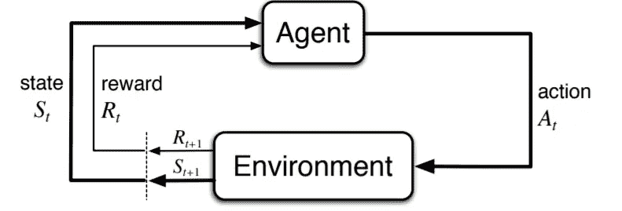
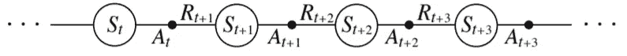
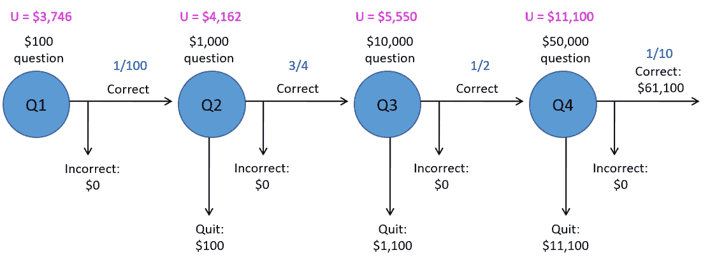
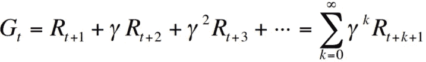
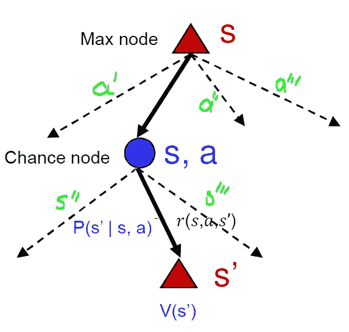

# 强化学习的基础:马尔可夫决策过程

> 原文：<https://levelup.gitconnected.com/fundamental-of-reinforcement-learning-markov-decision-process-8ba98fa66060>

## 第 1 部分:解释马尔可夫决策过程和贝尔曼方程的概念

Gert RDA valasevi it 在 [Unsplash](https://unsplash.com/?utm_source=medium&utm_medium=referral) 上拍摄的照片

在本文中，我将重点介绍强化学习(RL)的基础——马尔可夫决策过程(MDP)公式以及值迭代、策略迭代和 Q 学习算法的一些重要组件。

**马尔可夫决策过程(MDP)** 【MDP】是 RL 的数学基础，如果我们想要完全理解 RL 算法，我们总是需要从 MDP 开始。MDP 基本上是一个不确定情况下的决策框架。它可以提供一种计算最优决策策略的方法。首先，让我们介绍一下代理-环境接口。

代理-环境界面。来源——斯坦福大学 CME 241[讲座](https://web.stanford.edu/class/cme241/lecture_slides/rich_sutton_slides/5-6-MDPs.pdf)。

现在，让我们假设在离散的时间步长 **t = 0，1，2，…** 只有一个智能体与环境交互。在每个时间步长 **t** 时，智能体可以观察状态以了解状态 **Sₜ ∈ S** 的情况。然后它会采取行动 **Aₜ ∈ A(sₜ)** 。采取行动后会获得一定的奖励 **R_{t+1}** 到达下一个状态 **S_{t+1} ∈ S** 。然后，它将重复采取另一个行动，接受另一个奖励，并达到另一个状态，如下图所示。

代理和环境的相互作用。来源——斯坦福大学[CME 241 讲座](https://web.stanford.edu/class/cme241/lecture_slides/rich_sutton_slides/5-6-MDPs.pdf)。

这是顺序决策。当前的行动将对未来产生影响，即代理人将获得多少总回报以及代理人将达到哪个未来状态。满足马尔可夫性质(转移性质只取决于当前状态，而不取决于以前的状态或历史，换言之，这意味着未来发生的事情只取决于当前状态)的序列决策问题称为马尔可夫决策过程。

MDP 的配方(组分)

*   马尔科夫状态从初始状态 s0 开始
*   **动作** a，在每个状态 s 都有动作集合 A(s)
*   **转换模型** P(s'|s，a)，在当前状态 s，如果代理采取一个动作到达另一个状态 s '的概率。然而，它不是 100%确定它将达到哪个状态，有一个概率分布，因此它是一个不确定情况下的决策框架。
    假设:从 s 到 s’的概率只取决于 s 和 a 而不取决于任何其他过去的动作或状态(马尔可夫性质)
*   **奖励函数** R(s)或 R(s)

在 MDP 中，目标是得到一个**最优决策策略****【𝝅(s】**，这是代理在任何给定状态下应该采取的行动。

现在让我们用一个具体的例子(游戏展示如下图所示)来解释 MDP。这是一种我们在电视节目中看到的游戏，主持人会给参与者一系列问题，这些问题的难度和回报都在增加。在参与者成功回答一个问题后的每个时间点，他们有两个选择拿着钱离开或者继续下一个问题。如果参与者继续回答下一个问题，有两种可能:成功回答该问题并做出另一个决定，或者没有回答该问题并失去一切。

下面的例子共有 4 个问题，难度逐渐增加，第一个问题是 100 美元，第二个是 1000 美元，第三个是 10000 美元，最后一个是 50000 美元。在回答完每个问题后，参与者需要决定是退出游戏还是继续回答。显然，为了做出决定，参与者需要知道如果他们决定继续回答问题，他们可以获得的预期奖励，这取决于两个因素:正确回答问题的概率以及做出决定后发生的事情。基本上，这里我们需要做一些逆向归纳。

游戏节目。来源——cs 440/ECE 448 中伊利诺伊大学[讲座](http://isle.illinois.edu/speech_web_lg/coursematerials/ece448/17fall/ece448fa2017lecture25.pptx)。

例如，决定是否回答 Q2 将取决于回答 Q2 后发生的事情或回答 Q2 后得到多少奖励/金钱。同样，在决定是回答 Q3 还是 Q4 时，参与者需要知道在他们决定回答 Q3 或 Q4 后会发生什么。(逆向归纳)

因此，我们首先考虑我们需要做出的最后一个决定，即参与者是否应该回答最后一个问题 Q4。给出正确回答 Q4 的概率为 0.1。如果参与者回答 Q4，∴期望效用= 0.1 *(100+1000+10000+50000)+0.9 * 0 = 6110 美元，如果他们不回答 Q4，他们将获得 11100 美元。由于不回答的收益更大，在回答了 Q3 后，这里的最优决策是退出并获得 11，100 美元的奖励。

类似地，对于 Q3，不回答的收益是 1，100 美元，回答的预期收益是 0.5 * 11，100+0.5 * 0 = 5，550 美元。这里的最佳决策是通过回答 Q3 继续博弈。

接下来，Q2 不回答的收益是 100 美元，回答的预期收益是 0.75 * 5550+0.25 * 0 = 4162.5 美元。这里的最优决策是通过回答 Q2 来继续博弈。

最后，对于 Q1 来说，不回答的收益是 0 美元，回答的期望收益是 0.9 * 4，162.5+0.1 * 0 = 3，746.25 美元。这里的最优决策是通过回答 Q1 来继续博弈。

这正是 MDP 问题，有许多状态(每个问题)和必须做出的决定(退出或继续)，过渡模型(成功回答问题并到达另一个问题或回答失败并带着 0 美元回家)和奖励(最佳收益)。解决方案是参与者在任何给定状态下应该采取的最优策略或行动。

如上所述，最优策略应该最大化给定轨迹上的累积回报，如𝜏 = ~~ₜ ，A **ₜ** ，R **ₜ >** 在某些策略下:~~

累积奖励。来源——斯坦福大学 CME 241[讲座](https://web.stanford.edu/class/cme241/lecture_slides/rich_sutton_slides/5-6-MDPs.pdf)。

在 MDP，它关心的是总报酬，通常有一个叫做γ的贴现因子，取值在 0 到 1 之间。贴现因子是一个来自经济学的概念，即今天的钱比明天的钱更值钱，因为人们可以用这些钱来做投资。此外，通过使用折扣因子，累积奖励将是有界的，例如 **ₜ ≤** R **ₘₐₓ** /(1-γ)，这对算法有一些好的影响，特别是在理论分析中。折扣因子是可能影响学习算法的收敛或速度的超参数，通常在 0.9 到 1 之间。

现在，让我们定义一些重要的东西来解释 RL 算法。

*   如果代理人从状态 **s** 开始执行最优策略 **𝜋** ，状态的真实值(通常用**v(s)】**表示)是期望的贴现回报的总和。
    **𝑉**𝜋**(𝑠)**=**𝔼**𝜋**【𝐺ₜ|𝑆ₜ=𝑠】**
*   同样，我们可以将一个状态-动作对的动作-值定义如下:
    **𝑄**𝜋**(𝑠,𝑎)**=**𝔼**𝜋**【𝐺ₜ|𝑆ₜ=𝑠，𝐴ₜ=𝑎】**
*   而 q 与 v 的关系如下:
    **𝑉**𝜋**(𝑠)**=σ**𝑄**𝜋**(𝑠,𝑎)****𝜋(𝑎|s)**

如何推导贝尔曼方程的图解？来源——cs 440/ECE 448 中的伊利诺伊大学[讲座](http://isle.illinois.edu/speech_web_lg/coursematerials/ece448/17fall/ece448fa2017lecture25.pptx)。

从上图可以看出，在状态 s，我们可以采取许多可能的行动(a、a’、a”或 a”)。在采取行动 a 后，我们将到达某个状态 s ',但以一定概率到达 s ' '或 s ' ' '仍有不确定性。回到游戏节目的例子，在状态可以采取的行动是参与者是否回答问题(a)或不回答(a’)。如果他们决定回答这个问题，有两种结果:正确回答这个问题并进入下一个问题，或者回答失败并回家。在状态 **s** 中采取行动 **a** 的期望值基本上是考虑参与者用转移概率可以达到的不同状态。如果我们到达状态**s’**我们将会得到一个奖励，这个状态也有一些值**V(s’)**:**参与者到达状态 s’时可以得到的累积奖励。
**𝑄(𝑠,𝑎)=σp(s'|𝑠,𝑎)[r(s，a，s') + γ * V(s')]****

**现在回到上图中的状态 **s** ，代理人可以在动作空间 a 中采取不同的动作(a，a’，a”，a’”)，所选择的最优动作 **a** 是最大化上面提到的 **Q(s，a)**:
**𝜋∗(𝑠)=argmax**𝑎∈𝐴**σp(s'|𝑠,𝑎【r(s，a，s’)+γ* v(s’)】****

**并且 **V(s)** 根据其后继状态的效用的递归表达式被称为**贝尔曼方程**:
**v(𝑠)=max**𝑎∈𝐴**σp(s'|𝑠,𝑎【r(s，a，s’)+γ* v(s’)】****

**如果状态空间和动作空间是有限的，我们可以通过求解线性方程组来求解 MDP。但是它通常效率不高，因为它必须枚举所有的转换、所有的状态和动作。因此，有两种流行的算法叫做值迭代和策略迭代来解决 MDP 问题。**

# **推荐阅读**

** [## 强化学习的基础:价值迭代和政策迭代教程

### 第二部分:解释用于解决 MDP 问题的价值迭代和策略迭代的概念。

levelup.gitconnected.com](/fundamentals-of-reinforcement-learning-value-iteration-and-policy-iteration-with-tutorials-a7ad0049c84f)  [## 强化学习的基础:蒙特卡罗算法

### 第三部分:阐述了无模型 RL 算法的基本原理:蒙特卡罗算法

levelup.gitconnected.com](/fundamental-of-reinforcement-learning-monte-carlo-algorithm-85428dc77f76) 

# 参考

[1] [斯坦福大学 CME241 讲座:金融中随机控制问题的强化学习](https://web.stanford.edu/class/cme241/lecture_slides/rich_sutton_slides/5-6-MDPs.pdf)，2021

[2] [伊利诺伊大学 CS440/ECE448 讲座:人工智能](http://isle.illinois.edu/speech_web_lg/coursematerials/ece448/17fall/ece448fa2017lecture25.pptx)，2021**