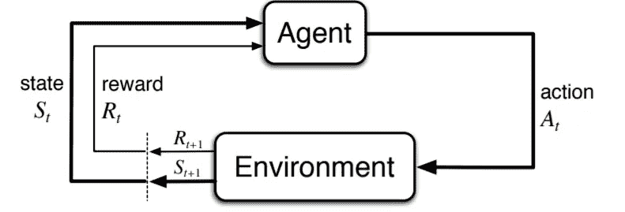
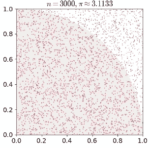
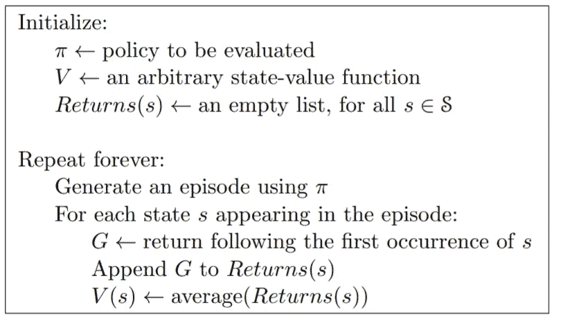
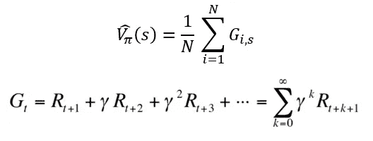
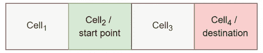
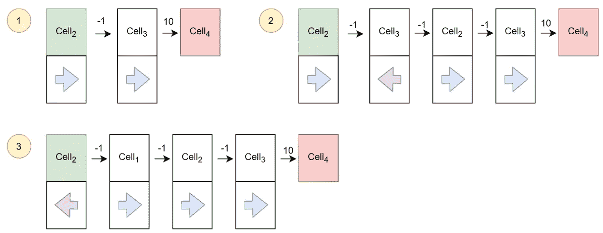
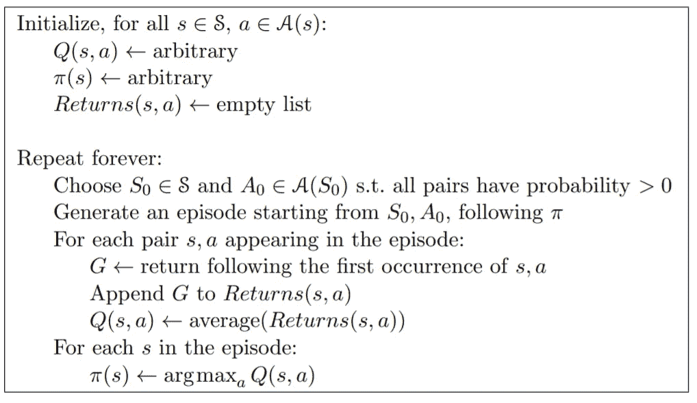
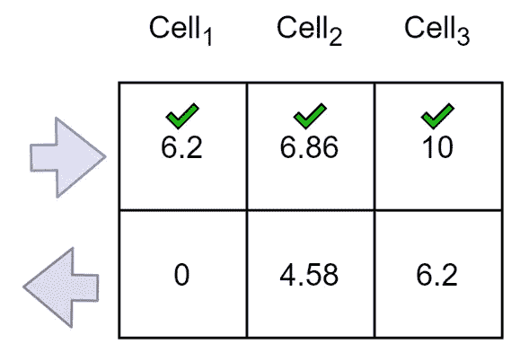

# 强化学习的基础:蒙特卡罗算法

> 原文：<https://levelup.gitconnected.com/fundamental-of-reinforcement-learning-monte-carlo-algorithm-85428dc77f76>

## 第三部分:阐述了无模型 RL 算法的基本原理:蒙特卡罗算法

卢卡斯·本杰明在 [Unsplash](https://unsplash.com/?utm_source=medium&utm_medium=referral) 上的照片

回想一下在[第一部分](/fundamental-of-reinforcement-learning-markov-decision-process-8ba98fa66060)中介绍的智能体-环境界面，观察是智能体对环境的感知，行动将改变环境的状态，奖励是一个标量值，表示智能体在步骤 t 做得有多好，智能体的目标是最大化累积奖励。

图 1:代理-环境界面。来源——斯坦福大学 CME 241[讲座](https://web.stanford.edu/class/cme241/lecture_slides/rich_sutton_slides/5-6-MDPs.pdf)。

强化学习不同于其他机器学习范式是因为代理的行为影响了它接收到的后续数据，没有监督(标签数据)，只有奖励信号。

在[第 2 部分](/fundamentals-of-reinforcement-learning-value-iteration-and-policy-iteration-with-tutorials-a7ad0049c84f)中，我们计算了价值函数，并找到了转移概率已知的最优策略。然而，在大多数情况下**转移概率是未知的**，我们需要**学习**价值函数并从经验中找到最优策略**。**

在本文中，我将使用采样方法解释蒙特卡罗算法，这是一种无模型 RL 算法。

# 蒙特卡洛

先说什么是蒙特卡罗(MC)？
MC 是一种利用随机性解决问题的方法，即通过生成合适的随机数并观察符合某些特性的数字分数来解决问题。使用 MC 计算π的示例:

图 2:为《𝑛=3000 时报》在正方形上随机放置圆点

从上图可以看出，给定 r = 1，红色面积= 1/4 πr，正方形面积= r。
∴ π ≈ 4 ×红色区域的点数/总点数

# 法国蒙特卡洛

同样，在 RL 中，我们使用 MC 对许多轨迹进行随机采样，并在此基础上尝试估计不同状态的值——回想一下，价值函数是从 s: V𝜋(𝑠)=𝔼𝜋[𝐺ₜ|𝑆ₜ=𝑠]开始的预期收益，而 q 值函数是从𝑠开始的预期收益，采取行动𝑎: 𝑄𝜋(𝑠,𝑎)=𝔼𝜋[𝐺ₜ|𝑆ₜ=𝑠，𝐴ₜ=𝑎].轨迹是从开始状态到结束状态的状态序列。例如(s₁，a₁，r₂，s₂，a₂，r₃，…，rₜ).)

## 首次访问蒙特卡洛政策评估

图 3:首次访问蒙特卡洛政策评估—伪代码[3]

这里我们用经验来学习一个经验状态值函数:

当计算价值函数时，它对访问(𝑠,𝑎).)后观察到的回报进行平均首次访问 MC 意味着平均回报率只有第一次(𝑠,𝑎)被访问的轨迹。

我们通过一个简单的例子来了解一下。假设下面提到的一维网格世界环境。

图 4:示例

代理处于 1x4 网格世界中，状态 s ∈ {cell₁、cell₂、cell₃、cell₄}，动作 a ∈{向左移动，向右移动)。在这种环境下，代理人如果到达目的地将获得 10 分奖励，每个动作将花费 1 分。

假设以下是 3 个轨迹的表示:

图 5:随机采样的 3 条轨迹

给定这 3 条轨迹，我们可以计算所有非终点状态的价值函数:cell₁、cell₂、cell₃.首先，我们计算𝛾=0.9.每集的回报

由于第一集和第二集没有涉及 cell₁，
**的经验值函数为−1×0.9⁰−1×0.9 +10×0.9 = 6.2**

**第一集 cell₂:gₜ=−1×0.9⁰+10×0.9 = 8
第二集 gₜ=−1×0.9⁰−1×0.9 1×0.9+10×0.9 = 4.58
第三集 gₜ=−1×0.9⁰−1×0.9 1×0.9+10×0.9 = 4.58
cell₂**的经验值函数为(8+4.58+4.58)/3=5.72****

**第一集 cell₃:gₜ=10×0.9⁰=10
第二集 Gₜ=−1×0.9⁰−1×0.9 +10×0.9 =6.2
第三集 gₜ=10×0.9⁰=10
cell₃的经验值函数为(10+6.2+10)/3=8.73**

> **我们可以用更多的情节或轨迹得到更精确的价值函数。**

## **蒙特卡罗控制算法**

****

**图 6:蒙特卡罗控制算法——伪代码[3]**

**现在，我们有了给定政策的所有状态的价值函数。我们需要改进政策，使之更好。评估和改进的过程重复进行，直到策略没有改变或达到最优策略。这个过程类似于我们在 [**策略迭代**](/fundamentals-of-reinforcement-learning-value-iteration-and-policy-iteration-with-tutorials-a7ad0049c84f) 中所做的。但是，光有价值函数是不够的，我们需要知道一个动作停留在一个状态下有多好(Q 值)。使用上面的例子，让我们给定一个状态和一个动作来填写 Q 表。估计 Q 函数与估计值函数略有不同。它是一集里国家行动对(𝑠,𝑎)被访问的平均回报。**

**由于第一集和第二集都没有(cell₁，右)
**(cell₁，右)**的经验 q 值函数为−1×0.9⁰−1×0.9 +10×0.9 = 6.2
由于所有集都没有(cell₁，左)
**(cell₁，左)**的经验 q 值函数为 0**

**对于第一集(cell₂，右)来说:Gₜ =−1×0.9⁰ +10×0.9 =8
第二集 gₜ=−1×0.9⁰−1×0.9 1×0.9+10×0.9 = 4.58
第三集 Gₜ=−1×0.9⁰+10×0.9 =8
对于 **(cell₂，右)**的经验 q 值函数为(8+4.58+8)/3=6.86
由于第一集和第二集都有 no(cell₂(左)参与，
经验 q 值函数**

**对于(cell₃，右)第一集:Gₜ =10×0.9⁰=10
第二集 Gₜ=10×0.9⁰=10
第三集 gₜ=10×0.9⁰=10
**(cell₃，右)**的经验 q 值函数为(10+10+10)/3=10
由于第一集和第三集都有 no(cell₃(左)
**(cell₃，左)**的经验 q 值函数为−1×0.9⁰−1×0.9 +10×0.9 =6.2**

****

**图 7:完成的问题表**

**每种状态下的最优行动是具有最大 Q(s，a)的行动。从结果来看，cell₁、cell₂、cell₃的最优行动是向右移动。**

# **推荐阅读**

** [## 强化学习的基础:马尔可夫决策过程

### 第 1 部分:解释马尔可夫决策过程和贝尔曼方程的概念

levelup.gitconnected.com](/fundamental-of-reinforcement-learning-markov-decision-process-8ba98fa66060)  [## 强化学习的基础:价值迭代和政策迭代教程

### 第二部分:解释用于解决 MDP 问题的价值迭代和策略迭代的概念。

levelup.gitconnected.com](/fundamentals-of-reinforcement-learning-value-iteration-and-policy-iteration-with-tutorials-a7ad0049c84f) 

# 参考

[1] [斯坦福大学 CME241 讲座:金融中随机控制问题的强化学习](https://web.stanford.edu/class/cme241/lecture_slides/rich_sutton_slides/5-6-MDPs.pdf)，2021

[2]“圆周率的蒙特卡罗模拟——奥尔登堡大学。”【在线】。可用:[https://uol . de/en/LCS/probabilical-programming/web church-and-open bugs/pi-by-Monte-Carlo-simulation](https://uol.de/en/lcs/probabilistic-programming/webchurch-and-openbugs/pi-by-monte-carlo-simulation)

[3] R. S .萨顿和 A. G .巴尔托，“强化学习:导论，第二版，进行中。”

# 分级编码

感谢您成为我们社区的一员！[订阅我们的 YouTube 频道](https://www.youtube.com/channel/UC3v9kBR_ab4UHXXdknz8Fbg?sub_confirmation=1)或者加入 [**Skilled.dev 编码面试课程**](https://skilled.dev/) 。

 [## dreamus114.com

### The course to master the coding interview

skilled.dev](https://skilled.dev)**