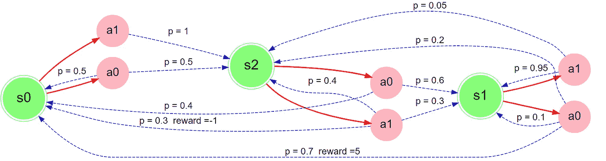
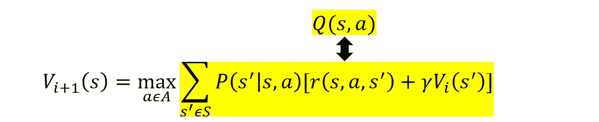
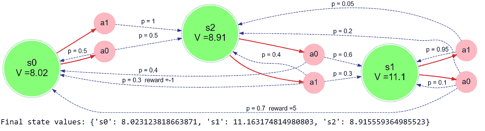
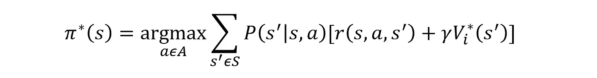
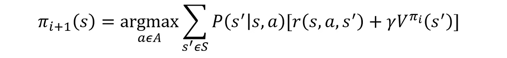
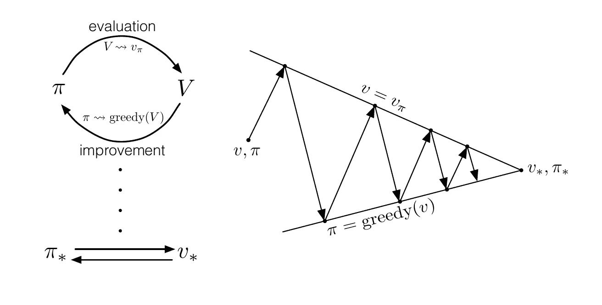
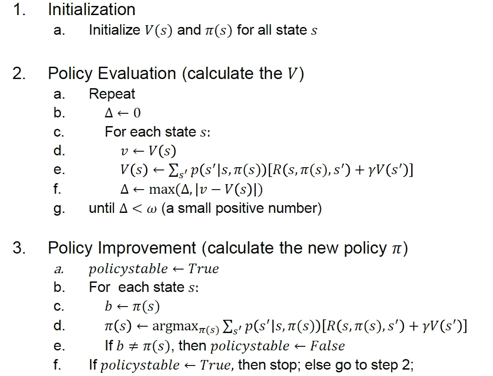
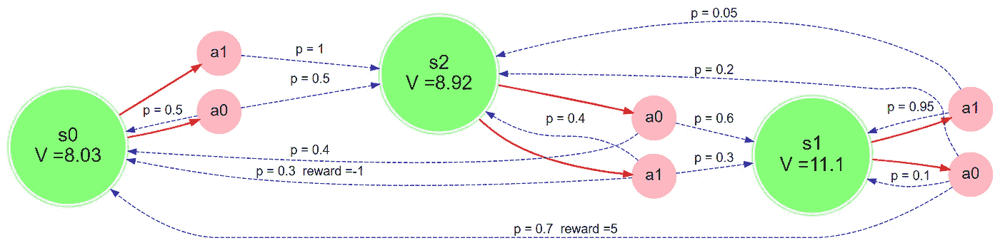

# 强化学习的基础:价值迭代和政策迭代教程

> 原文：<https://levelup.gitconnected.com/fundamentals-of-reinforcement-learning-value-iteration-and-policy-iteration-with-tutorials-a7ad0049c84f>

## 第二部分:解释用于解决 MDP 问题的价值迭代和策略迭代的概念。


由 [Pexel](https://www.pexels.com/) 上的 [Pixabay](https://www.pexels.com/@pixabay) 拍摄的照片

在[之前的文章](https://chaodeyu.medium.com/fundamental-of-reinforcement-learning-markov-decision-process-8ba98fa66060)中，我已经通过一个简单的例子和 Bellman 方程的推导介绍了 MDP，Bellman 方程是许多强化学习算法的主要组成部分之一。在本文中，我将通过一个简单的例子和如何用 Python 编写这些算法的教程来展示**值迭代**和**策略迭代**方法。

# 设置 MDP 问题

现在开始**教程**。

定义:状态转换由**p(s′| s，a)** 定义——如果你从状态𝑠采取行动 **a** ，你有多大可能在状态**s′**结束，为了方便起见，我将使用 **r(s，a，s′)**作为奖励函数。

本教程的灵感来自 Berkeley 的牛逼 [CS294](https://github.com/berkeleydeeprlcourse/homework) 和 Yandex 数据分析学院的[实用 RL](https://github.com/yandexdataschool/Practical_RL) 。

首先，让我们定义一个与 [Gym Env](https://gym.openai.com/) 兼容的 MDP。它是一个开发和比较强化学习算法的工具包。

现在我将使用转移概率和奖励来定义一个 MDP 问题。



MDP 问题根据上面的代码。

然后，我们可以像使用其他健身房环境一样使用 MDP。此外，它还具有可用于值迭代和策略迭代的其他方法，例如:

# 一、价值迭代

现在让我们用**V**value**I**迭代来解决上述 MDP 问题。

下面是 **VI** 算法的伪代码:
1。对于每个状态，将值函数 V(s)初始化为 0。
2。迭代直到**收敛**
*在每第 I 次迭代时，使用贝尔曼方程更新每个状态的值:



**收敛**是指当前迭代(I)和上一次迭代(i-1)中每个状态的值之差接近于 0。

首先，让我们编写一个函数来计算状态-动作值函数 Q(s，a):

使用 Q(s，a ),我们现在可以为值迭代定义“下一个”V(s ):

最后，让我们把所有的东西组合起来，写成一个有效的 **VI** 算法。

```
iter    0   |   V(s0) = 0.000   V(s1) = 0.000   V(s2) = 0.000

iter    1   |   V(s0) = 0.000   V(s1) = 3.500   V(s2) = 0.000

iter    2   |   V(s0) = 0.000   V(s1) = 3.815   V(s2) = 1.890

iter    3   |   V(s0) = 1.701   V(s1) = 4.184   V(s2) = 2.060

。。。 。。。 。。。 。。。 。。。 。。。 。。。 。。。 。。。 。。。

iter   62   |   V(s0) = 8.019   V(s1) = 11.159   V(s2) = 8.911

iter   63   |   V(s0) = 8.020   V(s1) = 11.160   V(s2) = 8.912

iter   64   |   V(s0) = 8.021   V(s1) = 11.161   V(s2) = 8.913

iter   65   |   V(s0) = 8.022   V(s1) = 11.162   V(s2) = 8.915Terminated
```



用值迭代求解 MDP 问题。

从迭代过程中可以看出，算法在迭代 65 次时缓慢收敛并终止，达到最优状态。s0、s1、s2 最终状态值 V*(s)分别为 8.02、11.1、8.91。

现在，让我们使用这些 V*(s)通过下面提到的等式来找出每个状态下的最佳行动。与 V(s)的唯一区别是，这里我们采用的不是 max 而是 arg max:find action with maximum Q(s，a)。



对于这个 MDP 问题，最优策略是在状态 s0 采取行动 a1，在状态 s1 采取行动 a0，在状态 s2 采取行动 a0。

# 二。策略迭代

现在让我们用 **P** 策略 **I** 迭代来解决上面提到的同一个 MDP 问题。

下面是 **PI** 算法的伪代码:
从某个初始策略 **𝛑0** 开始，在以下步骤之间交替:
1 .策略评估:为每个状态 s 计算 **V^𝛑i(s)** ，如 VI，直到收敛
2。策略改进:根据更新规则计算新的策略 **𝛑(i+1)** :



与 VI 不同，PI 必须维护一个策略，并基于该策略**评估**来估计值 **V^𝛑i** 。它只在价值观趋于一致时改变政策— **改进**。评估和改进的过程重复进行，直到策略没有改变或达到最优策略。



策略迭代的简要概述[1]



策略迭代算法:更详细的步骤[1]

首先，让我们为**评估**编写一个名为`compute_vpi`的函数，它计算任意策略的状态值函数**v^𝛑**𝛑。一开始， **𝛑** 会被随机初始化。

一旦我们获得了新的状态值，我们就可以更新我们的策略— **改进**。

最后，让我们把所有的东西组合起来，写成一个有效的 **PI** 算法。

```
====================== Policy Evaluation ======================
iter: 0, diff: 0.0
====================== Policy Improvement ======================
Policy is not stable yet, go back to Policy Evaluation
====================== Policy Evaluation ======================
iter: 0, diff: 9.267726745376368
iter: 1, diff: 0.0
====================== Policy Improvement ======================
Policy is not stable yet, go back to Policy Evaluation
====================== Policy Evaluation ======================
iter: 0, diff: 2.227647754197843
iter: 1, diff: 0.0
====================== Policy Improvement ======================
Policy is stable :D
Optimal Q value: {'s0': 8.031919916894896, 's1': 11.171970913211828, 's2': 8.924355463216552}
Optimal Policy: {'s0': 'a1', 's1': 'a0', 's2': 'a0'}
```



利用策略迭代求解 MDP 问题。

我们可以看到 PI 的解(最优值和策略)与 VI 的解几乎相同。

# 结论

我们首先设置了一个与体育馆环境兼容的 MDP 问题，可以通过一个简单的 Python 字典轻松实现。在此之后，问题可以通过简单地遵循贝尔曼方程更新和最优行动方程来解决。

# 推荐阅读

[](/fundamental-of-reinforcement-learning-markov-decision-process-8ba98fa66060) [## 强化学习的基础:马尔可夫决策过程

### 第 1 部分:解释马尔可夫决策过程和贝尔曼方程的概念

levelup.gitconnected.com](/fundamental-of-reinforcement-learning-markov-decision-process-8ba98fa66060) [](/fundamental-of-reinforcement-learning-monte-carlo-algorithm-85428dc77f76) [## 强化学习的基础:蒙特卡罗算法

### 第三部分:阐述了无模型 RL 算法的基本原理:蒙特卡罗算法

levelup.gitconnected.com](/fundamental-of-reinforcement-learning-monte-carlo-algorithm-85428dc77f76) 

# 参考

[1]萨顿和巴尔托(2017 年)。强化学习:导论。剑桥，麻省理工学院出版社