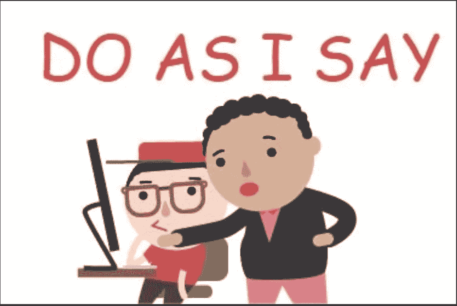
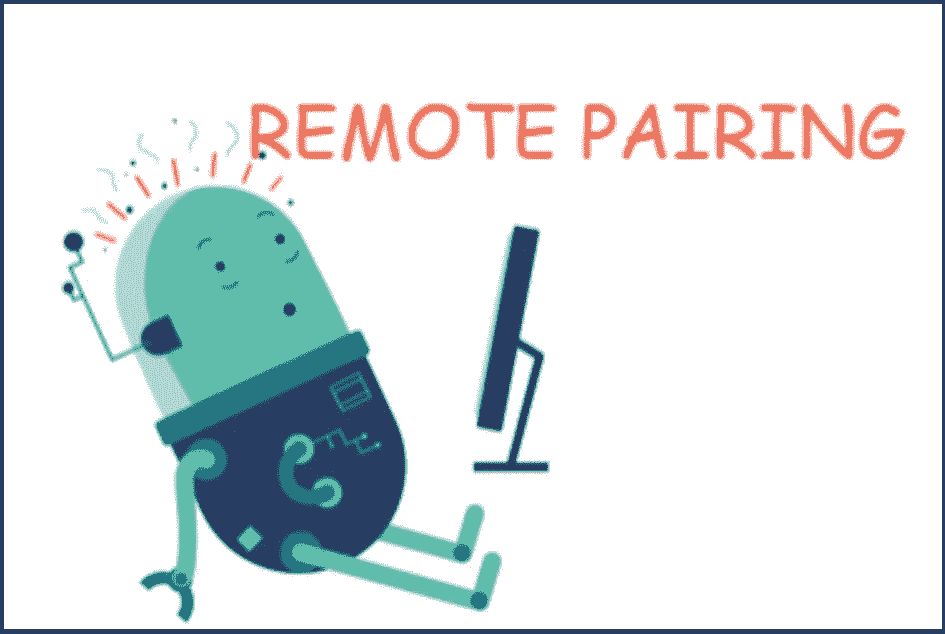

# 软件开发类型有趣的缩写

> 原文：<https://levelup.gitconnected.com/funny-acronyms-for-types-of-software-development-4b59cf1c0b92>

## 你遵循其中的哪一个？

图片由[不再这里](https://pixabay.com/users/No-longer-here-19203/?utm_source=link-attribution&utm_medium=referral&utm_campaign=image&utm_content=2983021)来自 [Pixabay](https://pixabay.com/?utm_source=link-attribution&utm_medium=referral&utm_campaign=image&utm_content=2983021)

软件工程师在其一生中会遇到许多软件方法。这些过程中的一些在大学里被教授。但它们中的大多数都是在项目工作中由聪明的头脑创新出来的。

如果你是一名软件开发人员，你会认识到下面的许多开发方法。如果你不是来自编码世界，不要担心——你仍然会从阅读下面的开发技术列表中获得乐趣。

# 注意缺陷障碍 (Attention Deficit Disorder)

*   **注意力驱动开发**——开发人员只有在认为有人在监视他们的时候才会工作。其他时间，他们都在忙着浏览他们的脸书或 Instagram 页面。

# BDD

*   **行为驱动开发** —书本式定义: *BDD 是利益相关者、领域专家和工程师之间共享词汇的定义。嗯，在大多数情况下，BDD 停留在围绕 TFS 中的 GIVEN、WHEN、THEN 形成的一堆语句上，这对开发人员来说毫无意义。“共享词汇”到此为止:d。*
*   **利益驱动开发** —如果我按照我的经理想要的方式编写代码，我将获得奖励。我的利益是第一位的。顾客可以一直等待他们想要的东西。

# 公共数字字典

*   **竞争驱动的发展** —我们的竞争对手正在这么做，所以我们也需要这么做。
*   **关注驱动开发**——无论你提出什么解决方案，团队都会提出大量理论上的关注点，来解释为什么他们认为这个方案行不通。

gif 来自 [giphy](https://giphy.com/)

# DDD

*   **缺陷驱动开发**——让我们将代码转储到产品中，无需测试。我们将修复用户发现的任何缺陷。难道我们都不知道——代码的真正考验是在生产中！
*   **期限驱动的开发—** 客户希望明天就能交付一百万个功能。伟大的领导已经承诺交付——所以不要抱怨；去做吧。

# 预计交货日期(estimated delivery date)

*   **升级驱动的开发—** 一旦首席执行官发现问题，我们将立即修复缺陷。除非缺陷被升级，否则它不是一个优先事项。

# 频分复用

*   **恐惧驱动的开发** —如果软件不能满足需求，同时，烤一些饼干和煮一杯咖啡，那么我们将会失去客户。让我们添加一万亿个客户可能不需要的功能，但是我们不想冒失去一个有价值的客户的风险，以防他们提出要求。

# GDD

*   **谷歌驱动开发**——你通过从互联网上复制粘贴代码来构建整个应用程序。
*   **高尔夫驱动开发** —首席执行官或 SVP 在打高尔夫时听说了一项新奇的新技术，现在他们希望同样的技术也能应用到产品中。

# 硬盘驱动器

*   **希望驱动的开发** —你不知道代码会不会起作用。您不知道您的设计是否能够处理生产中的负载。但是您还是在没有任何验证的情况下编写了它，并希望它能在生产中工作。

gif 来自 [giphy](https://giphy.com/)

# （=InternationalDirectDial）国际直拨长途电话

*   **行业驱动的开发** —让我们来做开发，因为行业中的其他人都在做。

# JDD

*   **蠢驴驱动的开发**——团队领导对最新技术一无所知，但他永远不会错。他将把自己关于如何编码的想法强加给团队的其他成员

作者截图

# KDD

*   **知识驱动的开发**——我们不关心需求说了什么。明智的程序员会用他们自己的知识，以他们认为对客户最有利的方式开发特性。

# LDD

*   **爱情驱动开发** —开发者暗恋其中一个队友。为了给她留下深刻印象，现在他利用周末来完成她的作业。

# MDD

*   **营销驱动发展** —营销团队向客户承诺；所以，你最好编码。
*   金钱驱动的开发——代码的质量取决于公司付给开发人员多少钱。你支付花生；你有猴子。

gif 来自 [giphy](https://giphy.com/)

# NDD

*   **夜间驱动开发—** 你整天和同事打乒乓球。一旦团队成员离开办公室，你就坐下来编码——只是为了让经理知道你工作到多晚。

# 奇数的

*   痴迷驱动的开发——开发人员痴迷于一种特定的语言，想要用这种语言解决所有的问题。俗话说——如果你有一把锤子，每个问题看起来都像钉子。

# 物理设备驱动器

*   **恐慌驱动的开发—** 在投入生产之前发现最后一分钟的代码缺陷。我们需要在管理层发现之前立即修复它。

gif 来自 [giphy](https://giphy.com/)

# QDD

*   **查询驱动开发** —开发人员不需要编写任何代码，直到领导或经理来询问状态。直到有任何跟进，开发过程才开始。

# RDD

*   **简历驱动开发—** 开发人员使用这项技术是因为他们想把它写进简历。即使这种技术对于当前的问题来说是最不合适的解决方案，也没有关系。

# SDD

*   **销售驱动的开发** —销售团队已经向客户承诺了该功能。现在你需要在产品中实现它。

# TimeDivisionDuplex 时分双工

*   **趋势驱动开发** —当今科技界的一种奇特技术趋势；团队突然改变产品的技术栈来适应技术。

作者截图

# UDD

*   **用户驱动开发** —用户表现得好像他们知道如何解决自己的需求。因此，他们不断向开发团队提出设计方案。这与开发人员告诉用户他们的需求应该是什么有着同样的灾难性影响。

# VDD

*   **伏都教驱动开发**——如果代码不能编译，只需在其中插入另一个引脚。

# WDD

*   **白板驱动开发** —整个设计都在白板上。团队只需要把它转换成代码。简单。

gif 来自 [giphy](https://giphy.com/)

# XDD

*   **X-mas 驱动开发** —现在是平安夜，你无处可去。你是孤独的灵魂；你决定自己编写整个项目的代码。

# YDD

*   **Youtube 驱动的开发—** 需要在您的企业应用程序中做一些全新的事情—从 Youtube 学习动态编码并完成开发。

# ZDD

*   **Zoom 驱动的开发** —参加一个 Zoom 会议，在别人编码的时候一直盯着看。远程结对编程现在非常流行。

作者截图。

现在，您对各种软件开发方法有了很多了解。你在工作中遵循哪一条？如果你有任何其他喜欢的有趣的首字母缩略词要添加到列表中——把它放在评论区，让每个人都可以阅读。

感谢您阅读本文。我希望你笑得开心。

**参考文献:**

了解更多关于 BDD:[https://www.agilealliance.org/glossary/bdd/](https://www.agilealliance.org/glossary/bdd/)

[http://www.secretgeek.net/a2z_dd](http://www.secretgeek.net/a2z_dd)更上相同

**你可能也想看看:**

 [## 为什么你应该考虑简历驱动的发展

### 发现学习新技术的正确方法。

medium.com](https://medium.com/2-minute-madness/why-you-should-think-about-resume-driven-development-f68d1ab55d82)  [## 客服代表为难相处的客户使用的 9 个有趣代码

### 你知道 PEBCAK 是什么意思吗？

medium.com](https://medium.com/be-unique/9-funny-codes-used-by-customer-care-reps-for-difficult-customers-64b1d2de2cbb)