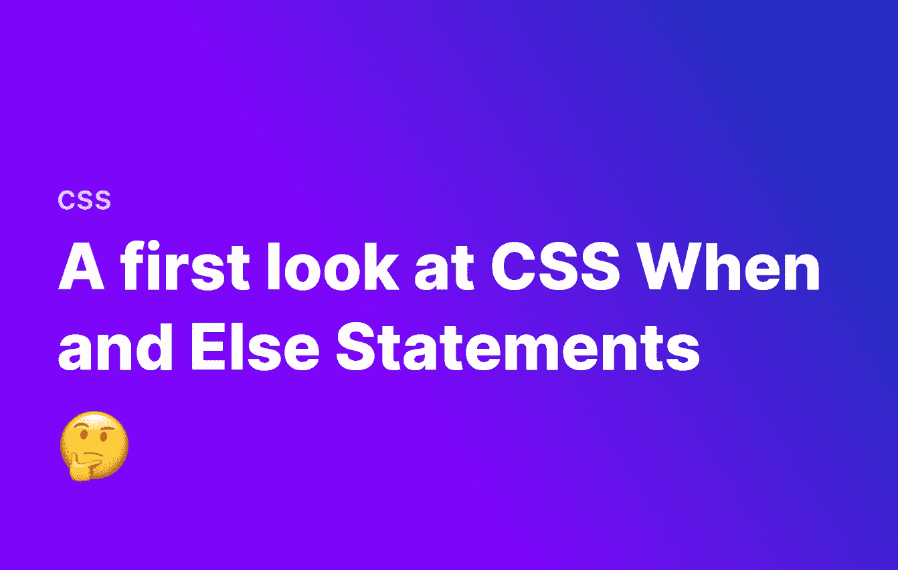
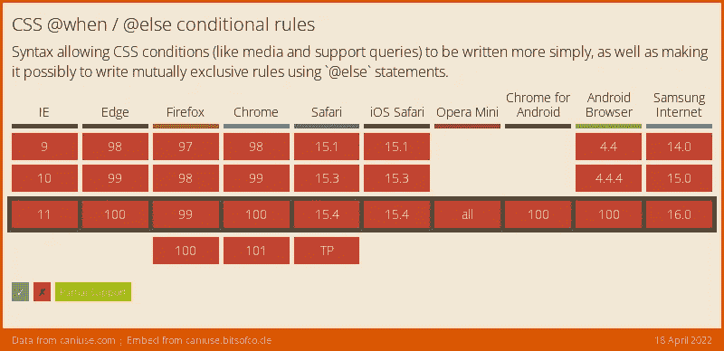

# 未来的 CSS:when 和 else 语句初探

> 原文：<https://levelup.gitconnected.com/future-css-a-first-look-at-when-and-else-statements-44e33deeb032>



在 CSS 中，我们通过使用媒体查询来选择不同的设备。媒体查询为我们提供了一种基于多种条件选择设备的简单方法，例如屏幕尺寸、像素密度，甚至是格式:即打印或屏幕。

随着时间的推移，这变得越来越复杂，现在我们经常要平衡许多有时相互冲突的条件。

**新的** [**CSS 条件规则 5 规范**](https://www.w3.org/TR/css-conditional-5/) 试图通过引入两种新的媒体查询方式— `@when`和`@else`来解决这个问题。这些将最终允许我们直接在普通 CSS 中创建条件语句。**让我们来看看它是如何工作的！**

# @when/ [@else](https://dev.to/else) 支持

目前，没有浏览器本身支持`@when` / `@else`，不过这很快就会改变。对`@when` / `@else`的全面支持如下图所示。



# 在 CSS 中使用@when/ [@else](https://dev.to/else)

让我们假设我们有一组规则，我们希望应用于支持`display: flex`的小于 780 像素宽的屏幕尺寸，而另一组规则应该应用于除此之外的任何尺寸。以前，我们必须使用`@media`查询来分别选择这两种情况。当选择多个不同的东西时，这变得有点混乱。对于`@when`和`@else`，它看起来像这样:

```
@when screen and (max-width: 780px) and supports(display: flex) {
    .my-element {
        color: red;
        display: flex;
    }
}
@else {
    .my-element {
        display: block;
    }
}
```

我们还可以链接多个条件。例如，假设我们有三种场景:支持 T10 的最大宽度为 780 像素的屏幕，支持 T11 的更大的屏幕，以及其他。在这种情况下，我们可以有多个条件:

```
@when screen and (max-width: 780px) and supports(display: flex) {
    .my-element {
        color: red;
        display: flex;
    }
}
@else screen and supports(display: flex) {
    .my-element {
        display: flex;
    }
}
@else {
    .my-element {
        display: block;
    }
}
```

如您所料，我们可以有更多的`@else`语句，但是上面的内容让您了解了`@when`和`@else`在 CSS 中实现时会变得多么有用。

# 结论

条件语句从未出现在普通 CSS 中，所以很高兴终于看到它们即将出现。这也将大大简化我们进行媒体查询的方式。如果我们使用像 SASS 这样的第三方包，我们在 CSS 中已经有了逻辑，但是当它是 CSS 的原生包时，我们可以避免使用预处理器或用这个附加包来构建。