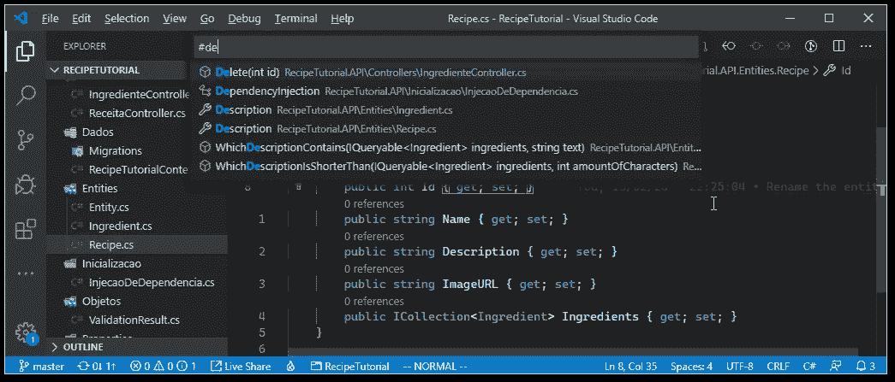
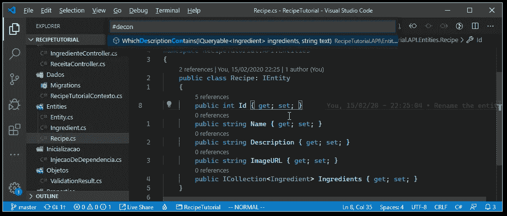
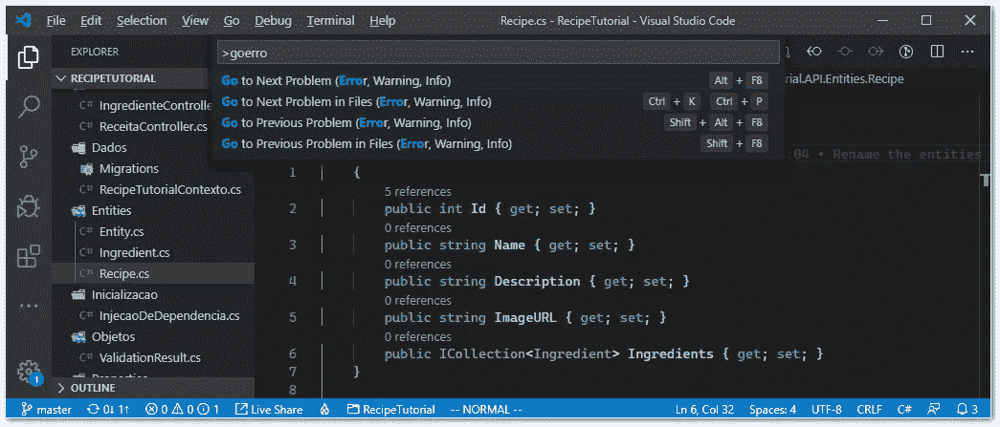
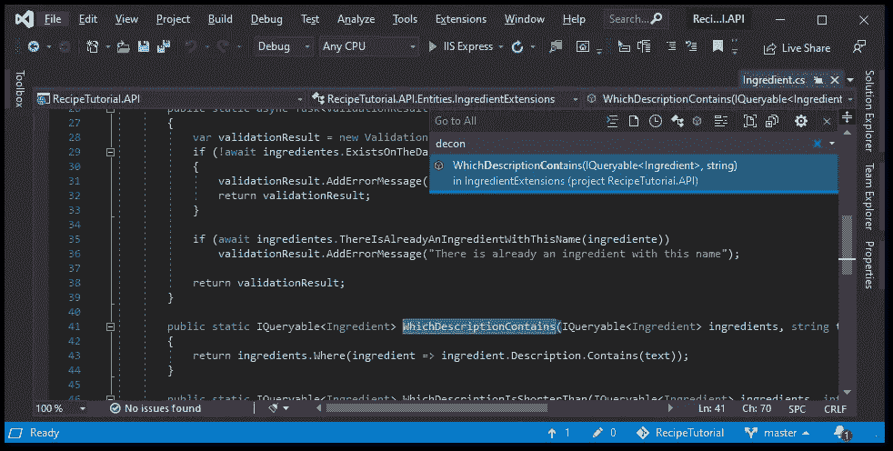

# VS 代码中的模糊搜索:提高开发人员注意力和生产力的技巧

> 原文：<https://levelup.gitconnected.com/fuzzy-searches-in-vs-code-tips-to-increase-developer-focus-and-productivity-6809c0f3ce9a>

有没有觉得找到一个特定的代码块需要太长时间？不一定要。

所以你正在进行一个冲刺式的编码，就像没有明天一样，你需要编辑那个文件，但是你不记得它在哪里了。这又需要一次有趣的浏览器之旅，寻找我们接下来要编辑的文件。

有时候，如果你到了那里还记得你要编辑的内容，那将是非常幸运的。许多遗留项目甚至一些现代的面向对象项目都是如此(Angular，我现在正看着你)。但是一定要一直这样吗？

# 模糊搜索救援！

大多数 ide 和文本编辑器都有一个特性，那就是文件浏览器，在这个浏览器上你可以看到你正在处理的当前项目或文件夹中的文件。这是探索文件结构并找出代码是如何组合在一起的好方法。这也是一种获取项目另一部分文件的可怕方式。

事实证明，只要您记住文件或资源名称的一部分，就有更好、更快的方法来获得您想要的文件或资源。为此，您可以使用模糊搜索导航直接找到您需要打开的文件。

它的工作原理是接收输入，并向您显示哪些文件(或符号)与您到目前为止键入的内容相匹配。与通常的搜索有一个重要的不同:它匹配来自文件或符号名称的部分匹配。

这样，您可以通过键入第一个和最后一个单词的一部分，或者中间世界，或者每个单词的一些字符来找到一个 3 个单词的文件。唯一的限制是要保持字符的顺序。

但是接下来还有一个更好的特性:这些搜索不局限于文件名。那么我说的符号模糊搜索到底是什么意思呢？

# 符号模糊搜索

你不记得通过描述获取成分的方法的确切名称了吗？只要敲几下键盘，你就能很容易地想起它。

像 Visual Studio Code 这样的工具不仅可以模糊地搜索文件名，还可以模糊地搜索函数/方法、类、接口、属性等。

在 VS 代码中，本地键绑定是 ctrl+P 用于文件名搜索，ctrl+T 用于符号搜索。您也可以按 ctrl+P 并在行首键入' # '。不知何故，它比只过滤文件名要慢一些，但它仍然快得惊人。

注意，VS 代码依赖于符号搜索特性的扩展。由于这一点，它只能像延伸本身一样放松。例如，typescript 扩展只显示找到整个字符序列的结果。但是多亏了 Omnisharp，C#扩展对符号的搜索是模糊的。

如果您想要模糊搜索 VS 代码设置，您也可以 ctrl+shift+P。通过 ctrl+P 并在行首键入'>'可以实现相同的搜索。这允许您通过描述来搜索 VS 代码命令。我发现这是记住不经常改变的设置的最简单的方法。记住他们的快捷方式也很有用。

然而，这些特性并不仅限于 VS 代码。Visual Studio 2015+也有一些有用的搜索。

在 Visual Studio 上，您可以按 ctrl +、(ctrl+逗号)转到“search all”弹出窗口。它的工作方式类似于 VS Code 的 ctrl+T。与使用典型的 ctrl+F 功能或解决方案资源管理器导航相比，通过这种方式可以更快地获得某个属性、类或方法的名称。

我喜欢这些工具的一个特别之处是，无论你什么时候搜索什么，你都可以把手放在键盘上，随时准备打字。因此，像打开一个类似的函数来获取你正在编写的新代码的样本代码这样的事情会变得更快。如果你是 Vim 用户，那就疯狂了，不过这是另一篇文章的内容。

开发猫释放功模糊的力量

那么，你呢？你有没有尝试过更频繁地用键盘导航你的代码？还是喜欢在文件浏览器上滚动的感觉？

试试看，如果你觉得这篇文章有用，请鼓掌。