# 带有事件建模的游戏设计

> 原文：<https://levelup.gitconnected.com/game-design-with-event-modeling-f977aece452c>

## 尝试新的分析技术来设计旧游戏

现在是完全不同的事情:我将采用事件建模，一种现代的系统设计方法，并尝试将其与一种在 20 世纪 80 年代过着最好生活的游戏类型相结合。具体来说，我将应用事件建模技术来设计一个交互式虚构(IF)游戏，讲述一只狗在主人不在家时恐吓它的家。

# 什么是事件建模？

事件建模是由[亚当·迪米特鲁克](https://twitter.com/adymitruk)推广的一项新技术。目标是提供一个被设计系统的极其简单的视图，该视图遵循 Cucumber 和其他[行为驱动开发](https://en.wikipedia.org/wiki/Behavior-driven_development) (BDD)工具使用的给定/何时/然后风格语法。

这种简单性使其易于理解、学习和使用。它与 Given / When / Then 语法的兼容性使得测试和识别需求变得容易。

在其核心，事件建模围绕 3 种类型的实体:事件、命令和视图。我将在这里简要解释每一个，但是一旦我们进入游戏设计的具体例子，它将在文章的后面变得有意义。

**事件**是在系统环境中发生的事情。在在线购物系统中，事件可能是“用户登录”或“商品添加到购物车”

**命令**是用户动作。用户告诉系统，他们希望系统采取某种形式的行动，并期待一个响应。在购物系统中，一个命令可能是单击一个按钮，将一个商品添加到用户的购物车中。

**视图**是系统如何向用户呈现关于系统当前状态的信息。在购物系统中，这可能是“确认购买？”显示即将下订单的详细信息的屏幕。

我们将在后面的例子中看到这是如何工作的。

# 什么是互动小说？

[互动小说](https://en.wikipedia.org/wiki/Interactive_fiction)在 20 世纪 70 年代到 90 年代初作为一种回合制冒险游戏形式流行开来，玩家可以在游戏中获得一个区域和场景的文本描述，并可以输入他们想做的事情。然后，系统会解释他们的输入并做出相应的响应。

这是一个虚构游戏的脚本示例:

`**Game**: You are in a small dimly lit room filled with empty pizza boxes and soft drink cans. A laptop sits open on a desk in front of you, displaying some code and an error message.`

`**Player**: Sit at desk`

`**Game**: You are now sitting at the desk in front of the laptop` `Player: Read the error message`

`**Game**: The message says "Unable to allocate value to non-zero index"`

`**Game**: I don't know what a debug is.`

`**Player**: Fix error`

`**Game**: You don't see an error here.`

不用说，80 年代早期的文本解析器让很多玩家感到沮丧，但这些游戏的前景很有趣，其中一些游戏有非常引人入胜的故事，弥补了图形的不足。

# 介绍“狗探险”

在本文中，我们将设计一个名为“Doggo Quest”的基于文本的小游戏的流程。这个游戏设定在一个郊区的家里，玩家控制着笼子里的一只小狗。你从笼子里出来，然后混乱随之而来，玩家造成一个又一个灾难，直到一个固定的计时器到期，主人回家。

这是一个简单的概念，很有趣，很容易解释，而且一有消息就马上投入进去，这使得它非常适合用作技术演讲的背景(这也是我一开始选择这个主题的原因)。

对于上下文，游戏世界看起来是这样的:

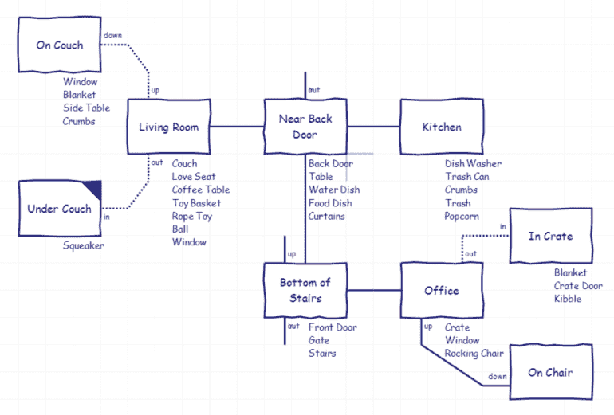

这是一个标准的交互式虚构地图，在 [Trizbort](https://github.com/genstein/trizbort) 中生成，显示了一系列房间(方块)，每个房间中突出显示了一些值得注意的项目。

你也可以把这个地图想象成一个状态机，玩家当前的房间就是一个州:

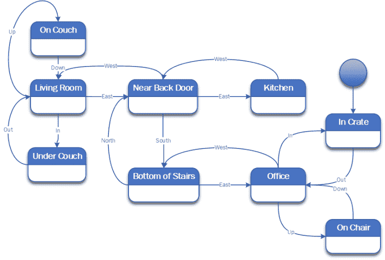

一些设计考虑:

*   你可以用鼻子推它或者用爪子抓它，从你的箱子里出来
*   为了能够尝试打开门，玩家必须首先看着它
*   如果玩家在 5 个回合内没有看门，游戏将提示他们门看起来不同或不寻常
*   在你打开箱子门 30 回合后，游戏结束
*   每个房间都有一些有趣的互动内容
*   有些房间有窗户。你在窗外看到的取决于你打开箱子后是哪一轮
*   有一个评分系统，如果你把事情弄得一团糟或者对着外面的东西叫，你就会得到分数

系统将支持的值得注意的动词(包括同义词):

*   去/走到/跑向
*   对…狗吠
*   考虑
*   闻/嗅
*   咀嚼/舔/吃
*   爪子/轻拍/ Bop /打/踢/打/推
*   抓/拉/捡/拿
*   责备

这些动词不同于许多其他冒险游戏，因为玩家是一只狗。

# 带有事件建模的游戏设计

既然我们已经大致描述了游戏及其世界，我将尝试应用事件建模来描述游戏逻辑。

为此，我们将遵循[事件建模](https://eventmodeling.org/posts/what-is-event-modeling/)背后的人推荐的多步骤方法。

***免责声明:*** *我最初的尝试并不顺利，我将在本文的稍后部分再次讨论这个问题。现在，把注意力放在步骤和概念上，不要过多关注我在这个故事中具体想做什么，因为它没有成功。如果你想跳到最终产品，跳到下面的“重做实验”部分。*

# 1.识别事件

在这一步，我们确定游戏世界中可能发生的所有事件。虽然我们可以(或许应该)将这限制在诸如“玩家输入了系统能够理解的单词”之类的事情上，但是说“垃圾桶被打翻了”这样的话要有趣得多。

因此，在我的游戏世界中，我设想会发生以下重大事件:

*   从箱子里出来(标志着游戏计时部分的开始)
*   打翻了垃圾桶
*   杀死了一只苍蝇
*   吃了一只苍蝇
*   撕碎的文件
*   吃面包屑
*   打翻了饮料
*   撕破窗帘
*   在地毯上撒尿
*   毁坏了一只鞋
*   在垃圾桶里打滚
*   对着松鼠吠叫
*   对着一辆婴儿车咆哮
*   对着一只狗吠叫
*   车库门开了(当车主准备返回时)
*   所有者返回(标志着游戏结束)

# 2.随着时间的推移绘制事件

接下来，我们将为我们确定的每个事件创建一个卡片，并将其排列成一条水平线，最早的事件在左边，最新的事件在右边。

如果你在卡片上使用颜色，事件建模插图通常使用橙色，但你也可以简单地在每张卡片上写“事件”或“E”来说明类型。

在 Doggo 的探索中，最早的事件是从箱子里出来，最后的事件是主人回家。一些事件必须在它们的前辈之后发生，但是除此之外，事件是相当独立的，我可以根据一个虚构的游戏任意地排列它们。

以下是我确定的事件顺序:

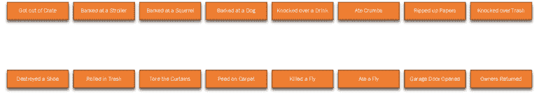

通常你只有一排卡片，但是为了本文的目的，我把它们分成了两排。

# 3.线框化

对于基于视觉的系统，您可以绘制与单个事件相对应的用户界面。对于 Doggo Quest，我们真的只有一个观点:

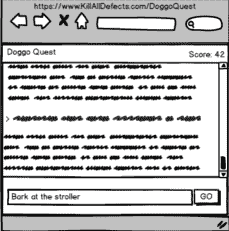

然后，我们可以在图的顶部包括这个线框，并说明命令从哪里发出，以及事件在哪里影响显示的视图。由于我识别的所有内容都是通过在底部的框中键入内容并更新顶部的文本框来实现的，所以为了简洁起见，我没有选择在 UI 中处处用箭头来表示这些内容。

# 4.识别命令

接下来，对于我们已经确定的每个事件，我们将看看是否可以确定导致它的命令。

因为我们在看一个基于文本的游戏，这实际上非常容易——我们只需要玩家可能输入的简化版本。例子包括`Push door`或者`Eat the fly`。

我们将把这些*命令*在我们的图表上表示为蓝色，并将每个命令的箭头添加到它所导致的事件上。在某些情况下，我们还会添加从事件到命令的箭头，表示这些事件是先决条件。

这是游戏设计图的一部分，显示了命令和事件。

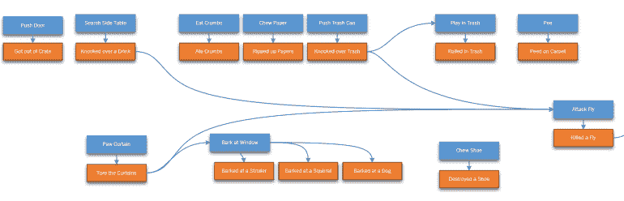

请注意，与大多数互动小说游戏不同，这款游戏并不是真的要成为一个谜题，而是一个可以玩的地方。因此，命令之间没有太多的依赖性，尽管有一些事件链接在一起。

# 5.识别视图

在传统的系统建模实验中，我们会识别与每个状态相关联的具体视图。由于这是互动小说，我们唯一有意义的观点是屏幕上的文字。此外，我们可以假设*的每个*动作都输出某种文本，这使得建模变得非常多余。

尽管如此，为了说明本练习的要点，我将通过添加从事件到视图的绿色矩形和箭头来模拟分数随着视图的增加而增加。

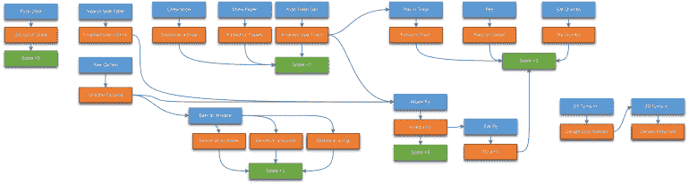

# 6.引入边界

接下来，我们需要应用康威定律，将相关事件分离到各自的“泳道”中。

在一个更大的系统中，我们将相关的项目划分到它们自己的子系统中，甚至是单独的应用程序/服务中。由于我们正在开发一个简单的游戏，我们将选择一个更自然的边界:游戏世界的区域。

事件建模提倡只将事件移动到泳道中，但是该系统中事件所涉及的依赖性使得这一点有些不吸引人，如下图所示:

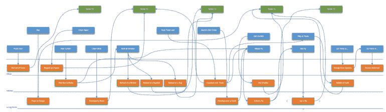

相反，我们将通过在泳道中包含命令来稍微偏离事件建模规范。这很有意义，因为命令是特定于位置的。

这样做的结果更干净:

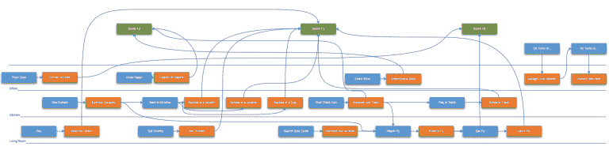

注意:如果我尝试在引擎层面而不是游戏设计/故事层面表现事件，这些结果会更清晰/简单。这里的分区可以是解析器、故事数据和用户界面。这也坚持了划分事物的目的，使得将一个代码模块交给不同的团队变得更加容易。

# 7.精心设计的场景

接下来，我们后退一步，看看我们的建模实验的结果，看看我们是否能识别出模型没有覆盖的任何情况，如果是，就添加它们。

看着图表的结果和我为了整洁而偏离的方式，我对结果不满意。我还可以清楚地识别出一些未涵盖的案例:

*   重新开始游戏
*   输入游戏无法识别的内容
*   看着物体

因此，我没有选择添加遗漏的案例，而是选择重做实验，重点放在引擎上。

在与其他事件建模者交谈时，花一些时间来习惯应用事件建模并不罕见，因此，我决定重做我的练习是这个学习过程的结果。

# 重做实验

所以，重做这个实验，但是把重点放在游戏引擎事件上，我的事件集看起来像这样(按时间顺序):

*   游戏开始
*   命令已输入
*   句子标记化(分解成单个单词)
*   遇到未知单词(例如，FooBarBaz)
*   遇到不支持的动词(例如 Yodel)
*   未检测到物体(例如，在没有婴儿车的情况下吃婴儿车)
*   判决生效
*   命令已执行
*   计时器开始计时(当玩家走出笼子时)
*   计时器递增
*   游戏结束

这一次，我将在系统中表现更多的角色，所以我包括了用户界面线框和主要的子系统来解释和执行玩家的意图:

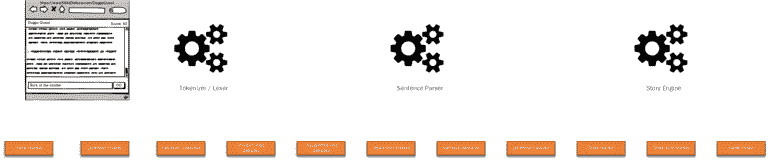

# 在命令和视图中添加

接下来，我将添加相关的命令和输出的视图。请记住，命令不一定是由*用户发起的*，因此各个子系统可以执行命令来触发事件。

这是我的带有命令、视图和事件的新模型:

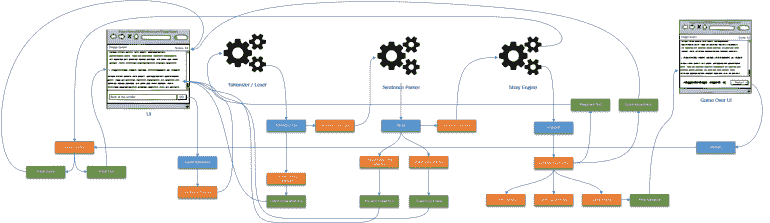

请注意，我还确定了一个新的线框作为这个练习的一部分。游戏结束用户界面不同于普通用户界面，因为用户不能输入命令。

最终，很明显，用系统事件而不是故事事件来表示系统才是正确的方法，这已经是事实了。

虽然我可以遵循建议并按照康威定律划分泳道，但有几件事对我来说已经很清楚了:

*   我将是唯一一个在这个项目上工作的人，所以我只需要 1 泳道
*   如果我真的想扩大规模，我会沿着垂直线将项目分开，一个人获得 UI，一个人获得故事内容，另一个人获得 lexer / parser，另一个人获得故事引擎。

因为我预计将图表分割成泳道会使水变得浑浊而不是有所帮助，所以我拒绝第二次遵循这个步骤。

最后，回顾一下这个模型，会发现在游戏结束时缺少了一些命令。修订这一节揭示了以下情况:

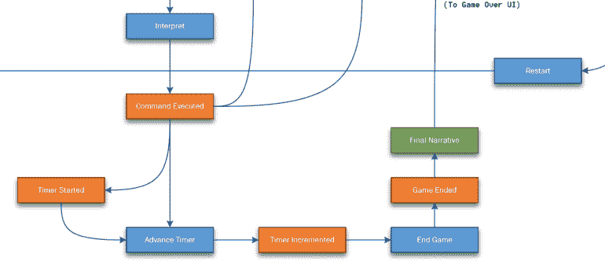

# 评估实验

经过最后的清理，完成的事件建模图如下所示:

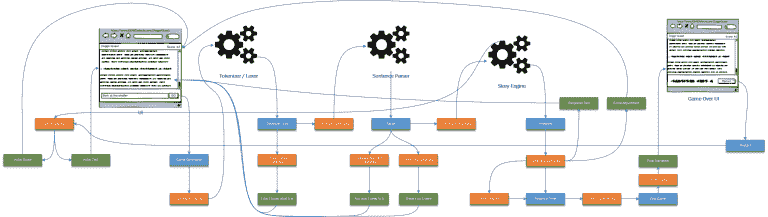

让我们后退一步，评估一下这个练习是如何进行的。

没错，第一次对哪些事件建模时出错了，但最终结果是一个清晰易读的游戏流程的顺序事件模型。当考虑我将要构建的应用程序的架构和结构时，可以使用这个最终结果。

# 作为测试蓝图的事件建模

事件建模不仅可以帮助我们捕获需求，并有效地与新的团队成员交流，还可以给我们一个好的测试大纲。

让我们来看看事件模型中的一个示例命令:

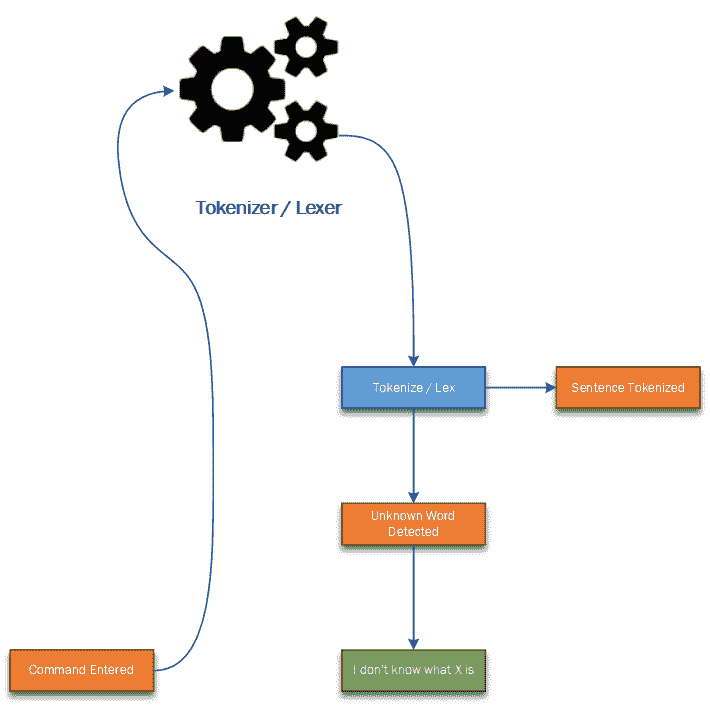

这里的 *Tokenize / Lex* 命令是由*命令进入*事件触发的，将触发一个*句子标记化*事件或者一个*未知单词检测*产生一个*我不知道 X 是什么*视图。

我们可以把它写成一对测试标准:

**给**一个命令，其中包含一个未知单词
**当**我将该命令输入到分词器/词法分析器
**中，然后**我应该得到一个*检测到未知单词*事件
和一个*我不知道 X 是什么*响应

并且:

**给定**一个命令，其中只有已知的单词
**当**我将该命令输入到分词器/词法分析器
**中，然后**我应该得到一个*句子分词*事件

退一步说，我们可以查看我们的整个事件模型，并为整个应用程序生成一个好的核心测试开始列表，而根本不需要大量的工作！

# 事件建模和 Doggo Quest

因此，使用事件建模，我现在已经有了一个构建和测试应用程序的好计划。这本身就是一个胜利。

然而，我开始对故事中的事件进行建模，我不得不放弃事件建模的尝试。这向我表明，事件建模更适合于系统建模，而不是对应用程序的内部状态建模。没关系，不是所有的工具都应该解决所有类型的问题。

然而，事实证明，在互动小说中有一种相当标准的表现故事流程的方式:谜题依赖图。

因为这篇文章的目的不是讨论这种技术，我就不解释了，但是《触手之日》的制作者提供了一个很好的入门[如果你好奇的话，我鼓励你去看看。](http://thewebsiteisdown.com/twidblog/puzzle-dependency-graph-primer/)

以下是 Doggo Quest 的拼图依赖图，供好奇者参考:

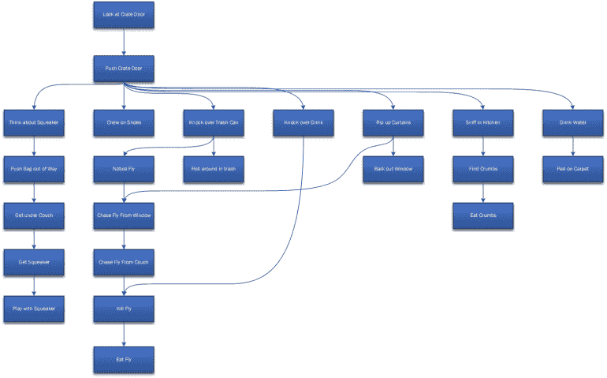

# 下一步是什么？

好了，我们走吧。现在我们已经对引擎和故事事件进行了建模。

这个月我将构建这个游戏引擎，并为今年我计划的几次关于构建应用程序的演讲做准备。

这将是我最后一次探索游戏的事件建模，但它满足了它的目的。

如果您想了解更多关于事件建模的知识，以及它如何帮助您开发应用程序，我强烈建议您访问事件建模网站。它有一篇关于通过 Slack、Twitter 和各种活动了解更多信息的综合文章和信息。

感谢阅读，敬请关注！

*原载于 2020 年 2 月 2 日*[*【https://killalldefects.com】*](https://killalldefects.com/2020/02/01/game-design-with-event-modeling/)*。*