# 游戏开发:JavaScript 的突破

> 原文：<https://levelup.gitconnected.com/game-development-breakout-in-javascript-5e5d142d3203>

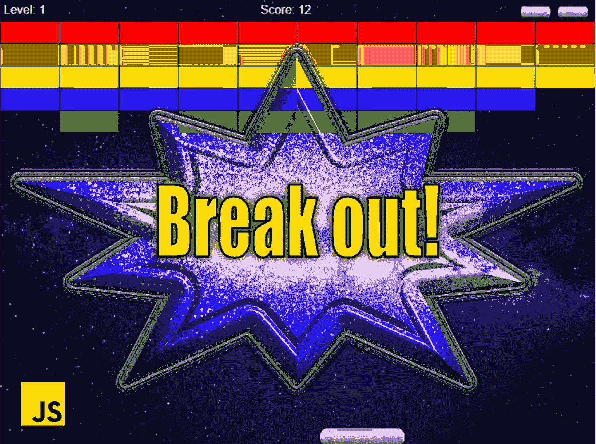

在本文中，我们创建了一个**完整的**突围式**游戏**。HTML **画布**提供了游戏容器，我们通过 **JavaScript** 在其中绘制图形。在学习了如何使用画布来制作图形和动画之后，我们将使用圆形和矩形等基本形状来研究碰撞背后的算法。有了这些概念和一些游戏循环和声音，我们很快就会有一个游戏可以玩了！

在我的 [GitHub 资源库 js-breakout](https://github.com/melcor76/js-breakout) 或者[里查看代码玩游戏](https://affectionate-shockley-c3f5d7.netlify.app/)！

如果你喜欢 JavaScript 游戏，可以看看我写的关于俄罗斯方块的文章:

*   [用俄罗斯方块学习现代 JavaScript】](https://michael-karen.medium.com/learning-modern-javascript-with-tetris-92d532bcd057)

说到传奇游戏，**突围**榜上有名。不仅仅是因为它是雅达利的 Pong 单机版续作，还因为史蒂夫·乔布斯和史蒂夫·沃兹尼亚克都曾开发过它，后来用部分资金创立了苹果公司。以现代的标准来看，这个游戏相当简单，但是在 1976 年，我出生的那一年，它是革命性的。十年后，随着泰托 1986 年的 arkan oid 问世，这一概念有了新的发展，它本身也催生了数十个模仿者。这种游戏被称为方块游戏。

这款游戏的成功延续至今，雅达利继续将其移植到新的平台上。事实上，你可以在 Android、iPhone 和 iPad 上找到一个官方端口。越狱是有史以来最克隆的游戏之一。让我们看看，在这门课的帮助下，我们能否增加这些数据。

# 游戏设计

所有突破式游戏至少有三个共同点——每个游戏都包含**桨、球和砖块**。

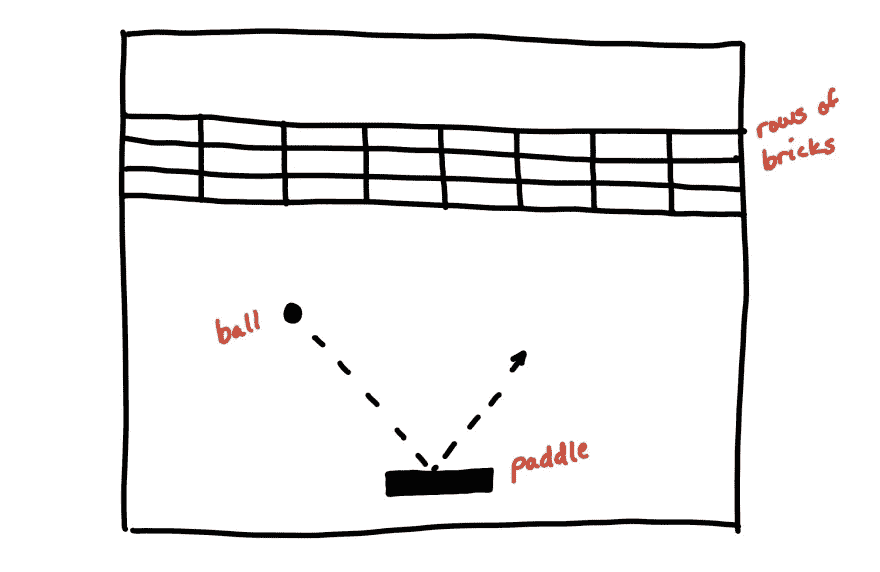

第一个游戏设计。

玩家必须用球拍将球弹起，穿过一排排砖墙。这些砖有不同的颜色。根据颜色的不同，砖块可以奖励更多的分数，并且更难破碎。为了让游戏更具挑战性，在游戏的某些时候，速度可能会增加。作为最后一栏，当玩家突破最后一排时，桨可以减小它的尺寸。如果玩家丢球三次，游戏就结束了。

# 入门指南

在开始游戏的功能之前，我们需要创建一个基本的结构来渲染游戏。我们可以用 HTML 和`<canvas>`元素做到这一点。

即使项目不是很大，将代码分成不同的文件也是一个很好的做法:

*   `index.html` —链接到其他文件的主文件。我们在最后添加的脚本的顺序是至关重要的。
*   `styles.css` —包含样式。
*   `breakout.js` —游戏的 JavaScript 代码。

当 JavaScript 变大时，我们可以考虑将它分成多个文件。

## HTML 和 CSS

HTML 文档结构非常简单，因为游戏呈现在`<canvas>`元素上。我们唯一需要担心的是启动游戏的按钮。

## JavaScript

在 HTML 文件的末尾，我们添加了对 JavaScript 文件的引用。`<script>`元素包含浏览器执行的 JavaScript 代码。

现在，我们可以添加一个对应于添加到播放按钮的`onclick`事件的空函数:

```
function play() {}
```

这样，我们的游戏容器就设计好了，等待代码。

# 帆布

在浏览器中绘制图形和创建动画有几种不同的方式。在本课程中，我们使用 **HTML5 Canvas** ，其功能集非常适合制作 2D 和 3D 游戏。canvas 元素是使用`width`和`height`属性在 HTML 代码中定义的。然后我们可以通过编写 JavaScript 来使用 HTML5 Canvas API。我们通过绘图函数访问画布来动态生成图形。

## 画布上下文

画布有一个 **2D 绘图上下文**用于绘制形状、文本、图像和其他对象。首先，我们选择颜色和画笔，然后我们绘画。我们可以在画之前改变画笔和颜色，或者继续使用现有的。

`HTMLCanvasElement.getContext()`方法返回一个绘图上下文，我们在其中渲染图形。通过提供`'2d'`作为参数，我们得到画布 2D 渲染上下文:

```
const ctx = canvas.getContext('2d');
```

> 还有其他可用的上下文，比如用于三维呈现上下文的`webgl`，超出了本文的范围。

## 坐标系

HTML 画布是一个二维网格。画布的左上角有坐标(0，0)。

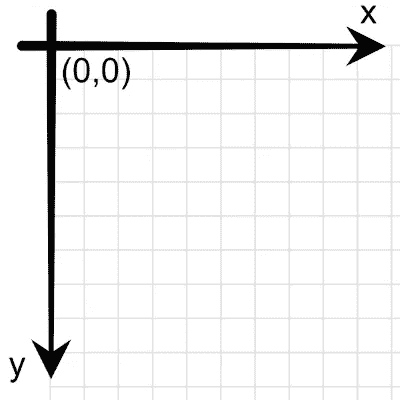

画布坐标系。

如果您对画布的更多细节感兴趣，可以查看我的文章:

*   [如何开始使用 JavaScript 制作画布动画](https://medium.com/dailyjs/how-to-get-started-with-canvas-animations-in-javascript-cb2ccf37515c)

# 制图法

为了让游戏看起来更好，我们可以使用图像来绘制球。但是，在此之前，我们需要跟踪球的位置和其他相关值。为此，我们可以定义一个`ball`对象。我们从定义唯一一个我们知道的常量值开始，这个值就是`radius`:

```
const ball = {
  radius: 10
}
```

当游戏开始时，我们想给球一些初始值，比如它的位置。我们在函数`resetBall()`中将球的起始`x`和`y`坐标定义为画布的底部中心部分，然后我们从`play()`函数调用该函数:

```
function resetBall() {
  ball.x = canvas.width / 2,
  ball.y = canvas.height — 100
}
```

这将有助于以后有一个函数来重置球的初始值，而不是在球对象中定义它们。

接下来，我们**定义用于球和背景的图像**。对于每个对象属性，我们首先将其创建为一个`new Image()`，然后将其`src`设置为我们正在使用的文件:

```
let images = {
  background: new Image(),
  ball: new Image()
}images.background.src = 'bg-space.webp';
images.ball.src = 'ball.webp';
```

> 这些图像采用的是 **WebP** 格式，生成的文件较小，但质量与 PNG 或 JPEG 相同。

为了绘制图像，我们使用了`drawImage()`，它提供了在画布上绘制图像的不同方法:

```
ctx.drawImage(image, x, y, width, height);
```

我们提供图像左上角的坐标，然后是图像的大小。对于**背景，**我们使用画布的宽度和高度来让背景图像覆盖整个比赛场地。对于**球，**我们将半径加倍以得到直径，它作为球图像的宽度和高度:

```
// draw background
ctx.drawImage(images.background, 0, 0, canvas.width, canvas.height);// draw ball
ctx.drawImage(images.ball, ball.x, ball.y, 2*ball.radius, 2*ball.radius);
```

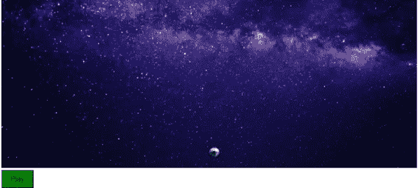

球和背景。

# 动画

现在我们知道了如何在画布上画画，我们准备好进行下一步——让球移动。为此，我们在屏幕上绘制球，清除它，然后在不同的位置再次绘制它。在画布上制作动画就像制作一部定格电影。我们在每一帧中稍微移动物体来制作动画。

## 绘图循环

Canvas 使用**即时渲染**——当我们画图时，它会立即在屏幕上渲染。但是，这是一个“一劳永逸”的系统。在我们画了一些东西之后，画布忘记了这个物体，只知道它是像素。所以没有我们能移动的物体。而是要再画一遍。

要做到这一点，我们需要定义一个绘图函数，每次运行时使用一组不同的变量值。我们可以使用 JavaScript 计时函数一遍又一遍地运行函数，比如`requestAnimationFrame()`，它比`setInterval()`有一些明显的优势:

-它支持浏览器优化。
-它处理帧速率。
-动画仅在可见时运行。

用`requestAnimationFrame()`制作动画的方法是创建一个绘制帧的函数，然后调度它自己再次调用。通过这样做，我们得到了一个异步循环，它在我们在画布上绘图时执行。我们反复调用`paint()`函数，直到我们决定停止。

我们必须记住使用`cancelAnimationFrame()`方法来取消先前预定的请求。如果我们忘记这样做，我们会注意到每次按 play 时游戏运行得更快，因为我们会有越来越多的动画循环在代码中运行。

我们可以将`requestId`添加到游戏对象中，并在运行新动画之前检查一个值。然后，我们在每次运行新的 *requestAnimationFrame* 时设置这个变量:

还有一件事要做。我们需要计算动画多长时间前进一帧，**否则动画会在高刷新率屏幕上运行得更快。**

## 计时器

当需要为下一次重画更新动画时，我们调用`requestAnimationFrame()`函数。但是考虑到不同的屏幕刷新率，我们需要计算我们是否应该在这个调用中更新我们的游戏。

```
requestAnimationFrame(callback);
```

回调函数被传递一个参数，一个类似于由`[performance.now()](https://developer.mozilla.org/en-US/docs/Web/API/Performance/now)`返回的`[DOMHighResTimeStamp](https://developer.mozilla.org/en-US/docs/Web/API/DOMHighResTimeStamp)`，指示`requestAnimationFrame()`开始执行回调函数的时间点。我们可以使用这个时间戳来计算何时绘制和更新我们的游戏。

首先，我们添加一个时间对象来跟踪所有相关的东西，并在`resetGame()`函数中设置它:

```
function resetGame() {
  game.time = {
    start: performance.now(),
    elapsed: 0,
    refreshRate: 16
  };
}
```

我们在`play()`函数中添加了对`resetGame()`的调用。然后在动画循环中，我们添加代码来检查`refreshRate`的 16ms 是否已经过去，以查看是否该绘制另一帧了:

现在我们有了一个在每一帧持续绘制游戏的循环，我们需要在下一次绘制之前改变位置。

## 移动球

我们用球对象的坐标在画布的底部中心部分定义了起点。画完球后，我们要改变`x`和`y`来移动它到一个新的位置。

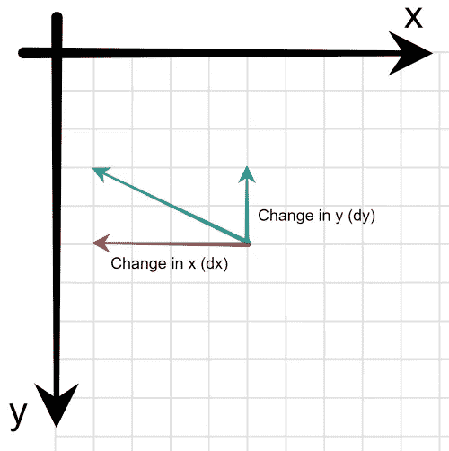

x 和 y 的变化。

无需过多探究背后的数学原理，我们可以使用`dx`和`dy`来定义变化。变化值越大，球移动得越快。

> 希腊字母δ(delta)表示*变量的变化。*

我们需要一个`speed`设置作为其他运动相关变量的基础。为了加快游戏速度，我们改变这个属性。

当我们发射球时，它应该是随机向上的。如果我们总是有相同的轨迹，游戏会很快变得可预测。当`dy`为负值时，球向上移动，所以我们用`Math.Random()`将其设置为`-speed.`，我们可以在 x 轴上随机化球射出的方向:

然后我们用每一帧的变化来更新`x`和`y`。每次更新时，球都会被画在新的位置上。添加这两行给了我们这个`update()`函数:

```
function update() {
  ball.x += ball.dx;
  ball.y += ball.dy;
}
```

我们在画完当前帧后从`animate()`函数调用`update()`。这样，我们就为下一次油漆准备好了新的位置。

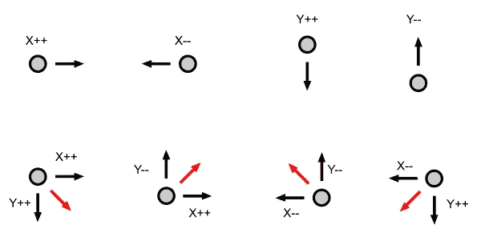

向不同的方向移动球。

在每个新帧之前，我们需要清空画布。我们可以用`CanvasRenderingContext2D.clearRect()`方法做到这一点，它通过将像素设置为透明黑色来擦除矩形区域中的像素。但是相反，我们可以通过绘制背景来开始每个新帧，这也清除了前一帧中的所有内容。为了保持动画函数的简洁，我们可以将所有与画布上的绘图对象相关的代码添加到一个`paint()`函数中:

通过绘制背景来清除每个框架画布。然后，我们在更新下一帧的 x 和 y 值之前绘制球。通过用`requestAnimationFrame()`安排`animate()`功能的新运行，我们创建了一个动画循环。


球动画

# 冲突检出

在前一章中，我们让球动了起来。但它很快就离开了屏幕，结束了这种乐趣。我们需要实现*碰撞检测*来让球从墙壁上弹开。

首先，我们需要计算碰撞何时发生。之后，我们需要思考当我们击中目标物体时，我们正在向哪个方向移动。然后我们可以在击球后将球向相反的方向送出。

## 边界

要使球在比赛场地内，以下三个条件都必须成立:

- **球的 X** 大于左墙的 X。
- **球的 X** 小于右墙的 X。
- **球的 Y** 大于屋顶的 Y。

球被绘制到画布上左上角的坐标处。我们需要考虑球的宽度。因此，我们需要考虑球的宽度时，检查对双方的碰撞。宽度或直径等于球半径的两倍(2r)。

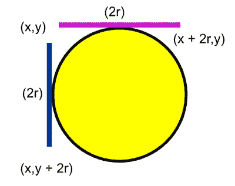

球坐标与半径。

## 检测碰撞

球飞过的第一堵墙是正确的。我们可以通过检查`x`何时大于画布的宽度来检测球何时与它发生碰撞。在这种情况下，我们需要添加`2*ball.radius`，因为碰撞发生在球的右侧。

当碰撞发生时，我们通过对δx(dx)求反，使球在 x 轴上反向运动，使球向相反方向运动:

```
if (ball.x + 2 * ball.radius > canvas.width) {
  ball.dx = -ball.dx;
}
```

当我们碰到左边的墙时，我们再次反转 x 轴的方向。这次我们检查 x 何时小于零，也就是 x 轴的起点。在这种情况下，碰撞发生在球的左侧，这意味着我们不需要改变 x 值:

```
if (ball.x < 0) {
  ball.dx = -ball.dx;
}
```

最后，我们需要从屋顶跳下来。在这种情况下，当 y 值低于零时，我们反转 y 轴上的移动。y 轴上的水平移动由δy 表示:

```
if (ball.y < 0) {
  ball.dy = -ball.dy;
}
```

我们将所有这些检查一起添加到函数`detectCollision()`中:

这段代码做了它应该做的事情，但是它可能很难读懂。为了增加可读性，我们添加了返回计算结果的函数表达式。我们还需要确保坐标不在游戏区域之外。所以我们确保将坐标移回墙上:

那更好！随着代码的实现，我们已经处理了所有需要球反弹的墙。但是你可能已经注意到有一个冲突我们还没有处理。

# 游戏结束

当球落在地板上时，我们不希望它反弹回来，但相反，这是我们输掉游戏的时候——游戏结束。

在我们安排下一轮`animate()`之前，我们检查球是否在球场底部出界。如果游戏输了，我们会向用户显示一条消息。我们通过设置`fillStyle`在屏幕上书写文本，并用`fillText()`告诉我们想要的内容和位置。在这里，我们将消息计算在画布的中间。

我们使用`return`语句来短路`animate()`循环。如果`isGameOver()`返回真，我们不请求下一帧。现在，如果我们运行代码，球会像它应该的那样从墙上弹回，当球落在界外时，我们会在屏幕上看到一个游戏。

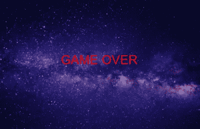

屏幕上的游戏

# 涉水

现在我们有了一个从墙上弹回的球，是时候通过增加玩家互动将这个演示演变成一个游戏了。让我们添加一个玩家可以控制和弹开球的球拍！

像往常一样，我们首先添加一些变量来定义一个`paddle`对象:

球拍在球场底部移动，因此 y 轴上的值是恒定的。对同一个对象的 height 属性存在依赖，这意味着我们需要使用一个 [getter](https://developer.mozilla.org/en-US/docs/Web/JavaScript/Reference/Functions/get) 。

然而，我们需要跟踪桨在每个时刻在 x 轴上的位置。我们希望每次开始新的生活或关卡时，球拍都从球场中央开始，所以我们定义了一个函数`resetPaddle()`，在这里我们计算 x 值:

最后，球拍必须比球快，这样我们才有机会接住球，所以我们将球拍的`dx`设置为游戏速度的增量。

## 划桨

接下来，我们添加在每一帧绘制船桨所需的代码。我们向我们的`images`对象添加一个`paddle`属性，并将`src`设置为球拍的图像。然后我们在`paint()`函数中使用`drawImage()`作为背景和球，在每一帧的正确位置绘制球拍:

## 控制桨

现在我们已经添加了绘图逻辑，我们可以从有趣的部分开始——让用户控制桨！我们应该按住左右箭头键来移动桨。为了实现这一点，我们需要:

*   变量来存储左右键的状态。
*   事件侦听器知道按键何时被按下和释放。

我们可以将`leftKey`和`rightKey`添加到我们的*游戏对象*中，默认值为`false`，因为这些按钮在游戏开始时不会被按下:

```
let game = {
  speed: 8,
  requestId: null,
  **leftKey: false,
  rightKey: false**
}
```

接下来，我们为`keydown`和`keyup`事件添加事件监听器。这些将监听按键和释放:

```
document.addEventListener('keydown', keyDownHandler);
document.addEventListener('keyup', keyUpHandler);
```

当您按下键盘上的一个键时，`keydown`事件触发并调用`keyDownHandler()`函数。随着键的释放，`keyup`事件触发并调用`keyUpHandler()`函数。以下代码定义了这些功能以及我们用于左右移动的按键:

这两个函数都将事件作为参数，由`e`变量表示。`key`属性保存关于被按下的键的信息。现代浏览器使用`ArrowRight`和`ArrowLeft`作为左/右箭头键。当我们按下一个键时，相关变量被设置为`true`。当释放该键时，变量变回`false`。

## 移动船桨

现在我们已经设置了变量、事件和函数来更新变量，我们可以使用这些按下的变量来更新球拍在屏幕上移动的 x 位置。我们可以在`update()`功能中这样做，如果按下左键或右键，我们将改变`x`坐标:

如果按键被按下，我们通过增加或减少`paddle.dx`来更新`paddle.x`变量。我们还需要检查是否已经到达墙壁，在这种情况下，我们将`x`变量保持在这些最小值和最大值。

## 把球从球拍上弹开

最后，我们必须为桨添加碰撞检测。当球碰到球拍时，球应该会反弹回比赛场地。

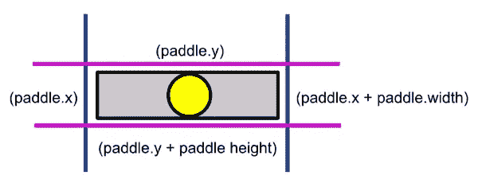

球拍里的球。

要做到这一点，我们可以检查球是否已经到达球拍，是否在球拍的左右边缘之间。由于我们从左上角开始测量球，所以在检查球是否到达球拍时，我们需要加上 2 *半径。这就是为什么我们必须在检查碰撞之前更新坐标的值。同样，当我们检查球是否击中水平面上的球拍时，我们必须记住计算中的半径:

运行代码，我们可以控制球拍并用它拍球。

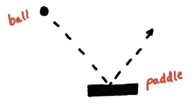

球从球拍上弹开

# 砖块

在墙上拍球很有趣，但很快就会变得无聊。我们需要的是可以摧毁的东西！这就是我们在本课中所做的，创建一个砖场。

## 定义砖块

首先，我们需要设置一些变量来定义砖块。将以下代码行添加到您的代码中，以创建一个块配置对象:

```
let brick = {
  rows: 5,
  cols: 10,
  get width() {
    return canvas.width / this.cols;
  },
  height: 30
}
```

这里我们定义砖块的行数和列数以及它们的高度。我们使用一个 getter 来根据列数计算砖块的宽度。

## 砖场

我们将所有的砖块放在一个名为`brickField.`的数组中，它包含了所有砖块对象的位置和大小，以便在屏幕上绘制每块砖块。我们用行和列循环初始化数组。然后，我们在每次迭代中向`brickField`数组添加一个具有以下属性的砖块:

*   x 位置
*   y 位置
*   高度
*   宽度
*   颜色
*   点
*   hitsLeft

我们根据行和列以及砖块的宽度和高度计算出`x`和`y`坐标。`topMargin`在画布的顶部留下了一些空间，我们稍后会用到。

这里我们按行设置了`color`，但是在创建新的关卡时，我们可以更有创造性。`points`也依赖于这一行，我们通过的每一行砖块都会得到更多的分数。砖块可以承受撞击，有时需要多次撞击才能被摧毁。这里我们用`hitsLeft`属性设置第一行的砖块在两次点击后消失:

上面的代码将遍历行和列，并创建我们添加到砖块数组中的新砖块对象。

## 画砖

现在让我们创建一个绘制砖块的函数。首先，我们检查`hitsLeft`是否大于零，这意味着砖块仍然可见。如果它有左击，它会被画在屏幕上。然后，在使用`fillRectangle()`和`strokeRectangle()`绘制砖块之前，我们从砖块属性中设置`color`:

然后我们需要在`paint()`函数中添加一个对`drawBricks()`的调用，来绘制每一帧中砖块的领域。

# 砖块碰撞

现在我们已经让砖块出现在屏幕上了，是时候让它们在我们用球击中它们时消失了。

当我们检查球和砖块之间的碰撞时，我们首先检查球是否在砖块内部。然后，我们检查球从哪个方向击中砖块，以了解要做出什么方向的改变。

要使球在砖块内，以下四个条件都必须成立:

*   球的 x 位置大于砖块的 x 位置。
*   球的 x 位置小于砖块的 x 位置加上它的宽度。
*   球的 y 位置大于砖块的 y 位置。
*   球的 y 位置小于砖块的 y 位置加上它的高度。

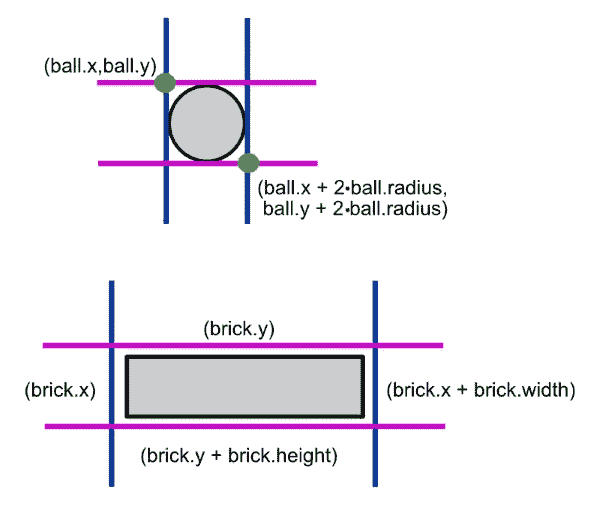

计算中使用的球和砖坐标

首先，我们要创建一个碰撞检测函数，循环遍历所有砖块，将球与其位置进行比较。为了提高代码的可读性，我们为所有的计算定义了一个函数表达式`isBallInsideBrick`。

正如我们前面看到的，当我们绘制砖块时，我们通过`hitsLeft`属性知道砖块是否可见。当砖块被击中时，我们减少它。我们还将最上面一行的颜色设置为灰色，该行在被销毁之前需要两次点击。

当我们击中砖块时，砖块会消失，但如果球在我们这样做时改变方向，那也很好。

# 碰撞方向

为了在碰撞后将球弹向正确的方向，我们需要知道球击中了砖块的哪一面。

我们可以通过移除变化`ball.dx`来计算球是来自左边还是右边，并找出球在撞击前是在砖块的左边还是右边。如果这是真的，我们否定`dx`使球从它来的地方反弹回来。

如果这两种情况都不成立，那么我们知道球击中了砖块的顶部或底部，在这种情况下，我们否定`ball.dy`使球反弹回来。

有时我们会在同一个框架中击中多个砖块。例如，如果我们从底部击中两块砖，并改变方向两次，球将会穿过砖。出于这个原因，我们需要一个变量`directionChanged`来跟踪，这样我们每帧只改变一次方向。

最后要做的是将对`detectBrickCollision()`函数的调用添加到我们的`animate()`函数中，就在`collisionDetection()`调用的下面。有了这些变化，我们就能敲碎砖头了。当我们击中一个球时，球会像预期的那样反弹。

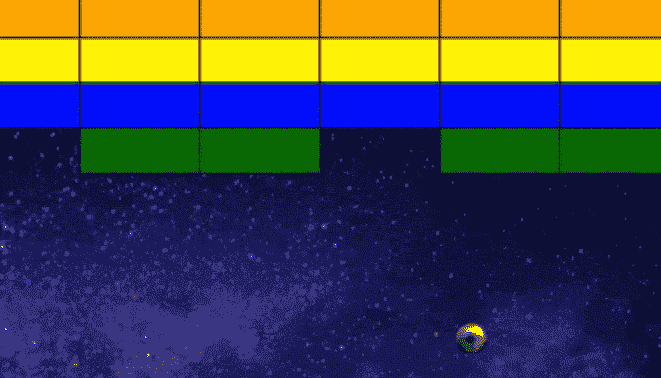

球碰到砖块改变了方向。

# 分数、等级和生活

现在我们可以摧毁砖块，游戏准备奖励击中砖块的分数，并记录总分数。当所有的砖块都被清除后，游戏应该会进入下一关。而在我们抓不住球的时候，有不止一次的生命去获得另一次机会，不是很好吗？

## 游戏变量

为了跟踪游戏中的所有这些新状态，我们将它们添加到游戏对象中。由于这些值需要在每个游戏开始时重置，我们将它们添加到`resetGame()`函数中:

```
function resetGame() {
  game.speed = 8;
  **game.score = 0;
  game.level = 1;
  game.lives = 3;**
}
```

## 显示文本

在画布上绘制文本类似于绘制形状。首先，我们设置`[font](https://developer.mozilla.org/en-US/docs/Web/API/CanvasRenderingContext2D/font)`的大小和类型。接下来，我们使用`[fillStyle](https://developer.mozilla.org/en-US/docs/Web/API/CanvasRenderingContext2D/fillStyle)`来设置字体的颜色，最后使用`[fillText()](https://developer.mozilla.org/en-US/docs/Web/API/CanvasRenderingContext2D/fillText)`来告诉我们想要在画布上显示什么文本以及显示在哪里。

下一步是在屏幕上显示所有这些新的变量，这样玩家就可以随时获得最新的信息。让我们添加一个`drawScore()`函数，用`level`和`score`创建和更新显示:

上面的代码在屏幕顶部打印当前级别和点数。

## 剩余生命

我们也可以用文字来书写生命，但为了让它更有趣，我们可以为我们剩余的每一个生命展示一个小小的桨。我们可以通过使用与桨相同的图像，并为我们剩下的每个生命绘制它来做到这一点:

现在，一个小桨出现在屏幕的右上方，代表我们每个人的生活。为了使用我们为游戏信息创建的函数，我们在`draw()`函数中添加了对它们的调用:

# 更新值

现在我们在屏幕上显示了所有的变量，我们需要更新它们来增加分数和等级，同时记录我们失去的生命。

## 得分

还记得上一章我们添加了每块砖的价值点数吗？每当我们摧毁一个，现在是时候把这些加到我们的总得分上了。

为了增加分数，我们在`detectBrickCollisions()`中每击中一次砖块，就增加砖块的价值分数:

```
game.score += brick.points;
```

现在，那很容易！下一个值有点复杂。

如果你想添加一个高分列表，请阅读我的文章:

*   [如何在本地存储中保存高分](https://michael-karen.medium.com/how-to-save-high-scores-in-local-storage-7860baca9d68)

## 级别

当没有更多的砖块时，我们进行到下一个水平。当所有砖块的`hitsLeft`都等于零时，就没有砖块了。我们如何检查一个数组中的所有元素来得到一个特定的属性值呢？

最适合的数组方法是 [every()](https://developer.mozilla.org/en-US/docs/Web/JavaScript/Reference/Global_Objects/Array/every) 。它可以检查数组中的所有元素是否都通过了我们提供的测试。检查何时没有砖块剩余，如果是这样，进入下一关:

我们在`animate()`函数中添加了一个对`isLevelCompleted()`的调用，如果该级别已经完成，则在请求新的帧之前退出:

```
if (isLevelCompleted() || isGameOver()) return;
```

当我们没有剩余的砖块时，我们增加`game.level`。当我们突破得更好时，开始速度变得太容易了。太容易意味着无聊。当我们升级时，我们通过增加`game.speed`来增加难度。

然后我们重新设置比赛场地，结果球和球拍在新的关卡上移动得更快了。请记住，如果关卡完成，我们会停止动画。原因是我们想在继续游戏之前显示几秒钟的屏幕。我们使用`setTimeout()`并设置在继续游戏前暂停的毫秒数。

类似地，正如我们对`cancelAnimationFrame()`所做的，我们将`clearTimeout(game.timeoutId)`添加到`play()`函数的开头，使得在没有另一个动画循环启动的情况下开始一个新游戏成为可能。

## 生活

最后，我们修改`gameOver()`函数，在游戏结束前检查我们是否还有生命。我们减少`lives`，当我们达到零时，游戏结束。否则，我们通过调用`resetBall()`得到一个新球:

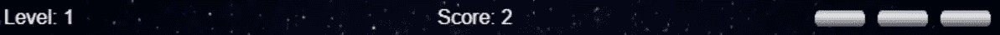

# 声音

在我们至少加入一些音效之前，没有一个游戏是完整的。有许多免费网站可以找到声音样本使用。我从 freesound.org 的作品中选了一些。

我们将为以下内容添加音效:

*   球击中了球拍
*   球撞上了砖块
*   球发射
*   游戏结束
*   完成的级别

`**Audio()**`构造函数创建并返回一个新的`[HTMLAudioElement](https://developer.mozilla.org/en-US/docs/Web/API/HTMLAudioElement)`用于播放音频:

```
const audioElement = new Audio(url);
audioElement.play();
```

可选的`[DOMString](https://developer.mozilla.org/en-US/docs/Web/API/DOMString)`包含音频文件的 URL。

除了可以在构造函数中添加 URL 之外，我们添加声音的方式类似于我们创建图像的方式。

现在我们可以在找到这些元素在代码中的位置时播放它们。例如，我们将`gameOver`声音添加到`gameOver()`函数中。有时我们会撞上多块砖。为了在我们敲击下一块砖时重新播放声音，我们将`currentTime`设置为零:

```
sounds.brick.currentTime = 0;
sounds.brick.play();
```

您可能已经注意到我们在 sounds 对象中添加了`music`。游戏音乐在我们按下开始键时开始，在游戏结束时结束。因为我们不想让音乐结束，所以我们将它设置为重复播放:

```
sounds.music.loop = true;
```

我们可以将音频的音量设置在 0 到 1 之间。为了确保音乐在开始时不会太大声，我们可以将其设置为比最大值低一点:

```
sounds.music.volume = 0.6;
```

我们也可以在`keyDownHandler`中添加一些键盘触发器来切换音乐的开关和控制音量。随着所有的声音到位，我们真的有一些东西开始类似于一个完整的游戏。

# 结论

今天我们学习了如何用 HTML 画布和 JavaScript 创建一个完整的游戏。我希望你喜欢这篇文章，并学到了一些新东西。

[](https://www.educative.io/courses/game-development-js-tetris) [## 用 JavaScript 开发游戏:创建俄罗斯方块-互动学习

### 在本课程中，您将获得使用 JavaScript 进行游戏开发的实践经验。使用俄罗斯方块的经典游戏…

www.educative.io](https://www.educative.io/courses/game-development-js-tetris) 

## 资源

*   [如何开始使用 JavaScript 制作画布动画](https://medium.com/dailyjs/how-to-get-started-with-canvas-animations-in-javascript-cb2ccf37515c)
*   [如何在本地存储中保存高分](https://michael-karen.medium.com/how-to-save-high-scores-in-local-storage-7860baca9d68)
*   [用俄罗斯方块学习现代 JavaScript】](https://michael-karen.medium.com/learning-modern-javascript-with-tetris-92d532bcd057)
*   [带有 js-breakout 的 GitHub 库](https://github.com/melcor76/js-breakout)。
*   声音来自[freesound.org](https://freesound.org/)