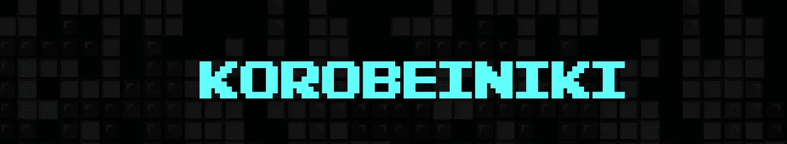

# 用 Angular 开发游戏:如何构建自己的俄罗斯方块克隆

> 原文：<https://levelup.gitconnected.com/game-development-with-angular-how-to-develop-your-own-tetris-clone-2e95f7af3a7e>

这是用 Angular 开发游戏的第一部分(希望如此)。第一部分会给你一些我正在做的项目的背景。

 [## oocx/korobeiniki

### 这个项目是用 Angular 9 做的俄罗斯方块克隆。我把它作为一个示例应用程序，用于 web 上的一个博客系列…

github.com](https://github.com/oocx/korobeiniki) 

几个月前，我老婆还在抱怨找不到适合 Xbox 的好的俄罗斯方块版本。“你是一名软件开发人员”，她说。“你就不能创造一个吗？”。

“为什么不呢？”我对自己说。“不会那么难吧！”。这似乎是一个有趣的挑战。所以我很快谷歌了几篇关于 Xbox 游戏开发的文章。我很快发现，要想在 Xbox 上获得一些东西，我要么需要通过商店发布它，要么我必须将我的 Xbox 置于开发者模式，这(据我所知)意味着当开发者模式打开时，我将无法再从商店玩“普通”游戏。我还必须使用我现在不想深究的工具和框架，这些工具和框架不会提供我可以在工作中应用的有用的新知识。

然后我想起来 Xbox 也有浏览器。可惜只是 Edge(旧的，不是新的基于 Chrome 的 Edge)。但是嘿，至少不是 IE！因此，如果我只是将我的游戏创建为浏览器游戏，我就不必通过商店，也不必使用开发者模式。此外，我可以使用我在工作中使用的工具和技术。

我决定简单地使用 Angular，因为这是我们目前在 Diamant Software 用来创建我们闪亮的新用户界面的东西。

游戏开发不同于为会计应用程序开发用户界面，所以即使我没有使用新的框架，仍然有足够多的新东西让我学习。

> 一些法律边注:“俄罗斯方块”的名称是俄罗斯方块公司拥有的。据我了解(我不是律师)，他们拥有“俄罗斯方块”这个名字，但基本的游戏理念不受商标或版权保护。所以只要我不把我的游戏叫做“俄罗斯方块”，我应该是安全的。此外，我没有把它放在任何应用商店，主要是用这个游戏作为我的博客帖子的例子。写关于如何创建游戏的文章应该与 YouTube 上所有的“如何用吉他弹奏 XYZ”教程没有太大区别(顺便说一下，甚至有一个“[俄罗斯方块主题——初学者吉他课](https://www.youtube.com/watch?v=BFBNFsMjjLk)”视频)。

那么我应该给我的游戏取什么名字呢？目前，我选择将其命名为“Korobeiniki”作为工作名称。这是俄罗斯方块主题所依据的一首俄罗斯民歌的名字(我已经后悔这个选择了，因为我永远也不记得怎么拼写了)。

在我开始写代码之前，我首先必须研究 t̶e̶t̶r̶i̶s̶·科罗拜尼基游戏机制的细节。这出乎意料地容易，因为官方的俄罗斯方块游戏需要遵循某种官方指导。这份指南发表在几个俄罗斯方块维基上，比如这里的。

该指南最重要的部分是一个叫做“[超级旋转系统](https://tetris.fandom.com/wiki/SRS)”的东西，它解释了当你旋转一个俄罗斯方块(你的游戏棋子)时，尤其是当你在其他方块附近旋转它时，它可能会在旋转后结束在已用空间中。获得正确的行为对于让我自己的游戏“感觉”像俄罗斯方块克隆版很重要。

对源代码的第一次快速浏览

该指南包含许多其他有趣的方面，甚至关于输入控件(哪个键做什么)或得分的细节。我不打算遵循每一个细节，因为我想在游戏中加入一些我自己的想法。

单人模式的游戏

在这篇文章中，我给了你一些背景知识，关于我为什么开始创作自己的游戏，以及我如何研究游戏机制的所有必要的小细节。

在接下来的帖子中，我可能会讨论的一些话题是(没有承诺！也许我很懒或者很忙，这将是我唯一发表的部分):

*   如何下载和构建游戏
*   游戏的整体架构(将“干净的架构”应用于俄罗斯方块)
*   创建游戏循环
*   在浏览器应用程序中使用游戏手柄
*   使用声音效果和音乐
*   使用角组件渲染游戏
*   如何优化游戏，使其始终以 60 fps 运行

请在评论中告诉我你对哪些话题感兴趣。

希望我让你好奇了，你现在想知道来源？你可以从我的 github 仓库下载，https://github.com/oocx/korobeiniki

我不会发布预建版本——如果想玩，需要自己搭建:)。

README.md 包含了如何构建和运行游戏的说明。我假设你已经对角的发展有些熟悉了，所以你应该能很快上手。如果没有，请告诉我，我会写另一篇文章来帮助初学者设置开发环境和构建代码。