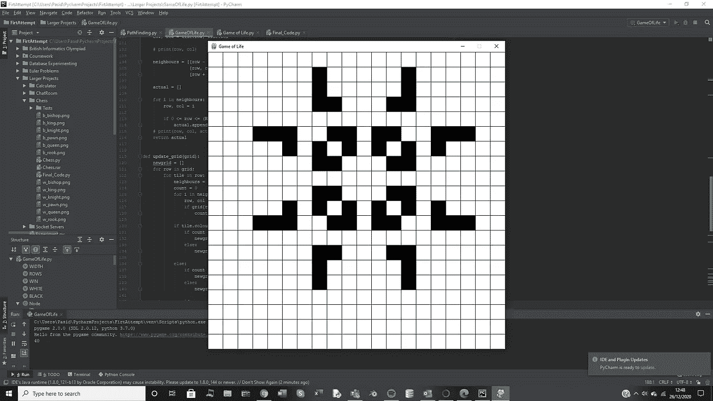

# Python 中的生命游戏

> 原文：<https://levelup.gitconnected.com/game-of-life-on-python-6aaf5fd58ee3>



不知道的话，人生的游戏是对人口的模拟。

[](https://en.wikipedia.org/wiki/Conway%27s_Game_of_Life) [## 康威的生活游戏

### 生命的游戏，也简称为生命，是由英国数学家约翰·霍顿设计的细胞自动机…

en.wikipedia.org](https://en.wikipedia.org/wiki/Conway%27s_Game_of_Life) 

维基百科页面解释了生命游戏的基本规则，以及如何决定一个方块的状态。

如果你是一个视觉学习者，这个视频也给了你一个直观的解释。

# 规则:

活着的状态是黑色的，死去的状态是白色的。我们

1.  任何少于两个活邻居的活细胞都会死亡，就好像是由于人口减少。
2.  任何有两个或三个活邻居的活细胞都会延续到下一代。
3.  任何有三个以上活邻居的活细胞都会死亡，好像是由于人口过多。
4.  任何一个死细胞，只要有三个活的邻居，就会变成活细胞，就像通过繁殖一样。

如果你看一下代码，你可能会意识到它使用了与国际象棋网格非常相似的代码，这是因为这个程序的大部分是带有新逻辑的国际象棋的副本。所以我复制了大部分的网格设置(我可能也不小心留下了象棋代码的新注释)。

# 完整代码

首先我会分享完整的代码，然后解释如下。

```
import pygame
import sysWIDTH = 800
ROWS = 20
WIN = pygame.display.set_mode((WIDTH, WIDTH))pygame.display.set_caption("Game of Life")WHITE = (255, 255, 255)
BLACK = (0, 0, 0)class Node:
    def __init__(self, row, col, width):
        self.row = rowself.col = colself.x = int(row * width)self.y = int(col * width)self.colour = WHITEself.occupied = Nonedef draw(self, WIN):
        pygame.draw.rect(WIN, self.colour, (self.x, self.y, WIDTH / 8, WIDTH / 8))def make_grid(rows, width):
    grid = []gap = WIDTH // rowsprint(gap)for i in range(rows):grid.append([])for j in range(rows):
            node = Node(j, i, gap)grid[i].append(node)return griddef draw_grid(win, rows, width):
    gap = width // ROWSfor i in range(rows):pygame.draw.line(win, BLACK, (0, i * gap), (width, i * gap))for j in range(rows):
            pygame.draw.line(win, BLACK, (j * gap, 0), (j * gap, width))"""The nodes are all white so this we need to draw the grey lines that separate all the chess tilesfrom each other and that is what this function does"""def update_display(win, grid, rows, width):
    for row in grid:for spot in row:
            spot.draw(win)draw_grid(win, rows, width)pygame.display.update()def Find_Node(pos, WIDTH):
    interval = WIDTH / ROWSy, x = posrows = y // intervalcolumns = x // intervalreturn int(rows), int(columns)def neighbour(tile):
    col, row = tile.row, tile.col# print(row, col)neighbours = [[row - 1, col - 1], [row - 1, col], [row - 1, col + 1],
                  [row, col - 1], [row, col + 1],
                  [row + 1, col - 1], [row + 1, col], [row + 1, col + 1], ]actual = []for i in neighbours:
        row, col = iif 0 <= row <= (ROWS - 1) and 0 <= col <= (ROWS - 1):
            actual.append(i)
    # print(row, col, actual)
    return actualdef update_grid(grid):
    newgrid = []
    for row in grid:
        for tile in row:
            neighbours = neighbour(tile)
            count = 0
            for i in neighbours:
                row, col = i
                if grid[row][col].colour == BLACK:
                    count += 1if tile.colour == BLACK:
                if count == 2 or count == 3:
                    newgrid.append(BLACK)
                else:
                    newgrid.append(WHITE)else:
                if count == 3:
                    newgrid.append(BLACK)
                else:
                    newgrid.append(WHITE)return newgriddef main(WIN, WIDTH):
    run = None
    grid = make_grid(ROWS, WIDTH)while True:
        pygame.time.delay(50)  ##stops cpu dying
        for event in pygame.event.get():
            if event.type == pygame.QUIT:
                pygame.quit()
                sys.exit()if event.type == pygame.KEYDOWN:
                if event.key == pygame.K_SPACE:
                    run = Trueif event.type == pygame.MOUSEBUTTONDOWN:
                pos = pygame.mouse.get_pos()
                row, col = Find_Node(pos, WIDTH)
                if grid[col][row].colour == WHITE:
                    grid[col][row].colour = BLACKelif grid[col][row].colour == BLACK:
                    grid[col][row].colour = WHITEwhile run:
                for event in pygame.event.get():
                    if event.type == pygame.MOUSEBUTTONDOWN:
                        run = False#pygame.time.delay(50)
                newcolours = update_grid(grid)
                count=0
                for i in range(0,len(grid[0])):
                    for j in range(0, len(grid[0])):
                        grid[i][j].colour=newcolours[count]
                        count+=1
                update_display(WIN, grid, ROWS, WIDTH)
                #run= Falseupdate_display(WIN, grid, ROWS, WIDTH)main(WIN, WIDTH)
```

# 代码解释:

```
import pygame
import sys

WIDTH = 800
ROWS = 20
WIN = pygame.display.set_mode((WIDTH, WIDTH))

pygame.display.set_caption("Game of Life")

WHITE = (255, 255, 255)
BLACK = (0, 0, 0)

class Node:
    def __init__(self, row, col, width):
        self.row = row

        self.col = col

        self.x = int(row * width)

        self.y = int(col * width)

        self.colour = WHITE

        self.occupied = None

    def draw(self, WIN):
        pygame.draw.rect(WIN, self.colour, (self.x, self.y, WIDTH / 8, WIDTH / 8))

def make_grid(rows, width):
    grid = []

    gap = WIDTH // rows

    print(gap)

    for i in range(rows):

        grid.append([])

        for j in range(rows):
            node = Node(j, i, gap)

            grid[i].append(node)

    return grid

def draw_grid(win, rows, width):
    gap = width // ROWS

    for i in range(rows):

        pygame.draw.line(win, BLACK, (0, i * gap), (width, i * gap))

        for j in range(rows):
            pygame.draw.line(win, BLACK, (j * gap, 0), (j * gap, width))

    """

    The nodes are all white so this we need to draw the grey lines that separate all the chess tiles

    from each other and that is what this function does"""

def update_display(win, grid, rows, width):
    for row in grid:

        for spot in row:
            spot.draw(win)

    draw_grid(win, rows, width)

    pygame.display.update()

def Find_Node(pos, WIDTH):
    interval = WIDTH / ROWS

    y, x = pos

    rows = y // interval

    columns = x // interval

    return int(rows), int(columns)
```

所有这些代码都是我做的象棋程序的副本，我基本上只是用一个我称之为节点的类来创建网格的瓦片。如果你想要一个网格的解释，我推荐你去看看我的象棋代码。

*   draw——我用来在窗口上绘制节点的方法，注意——这些节点周围没有黑色边框，所以我们需要单独添加这些节点。
*   make_grid 在程序开始时被调用，它将创建一个充满节点元素的初始 2d 数组，用来表示网格。嵌套循环将会定期自动设置节点在屏幕上的位置
*   正如我前面所说的，当我们在屏幕上画正方形时，当它们是白色时，它们不会立即有边界，例如，如果我们在屏幕上画一个白色的正方形，它的边界也将是白色的，因为我们窗口的背景颜色自动是白色的，这意味着它将融入背景，也融入相同颜色的其他节点。因此，该函数将绘制黑线来分隔所有节点。
*   update _ display——对于每个 tick，我们需要用已经做出的任何更改来更新屏幕，所以我们在 while True 循环的末尾使用这个函数来更新屏幕。我们通过再次调用 draw 方法来做到这一点，如果发生了任何变化(当发生变化时，我们改变节点颜色)，这将出现在屏幕上。
*   使用 Find_Node 是因为如果我们单击屏幕，房子的坐标将在 800 x 800 的范围内(因为它是窗口上的坐标),而我们想要一个较小范围内的数组网格的索引。这是我们使用 mod(%)转换成网格索引的地方，该索引对应于我们单击屏幕时鼠标所在的节点。

```
def neighbour(tile):
    col, row = tile.row, tile.col

    # print(row, col)

    neighbours = [[row - 1, col - 1], [row - 1, col], [row - 1, col + 1],
                  [row, col - 1], [row, col + 1],
                  [row + 1, col - 1], [row + 1, col], [row + 1, col + 1], ]

    actual = []

    for i in neighbours:
        row, col = i

        if 0 <= row <= (ROWS - 1) and 0 <= col <= (ROWS - 1):
            actual.append(i)
    # print(row, col, actual)
    return actual

def update_grid(grid):
    newgrid = []
    for row in grid:
        for tile in row:
            neighbours = neighbour(tile)
            count = 0
            for i in neighbours:
                row, col = i
                if grid[row][col].colour == BLACK:
                    count += 1

            if tile.colour == BLACK:
                if count == 2 or count == 3:
                    newgrid.append(BLACK)
                else:
                    newgrid.append(WHITE)

            else:
                if count == 3:
                    newgrid.append(BLACK)
                else:
                    newgrid.append(WHITE)

    return newgrid

def main(WIN, WIDTH):
    run = None
    grid = make_grid(ROWS, WIDTH)

    while True:
        pygame.time.delay(50)  ##stops cpu dying
        for event in pygame.event.get():
            if event.type == pygame.QUIT:
                pygame.quit()
                sys.exit()

            if event.type == pygame.KEYDOWN:
                if event.key == pygame.K_SPACE:
                    run = True

            if event.type == pygame.MOUSEBUTTONDOWN:
                pos = pygame.mouse.get_pos()
                row, col = Find_Node(pos, WIDTH)
                if grid[col][row].colour == WHITE:
                    grid[col][row].colour = BLACK

                elif grid[col][row].colour == BLACK:
                    grid[col][row].colour = WHITE

            while run:
                for event in pygame.event.get():
                    if event.type == pygame.MOUSEBUTTONDOWN:
                        run = False

                #pygame.time.delay(50)
                newcolours = update_grid(grid)
                count=0
                for i in range(0,len(grid[0])):
                    for j in range(0, len(grid[0])):
                        grid[i][j].colour=newcolours[count]
                        count+=1
                update_display(WIN, grid, ROWS, WIDTH)
                #run= False

            update_display(WIN, grid, ROWS, WIDTH)

main(WIN, WIDTH)
```

下面的代码是我为了让它工作而编写的新代码。此外，我想再次感谢埃德温，因为我在使用[列][行]索引 2D 数组的代码中犯了一些非常愚蠢的逻辑错误，我无法调试逻辑错误所在，埃德温是为我找到逻辑错误并修复代码的人。

# 邻居:

这个函数非常类似于我们在国际象棋程序中放入棋子的逻辑，但现在我们只是取我们所在的节点的位置，然后检查它的每个邻居，如果它们在网格的范围内，那么它们被放入我们返回的 2D 数组中

**注意:这是一种非常低效的方式来确定我们想要切换到活动/死亡的节点，一种更高效的方式是在屏幕上添加活动节点，并在它周围的所有节点上增加一个计数器，然后计算出该节点应该是活动的还是死亡的。这种方式仍然有效，但是你的 CPU 不会很享受。**

# 更新网格:

这个函数将会计算出在下一次窗口更新中哪些图块将变得活跃和不活跃。你可能想知道为什么我没有立即直接在图块上实现颜色更改，而是将它放入一个数组中，我这样做是因为如果你立即更新这些值，这个新值将影响下一次对它旁边的图块进行检查的结果，所以我们需要在实现更改之前计算所有的节点。如果你了解线性回归，尤其是其中的梯度下降，这就是为什么我们在完成所有涉及梯度下降方程的计算后更新所有参数。if 语句也是我们实现前面展示的规则的地方，这是我们决定图块在程序的下一次迭代中是死是活的地方。

# 主要:

程序启动时运行的是主循环。我们通过让用户点击空格按钮来开始游戏，当他们点击时，它将运行状态切换到 True，这将启动一个无限循环，在这里运行我们所做的计算函数。在此之前，我们让用户能够点击任何瓷砖，然后我们将它涂成黑色(活着)，如果他们点击一个活瓷砖，它会把它变回死。这允许用户定制他们想要的任何开始安排，也帮助我和 Edwin 验证了程序中的逻辑实际上工作正常。

这是人生完整的游戏！我记得大概就在一个月前看这个程序，认为这是一个非常难的程序，完全超出了我的能力范围，但所有的代码都在 2 小时内完成，这让我感到震惊(尽管这确实涉及到我从未发现的逻辑错误(edwin 发现))。