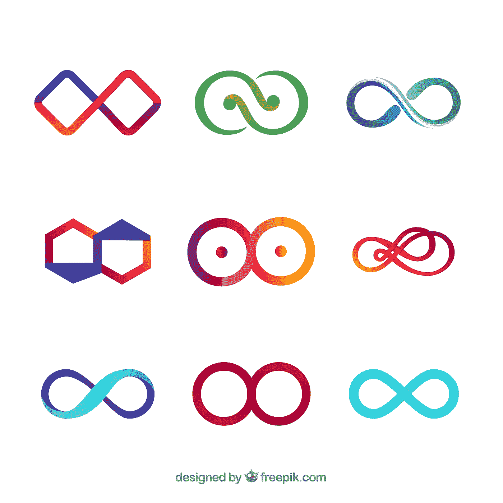
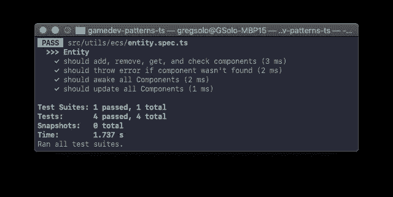
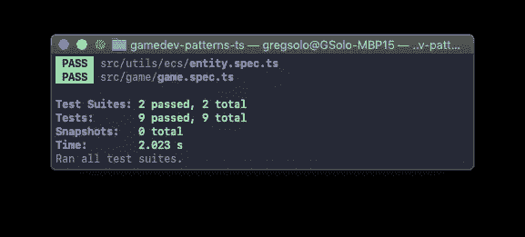

# 用 TypeScript 构建游戏。游戏循环 2/2

> 原文：<https://levelup.gitconnected.com/gamedev-patterns-and-algorithms-in-action-with-typescript-game-loop-2-2-c0d57a8e5ec2>

教程[系列](https://medium.com/@gregsolo/gamedev-patterns-and-algorithms-in-action-with-typescript-d29b913858e)中的第二章讲述了如何用 TypeScript 和本地浏览器 API 从头开始构建游戏

[free pik 创建的 Logo 矢量](https://www.freepik.com/vectors/logo)

欢迎回来！这是我们讨论如何用 TypeScript 和本地浏览器 API 构建一个简单的回合制游戏的系列文章！第二章致力于为这个游戏建立一个游戏循环，其他章节可以在这里找到:

*   [简介](https://medium.com/@gregsolo/gamedev-patterns-and-algorithms-in-action-with-typescript-d29b913858e)
*   [第一章实体组件系统](https://medium.com/@gregsolo/entity-component-system-in-action-with-typescript-f498ca82a08e)
*   第二章。游戏循环([第一部分](https://medium.com/@gregsolo/gamedev-patterns-and-algorithms-with-typescript-game-loop-part-1-2-699919bb9b71)，第二部分)
*   第三章。绘制网格([第 1 部分](https://medium.com/@gregsolo/building-a-game-with-typescript-drawing-grid-1-5-aaf68797a0bb)、[第 2 部分](https://medium.com/javascript-in-plain-english/building-a-game-with-typescript-drawing-grid-2-5-206555719490)、[第 3 部分](https://medium.com/@gregsolo/building-a-game-with-typescript-drawing-grid-3-5-1fb94211c4aa)、[第 4 部分](https://medium.com/@gregsolo/building-a-game-with-typescript-iii-drawing-grid-4-5-398af1dd638d)、[第 5 部分](https://medium.com/@gregsolo/building-a-game-with-typescript-drawing-grid-5-5-49454917b3af))
*   第四章。舰船([第一部分](https://medium.com/@gregsolo/building-a-game-with-typescript-colors-and-layers-337b0e4d71f)、[第二部分](https://medium.com/@gregsolo/building-a-game-with-typescript-team-and-fleet-f223d39e9248)、[第三部分](https://medium.com/@gregsolo/building-a-game-with-typescript-drawing-ship-14e6c19caa38)、[第四部分](https://gregsolo.medium.com/building-a-game-with-typescript-ship-and-locomotion-4f5969675993))
*   第五章输入系统([第一部分](https://gregsolo.medium.com/building-a-game-with-typescript-input-system-1-3-46d0b3dd7662)、[第二部分](https://gregsolo.medium.com/building-a-game-with-typescript-input-system-2-3-cd419e36027c)、[第三部分](https://gregsolo.medium.com/building-a-game-with-typescript-input-system-3-3-8492552579f1))
*   第六章。寻路和移动([第一部分](https://blog.gregsolo.me/articles/building-a-game-with-typescript-pathfinding-and-movement-17-introduction)、[第二部分](https://blog.gregsolo.me/articles/building-a-game-with-typescript-pathfinding-and-movement-27-highlighting-locomotion-range)、[第三部分](https://blog.gregsolo.me/articles/building-a-game-with-typescript-pathfinding-and-movement-37-graph-and-priority-queue)、[第四部分](https://blog.gregsolo.me/articles/building-a-game-with-typescript-pathfinding-and-movement-47-pathfinder)、[第五部分](https://blog.gregsolo.me/articles/building-a-game-with-typescript-pathfinding-and-movement-57-finding-the-path)、[第六部分](https://blog.gregsolo.me/articles/building-a-game-with-typescript-pathfinding-and-movement-6-instant-locomotion)、[第七部分](https://blog.gregsolo.me/articles/pathfinding-and-movement-7-animated-locomotion))
*   第七章。玛奇纳州
*   第八章。攻击系统:生命和伤害
*   第九章。比赛的输赢
*   第十章敌人 AI

[上次](https://medium.com/@gregsolo/gamedev-patterns-and-algorithms-with-typescript-game-loop-part-1-2-699919bb9b71)我们以这样一个问题结束:我们如何在不使构造函数过于复杂的情况下开始游戏循环。我们可以采取的方法之一是让它“可唤醒”。

> F 鳗鱼可以自由切换到[仓库](https://github.com/soloschenko-grigoriy/gamedev-patterns-ts)的`game-loop-1`分支。它包含了前几篇文章的工作成果，是这篇文章的一个很好的起点。

# 目录

1.  到…里面
2.  实体觉醒
3.  开始循环
4.  嵌套实体
5.  测试游戏实体
6.  结论

# 到…里面

如果您还记得，我们在建立`game`实体方面取得了重大进展。我们甚至准备了它的`Update`方法，递归地更新`Game`的所有组件。然而，这并没有太大的帮助，因为没有人进行初始调用来启动循环！

我们还建立了在构造函数的帮助下开始循环的可能性:

更好的方法是提供一个专用的初始化方法。该方法可以启动循环并进行许多其他设置，同时构造函数保持精简。我们可以随便叫这个方法，比如`Init`或者`Awake`。我将使用最新的来模仿`Unity3d` API。

# 实体觉醒

[free pik 创建的背景矢量](https://www.freepik.com/free-photos-vectors/background)

所有实体和组件现在都将变成“*可唤醒*”。那就是:他们会有 public `Awake`方法。

> 注意，这个生命周期方法与构造函数没有很强的关系。一个对象只能被构造一次，而它的`Awake`在一个对象的生命周期内可能会被执行多次。它可以“睡着”，然后再次被唤醒。一个典型的例子是重用对象，以避免实例化对象的内存分配成本(*读作:执行构造函数*)。

很容易简单地添加一个新方法来抽象`Entity`和接口`IComponent`。但正如`Update`，`Awake`可以是我们游戏其他元素的一部分，而不仅仅是 ECS。更明智的做法是创建一个专用的`IAwake`接口，然后实现它。

界面简单得惊人。我们甚至不期望传递任何特定的数据:

剩下的就是用`IComponent`来实现它了:

和`Entity`:

> 请注意，该实体一旦唤醒自己，就会唤醒其所有组件。这是正确的，因为一个`Update,`是一个**默认的**行为。必要时，特定实体可以自由扩展或更改它。

还有，既然我们反正在这附近，就做点家务吧。我将在一个实用模块下加入 Awake 和 Update，并称之为“生命周期”。如果我们需要更多这样的事件，我们可以在此添加:

现在我们可以删除过时的`update.h.ts`和`awake.h.ts`。此外，支持必要的桶文件，以正确地重新导出此模块:

然后更新这些接口的使用者:

啊！但是我们破坏了测试！那是因为我们没有履行承诺:“每个实体和组件都应该有`Awake`方法”。而模仿者显然没有这种能力。让我们快速解决这个问题:

我们绝对应该测试`Awake`。我将使用我们在测试`Update`时使用的相同方法:我首先监视各自的方法，将假组件添加到假实体，执行实体的 Awake 方法，并期望组件的方法也被调用:

如果您在此时运行`npm start`，您的代码应该编译无误。如果您在`npm t`之前运行测试，它们也应该会成功:

# 开始循环

有了这些，我们可以在游戏实体中利用新的生命周期方法:

游戏及其所有组件一醒来，我们就开始游戏循环:

一个小小的改进:我想确保游戏循环不会在所有组件和子实体被唤醒之前开始。为此，我将更新延迟到下一帧:

# 嵌套实体

我说的是"**子实体**吗？"。没错:游戏是根实体但不是唯一。这是一种非常保守的方式，让实体组织在层级中。其中，这允许我们在游戏中通过调用每个孩子的`Update`来更新所有这些孩子。

我们将在下一章开始添加子实体，但是现在，让我们只设置一个阶段，并确保它们将被更新。

[由 brgfx 创建的字符向量](https://www.freepik.com/free-photos-vectors/character)

我添加了一个保存所有子实体数组的公共属性:

通过跟踪所有的子实体，我们可以轻松地调用它们的所有生命周期方法。而且，他们中的一些人(甚至全部！)可能有他们的孩子，并且也呼叫唤醒/更新他们。

首先，我们应该唤醒所有孩子，并在开始循环之前这样做:

然后在每次迭代中更新它们:

现在，我们终于有了一个全功能的游戏循环，它迭代每一帧并更新所有实体和所有组件。

最后一点:让我们通过实例化和唤醒游戏本身来启动这个引擎:

厉害！如果您通过执行`npm start`来运行您的代码，它应该可以顺利编译。

# 测试游戏实体

我们仍然没有视觉效果来证明我们的探索成功了，所以单元测试是唯一的希望。

[free pik 创建的 Man 向量](https://www.freepik.com/free-photos-vectors/man)

幸运的是，此时测试游戏实体很简单。我们要测试五样东西:

为此，我们需要做一些准备。首先，让我们设置假的子组件和组件:

我创建并实例化了组件，正如我在前一章中对实体测试所做的那样。我还创建了空实体，实例化它们，并附加到游戏中。

我们在游戏中使用 requestAnimationFrame。这是一个异步回调，我们必须适当地模拟它。一种方法是用`jest.fn`替换它，并确保它立即调用回调:

这将允许我测试更新循环是否正常工作:

在这里，我只是监视`game.Update`，唤醒游戏，并期待`game.Update`真的被执行。

测试其他四个场景与我们在上一章中测试实体非常相似:

我首先监视每个子/组件的`Awake`或`Update`，并期望它们分别在`game.Awake`或`game.Update`之后被调用。

> 为什么我们要测试组件的唤醒/更新？我们已经在一个抽象实体上测试了同样的东西。为什么复读？
> 
> 原因是我们可以在游戏的唤醒/更新中覆盖这个功能。记住，抽象实体只提供默认行为，如果我们覆盖了这个方法(正如我们所做的)，那么我们应该确保我们没有丢失任何东西。

如果您使用`npm t`运行测试，它们应该都会成功:

> Y 你可以在[库](https://github.com/soloschenko-grigoriy/gamedev-patterns-ts)的`*game-loop-2*`分支中找到这篇文章的完整源代码。

# 结论

你应该为自己感到骄傲，你已经完成了很多**:学习了游戏循环以及它如何在一个团队中使用实体和组件，如何在每一帧执行代码，发现了实体的生命周期方法以及如何在游戏循环中使用它们，当然，还构建了核心游戏实体并覆盖了测试！惊人的进步！**

**[下一次](https://medium.com/@gregsolo/building-a-game-with-typescript-drawing-grid-1-5-aaf68797a0bb)我们将最终在屏幕上绘制一些东西，并看到组件在运行中的美丽。**

**如果您有任何意见、建议、问题或任何其他反馈，请不要犹豫，给我发私信或在下面留下评论！感谢您的阅读，我们下次再见！**

***这是系列教程“* ***用打字稿*** *构建游戏”中的第二章。其他章节可点击此处:***

*   **[简介](https://medium.com/@gregsolo/gamedev-patterns-and-algorithms-in-action-with-typescript-d29b913858e)**
*   **[第一章实体组件系统](https://medium.com/@gregsolo/entity-component-system-in-action-with-typescript-f498ca82a08e)**
*   **第二章。游戏循环([第一部分](https://medium.com/@gregsolo/gamedev-patterns-and-algorithms-with-typescript-game-loop-part-1-2-699919bb9b71)，第二部分)**
*   **第三章。绘制网格([第一部分](https://medium.com/@gregsolo/building-a-game-with-typescript-drawing-grid-1-5-aaf68797a0bb)、[第二部分](https://medium.com/javascript-in-plain-english/building-a-game-with-typescript-drawing-grid-2-5-206555719490)、[第三部分](https://medium.com/@gregsolo/building-a-game-with-typescript-drawing-grid-3-5-1fb94211c4aa)、[第四部分](https://medium.com/@gregsolo/building-a-game-with-typescript-iii-drawing-grid-4-5-398af1dd638d)、[第五部分](https://medium.com/@gregsolo/building-a-game-with-typescript-drawing-grid-5-5-49454917b3af))**
*   **第四章。船舶([第一部分](https://medium.com/@gregsolo/building-a-game-with-typescript-colors-and-layers-337b0e4d71f)、[第二部分](https://medium.com/@gregsolo/building-a-game-with-typescript-team-and-fleet-f223d39e9248)、[第三部分](https://medium.com/@gregsolo/building-a-game-with-typescript-drawing-ship-14e6c19caa38)、[第四部分](https://gregsolo.medium.com/building-a-game-with-typescript-ship-and-locomotion-4f5969675993))**
*   **第五章输入系统([第一部分](https://gregsolo.medium.com/building-a-game-with-typescript-input-system-1-3-46d0b3dd7662)、[第二部分](https://gregsolo.medium.com/building-a-game-with-typescript-input-system-2-3-cd419e36027c)、[第三部分](https://gregsolo.medium.com/building-a-game-with-typescript-input-system-3-3-8492552579f1))**
*   **第六章。寻路与移动([第一部分](https://blog.gregsolo.me/articles/building-a-game-with-typescript-pathfinding-and-movement-17-introduction)、[第二部分](https://blog.gregsolo.me/articles/building-a-game-with-typescript-pathfinding-and-movement-27-highlighting-locomotion-range)、[第三部分](https://blog.gregsolo.me/articles/building-a-game-with-typescript-pathfinding-and-movement-37-graph-and-priority-queue)、[第四部分](https://blog.gregsolo.me/articles/building-a-game-with-typescript-pathfinding-and-movement-47-pathfinder)、[第五部分](https://blog.gregsolo.me/articles/building-a-game-with-typescript-pathfinding-and-movement-57-finding-the-path)、[第六部分](https://blog.gregsolo.me/articles/building-a-game-with-typescript-pathfinding-and-movement-6-instant-locomotion)、[第七部分](https://blog.gregsolo.me/articles/pathfinding-and-movement-7-animated-locomotion))**
*   **第七章。玛奇纳州**
*   **第八章。攻击系统:生命和伤害**
*   **第九章。比赛的输赢**
*   **第十章敌人 AI**

# **分级编码**

**感谢您成为我们社区的一员！ [**订阅我们的 YouTube 频道**](https://www.youtube.com/channel/UC3v9kBR_ab4UHXXdknz8Fbg?sub_confirmation=1) 或者加入 [**Skilled.dev 编码面试课程**](https://skilled.dev/) 。**

** [## 编写面试问题

### 掌握编码面试的过程

技术开发](https://skilled.dev)**