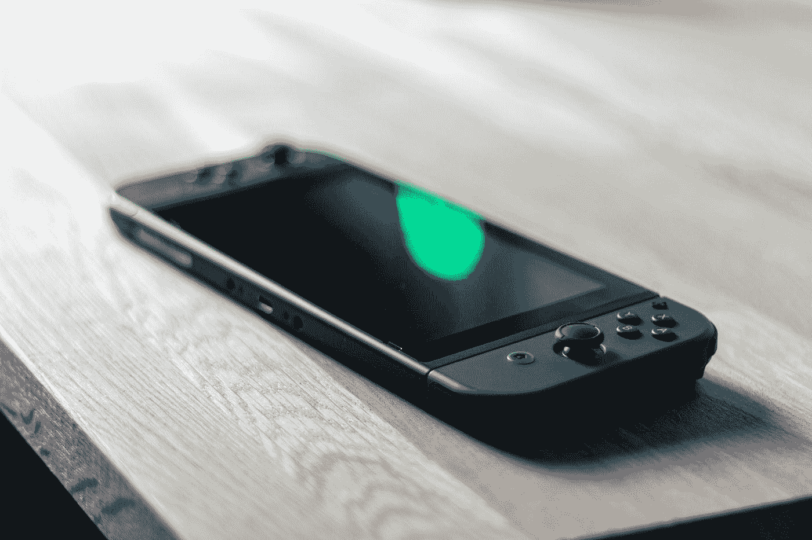

# 游戏可及性:实施包容性设计如何带来更多玩家

> 原文：<https://levelup.gitconnected.com/gaming-accessibility-how-implementing-inclusive-design-brings-in-more-players-4d341f12e69a>

游戏是全球数百万人的爱好。来自世界各地的玩家可以在他们的家用电脑、电视上的特殊控制台上玩游戏，甚至可以在移动设备上玩游戏。游戏类型从街机风格的赛车到开放世界探索角色扮演游戏。

然而，游戏的设计往往是排斥性的，使得残疾人很难无障碍地玩游戏。游戏中的字幕、第三方控制器支持和按钮重映射等功能变得越来越常见，但这些功能有时仍会出现问题。

最近，我和两位无障碍专家伊恩·汉密尔顿和 T2·摩根·贝克谈了谈这个行业是如何发展的，游戏设计师能为无障碍环境做些什么，以及游戏的未来。

## 输入设计

照片由[弗雷德里克·克里斯蒂安](https://unsplash.com/@freddyfromcgn?utm_source=medium&utm_medium=referral)在 [Unsplash](https://unsplash.com?utm_source=medium&utm_medium=referral) 拍摄

汉密尔顿在互动媒体设计方面的背景使他在与英国广播公司(BBC)的儿童网站和游戏合作时，看到了设计对玩家的直接影响。他看到了学龄前游戏的播放测试片段，这些游戏是为兼容无障碍开关而设计的，这使得无法使用传统控制器的儿童可以和他们的同学一起玩。

> “…看到设计可以产生的影响，一个相对较小的调整，我看着这些孩子快乐地玩耍，做着和他们所有同学一样的事情，平等地参与那个小文化和社会…这真是令人兴奋不已。”—汉密尔顿

他的无障碍工作与他在 BBC 的角色密不可分，直到公司搬迁，他无法搬到新的地方工作。他对可访问性的热情使他在其他公司寻找类似的职位，这些职位在游戏可访问性方面有类似的作用。不幸的是，当时没有这样的职位，所以他独立地为无障碍宣传工作，直到最终有足够的有偿工作，可以成为全职工作。

> “可访问性成了一种召唤，而不是我热爱的工作的一个方面。所以我开始演讲、写作以及其他所有的事情，加入到那些已经在为让这个行业变得更好而奋斗的人们当中。”—汉密尔顿

就无障碍的严格硬件而言，Hamilton 提到“任何新的技术进步都有可能成为阻碍者或推动者”，硬件为一些人而不是所有人提供了无障碍。他继续说，只要“你把它作为一个额外的选项提供，而不是使它成为一个唯一的固定需求，它就可以成为那些需要它的人的推动者，而不会阻止那些不能使用它的人”。像 Xbox 自适应控制器这样的设备可能对一些玩家来说很棒，但重要的是要记住，就个人需求而言，它们不是一个万能的解决方案。

## 游戏和软件设计

由[大卫·兰格尔](https://unsplash.com/@rangel?utm_source=medium&utm_medium=referral)在 [Unsplash](https://unsplash.com?utm_source=medium&utm_medium=referral) 上拍摄的照片

Baker 作为教育领域的辅助功能专家的背景使她成为了一名全职的游戏开发辅助功能专家，例如与顽皮狗工作室合作开发游戏《我们最后的一部分 II》。该游戏因其实现的辅助功能而获奖。

贝克和汉密尔顿都注意到，一般来说，公司缺乏对残疾游戏玩家的关注。然而，公司对扩展为可访问性提供的功能越来越感兴趣。贝克的[独立研究](https://leahybaker.com/projects/)得到了许多工作室的积极反馈和使用，这些工作室不仅仅是开发游戏的特定工作室。

两人都提到了堡垒之夜，这是一款基于听觉的游戏(例如，听到敌人的炮火来自哪个方向)，具有 d/聋人辅助功能，可以可视化音频提示。许多开发者在游戏发布后的补丁和更新中添加了辅助功能，但贝克说，“这是你烘焙到产品中的东西，而不是在最后阶段提出的话题”。由于在一开始就集成了可访问性，更多的玩家可以很容易地享受游戏。

> “一般来说，开发人员需要明白，可访问性是你在产品中烘焙的东西，而不是在最后阶段提出的话题。你不能指望它在一夜之间发生。”—贝克

## 向前发展的游戏社区

就代表性和包容性而言，有一些角色，如 [Quill](https://ag.hyperxgaming.com/article/2973/moss-vrs-lead-mouse-signs-her-way-into-our-hearts) ，一只拟人化的老鼠，它使用美国手语作为一种交流形式。Hamilton 提到，英国的[政府研究](https://www.theguardian.com/society/2017/feb/21/minister-tells-industries-to-increase-representation-of-disabled-people)强调残疾代表是“年轻残疾人面临的首要问题”。让来自该人群的人提供输入对于表示也很重要，因为这有助于避免形成讽刺和刻板印象。

> “代表很容易做得不好，在目前存在的少数情况下，通常都做得不好……做好代表的方法是不做任何假设，与你想代表的人交谈，让他们参与整个过程。”—汉密尔顿

贝克指着像[这样的网站说:“我能玩吗?”？](https://caniplaythat.com/)和[游戏可访问性 Nexus](https://www.gameaccessibilitynexus.com/) 作为残疾游戏玩家的评论网站，也参与调查研究并寻求开发者支持。汉密尔顿还为开发者和研究人员提供了一个链接和信息列表。

> "意识之战现在胜利了，我们现在必须实现我们的意图."—汉密尔顿
> 
> “…每个人都值得参与游戏，即使他们的游戏方式可能会有所不同。”—贝克

## 参考链接

以下是按主题分类的链接列表，并附有链接说明

**受访者**:

*   伊恩·汉密尔顿— [推特](https://twitter.com/ianhamilton_)，[网站](http://ian-hamilton.com/)
*   摩根·贝克— [推特](https://twitter.com/momoxmia)，[网站](https://leahybaker.com/)

**游戏无障碍审查网站:**

*   我可以弹那个吗？ —摘自对贝克的采访。
*   [游戏可访问性关系](https://www.gameaccessibilitynexus.com/) —来自对贝克的采访。
*   对贝克的采访。

**公共引用:**

*   [游戏无障碍会议](https://www.gaconf.com/conference/)——一个以无障碍游戏为中心的年度会议。会议档案可以在 [Youtube](https://www.youtube.com/channel/UCKWG26bBd7TOiaLtc_crqvw) 上找到。
*   IGDA-加西格为开发者和研究人员提供的资源列表。包含可访问性指南、文章、学术论文、开发工具等的网站列表
*   [游戏可访问性历史的电子表格](https://docs.google.com/spreadsheets/d/1lcQcr6hAmuqZfZVDCP5Dd7oXYrACNUp2W3hf8CjiPwk/edit#gid=0) —来自对汉密尔顿的采访。从 1950 年到 2020 年的游戏可访问性历史的 Excel 表格
*   [Be Player One](https://www.beplayerone.com/)——一家法国初创公司，致力于无障碍游戏设备设计、游戏无障碍优化、无障碍功能信息。目前这个版本的网站正在建设中，法文版可以在这里[访问](https://www.beplayerone.fr/)。