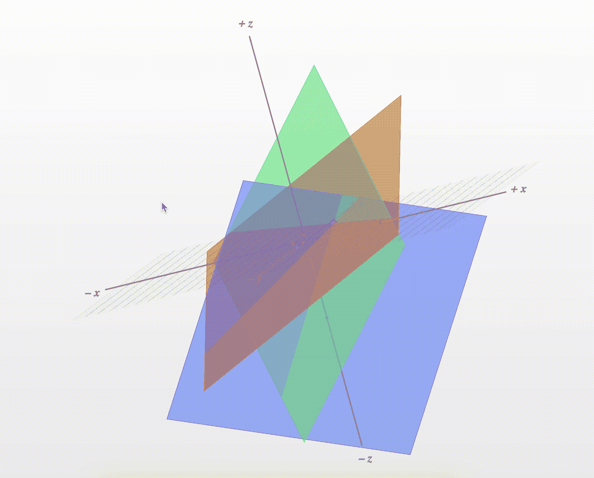

# Python 中的高斯消去算法

> 原文：<https://levelup.gitconnected.com/gaussian-elimination-algorithm-in-python-4e90cb3a0fd9>

## 关于如何在 Python 中使用高斯消去法求解线性方程组的教程

## 介绍

**高斯消元**，或*降行*，是求解线性方程组的一种数值方法*。这是矩阵代数基础*中的一个主题。

*求解*一个方程包括确定任何**未知变量**的值，使得表达式的两边相等。例如，请参见下面的*动画*，它展示了本文中的三个线性方程组的**解**。

[](https://towardsdatascience.com/fundamentals-of-matrix-algebra-with-python-part-1-85aaa17e3632) [## Python 的矩阵代数基础|第 1 部分

### 使用 Python 理解和实现基本矩阵代数概念和运算

towardsdatascience.com](https://towardsdatascience.com/fundamentals-of-matrix-algebra-with-python-part-1-85aaa17e3632) 

由[卢卡·布拉沃](https://unsplash.com/@lucabravo?utm_source=medium&utm_medium=referral)在 [Unsplash](https://unsplash.com?utm_source=medium&utm_medium=referral) 拍摄的照片

## 方程组

等式 1–3 是一组**线性等式**的示例。

*   *系统:*暗示所有方程中*可能*存在公共解
*   *线性:*未知变量的**最高幂**， *x₁* ， *x₂* 和 *x₃，*是 *1*


等式 1–3—线性方程组(图片由作者提供)

**高斯消去法**是一种算法，旨在找到 *x₁* 、 *x₂* 和 *x₃* 的值，使*同时*满足每个表达式。计算机广泛使用它来有效地评估潜在的数千个变量。

使用 Gist 1 中提供的 Python 代码，使用 **Sympy** 库声明*符号方程组*。

要点 1——符号线性方程组

## 算法

高斯消去法利用**矩阵代数**。

首先，将等式 1-3 写成矩阵形式 *Ax = b* ，如等式 4 所示。

*   **变量的系数**在矩阵中，
*   ***变量** *x₁* ， *x₂* 和 *x₃* ，都写成列向量 ***x****
*   *列向量 ***b*** 由方程式的右侧**组成***

**

*等式 4 —方程组矩阵表示(图片由作者提供)*

**将 A 的行乘以 x 列向量以检索原始方程。**

*接下来，形成**增广矩阵**，简单地将右侧的 *A* 矩阵*与 *b* 矩阵*连接，如等式 5 所示。*

**

*等式 5 —扩充矩阵(图片由作者提供)*

*使用 Gist 2 中的代码片段在 Python 中创建增广矩阵。`matrix_representation`函数需要之前定义的变量`equations`和`symbolic_vars`。*

*要点 2 —生成扩充矩阵*

*使用*高斯消去法*将增广矩阵转换成**行梯队形式**。排梯队形式意味着:*

*   *第一个非零行号位于上一行前导系数的右侧。这个值被称为**枢轴**。*
*   **零存在于对角线的下方*。这样的矩阵是 ***上三角*** ，因为仅有的非零元素在对角线上或对角线上方。*
*   *由全零组成的任何**行位于矩阵的底部*处。****

*等式 6 说明了这些要点。*

**

*等式 6 —行梯队形式(图片由作者提供)*

*某些**行操作**被用于使扩充矩阵朝着类似于等式 6 的形式前进，这些操作包括:*

1.  ***将任意行乘以一个常数***
2.  ***将**一行的倍数加到另一行*
3.  ***互换**任意行的顺序*

*继续上面等式 5 中给出的系统，等式 7-10 将*增广矩阵*移动到*上三角形式*。*

**

*等式 7–10—将增广矩阵转换为上三角矩阵(图片由作者提供)*

*将行操作 1–3 转录到代码中，使它们将任何给定的增广矩阵`M`变异为上三角形式。*

*Gist 3 显示了一个 Python 算法，用于执行高斯消去，并将一个系统的 **Sympy** 符号方程转换为*行梯队形式*。*

*要点 3 —高斯消去行梯队形式算法*

*将`M`打印到**控制台**会产生以下**输出**，相当于手写行操作后获得的矩阵:*

```
***upper triangular matrix**: [[ 1\.         -2\.         -1\.          6\.        ]
 [ 0\.          1\.          0.166667   -1.83334   ]
 [ 0\.          0\.          1\.          1\.        ]]*
```

*上三角矩阵给出了三个简化的表达式，包含 *x₁* 、 *x₂* 和 *x₃* ，如等式 11-13 所示。*

**

*等式 11–13—简化表达式(图片由作者提供)*

***反向代入**使得求解未知变量成为可能。*

*   ****x₃* = 1.0** :从等式 13 中可以立即明显看出*
*   ****x₂* = -2.0** :将等式 12 中的 *x₃* 替换为 *1**
*   ****x₁ = 3.0*** :用 *1* 代替 *x₃* ，用 *2* 代替 *x₂**

*要点 4 展示了对未知变量执行*回代*和*求解*的代码。*

*要点 4 —回代算法*

*高斯消去算法通过降行和回代成功地捕捉到了线性方程组的解。**根**与手动导出值*相同*。*

```
*solutions:[**3.0000**, **-2.0000**, **1.0000**]  # (x1, x2, x3)*
```

## **边缘案例**

*a) **无解**:如果行梯队形式包含一个除右手边外全零的*行，则无解，系统**不一致**。**

*下面突出显示的语句显然是一个**矛盾**，因为 *0 ≠ 1* 。*

```
*Inconsistent System:[[ 1\.    1\.   -3\.    4.]
[-0\.     1\.   -5\.    6.]
[ **0\.     0\.    0\.    1.**]]*
```

*b) **无穷多解**:如果存在一个全零的*行，且非零行的个数小于变量个数，则系统为**依赖**，意味着存在*无穷多解*。**

```
*Dependent System: [[ 1\.   1\.   -3\.    0.]
 [-0\.    1\.   -5\.   -0.]
 [ **0\.    0\.    0\.    0.**]]*
```

## *可视化解决方案*

**三元*的线性方程描述了三维的**平面**。每个变量在正交笛卡尔坐标系中都有一个轴。*

*图 1 是由等式 1-4 创建的平面的**图**。*

*   **蓝色*平面由方程式 1: `x1 – 2 * x2 — x3 — 6 = 0`组成*
*   **绿色*平面由方程 2 构成:`2 * x1 + 2 * x2 — x3 — 1 = 0`*
*   **红色*平面由方程式 3 形成:`— x1 — x2 + 2 * x3 — 1 = 0`*

***交点**是三个线性方程组的解，是`[**3.0**, **-2.0**, **1.0**]`处明显被遮挡的黑点。*

**

*图 1 —使用 Matplotlib 的线性方程组和解决方案的可视化(图片由作者提供)*

*这个互坐标就是该系统的唯一解**与之前得到的代数结果一致。***

*一个**相关系统**的图形描述显示，平面之间的*交叉形成一条线*，从而留下无限个解。此外，在图形上，**不相容系统**由*三个不相交的平面表示。**

***像这样可视化平面**在 *Matplotlib* 中并不完全清晰。因此，使用这个优秀的[绘图工具](https://technology.cpm.org/general/3dgraph/)来探索这些*场景*。图 2 显示了与图 1 相同的等式，但是使用了*改进的计算机图形*。*

**

*图 2-使用在线工具的线性方程组和解决方案的可视化(图片由作者提供)*

 *[## 三维绘图仪

### 编辑描述

technology.cpm.org](https://technology.cpm.org/general/3dgraph/)* 

## *结论*

**本文主要讲述如何使用高斯消去法求解一个三线性方程组。*然而，提出的高斯消去 Python 算法扩展到**任意数量的未知变量**。*

*线性方程求解器的完整代码在下面的要点 5 中。*

*要点 Python 中的高斯消去法*

> *如果您对 Python、工程和数据科学感兴趣，请随时关注和查看我的其他文章。*

*[](https://medium.com/@andrewdaviesul/membership) [## 通过我的推荐链接加入媒体-安德鲁·约瑟夫·戴维斯

### 作为一个媒体会员，你的会员费的一部分会给你阅读的作家，你可以完全接触到每一个故事…

medium.com](https://medium.com/@andrewdaviesul/membership) [](https://towardsdatascience.com/5-python-projects-for-engineering-students-8e951b7c131f) [## 面向工程专业学生的 5 个 Python 项目

### 面向工程师的初级到中级 Python 项目理念

towardsdatascience.com](https://towardsdatascience.com/5-python-projects-for-engineering-students-8e951b7c131f) 

## 参考

[1]行梯队形式— [不道歉的数学家](https://unapologetic.wordpress.com/)(对感兴趣的局外人的数学)
【2】行归约、行梯队形式和归约的行梯队形式— [洛伦佐·萨敦](https://www.youtube.com/channel/UC3IZYipZ6A_Rs5v0GdwUM7Q)(2013 年 7 月 30 日)
【3】三变量方程组— [lumenlearning](https://courses.lumenlearning.com/boundless-algebra/chapter/systems-of-equations-in-three-variables/#:~:text=The%20graphical%20method%20of%20solving,unique%20solution%20to%20the%20system.)*