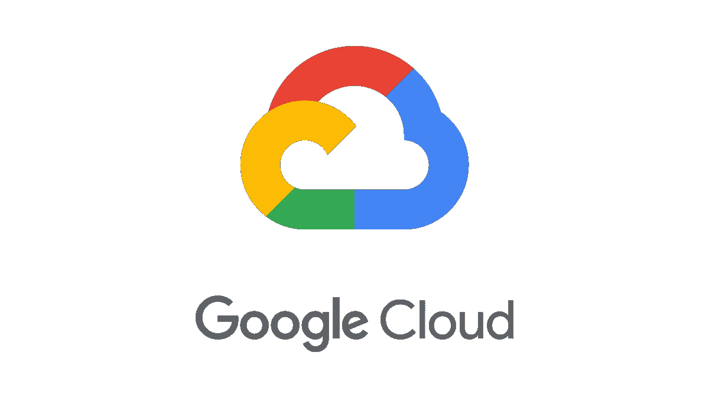

# GCP 笔记(一)

> 原文：<https://levelup.gitconnected.com/gcp-notes-i-8989fa3acf67>

1.  **谷歌云平台**是一个云服务提供商，个人和组织使用它来构建、托管和交付应用程序。
2.  对于大多数应用程序，你需要 3 个核心元素:**计算、存储和网络。**
3.  在 GCP 上运行应用程序最常见的方式之一是使用虚拟机(VM)。
4.  在 GCP，帮助创建和管理虚拟机的服务被称为**计算引擎。**
5.  虚拟机可以基于 Windows/Linux。
6.  如果您当前有一个应用程序运行在 Windows/Linux 本地设备上，那么您可以使用**“lift&shift migration”。**
7.  计算引擎是 **IAAS(基础设施即服务)**，因为它将传统 it 计算资源作为服务运行。
8.  GCP 也提供 **PAAS 产品(平台即服务)**，它被称为**应用引擎**。
9.  App Engine 允许您托管移动和 Web 应用程序，而无需担心底层基础架构。
10.  你所需要做的就是把你的代码上传到应用引擎，GCP 会处理其他的事情。它甚至可以自动缩放。
11.  如果流量为 0，则底层基础架构会将虚拟机缩减至 0，直到流量恢复。此外，没有流量时不收费。
12.  **但是如果你有手机或网络应用，你只能使用 App Engine。**
13.  如果你有任何其他应用程序，那么你将不得不使用虚拟机(计算引擎)
14.  最热门的技术之一是**容器。**
15.  容器就像没有操作系统的虚拟机。
16.  它们包含自己的环境及其依赖项、第三方包等等，作为预定义的需求文件。
17.  与 VM 相比，它们是非常轻量级的。
18.  事实上，它们运行在虚拟机内部
19.  运行容器最简单的方法是使用**云运行。**
20.  我们也可以使用 **DOCKER。**
21.  但是 DOCKER 和 CLOUD RUN 不能用于可能涉及多个容器的复杂应用。
22.  如果你有一个包含多个容器的复杂应用，那么最好使用**谷歌 Kubernetes 引擎(GKE)。**
23.  GKE 是一个容器编排工具，使部署和管理多容器应用程序变得更加容易。
24.  另一个最热门的技术是:**无服务器**
25.  术语无服务器可能有点误导，因为它仍然需要服务器来运行。这只是意味着您不需要了解运行您代码的底层服务器的任何信息，就像 App Engine 一样。
26.  因此，我们可以说 App Engine 或云运行是无服务器的。
27.  但是 GCP 最不需要服务器的东西是云功能。
28.  而 App Engine 和 Cloud Run 用于部署 App。云功能用于部署单个功能，它们是事件驱动的。
29.  再看**存储**，首先我们有**云存储。**
30.  云存储也被称为**对象存储。**
31.  它没有分层文件结构。
32.  它有一个**扁平结构。**
33.  它用于图像、视频、日志等非结构化数据
34.  它有各种类型的存储:**标准存储**(频繁访问，高成本)**近线存储**(每月访问一次，比标准存储便宜)**冷线存储**(每季度访问一次，比近线存储便宜)**档案存储**(每年访问不到一次，成本最低)
35.  然而，与其他云服务提供商不同，在 GCP，所有四个存储类别的访问时间都是相同的。
36.  其次，我们有**文件存储。**
37.  如果您需要具有分层结构和 NFS 兼容性的传统存储。
38.  转到数据库，如果您使用 MySQL、PostgreSQL 或 SQL SERVER，那么最好使用**云 SQL。**
39.  云 SQL 本质上是关系型的。
40.  关系数据库的问题是很难扩展它们来处理大容量和高速的数据。
41.  为了解决这个问题，我们有了 NOSQL 数据库。
42.  NoSQL 数据库可以处理大量数据，但它们用于更简单的用例，比如存储键值对。
43.  谷歌提供的几个 NOSQL 数据库是 **BigTable** (用于大型分析工作负载) **FIRESTORE** (构建客户端移动和网络应用) **FIREBASE** (在用户之间实时同步数据) **MEMORY STORE** (使用缓存加速)
44.  最后，我们有了另一个数据库，它结合了关系数据库和 NoSQL 数据库的优点: **CLOUD SPANNER。**
45.  CLOUD SPANNER 是一个关系数据库，可大规模扩展，但非常昂贵。
46.  然后我们有 **BIGQUERY** ，当你需要一个数据仓库时使用，它对 OLAP 和商业智能有好处。
47.  接下来是**网络**，当你在 GCP 内部创建一个虚拟机时，你必须将它放入 **VPC(虚拟私有云)**
48.  VPC 中的每个虚拟机都有一个 IP 地址。
49.  虚拟机可以在同一个 VPC 内相互通信。
50.  在 VPC 中，您还可以创建**子网**，并将每个虚拟机分别放置在每个子网中。你必须使用 **VPC 路由**来控制虚拟机之间的流量。
51.  **默认情况下，允许来自 VPC/子网内虚拟机的所有出站流量，但入站流量需要分配给虚拟机的外部 IP。**
52.  如果您想要在两个不同的虚拟专用计算机中的两个虚拟机之间进行通信，请使用 **VPC 网络对等连接 VPC。**
53.  如果你想在内部网络和你的虚拟专用网之间建立一个安全的连接，你需要使用**云虚拟专用网。**
54.  您也可以使用**云互联/对等**。
55.  云 VPN 通过互联网发送加密流量。
56.  云互联/对等通过您的站点和 Google 网络之间的专用连接进行通信。
57.  通常，云互联比 VPN 更昂贵，因为它提供了更高的速度和可靠性，因为它有一个专用的连接。
58.  窥视是免费的，但不推荐，因为它不属于 GCP 的视野。
59.  还有各种其他的网络，像，**云路由器，云装甲，云 DNS，云负载均衡，云防火墙，伙伴互联，**等等。
60.  谷歌还提供计算、存储和网络类别之外的各种其他服务，如 **AI、DevOps 等。**

❖ [*GitHub*](https://github.com/ritchiepulikottil/)

❖ [*领英*](https://www.linkedin.com/in/ritchie-pulikottil-6876341aa/)

❖ [*Youtube*](https://heylink.me/rp1/)

❖ [*接我*](https://ritchiepulikottil.netlify.app/) *！*