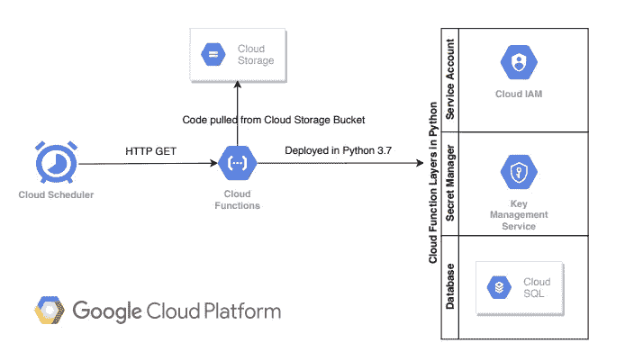

# GCP —使用云调度程序在云 SQL 中调度查询(CLI 方法)

> 原文：<https://levelup.gitconnected.com/gcp-time-savers-how-to-connect-to-cloud-sql-from-cloud-scheduler-44537f66f49b>

Cloud Scheduler 是 GCP 的 cron 作业服务，Cloud SQL 是 GCP 的关系数据库。

曾经想知道是否有可能使用云调度器来调度针对云 SQL 的查询执行？如果是这样，我们如何避免数据库凭证的纯文本？我们可以在哪里托管代码？实现这一点所需的最低权限是什么？哪种 GCP 服务组合可用于解决这一问题？整个配置只能通过 CLI 实现吗？

本文介绍了一种使用 GCP 核心服务的架构方法，以及一种彻头彻尾的命令行方法(CLI)



使用 HTTP 端点扩展云调度器核心功能

# 问题陈述:

云调度器是 GCP 的企业级 cron 作业服务，可用于调度任何类型的批处理作业、操作相关的作业等。目前，可以针对以下目标调用这些作业:

*   HTTP/HTTPS 端点
*   云发布/订阅
*   谷歌应用引擎

本文旨在使用 Google 的最佳实践来扩展云调度程序，并通过云函数使用 HTTP/HTTPS 端点连接到云 SQL(以便执行任何基于 SQL 的语句/作业)。

# 先决条件:

使用您选择的数据库创建云 SQL 实例。用示例数据加载数据库。使用以下参考资料开始

## 参考资料:

*   快速启动→[https://cloud.google.com/sql/docs/mysql/quickstart](https://cloud.google.com/sql/docs/mysql/quickstart)
*   样本数据库→【https://www.mysqltutorial.org/mysql-sample-database.aspx 

# 要考虑的设计要素:

*   云调度器中的哪个目标选项可以用来连接云 SQL？
*   连接云 SQL 的首选库是什么？如何相应地加载库依赖项？
*   如何确保数据库名称、用户名和密码等关键数据库信息不以明文格式传递？
*   为确保“最小特权原则”，需要考虑的最小角色集是什么？

# 方法:

*   HTTP/HTTPS 端点是连接到云 SQL 的潜在目标选项。这可以通过使用其支持的编程语言之一的云函数来实现。在本文中，我们将使用 Python 3.7 作为编程语言的选择。
*   SQLAlchemy 是一个 python SQL 工具包，提供了从 Python 3.7 通过 Cloud 函数连接到 Cloud SQL 的库。作为云函数的一部分，可以通过在 requirements.txt 文件中指定依赖库来加载库依赖项。
*   云 KMS 的秘密管理可用于防止以纯文本格式或通过环境变量传递关键数据库信息。
*   具有“秘密访问器”和“云 SQL 客户端”角色的服务帐户将确保此特定云功能遵循“最小特权原则”。

# 解决既定方法的构建模块:

## **创建服务账户**

```
***# Syntax*** *gcloud iam service-accounts create <service-account-name> --display-name "<service-account-display-name>"****#Example*** *gcloud iam service-accounts create cloud-scheduler-function --display-name "Cloud Scheduler Function"*
```

## **为服务账户分配适当的角色**

在这种情况下，角色—云 SQL 客户端将允许云函数访问云 SQL，角色—机密访问器将允许云函数通过机密管理器从云 KMS 获取敏感的数据库凭证

```
***#Syntax*** *gcloud projects add-iam-policy-binding <project-id> \
  --member='serviceAccount:<service-account-name>@<project-id>.iam.gserviceaccount.com' \
  --role='roles/<role-name>'****#Assign SecretAccessor role to service account*** *gcloud projects add-iam-policy-binding gcp-time-savers \
  --member='serviceAccount:cloud-scheduler-function@gcp-time-savers.iam.gserviceaccount.com' \
  --role='roles/secretmanager.secretAccessor'****#Assign CloudSQL Client role to service account*** *gcloud projects add-iam-policy-binding gcp-time-savers \
  --member='serviceAccount:cloud-scheduler-function@gcp-time-savers.iam.gserviceaccount.com' \
  --role='roles/cloudsql.client'*
```

## 使用机密管理器创建机密:

**启用秘密管理器 API**

```
gcloud services enable secretmanager.googleapis.com
```

**为数据库凭证创建秘密**

下面是一个为数据库用户名创建密码的例子。对于数据库口令和数据库模式名(如果需要的话),应该重复同样的操作

```
***#Syntax*** *echo -n "<secret-value>" | \
    gcloud beta secrets create <secret-name> \
      --data-file=- \
      --replication-policy automatic****#Example for database username*** *echo -n "gcptimesavers" | \
    gcloud beta secrets create db-username \
      --data-file=- \
      --replication-policy automatic*
```

## 创建、配置和部署云功能以调用云 SQL

**用 Python 3.7 开发云函数的源代码**

> 这篇文章的源代码可以在 https://github.com/sandeepmanchi/connect-to-cloud-sql[找到](https://github.com/sandeepmanchi/connect-to-cloud-sql)

为了编写适合云功能的代码，需要两个主要文件:

*   main.py 这是一个保存入口点方法的 python 文件。后续的方法可以写在同一个文件或附加的 python 文件中。
*   requirements . txt——这是一个捕获 python 依赖项的文本文件(将作为部署云功能的一部分进行安装)

演示使用 SQLAlchemy 连接到云 SQL 的连接字符串的构造的代码段。

```
*db = sqlalchemy.create_engine(
    # Equivalent URL:
    # mysql+pymysql://<db_user>:<db_pass>@/<db_name>?unix_socket=/cloudsql/project-id:region-name:<cloud_sql_instance_name>
    sqlalchemy.engine.url.URL(
        drivername="mysql+pymysql",
        username=db_user,
        password=db_pass,
        database=db_name,
        query={"unix_socket": "/cloudsql/gcp-time-savers:us-central1:{}".format(cloud_sql_connection_name)},
    ),
    pool_size=5,
    max_overflow=2,
    pool_timeout=30,
    pool_recycle=1800,
)*
```

保存依赖项的 requirements.txt 文件的内容。

```
*# Function dependencies, for example:
# package>=version**sqlalchemy
pymysql
google-cloud-secret-manager==0.1.1*
```

代码开发完成后，压缩上述两个文件，并为压缩文件提供一个名称。例如:连接到云 sql.zip

**发布代码到云存储**

*   创建一个云存储桶

```
*gsutil mb -c regional -l us-central1 gs://gcp-time-savers-cloud-function-code*
```

*   将 zip 文件移动到创建的云存储桶内的文件夹中

```
*gsutil cp connect-to-cloud-sql.zip gs://gcp-time-savers-cloud-function-code/connect-to-cloud-sql/*
```

**配置部署云功能**

通过命令行部署云功能，并配置:

*   HTTP 触发器
*   使用存储桶 URI 从云存储桶中获取源代码
*   指定入口点以标识执行点
*   分配具有云功能所需的最低权限的服务帐户

```
*gcloud functions deploy connect-to-cloud-sql1 --allow-unauthenticated --entry-point=connect_to_cloud_sql --memory=256MB \
  --runtime=python37 --service-account=cloud-scheduler-function@gcp-time-savers.iam.gserviceaccount.com \
  --source=gs://gcp-time-savers-cloud-function-code/connect-to-cloud-sql/connect-to-cloud-sql.zip \
  --timeout=60s --trigger-http*
```

## 配置云调度程序以启动连接到云 SQL 的云功能

在这种情况下，云调度程序的关键输入是:

*   Cron 作业名称—连接到云 sql 作业
*   目标类型— http
*   时间表—* * * * * *(这是指每一分钟。然而，这可以根据用户来设置)
*   函数 URL —连接到云 SQL 的云函数的 URL
*   方法—获取

```
*gcloud scheduler jobs create http connect-to-cloud-sql-job --schedule "* * * * *" --uri "http://us-central1-gcp-time-savers.cloudfunctions.net/connect-to-cloud-sql" --http-method GET*
```