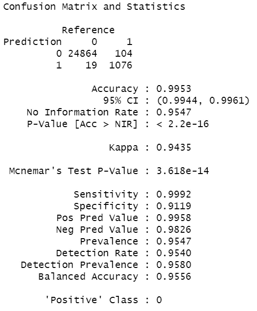
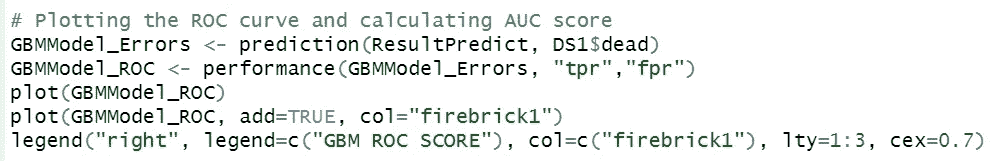
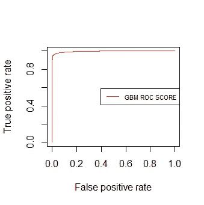

# R 中的广义增强回归模型

> 原文：<https://levelup.gitconnected.com/generalized-boosted-regression-models-in-r-6dfe311be33c>

不久前，我偶然发现了梯度推进机器(GBM)的概念，这激发了我使用这种技术进行预测的兴趣。根据我的研究，GBM 是对预测建模有用的机器学习算法。这听起来有些花哨和复杂，但只要有一点编程知识就完全可以做到。

我将跳过理论部分，直接进入 r 的编程部分。如果你想更好地理解梯度推进的机器，快速的谷歌搜索会产生大量的文章和例子来打破这个概念。在这个小教程中，我将探索在构建 GBM 模型以对数据集执行一些预测时要使用的库和数据集。

我选择这个数据集作为我的例子，因为它看起来相当有趣，并且包含了大量用于构建我们的模型的观察数据。

## 目标

我们这个模型的目的是根据汽车的安全气囊和其他影响因素来预测前排乘客是“活着”还是“死了”。

变量的完整列表及其描述可以在[https://vincentarelbundock . github . io/rdata sets/doc/DAAG/NASS CDs . html](https://vincentarelbundock.github.io/Rdatasets/doc/DAAG/nassCDS.html)找到

## 数据探索和预处理

让我们首先设置当前的工作目录，并在 R studio 中读取数据集。之后，我们将看看数据集中的变量。

从图中我们可以看到，我们的目标变量 dead 是一个 2 级的因子，假设“alive”= 1，“dead”= 2。但是，我们无法预测模型，因为 GBM 函数要求目标变量是二进制变量(1/0)。此外，我们可以推导出不重要的变量，如 X 和 caseid，它们是名义变量，对我们的预测模型没有帮助。

在开始之前，让我们先加载这个预测模型所需的以下库。

让我们使用 tidyverse 库中包含的函数对变量进行重新编码。

重新编码变量后的输出:

太棒了，现在变量 dead 已经被转换为二进制值，我们可以进行进一步的数据预处理了。首先，让我们删除变量 X 和 caseid，这对于使用 select 函数的模型来说并不重要。

现在，我们只剩下了用来构建模型的变量。

最后，在构建我们的模型之前，让我们快速检查一下缺失的数据。

太好了！我们的数据集没有任何缺失数据，而现实情况往往恰恰相反。但是仅仅为了练习的目的，让我们使用这个数据集。现在，我们可以开始模型构建过程。

## 模型结构

让我们设置一个种子值来创建模拟或随机对象，可以复制。之后，我们将继续将数据分为“训练”和“测试”集。由于我们有相对较多的观察值(26，063)，我们将在训练集和测试集之间进行 80/20 的分区划分。测试集将是我们模型中“看不见的”数据，我们将在训练它之后使用它来进行预测。

然后，我们将继续使用 gbm 函数创建 GBM 模型。

公式=我们想要预测的目标产量

分布=创建模型时使用的损失函数。在本例中，我们选择分布为“伯努利”，用于结果为 0–1 的逻辑回归。

数据=包含模型中变量的数据框

n.trees =整数，指定要匹配的树的总数。这相当于加法展开中的迭代次数和基函数个数。默认值为 100

收缩率=应用于扩展中每棵树的收缩率参数。也称为学习率或步长缩减；0.001 到 0.1 通常是可行的，但是较小的学习率通常需要更多的树。默认值为 0.1。

cv.folds =要执行的交叉验证折叠数。如果 cv.folds>1，那么除了通常的拟合，gbm 将执行交叉验证，计算 cv.error 中返回的泛化误差估计值。

interaction.depth =变量交互的最大深度。

模型概述:

从结果中，我们可以看出，以下变量 injSeverity 对预测一个人在事故后是“活着”还是“死了”具有最大的相对影响。接下来是额外的变量，如年龄和体重..等等。

这是变量相对重要性的图示

现在我们已经对影响我们模型的变量有了一个大致的概念，让我们用超参数调整来稍微调整一下。超参数调整对于构建 gbm 模型至关重要，因为它们有过度拟合的趋势。注意到我们之前在模型中添加的线 *cv.folds* 了吗？我们将利用这一点进行超参数调整。

对于我们的超参数调整，我们将使用 gbm 库支持的交叉验证和开箱方法。这些方法通过选择拐点来工作，在该拐点处，测试数据集的性能开始下降，而随着模型开始过度拟合，训练数据集的性能继续提高。

结果:

这告诉我们，使用交叉验证，我们拟合模型的最佳树数(n.trees)是 83，对于随机方法是 24。由于该数据集包含的观察值相当少，我们将使用最佳交叉验证 n.trees 值。

## 模型结果

为了查看我们的模型结果，我们使用了*预测*函数和 *ifelse* 函数来预测一个人是否以大于 80%的百分比“死亡”。然后，我们将使用混淆矩阵，这是一个经常用来描述分类模型性能的表格。

输出:

从结果中，我们可以看到，我们的模型基于数据集中的变量预测个体是“活着”还是“死去”的准确率非常高，约为 99.53%。从逻辑上来说，基于具有最高重要性的预测因素，即伤害严重程度，对个人的影响最大。

此外，我们可以绘制 ROC 图并计算 AUC 值来检查我们模型的性能。它们协同工作，其中较高的 ROC 和 AUC 分数代表我们的分类模型在预测真阳性和真阴性方面有多好。(理想情况下越高越好！)

从 ROC 曲线可以看出，非常接近理想的“1”值。从我们的混淆矩阵结果来看，这很好地表明了该模型具有非常高的准确性。这也表明，我们建立的模型在基于看不见的或测试数据预测真阳性和真阴性方面非常准确。

计算 AUC 分数

输出显示了同样高的值 0.9957，非常接近理想值 1。

这是一个令人兴奋和有趣的项目！尽管这可能不是最好的例子，但是可以尝试使用其他类型的数据集。

好奇的学习者？释放你在媒体上学习的全部潜力，用不到一杯咖啡的钱支持像我这样的作家。

 [## 通过我的推荐链接加入媒体——杰森·LZP

### 作为一个媒体会员，你的会员费的一部分会给你阅读的作家，你可以完全接触到每一个故事…

lzpdatascience.medium.com](https://lzpdatascience.medium.com/membership) 

刚接触 R 编程，不知道从哪里开始？看看我的电子书一步一步的指南！

 [## 数据科学入门指南(PDF /电子书

### 有一段时间了，我希望每个人都保持安全和健康。本月初，由于封锁，我…

lzpdatascience.medium.com](https://lzpdatascience.medium.com/r-for-data-science-a-beginners-guide-pdf-ebook-a5fe11009443)