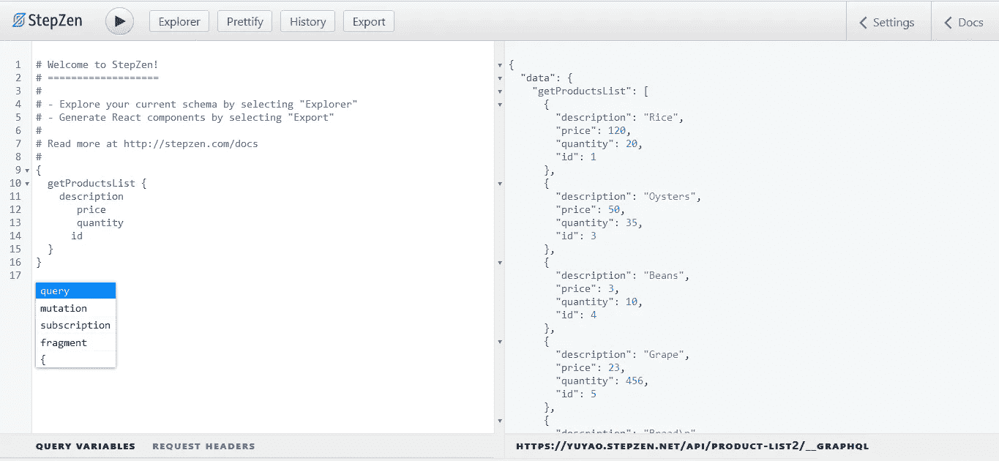

# 使用 StepZen 为 Amazon RDS PostgreSQL 生成 GraphQL API

> 原文：<https://levelup.gitconnected.com/generate-a-graphql-api-for-amazon-rds-postgresql-with-stepzen-8e37cfaba2ec>


StepZen 是一个 GraphQL 即服务云基础设施，它帮助您从不同的数据源构建和部署可伸缩的、安全的和高性能的 GraphQL APIs。使用 StepZen，您可以从数据库(MySQL、PostgreSQL、NoSQL)或现有的 REST 或 GraphQL API 启动并运行您的 GraphQL API。

在本文中，您将学习如何将 StepZen 与基于 PostgreSQL 的 Amazon RDS 数据库一起使用。

## 关于亚马逊(AWS) RDS 数据库

Amazon Web Services 关系数据库系统(或 AWS RDS PostgreSQL)是一个基于云的关系数据库系统，它使得在云中设置、操作和扩展关系数据库变得更加容易。Amazon RDS 数据库为 PostgreSQL 提供了高可用性，这使得它们非常适合在高流量的生产环境中使用。除了高可用性，您还可以轻松部署新的数据库，获得备份和恢复选项，以及增强的安全性，而不是在内部运行 PostgreSQL 数据库。

将 AWS RDS 与 StepZen 一起使用有很大的好处，因为这两种服务都运行在云中，并针对性能进行了优化。使用 StepZen 创建的 GraphQL APIs 会自动伸缩，以满足您的 API 的流量需求。所以你不必担心你的 API 的流量和安全性，因为 StepZen 已经覆盖了你！另一方面，AWS RDS 确保当 GraphQL API 的流量增加时，数据库不会成为瓶颈。

这篇文章将展示如何使用 StepZen 为 AWS RDS PostgreSQL 生成一个 GraphQL API。我们开始吧！

## 设置 AWS RDS 设置:使用 Amazon 的关系数据库服务(RDS)创建和连接 PostgreSQL 数据库

我们将学习如何创建 PostgreSQL 数据库并将其连接到基于云的数据库管理系统。这通常是一项艰巨的任务，但现在这是一件简单的事情，这都要感谢 AWS。

您可以通过 Amazon Web Service 的 RDS web 产品创建并部署六个关系数据库。RDS 支持的数据库引擎有 MariaDB、Oracle 数据库、MySQL、SQL Server、Amazon Aurora，当然还有 PostgreSQL。

*   第一步:注册一个亚马逊网络服务账户
*   创建一个亚马逊网络服务账户非常简单。你需要做的就是去 aws.amazon.com 的 T2。这个网站的登录页面是通用的，像其他网站一样。你现在所要做的就是点击“创建 AWS 账户”
*   **步骤 2:创建一个 RDS 实例**
*   创建您的 AWS 帐户后，转到位于左上角或页脚的服务。点击它并选择 RDS。选择 RDS 后，将提示您选择一个关系数据库引擎。在这种情况下，我们将使用 PostgreSQL 数据库引擎。您还会注意到一个下拉菜单，您可以在其中选择数据库版本。选择最新版本，或至少第二个最新版本。
*   **步骤 3:配置您的数据库实例**
*   此时，您需要为数据库实例命名，并设置主用户名和密码。您在这里设置的密码和用户名用于本地和云数据库交互。


*   选择“PostgreSQL”作为数据库引擎后，您需要配置数据库实例大小、可用性和存储。尽管进行个性化选择总是好的，但是在 AWS 数据库创建的这一点上，您应该保留所有的默认设置，这仅仅是因为最佳选择已经被默认勾选。最后，点击“创建数据库”
*   我们将不得不等待一段时间，以便 AWS 可以完成设置我们新创建的数据库。这个过程一般不超过 10 分钟。然后嘣！我们的数据库准备好了！

我们完成了数据库的创建。现在是时候将我们的云数据库连接到本地 PostgreSQL 了。我们将使用 pgAdmin 4 作为本地 PostgreSQL 开发环境。

## pgAdmin 和 AWS PostgreSQL 的集成

将 PostgreSQL 数据库连接到 AWS 非常简单。您所要做的就是在“查看连接详细信息”中获取可用的连接凭据。您需要从 AWS 获得的唯一信息是端口号、主机端点、用户名和一些安全组配置。

*   **第一步:从“连接详细信息”中复制登录凭证**。
*   创建数据库实例后，连接到新的 AWS RDS PostgreSQL 数据库所需的所有细节都已经可用。接下来要做的是单击安全组栏并查找入站规则。为了避免中断 PostgreSQL-AWS 连接，单击编辑入站规则并选择“Anywhere”


*   **第二步:下载并安装 pgAdmin 或 EDB PostgreSQL 套件**
*   可以从他们的[官网](http://pgadmin.org/)下载 pgAdmin。来自 EDB 的 PostgreSQL 也是如此。设置基本上很简单，只需点击安装程序，等待程序完成安装。
*   **步骤 3:启动 pgAdmin 并连接到 AWS 数据库**
*   像任何应用程序一样启动已经安装的 pgAdmin。右键单击 pgAdmin 中的服务器对象，然后单击“create”。
*   输入数据库实例的名称，然后单击 connection 选项卡。从 AWS RDS 控制台输入登录凭据，最后单击“保存”。


*   现在，您的工作区应该有了一些变化，并且包含了 PostgreSQL 数据库的模式。

让我们在下一节继续向这个数据库添加数据。

## 使用 pgAdmin 向 AWS RDS 添加数据

我们差不多完成了数据库的设置。是时候将一些数据添加到我们的 AWS RDS 数据库中了，我们将使用这些数据通过 StepZen 创建我们的 GraphQL 模式。为此，我们将再次使用 pgAdmin，我们已经在上一节中设置了它。

> 您还可以使用其他工具向 PostgreSQL 数据库添加数据，例如直接从命令行使用 [psql](https://www.postgresql.org/docs/current/app-psql.html) 。

我们将使用几个产品作为我们数据库的数据。每个产品都有自己的`description`、`price`、`quantity`，以及各自独特的`IDs. To achieve this, we’ll create a table named` 产品。包含以下各列:

*   `area`:我们桌子的面积是`Products`，因为我们将存储产品数据。
*   这是我们的主键。
*   上面有我们产品的名字。
*   `quantity`:显示每个产品的数量。
*   `price`:该列显示每种产品的价格。

下面的 CSV 数据包含我们的数据库列中使用的数据:

```
"area","id","description","quantity","price"
"Product",1,"Rice",20,120
"Product",2,"Bread",400,5
"Product",3,"Oysters",35,50
"Product",4,"Beans",10,3
"Product",5,"Grape",456,23
```

向我们的远程数据库添加数据与向本地数据库添加数据是一样的，您所要做的就是在您的工作空间中定位“表”。

点击它，然后点击“创建一个新表”。创建一个表名，然后单击列栏。您将在这里添加表格列。


要查看和编辑表格数据，只需右键单击表格名称并选择“查看和编辑数据”下图显示了我们在 Postgres 中使用的列和行数据。


创建表数据后，单击“刷新”来同步您的主数据库。这将确保所有新的变更都被推送到 AWS。

## 从 AWS RDS 生成 GraphQL 模式

现在我们已经建立了数据库，是时候生成一个 GraphQL 模式了。我们将使用 StepZen 来生成我们的 GraphQL 模式。StepZen 是一个 GraphQL API 服务，允许您连接到任何数据源，并从中生成一个可以部署到云的 GraphQL 模式。

要使用 StepZen，您需要安装 CLI。StepZen CLI 的安装过程并不难。您只需使用以下 npm 命令:

```
npm install -g stepzen
```

确保在您的计算机上安装 Node.js，因为它用作 CLI 的运行时。安装 CLI 后，您可以从 AWS RDS 数据库生成一个 GraphQL 模式。

*   **第一步:创建一个 StepZen 账户**
*   要使用 StepZen CLI，您必须创建一个帐户，就像我们在 AWS 设置期间所做的那样。您可以在这里创建一个账户[。然后转到您的](https://stepzen.com/signup) [StepZen 仪表板](https://dashboard.stepzen.com/)，在这里您可以监控您已经部署的 API，并访问 StepZen 的 CLI 所需的登录详细信息。
*   您可以从您的[我的步骤—认证](https://dashboard.stepzen.com/account)选项卡中获取您的用户名和 API 密钥。您将需要这些凭据来登录 StepZen CLI。
*   **步骤 2:登录 StepZen CLI**
*   要登录到 StepZen CLI，您需要使用以下命令:
*   `stepzen login`
*   这将提示您输入用户名和 API 密钥。输入凭据后，您将登录到 StepZen CLI。
*   **步骤 3:使用 StepZen 导入 AWS RDS PostgreSQL**
*   StepZen 简化了从不同来源导入数据库的过程；AWS RDS PostgreSQL 也不例外。你所要做的就是使用下面的命令。Amazon RDS PostgreSQL 的凭证与我们用来连接 pgAdmin 的凭证相同。
*   `$ stepzen import postgresql ? What would you like your endpoint to be called? (api/product-list) Downloading from StepZen...... done ? What is your host? <AWS_RDS_HOST> ? What is your database name? <PGADMIN_DB_NAME> ? What is the username? <AWS_RDS_DB_USERNAME> ? What is the password? [hidden] <AWS_RDS_DB_PASSWORD>`

如果过程成功，StepZen 将自动为您的 PostgreSQL 数据库创建一个 GraphQL 模式，其中包含一组示例查询和变异。

如果您打开从上面的 StepZen 命令创建的目录，您将看到以下文件:

*   `postgresql/index.graphql`:这个文件包含数据库的 GraphQL 模式。
*   `index.graphql`:这个文件包含所有 GraphQL 模式的索引，以防您使用多个数据源。
*   `config.yaml`:这是我们的数据库配置文件所在的位置。
*   `stepzen.config.json`:这是我们的 StepZen 端点所在的位置。你也可以在你的 StepZen 仪表盘上看到。

在下一节中，让我们将这些文件部署到 StepZen 云中。

## 将 GraphQL 模式部署到 StepZen

到目前为止，我们已经使用 AWS RDS 建立了一个 PostgreSQL 数据库，为它植入了数据，并为这个数据库创建了一个 GraphQL 模式。这意味着我们快完成了。部署 GraphQL API 是最后一步，您所要做的就是键入下面的命令。

```
stepzen start
```

这将把我们的 GraphQL 模式部署到`stepzen.config.json`中的端点。终端会为您生成一个链接。使用 GraphQL 本地浏览 GraphQL API 的 URL 如下所示:

```
[http://localhost:5001/api/product-list](http://localhost:5001/api/product-list)
```

链接打开后，您可以测试您的 GraphQL API。您还可以在 StepZen 仪表板中监控通过端点发出的查询和请求的数量，仪表板中的数据每天都会更新。

我们从数据库中生成的 GraphQL 模式具有如下所示的查询:

```
"""
These are some examples of queries generated from the schema. Feel free to modify them or add your own.
"""
type Query {
  getProductsList: [Products]
    @dbquery(
      type: "postgresql"
      schema: "public"
      table: "Products"
      configuration: "postgresql_config"
    )
  getProducts(id: Int!): Products
    @dbquery(
      type: "postgresql"
      schema: "public"
      table: "Products"
      configuration: "postgresql_config"
    )`
}
```

我们可以使用`getProductsList`和`getProducts`查询来查询我们的数据库。`getProductsList`查询返回数据库中的所有数据，而`getProducts`查询返回数据库中的单行数据。

下面的代码将查询我们数据库中产品的描述:

```
{
  getProductsList {
    description
  }
}
```

响应将是一个 JSON 响应，包括我们数据库中的产品描述。您还可以为每个产品请求像`price`或`quantity`这样的字段。从 GraphiQL 来看，它将如下所示:



从 GraphQL 中，您还可以探索 graph QL 模式并测试查询和变化。您还可以使用 StepZen GraphQL API 来构建前端应用程序。

## 结论

这篇文章介绍了如何为 AWS RDS PostgreSQL 数据库生成 GraphQL API。我们已经介绍了如何设置和连接 pgAdmin 到 AWS RDS PostgreSQL、安装 StepZen、从 AWS RDS 导入数据以及部署和查询 StepZen GraphQL API。

想了解更多关于 [StepZen](https://stepzen.com/docs/quick-start) 的知识？在这里尝试一下，或者在这里问任何关于不和谐[的问题。](https://discord.com/invite/9k2VdPn2FR)