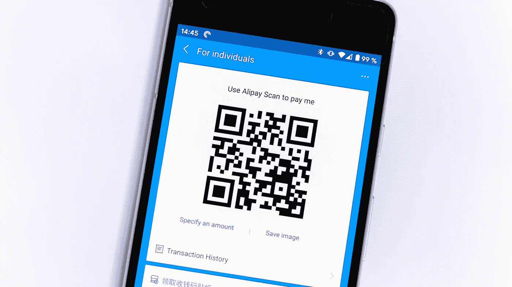

# 在 Laravel 框架中生成条形码和 QR 码

> 原文：<https://levelup.gitconnected.com/generate-barcodes-and-qr-codes-in-laravel-framework-41b2644ff632>

在本文中，您将了解如何在您的 Laravel 应用程序中高效地生成多种类型的条形码和 QR 码。

本分步指南将帮助您实现快速生成多种类型的条形码和 QR 码的功能，您可以在电子商务商店的产品上使用这些条形码和 QR 码，或用于其他目的。

我们将使用第三方扩展来完成这项任务。这个扩展的名字是**“米隆条码生成器”**。点击下面的链接，探索他们的 GitHub 资源库。该扩展与 Laravel v5.x、v6.x、v7.x 和 v8.x 兼容。

 [## GitHub - milon/barcode: Laravel 5 条形码生成器

### 这是一个条形码生成包，灵感来自 https://github.com/tecnickcom/TCPDF.。实际上，我使用这个包的…

github.com](https://github.com/milon/barcode) 

# 条形码简介

条形码由不同宽度的条和空白组成，可以用光学条形码扫描仪读取。它是数字和字符的机器可读表示。这些条纹可以在超市、便利店等出售的产品背面看到。

# 二维码简介

QR 码由数字、字母字符、符号、二进制数据、控制码和其他形式的数据组成。这些在使用方面都是超高效的。它可以从任何角度扫描。由于三位置检测模式，有助于扫描仪稳定、快速地读取，而不受背景模式的影响。

# 步骤概述

让我们设置我们的 web 应用程序来生成 QR 码和条形码。这将是一个快速的五步过程。
1。安装条形码扩展。
2。注册条形码扩展。
3。设置新控制器并查看文件。
4。更新路线。
5。通过查看文件显示 QR 码和条形码。

# 安装条形码扩展

在项目的根目录中启动终端或命令提示符，并执行下面截图中显示的命令。

# 注册条形码扩展

安装完成后，需要打开 **config/app.php** 文件，用 **BarcodeServiceProvider** 类更新 **providers** 数组，用 **DNS1D 和 DNS2D** 更新 **alias** 数组。详情见下面截图。

config/app.php

# 设置新控制器并查看文件

现在，让我们创建一个名为 **SiteController** 的新控制器。这将被添加到我们 web 应用程序的 **app/Http/Controllers** 目录中。您可以使用终端或命令提示符立即创建它。详情见下面截图。

控制器已经创建好了，让我们导航到 **app/Http/Controllers** 目录，打开【SiteController.php】的**文件**。在下面的截图中，你可以看到如何将名为**barcode.blade.php**的**视图**文件加载到控制器的动作/方法中。****

app/Http/Controllers/site controller . PHP

# 更新路线

既然我们的控制器已经设置正确，并且视图文件的名称已经添加，那么让我们将条形码页面的路径添加到文件 **routes/web.php** 中。详情见下面截图。

routes/web.php

# 通过查看文件显示 QR 码和条形码

这是在视图文件中生成条形码和 QR 码的最后一步。让我们在**资源/视图**目录中创建一个文件。文件的名称应该与控制器中指定的名称相同，即:**barcode.blade.php。**

以下是条形码生成器中可供您使用的大量方法。通过这些方法，您可以生成以下格式:**二维码**、 **PDF417** 、 **C39** 、 **C39+** 、 **C39E** 、 **C39E+** 、 **C93** 、 **S25** 、 **S25+** 、 **I25** 详情见下面截图。

资源/视图/barcode.blade.php

太棒了。您已经完成了设置 Laravel 应用程序以生成条形码和 QR 码的过程。编码快乐！