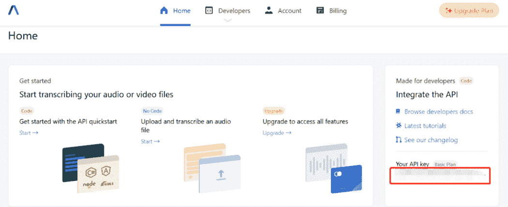

# 为您的音频和视频文件生成章节摘要

> 原文：<https://levelup.gitconnected.com/generate-chapter-summary-for-your-audio-and-video-files-3270c9311035>

一段时间内音频内容的摘要


由[蒂莫西·埃伯利](https://unsplash.com/@timothyeberly?utm_source=unsplash&utm_medium=referral&utm_content=creditCopyText)在 [Unsplash](https://unsplash.com/s/photos/chapter?utm_source=unsplash&utm_medium=referral&utm_content=creditCopyText) 上拍摄的照片

之前，我已经介绍过如何使用 AssemblyAI 提供的外部[语音转文本 API](https://www.assemblyai.com/) 将音频文件转录为文本。在本教程中，让我们深入探讨另一个称为自动章节的特性，它是转录 API 的一部分:

```
https://api.assemblyai.com/v2/transcript
```

供您参考，它的工作方式如下:

*   根据谈话的主题将录音分成几个章节
*   为每章生成摘要

请放心，您需要做的就是调用 API 并传入所需的参数。它将为您处理所有任务，并返回一个 JSON 结果，该结果可以直接在您的项目中使用。例如，您可以利用此功能为您的 YouTube 视频生成摘要或描述。

在本教程中，您将学习实现以下项目:

*   将视频转换成音频文件
*   将音频文件上传到服务器
*   对脚本 API 进行 POST 调用
*   通过脚本 get 调用获取 JSON 结果

# 设置

在此之前，请确保您已经创建了一个新的虚拟环境。

## Pydub

激活它并运行以下命令来安装`pydub`包:

```
pip install pydub
```

您将使用此包将视频文件导出到录音。

## 要求

默认情况下，`requests`包应该已经安装在基础环境中。如果不是这样，请按如下方式安装:

```
pip install requests
```

您将利用这个包进行 HTTP API 调用。

## API 密钥

注册一个[新的免费试用账户](https://app.assemblyai.com/signup)，每月有 3 个小时的转录时间。对于本教程来说应该绰绰有余了。



作者图片

在主页的右侧，您应该会看到您的帐户对应的 API 密钥。记下它，因为我们将在后面的代码中使用它。

# 视频到音频文件

创建一个名为`convert.py`的新 Python 脚本，并添加以下代码:

```
from pydub import AudioSegmentaudio = AudioSegment.from_file("test.mp4", "mp4")
audio.export("test.mp3", format="mp3")
```

上面的代码将读取一个名为`test.mp4`的视频文件，并将其转换为 mp3。事实上，您也可以从不同的文件格式加载:

```
# audio files
audio = AudioSegment.from_wav("test.wav")
audio = AudioSegment.from_mp3("test.mp3")# ogg and flv
audio = AudioSegment.from_ogg("test.ogg")
audio = AudioSegment.from_flv("test.flv")# other formats
audio = AudioSegment.from_file("test.mp4", "mp4")
audio = AudioSegment.from_file("test.wma", "wma")
audio = AudioSegment.from_file("test.aiff", "aac")
```

此外，您可以在加载音频文件时指定通道数和帧速率:

```
audio = AudioSegment.from_file("test.mp4", "mp4").set_channels(1).set_frame_rate(16000)
```

保存文件并在终端上运行以下命令:

```
python convert.py
```

您应该在当前工作目录中获得一个名为 test `test.mp3`的新音频文件。

# 将文件上传到服务器

如前所述，整个转录过程如下:

*   将本地音频文件上传到服务器以获得可访问的 URL
*   用`audio_url`和`auto_chapters`参数调用转录 API (POST call)
*   调用转录 API (GET call)来获得最终的转录结果

在同一个目录中，用下面的代码创建一个名为`upload_file.py`的新文件:

您应该根据自己的用例替换`api_key`和`filename`变量。

保存文件并按如下方式运行:

```
python upload_file.py
```

您应该得到以下输出，它代表了音频文件的可访问 URL:

```
{“upload_url”: “https://cdn.assemblyai.com/upload/ccbbbfaf-f319-4455-9556-272d48faaf7f"}
```

# 对脚本 API 进行 POST 调用

让我们创建另一个名为`transcribe.py`的文件，它将调用[官方脚本 API](https://docs.assemblyai.com/api-ref/v2-transcript) 。

记住将`auto_chapters`变量设置为`true`以启用汇总功能。

保存文件并运行以下命令:

```
python transcribe.py
```

它将返回一个包含许多键的 JSON。最重要的键是 id 和状态

```
{"id": "ccbbbfaf-f319–4455–9556–272d48faaf7f", ...
"status": "queued" ...}
```

如果您收到的状态是`error`，可能是以下原因之一:

*   不支持的音频文件格式
*   音频文件不包含音频数据
*   音频文件太短(< 200 毫秒)
*   无法访问音频文件的 URL
*   API 端的错误

# 通过抄本获取调用获取结果

最后一步是对脚本 API 进行 GET HTTP 调用。根据音频文件的长度，转录可能需要 10 分钟。创建一个名为`transcribe_file.py`的新 Python 文件，并在其中添加以下代码:

记住相应地更换`api_key`和`id`变量。在您的终端上运行以下命令:

```
python transcribe_file.py
```

API 将返回一个 JSON 响应，其中包含相当多的键值对。章节关键字代表包含以下项目的字典列表:

*   `summary` —简要描述，代表录音中某一章节的概要
*   `headline` —与摘要相对应的标题。你可以把它看作是总结的总结
*   `start` —特定章节的开始时间戳
*   `end` —特定章节的结束时间戳

看看下面的输出示例作为参考:

```
chapters: [
    {
        "start": 0,
        "end": 20000,
        "summary": "The American job plan is going to create millions of good paying jobs.  jobs created in an American jobs plan do not require a College degree. 75% don't require an associate's degree.",
        "headline": "The American job plan is going to create millions of good paying jobs.",
    }
    ...
]
```

# 结论

让我们回顾一下你今天所学的内容。

本文首先简要介绍了 AssemblyAI 的语音转文本 API 的自动章节功能。接下来通过`pip install`安装必要的 Python 包。

然后，它介绍了如何将视频文件转换成音频文件。随后，在调用脚本 API 之前，文件被上传到服务器。它将返回一个可以在您的项目中使用的 JSON 结果。

感谢你阅读这篇文章。祝你有美好的一天！

# 参考

1.  [介绍汽车章节—总结音频和视频文件](https://www.assemblyai.com/blog/introducing-assemblyai-auto-chapters-summarize-audio-and-video-files/)
2.  [汽车章节—文档](https://docs.assemblyai.com/guides/auto-chapters)