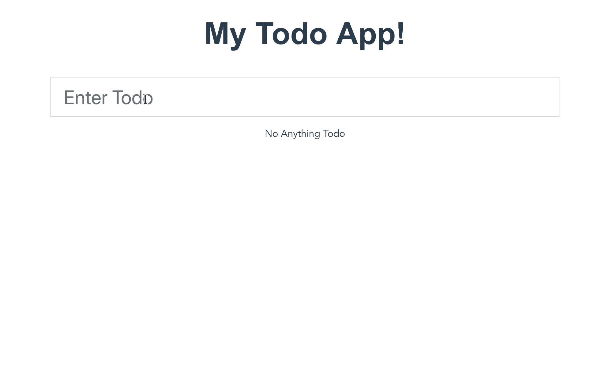
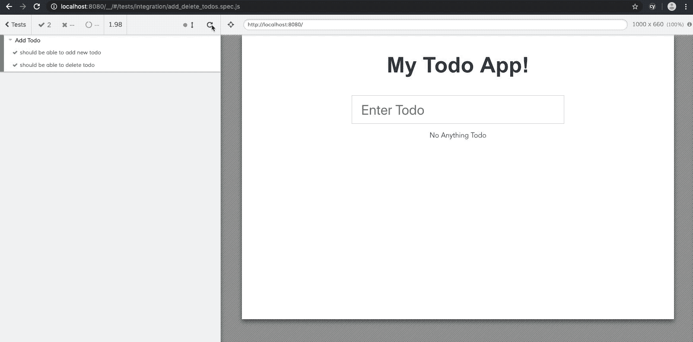
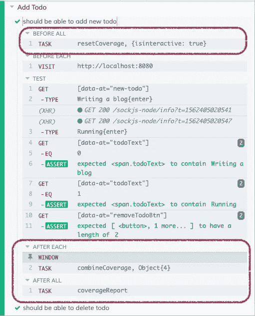
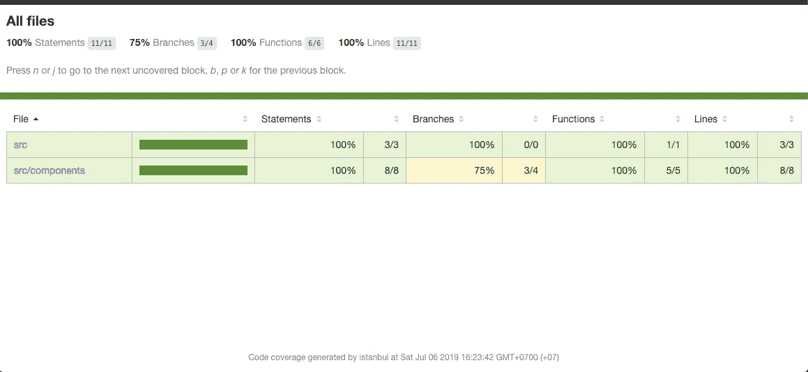
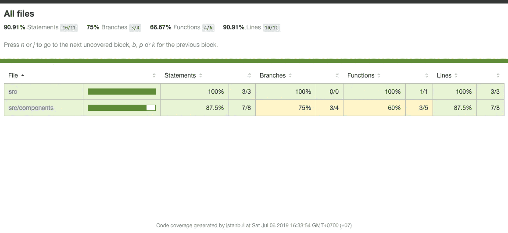
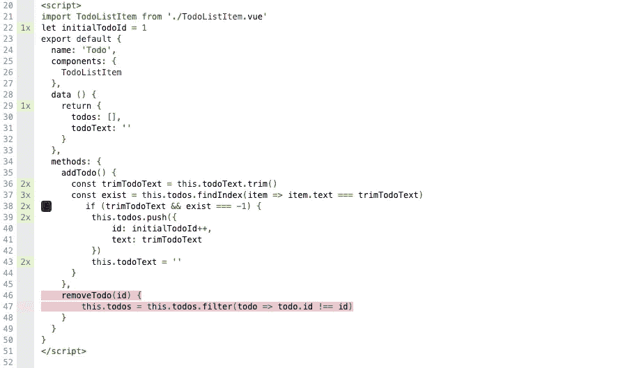

# 使用 Cypress.io 运行端到端测试，生成代码覆盖报告

> 原文：<https://levelup.gitconnected.com/generate-code-coverage-report-from-running-e2e-test-with-cypress-io-aaf6d47499e8>


大家好，我相信大多数开发人员或 QAs 工程师可能都有编写 Web 自动化测试的经验，包括单元测试、集成测试和端到端(E2E)测试。构建测试时可能会想到的问题:

*   ***我们有足够的测试吗？***
*   我们的测试接触了多少代码？
*   有没有哪一行代码我们忘记写测试了？

如果你正在编写单元测试，这个问题很容易回答。答案是“*只做一个代码覆盖*”。E2E 测试怎么样？

如果您使用 Cypress 作为 E2E 测试的测试框架，那么您可以很容易地回答这个问题。你现在可以使用[**Cypress Code Coverage**](https://github.com/cypress-io/code-coverage)插件从运行 E2E 测试中生成一个代码覆盖报告。这个插件是最近刚发布的，非常有用。我推荐每个用 Cypress 编写 E2E 测试的人使用这个插件。

如果你没用过 Cypress，可以看下面这篇文章入门。

[](https://docs.cypress.io/guides/overview/why-cypress.html) [## 为什么是柏树？

### 您将了解到什么是 Cypress，为什么您应该使用它我们的任务，以及我们认为 Cypress 的关键特性是什么…

docs.cypress.io](https://docs.cypress.io/guides/overview/why-cypress.html) 

# 示例项目

我将使用一个简单的 Todo 应用程序写在 [VueJS](https://vuejs.org/) 的项目。



在这个示例应用程序中，您只需在文本字段中键入一些文本，然后按“Enter”将其添加到待办事项列表中。之后，应用程序将保存您的列表，并显示在文本字段下。它还允许您删除待办事项列表。

# 代码检测

先说一下代码插装的概念。代码插装是一种允许您监视和检查代码中有多少语句被调用的技术。它必须有一个计数器来计算所有的调用。如果我们谈论 Javascript 应用程序的代码插装，您可能听说过的一个库是“ [**伊斯坦布尔**](https://istanbul.js.org/) ”。伊斯坦布尔文书您的 ES5 和 ES2015+ Javascript 代码与行计数器，以便您可以跟踪多少你的测试行使你的应用程序。它可以帮助你用几个配置文件轻松地生成代码覆盖率。

# 安装和配置

让我们安装并配置我们需要的所有依赖项。

1.  安装节点依赖:`babel-plugin-istanbul`、`istanbul-lib-coverage`和`nyc`

*   `babel-plugin-istanbul`是一个 [babel](https://babeljs.io/) 插件，用伊斯坦布尔覆盖率来测试你的代码。可配合[噶玛](https://karma-runner.github.io/latest/index.html)和[摩卡](https://mochajs.org/)(柏木也用)
*   `istanbul-lib-coverage`提供一个 API，可以读取并合并覆盖数据，汇总覆盖信息。
*   `nyc`是一个伊斯坦布尔命令行界面，可以生成各种格式的代码覆盖报告，如 HTML 文件。

```
sh$ yarn add babel-plugin-istanbul istanbul-lib-coverage nyc
```

2.安装 Cypress 代码覆盖插件

```
sh$ yarn add cypress @cypress/code-coverage
```

3.配置`.babelrc`(如果没有就新建一个)

4.创建一个`nyc`配置文件。在这种情况下，我想检查`.js`和`.vue`的覆盖率

# 配置 Cypress 代码覆盖率插件

将 Cypress 添加到项目中之后，您必须配置 Cypress 插件文件`cypress/plugin/index.js`来启用 Cypress 代码覆盖插件。

请注意，这个插件可能会降低你的测试速度，因为它必须检测你所有的代码。Cypress 团队正在努力在未来的版本中改进这一点。您可以在此处跟踪问题状态

cypress/support/index.js

赛普拉斯/插件/索引. js

# 用 Cypress 编写 E2E 测试

我已经在我的 app 源代码中添加了`data-attribute`。所以我要用这些属性来定位我的 E2E 测试中的元素。这是我们在任何项目中编写 E2E 测试时应该做的最佳实践之一。

当您开始使用 Cypress UI Test Runner 执行您的测试时，它将像这样运行您的测试。



然后，如果你一步一步地查看测试用例，你可以看到 Cypress 在测试运行后连接了`task`来生成代码覆盖报告。您可以看到在您的项目中自动生成的`coverage`文件夹。您可以在任何 web 浏览器中打开代码覆盖率报告。



我的 E2E 测试的 100%声明覆盖率。不错！

起初，我不知道是否该相信覆盖率数据是正确的——它似乎好得不像是真的。所以我试图跳过我的第二个测试用例(即`Delete Todo`用例),来检查代码覆盖率是否正常工作。那么结果就是



我的语句覆盖率减少到 87.5%，这意味着您遗漏了一些代码行。你可以点击它来检查测试发现的代码在哪里。挺酷的。



用红色突出显示的代码行是未经测试的。这是因为我跳过了第二个测试用例(`Delete Todo`用例)，所以没有调用`removeTodo`方法。

# 向配置项添加代码覆盖率

因此，您可以看到如何通过在本地机器上运行 E2E 测试来生成代码覆盖率。您可以将这一概念应用于您的[持续集成](https://en.wikipedia.org/wiki/Continuous_integration)系统以及支持生成各种格式报告的`nyc`命令。因此，您可以在您的 CI 系统上跟踪您的*代码覆盖率趋势*。这可以让你在产品质量方面更有信心。你有一个简单的方法来管理你的测试覆盖率。获得更好的代码质量，这就是目标，对吗？

Cypress 也有很多有趣的特性可以使用。在泰国，我们在脸书有一个名为“[**Cypress Thailand Community**](https://www.facebook.com/groups/503467050140551)的公共团体。“我们有许多 Cypress 用户，他们分享他们的知识和最佳实践，也可以随时加入我们。

您可以在下面看到 Todo 应用程序的 E2E 测试示例代码。测试愉快！

[](https://github.com/nottyo/cypress-e2e-code-coverage) [## nottyo/cypress-e2e 代码覆盖范围

### 从赛普拉斯 E2E 测试生成代码覆盖率的示例项目

github.com](https://github.com/nottyo/cypress-e2e-code-coverage) 

**代码覆盖率报告示例**:[https://not tyo . github . io/cypress-e2e-Code-Coverage/Coverage/](https://nottyo.github.io/cypress-e2e-code-coverage/coverage/)

**参考**:[https://docs.cypress.io/guides/tooling/code-coverage.html](https://docs.cypress.io/guides/tooling/code-coverage.html)