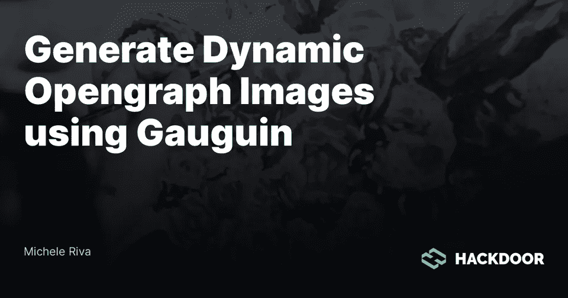
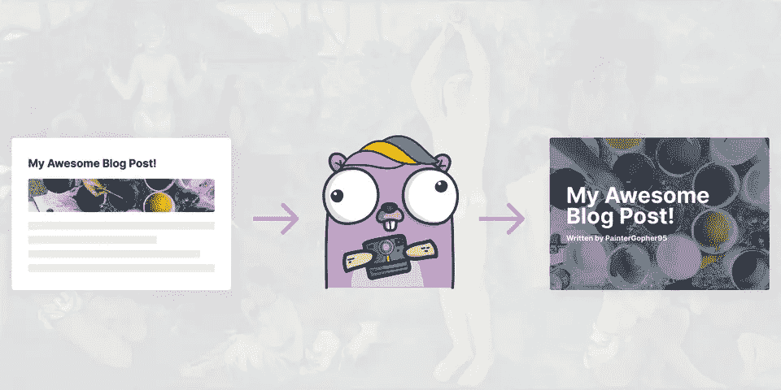
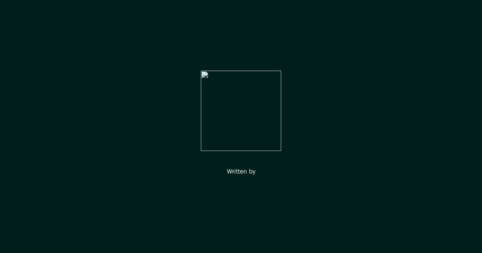

# 使用高更生成动态 Opengraph 图像

> 原文：<https://levelup.gitconnected.com/generate-dynamic-opengraph-images-using-gauguin-b53c5dc8ec2f>

你有没有尝试过在脸书、Twitter、Reddit 等社交网络上分享任何 Hackdoor 文章？

如果你还没有，你应该现在就试试这篇文章。😛
玩笑归玩笑，我这么说是有原因的:你会注意到这篇文章的开放图看起来像这样:



如果你是一个黑客门作者**，**你可能也会注意到，如果你改变了你文章的标题或图片，打开的图形图片会立即反映这些变化。

那是因为我们用的是高更！

[](https://github.com/micheleriva/gauguin) [## 米歇尔·里瓦/高更

### 高更(发音/ˈɡoʊɡæ̃/)是一个高性能的 Golang 服务器，生成动态开放图形图像在…

github.com](https://github.com/micheleriva/gauguin) 

**Gauguin** 是一个开源的 **Golang** 服务器，可以让你以最快的方式生成动态的、开放的图形图像，并且不需要 Golang 知识就可以开始使用！

# 高更入门

要开始使用高更(`v0.0.X`)的当前版本，你需要在你的机器上安装 **Docker** (或者同时安装 Go 和谷歌 Chrome)。

安装 Docker 后，让我们创建一个新的**高更**项目:

此时，进入您的项目文件夹并创建一个名为`gauguin.yaml`的新文件

这将是我们的**高更**项目的配置文件。

# 配置

假设我们在配置**高更、**时有一个博客，我们想要指定以下数据:

1.  我们想要创建的图像变体(文章图像、作者图像等等)
2.  动态数据:例如，对于文章图像，我们需要以下动态数据:作者姓名、文章标题、文章封面图像 URL。
3.  打开的图形图像的大小(脸书为 1200x630px 像素)
4.  我们希望用于此打开的图形图像的模板

我们将得到一个类似于下面这样的`gauguin.yaml`文件:

# 模板

现在我们要定义我们的模板！让我们创建一个名为`templates`的新目录和两个子文件夹，一个用于`article`模板，一个用于`user`模板。

我们将使用[标准 Golang 模板引擎](https://golang.org/pkg/text/template/)来编写我们的模板，这样我们就可以使用变量(我们已经在配置文件中定义了)甚至一些自定义逻辑。

先说单篇开图图片(`templates/article/opengraph.tmpl`):

如您所见，它基本上是一个带有一些变量的标准 HTML 文件。在 Golang 模板中，变量是这样定义的:`{{.myVariable}}`。

太好了，我们有了第一个模板！

# 渲染图像

既然我们已经定义了第一个模板，我们就可以看到结果了！

你可能还记得，在我们的`gauguin.yaml`文件中，我们定义了一些路线。
更准确地说，对于文章的开放图形图像，我们已经定义了以下路径:`/article/opengraph` 在我们实际测试它之前，我们需要启动我们的服务器。

新建一个`docker-compose.yaml`文件，填写如下:

如您所见，在`gin_gonic`服务配置下，我们指定要使用 Gauguin 的`v0.0.4` 版本，这是在撰写本文时的最新版本。

你可以在这里选择另一个版本:[https://github.com/micheleriva/gauguin/releases](https://github.com/micheleriva/gauguin/releases)。

太好了！现在我们可以通过运行以下命令来启动 Docker:

服务器启动后，我们终于可以在下面的地址访问我们的路由:`[http://localhost:5491/articles/test](http://localhost:5491/articles/test)` 这就是我们看到的:



不要害怕！我们忘记传递变量了！
为了呈现动态内容，我们需要通过查询字符串传递变量。

我们之前已经定义了三个变量:

1.  标题(`title`)
2.  作者(`author`)
3.  图像 URL ( `imageUrl`)

我们希望我们的 og:image 显示以下动态数据:

1.  标题:“**一篇关于我的花园的帖子**”
2.  作者:**杰克骑士**

我们想要渲染下面的图像(取自 **Unsplash** ):


完整图片网址为[https://images . unsplash . com/photo-1525498128493-380d 1990 a112？IX lib = r b-1 . 2 . 1&ixid = eyjhchbfawqiojeymdd 9&auto = format&fit = crop&w = 200&h = 200&q = 80&dev = true](https://images.unsplash.com/photo-1525498128493-380d1990a112?ixlib=rb-1.2.1&ixid=eyJhcHBfaWQiOjEyMDd9&auto=format&fit=crop&w=200&h=200&q=80&dev=true)但是记住，我们不能通过查询字符串传递 URL！我们首先需要将其编码为 URI 分量。

我们可以通过使用 JavaScript 来实现:

或者使用 http://pressbin.com/tools/urlencode_urldecode/index.html 这样的在线工具。

在这两种情况下，我们都希望我们的图像 URL 看起来像这样:`https%3A%2F%2Fimages.unsplash.com%2Fphoto-1525498128493-380d1990a112%3Fixlib%3Drb-1.2.1%26ixid%3DeyJhcHBfaWQiOjEyMDd9%26auto%3Dformat%26fit%3Dcrop%26w%3D200%26h%3D200%26q%3D80%26dev%3Dtrue`

我们现在准备重试！我们的完整网址是:

```
[http://localhost:5491/articles/test?author=Bojack%20Horseman&title=A%20Post%20About%20my%20Garden&imgUrl=https%3A%2F%2Fimages.unsplash.com%2Fphoto-1525498128493-380d1990a112%3Fixlib%3Drb-1.2.1%26ixid%3DeyJhcHBfaWQiOjEyMDd9%26auto%3Dformat%26fit%3Dcrop%26w%3D300%26q%3D80&dev=true](http://localhost:5491/articles/test?author=Bojack%20Horseman&title=A%20Post%20About%20my%20Garden&imgUrl=https%3A%2F%2Fimages.unsplash.com%2Fphoto-1525498128493-380d1990a112%3Fixlib%3Drb-1.2.1%26ixid%3DeyJhcHBfaWQiOjEyMDd9%26auto%3Dformat%26fit%3Dcrop%26w%3D300%26q%3D80&dev=true)
```

这就是结果！


如果您想使用 chrome 检查模板，使用与上面相同的 URL 并添加`&dev=true`。使用指定参数，Gauguin 将呈现 HTML 而不是图像！

# 部署

部署高更非常容易。由于其架构，它甚至可以在 5 美元的数字海洋液滴上工作良好。

如果你想试试，你可以使用以下链接获得未来三个月 100 美元的免费数字海洋服务:[https://m.do.co/c/3876c597ccc7](https://m.do.co/c/3876c597ccc7)。

创建 Droplet(或 EC2/VPS)后，您需要创建两个文件:

`docker-compose.yaml`

我们想使用 Caddy 作为向外界展示 Gauguin 的反向代理，所以我们还需要创建一个 Caddyfile。

`Caddyfile`:

确保用你自己的域名来改变 example.com！😄

现在将您的本地`templates`目录和您的本地`gauguin.yaml`文件移动到`docker-compose.yaml`和`Caddyfile`的同一个文件夹中，并运行:

```
docker-compose up -d
```

你完了！高更站起来了！

你可以在 ProductHunt 上支持高更: