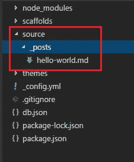
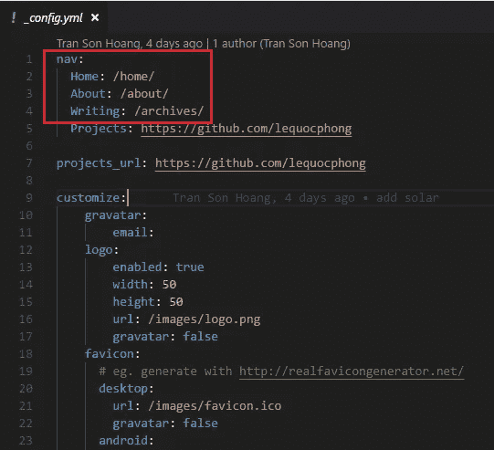
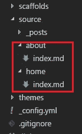
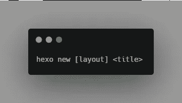
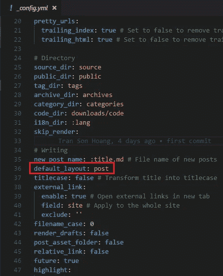
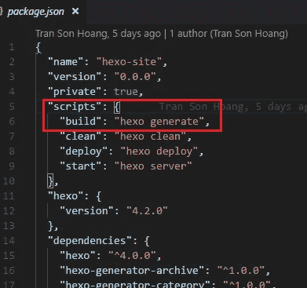
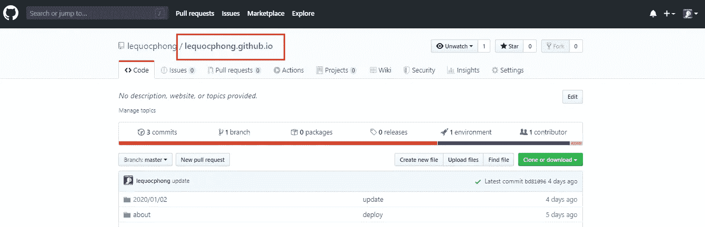
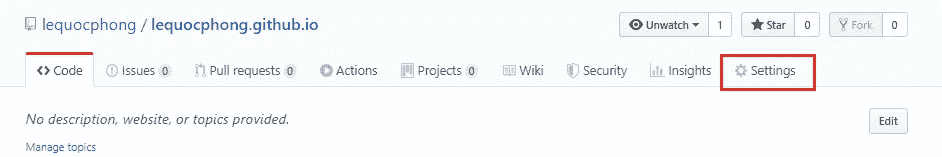
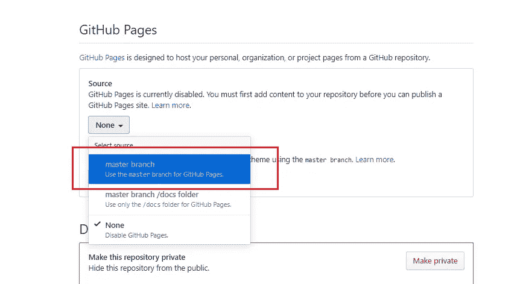
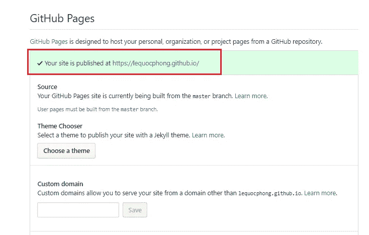

# 为您的博客生成免费的 GitHub 域——一小时内创建一个博客(第 2 部分)

> 原文：<https://levelup.gitconnected.com/generate-free-github-domain-for-your-blog-part-2-9c284fcdc693>

## 你自己的博客

## 关于构建本地源代码的指南，部署到公共 GitHub 库，从 GitHub 获得一个免费域


[亚历克斯](https://unsplash.com/@worthyofelegance?utm_source=unsplash&utm_medium=referral&utm_content=creditCopyText)在 [Unsplash](https://unsplash.com/s/photos/coffee?utm_source=unsplash&utm_medium=referral&utm_content=creditCopyText) 上的照片

这篇文章是关于编写你自己的博客的 3 篇系列文章的第二篇。

[](/setup-project-for-blog-in-fastest-way-part-1-54e6d47e2c44) [## 编写你的博客网站——在一小时内建立一个博客(第 1 部分)

### 关于如何创建博客、选择好的主题并将其发布到 GitHub 资源库的指南。

levelup.gitconnected.com](/setup-project-for-blog-in-fastest-way-part-1-54e6d47e2c44) [](/customize-github-domain-part-3-927c645d0ce9) [## 用 GitHub 页面创建自定义域——一小时内创建一个博客(第 3 部分)

### 将 xxx.github.io 免费域名从 github 改为我们个人域名的指南

levelup.gitconnected.com](/customize-github-domain-part-3-927c645d0ce9) 

在这篇文章中，我将指导你部署你的博客并获得一个 GitHub 域。这花了我大约 20 分钟。

本文分为三个部分:

1.  构建本地源代码
2.  部署到公共存储库
3.  生成一个自由域

*更多类似内容，请查看*[*https://betterfullstack.com*](https://betterfullstack.com)

注意:为了从 GitHub 定制一个免费的域，我将为这个主题创建另一篇文章。

# 构建本地源代码

你有没有注意到在你的本地主机上有一些没有找到的链接？

现在，我们将对您的博客进行一些更改，例如:

1.  修复未找到的问题链接
2.  创建新帖子
3.  建立一个项目

## **修复未找到的问题链接**

**source** 文件夹是我们为博客写文章的地方。



源文件夹的初始状态

你可以在**主题/太阳能主题中看到`_config.yml`文件，**它将包括导航配置。



导航配置

这意味着我们将从**源**文件夹中再创建两个文件夹。他们是**家的**和**关于**里面包括一个`index.md`。



添加主页和关于页面

这里有一个从主题配置中添加缺失链接页面的通用方法。

## **创建一个新职位**

我更喜欢用下面的语法从终端创建一个新帖子:



创建新帖子

这将为您生成一个新的降价文件，其中包含日期和时间。而且这个日期时间对整理所有文章很重要。

在没有布局的情况下，新的降价文件将在默认布局内呈现。故事发生在`_config.yml`。



default_layout 设置来自 _config.yml

## **建设项目**

因为我们用 markdown 写博客文章，所以需要把它转换成静态 HTML。

为此，我们运行`npm run build`，该语法在`package.json`定义。



npm 运行构建脚本以将源代码构建到静态文件中

这将生成一个**公共**文件夹，我们将把这个文件夹部署到 GitHub 并把它变成一个网站。

# 部署到公共存储库

这里我们有两件事需要注意:

1.  存储库名称
2.  将远程添加到一个**公共**文件夹

## **储存库名称**

您应该遵循这个惯例来创建存储库名称。正是`your-blog-name.github.io`。

注意:必须有 **.github.io**

在本例中，我为我的兄弟创建了一个名为 [lequocphong.github.io](https://github.com/lequocphong/lequocphong.github.io) 的存储库。



回购名称遵循约定. github.io

## **将遥控器添加到公共文件夹**

现在，从根文件夹，我们转到 **public** 文件夹，添加一个 remote，将静态 HTML 代码发布到新的公共存储库中。

```
git remote add origin [https://github.com/lequocphong/lequocphong.github.io.git](https://github.com/lequocphong/lequocphong.github.io.git)
git add .
git commit -m "init my blog"
git push -u origin master
```

这意味着每次我们构建源代码时，我们都将进入公共文件夹，向公共存储库提交新的更改。

以下是最后的步骤:

1.  添加新的博客文章
2.  检查本地主机
3.  将源代码提交给私有存储库
4.  构建源代码
5.  Bo 到公共文件夹，并将新的静态文件提交到公共存储库

# 生成自由域

现在在公共存储库中，转到**设置**页面。



设置页面

然后向下滚动到底部，我们可以看到 **GitHub 页面**并选择**源**部分内的**主分支**。



选择主分支

然后我们会看到

**“您的站点发布在**[**https://lequocphong . github . io**](https://lequocphong.github.io/)**”**博客域名是我们上面创建的存储库名称。



你的网站发表在[https://lequocphong.github.io/](https://lequocphong.github.io/)

搞定了。现在，我们可以转到该链接来查看我们的网页。

# 摘要

这篇文章是关于如何创建一篇文章和构建你的源代码，提交一个 **public** 文件夹到一个新的公共库，并生成一个免费的 GitHub 域的指南。

我希望这篇文章对你有用！你可以在[媒体](https://medium.com/@transonhoang?source=post_page---------------------------)上关注我。我也在[推特](https://twitter.com/transonhoang)上。欢迎在下面的评论中留下任何问题。我很乐意帮忙！

[](/customize-github-domain-part-3-927c645d0ce9) [## 用 GitHub 页面创建自定义域——一小时内创建一个博客(第 3 部分)

### 将 xxx.github.io 免费域名从 github 改为我们个人域名的指南

levelup.gitconnected.com](/customize-github-domain-part-3-927c645d0ce9) [](https://betterfullstack.com/stories/) [## 故事-更好的全栈

### 关于 JavaScript、Python 和 Wordpress 的有用文章，有助于开发人员减少开发时间并提高…

betterfullstack.com](https://betterfullstack.com/stories/)