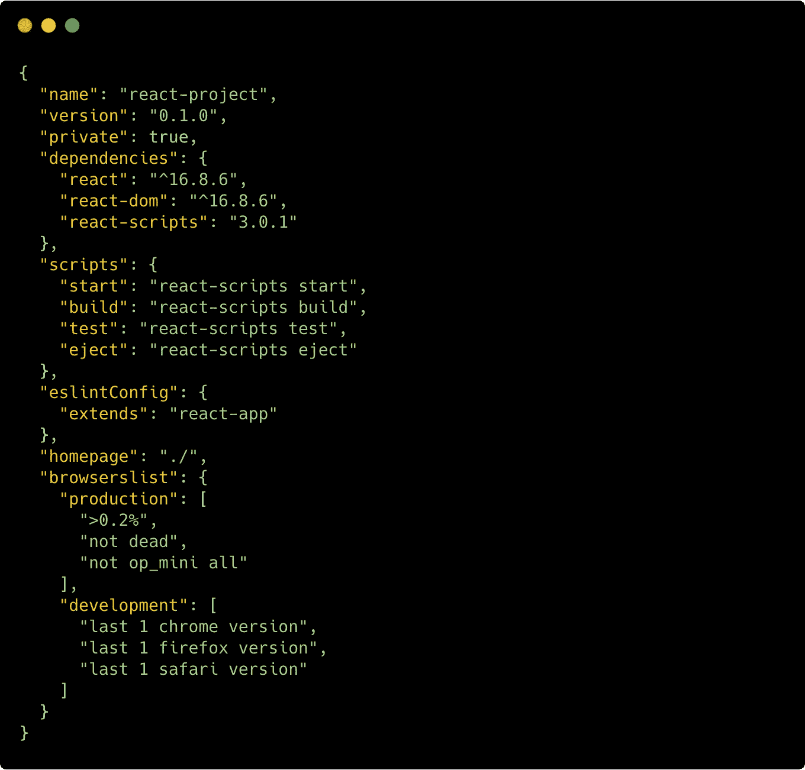
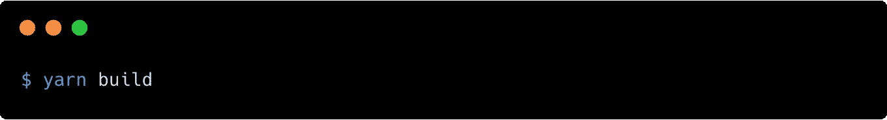

# 使用 React、Vue 生成图像，或使用木偶师生成角度图像

> 原文：<https://levelup.gitconnected.com/generate-images-using-react-vue-angular-765525b45f28>

我最近开始用一种新的格式设计我博客的特色图片(就是你在上图中看到的那种)。我需要手动为 20 篇文章创建 60 张新图片。每篇文章有 3 张图片 Open Graph、Instagram story 和 Instagram post 图片。

通过简单地使其成为一个 REST 请求并发送标题、副标题和背景图像来生成新的文章图像集会有多好？

让我们通过使用 React 和木偶师建立一个简单的项目来看看如何做到这一点。

首先，让我们在 React 应用程序(我们构建的图像+文本的 UI)和图像渲染脚本之间划分我们的项目，我们需要一个像这样的文件夹结构:

让我们从使用`create-react-app`创建一个新的 React 应用程序开始:

太好了！现在我们来思考一下我们想要塑造哪种形象。
对于这篇文章，我想创建一个全高清(1920 * 1080 像素)的图片，上面有一些文字。让我们设计它只是为了在开发过程中有一个参考:

如你所见，我们使用了 Google 字体( [**Roboto**](https://fonts.google.com/specimen/Roboto) )和 Unsplash 中的 [**图像，所以我们需要在我们的组件中渲染它们。**](https://images.unsplash.com/photo-1555448248-2571daf6344b?ixlib=rb-1.2.1&ixid=eyJhcHBfaWQiOjEyMDd9&auto=format&fit=crop&w=934&q=80)

让我们从创建背景组件开始。请注意，干净的 React 架构不是本文的目标。我们只需要创建一些有用的东西，并将其渲染为图像！

## 背景组件

如你所见，我们只是创建了一个简单的组件，它将从`props`获取背景图像，并将所有内容作为`children`道具呈现。

## 标题组件

`Title`组件甚至更简单——它采用一个名为`text`的道具，并将它呈现在一个`h1`标签内。

## 字幕组件

就像`Title`组件一样，`Subtitle`将获得一个名为`text`的道具，并将其呈现在`div`中。相当简单！

## 应用程序组件

使用`App`组件，我们将挂载整个图像和文本。让我们在网络浏览器中看看结果:

厉害！这正是我们所需要的。

# 将 React 项目呈现为 PNG 文件

我们需要创建 React 应用程序的生产版本。让我们将`"homepage”`属性添加到我们的`package.json`文件中。这将使它在本地工作，只需用浏览器打开生成的`index.html`文件:

现在让我们使用默认的`create-react-app`脚本启动构建:

太好了！现在我们有了以下文件夹结构:

我们已经将 React app 项目与 Render 项目(将为我们生成图像的项目)分开。在`/react-project/build`目录中，我们可以找到用于生成图像的产品版本。

现在让我们进入我们的`render-project`文件夹，初始化一个新的`package.json`文件。

现在让我们添加我们需要的唯一依赖项， [**木偶师**](https://github.com/GoogleChrome/puppeteer) 。

木偶师是由谷歌建立的一个令人惊讶的库，它公开了无头的 Chrome APIs。这意味着我们在谷歌 Chrome 上做的几乎所有事情都可以使用这个神奇的库来完成！

让我们看看如何实现图像生成:

就是这样！仅仅 14 行代码就可以从我们的 React 场景中生成一个 PNG 图像！

让我们深入分析一下我们正在做的事情:

1.  我们创建了一个新的木偶浏览器。
2.  我们创建一个新页面。
3.  我们将它的目标 URL 设置为我们生成的`index.html`文件。请注意，我们使用的是`file://`，`http`协议不适用于这种特定情况！
4.  我们将视口设置为 1920x1080 像素。这样，我们将覆盖整个 React 场景，并在下一个脚本中完整地捕捉它。
5.  我们截取页面截图并保存到`./myAwesomeImage.png`文件。
6.  我们关闭浏览器。

现在让我们看看结果:

你能猜出哪个是原始图像，哪个是用 React 生成的吗？我也没有！

您可以在这个资源库中找到完整的项目:

 [## jsmonday/jsm22

### 第 22 篇 JSMonday 文章的源代码。在 GitHub 上创建一个帐户，为 jsmonday/jsm22 的开发做出贡献。

github.com](https://github.com/jsmonday/jsm22) 

# 后续步骤

那么现在，我们下一步能做什么？我刚刚开源了一个**谷歌云功能**(它也可以作为一个 **AWS Lambda** )的代码，只需通过 REST API 发送标题、副标题和图片链接，就可以生成 Instagram 帖子/故事和开放图形图像:

 [## jsmonday/sigf

### 无服务器图像生成功能。在 GitHub 上创建一个帐户，为 jsmonday/sigf 开发做贡献。

github.com](https://github.com/jsmonday/sigf) 

可能性是无限的。您可以构建一个基于某些参数生成图像的 Express 服务器，或者您也可以使用 Puppeteer 和 React 生成 PDF 发票。全凭你的想象力！

