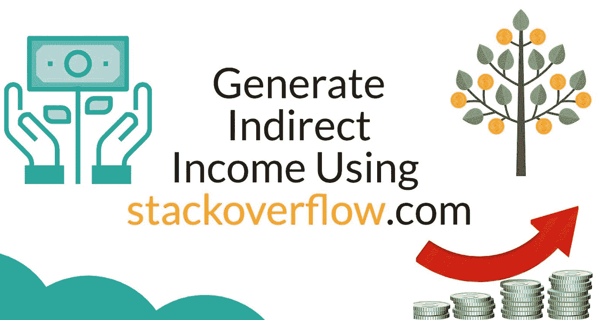
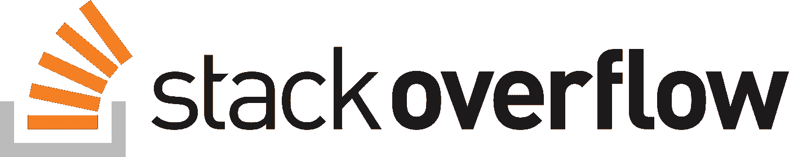
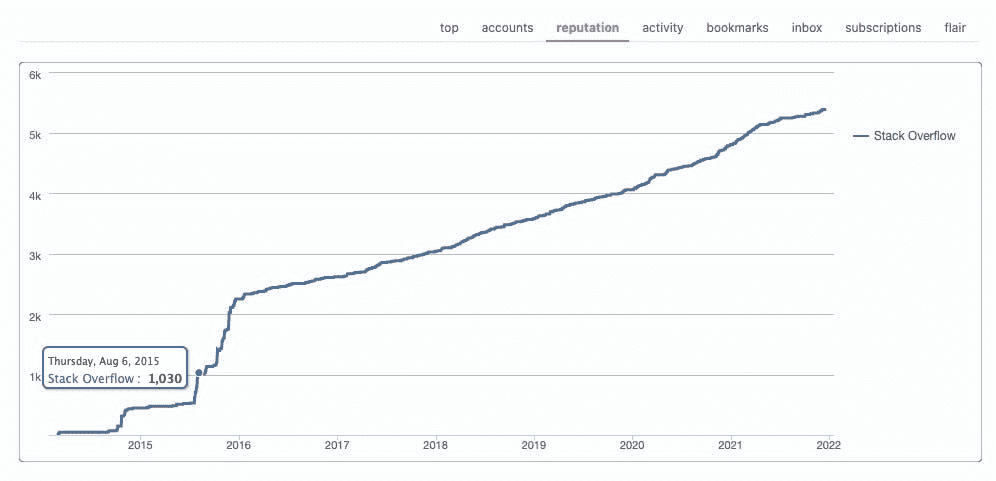
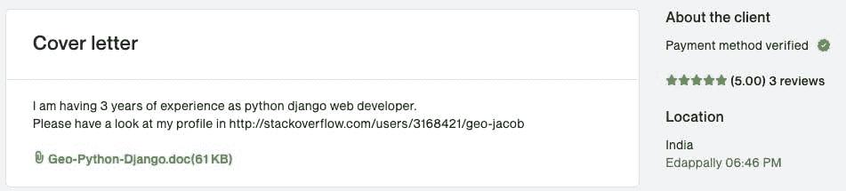

# 使用 stackoverflow.com 产生间接收入

> 原文：<https://levelup.gitconnected.com/generate-indirect-income-using-stackoverflow-com-1fef86d586b3>

## 堆栈溢出时保持活动状态的长期好处

## 在我们开始之前，让我们问一些关于你自己的问题。

*1。当你被困在某个地方或准备在空闲时间帮助某人时，你是同一个人吗？*

*2。为什么有人会在没有任何好处的情况下帮助你回答问题，因为他们可能已经花了几个小时来解决你所面临的同样的问题。你想过这些吗？*

# 堆栈溢出的好处

使用[stackoverflow.com](http://stackoverflow.com/)有很多直接的好处。这些在门户网站上非常明显，如:

*   QnA 螺纹
*   乔布斯
*   组
*   集体
*   学习
*   声誉
*   徽章等。

但是，从市场营销的角度来看，你认为有可能使用你在 stackoverflow.com 的个人资料吗？

好吧，让我们进入真正的部分。

开发者在线赚钱的可能性有很多，其中一些是:

*   联盟营销
*   博客
*   信息产品
*   微型创业公司
*   当自由职业者
*   在线课程等。

这些都很好，但自由职业是一个很好的机会。但主要问题是在哪里/如何找到客户？现在，许多自由职业门户网站解决了这个问题，例如:

*   向上工作
*   自由记者
*   共同导师
*   托普塔尔
*   每小时人数等。

现在最大的问题是你如何获得那些自由职业平台上列出的项目。人们认为，作为一个自由职业世界的初学者，很难得到他们的第一个项目。但事实上，如果你走在正确的道路上，它就不是。获得你的第一个项目有很多战术；其中之一是，在提交你的提案时，使用 stackoverflow.com 的个人资料来推销你自己。从我的经验来看，这确实是一个成功的方法。

# 让我们仔细看看

过去，我在 2013 年左右开始职业生涯，在 2014 年底或 2015 年初的时间框架内，我在[stackoverflow.com](http://stackoverflow.com/)非常活跃。很快我就对它上瘾了，每天不停地搜索我最喜欢的标签`"django"`，并试图回答所有的问题。它确实帮助我增长了作为开发人员的知识，并且在一段时间内进行得很顺利。作为一个额外的优势，我也在短时间内赢得了 1000+的声誉。

大约两年后，我考虑在工作的同时赚些外快，并开始寻找自由职业的机会。所以我在 Upwork 上开了个账户，开始申请项目。但是我知道没有人会看我的资料，正如我所说的，我只有 2.5 年的经验，尽管我有信心满足我的客户的要求(我过去总是提交从头开始构建应用程序的提案)。几天就这样过去了，然后我意识到没有人会相信我，直到他们看到我的工作或者我有多么有激情。因此，我开始在求职信上放上我的[stackoverflow.com](http://stackoverflow.com/)个人资料链接，并开始提交提案。突然我开始看到一些好的结果。我收到了面试邀请，并最终赢得了我的第一个项目。这种方法我已经坚持了一段时间，直到我从客户那里得到足够多的关于 Upwork 的评论..

*注意:一旦你从客户那里获得足够多的好评，获得新项目就容易多了。*

一封样本求职信，它帮助我获得了我的第一份装修合同..

在提交项目建议书时，你需要考虑更多的事情。由于我们对这篇文章的意图不同，我将在另一篇文章中写这些。

感谢阅读，请在你的网络内分享，如果这引起你的共鸣。

你也可以[在 twitter](https://twitter.com/intent/follow?screen_name=geojacobm6) 上和我联系，因为我会经常在那里记下我的想法。