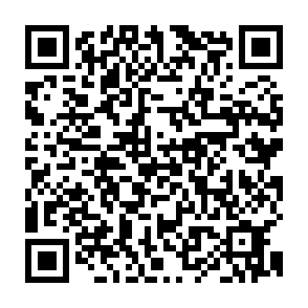
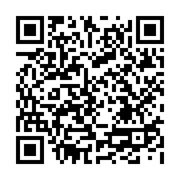
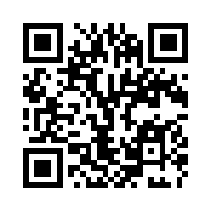

# 使用 Python 生成二维码— Python 编程

> 原文：<https://levelup.gitconnected.com/generate-qr-code-using-python-python-programming-pyshark-dfd3302ef6c6>


本文将探讨如何用 Python 生成二维码，以及来自 [pyqrcode](https://pythonhosted.org/PyQRCode/index.html) 库的一些有用的创建特性。

**目录**

*   介绍
*   创建一个简单的 QR 码图像
*   QR 码参数
*   更多二维码示例
*   结论

# 介绍

二维码最近变得比以往任何时候都更受欢迎，但很少有人知道二维码的第一次迭代是在 20 世纪 90 年代在日本为汽车行业创建的。

QR(快速响应)码本质上是一种条形码，我们都习惯于在杂货店购买的产品上看到。它以同样的方式工作。二维码是包含特定信息的标签。

与传统条形码不同，二维码能够存储[更多信息](https://www.qr-code-generator.com/qr-code-marketing/qr-codes-basics/)，通常用于存储产品详情、地理位置、优惠券、网址等等。

由于其存储信息的有趣能力，它成为数据科学和机器学习的一个感兴趣的领域，主要是在分析领域。

如果你想到一家销售服装的零售店，每件商品上的一个简单的二维码可能会存储商品描述、颜色、价格和其他信息。一旦购买了商品，就可以从 POS 系统或数据存储中检索该信息，并进一步将其输入到例如推荐系统中。

现在我们知道了什么是二维码，以及如何使用它们。让我们开始实际创建我们的第一个简单的 QR 码图像，并尝试使用它来访问信息。

# 使用 Python 创建一个简单的二维码

为了继续学习本教程，我们需要两个 Python 库:pyqrcode 和 pypng。

如果您没有安装它们，请打开“命令提示符”(在 Windows 上)并使用以下代码安装它们:

```
pip install pyqrcode
pip install pypng
```

导入所需的库:

一旦下载、安装和导入了库，我们就可以继续 Python 代码实现了。

我将创建一个二维码，当扫描时，将在您的移动设备浏览器中带您到本教程。为此，我首先需要找到这篇文章的 URL，并将其存储为某个变量:

下一步实际上是创建包含我们链接的 QR 码对象:

这里我们创建了一个**的实例。QRCode()** 类，并将我们的 **dest** (目的地)作为参数传递给它，作为回报，它创建一个 QRCode 对象。

我们可以用下面的例子来看看:

请看:



非常简单易懂对吗？

要重复使用此二维码，我们将把它保存为 PNG:

注意: **scale=8** 是调整二维码 PNG 大小的参数，你可以调整它来增大/减小二维码图像的大小。

你可以用你手机的摄像头(我用的是我的 iPhone)测试这个二维码，它会带你去这篇文章的网址。

# QR 码对象参数

上一节展示了如何创建一个简单的 QR 码，无需任何特定的调整或选择参数。当没有指定它们时，它们将采用默认值，代码将被执行。

但是，如果我们想对它进行一些定制，那么如何调整以及调整什么是值得讨论的。

当我们创建简单的二维码时，使用了以下代码行:

实际上，有一些预设的默认参数，如果展开，代码将如下所示(但产生相同的输出):

让我们从列出 QRCode()类的所有可能参数开始，并讨论每个参数的作用:

*   **内容**:这是我们想要在二维码中编码的“目标”目的地。
*   **错误**:代码的纠错级别(默认设置为‘H’，这是可能的最高级别)。
*   **版本**:指定代码的大小和数据容量(可以取 1 到 40 之间的整数值)，如果不指定，它会找到最小的二维码版本来存储我们想要的数据(已知其大小)。
*   **模式**:指定**内容**将如何编码(有四个选项:数字、字母数字、二进制、汉字)。如果不指定，它将被算法猜测。
*   **编码**:指定内容的编码方式，默认为 iso-8。

每个参数的详细说明可在[这里](https://pythonhosted.org/PyQRCode/moddoc.html)获得。

您可以使用我们的初始代码并调整上述参数，看看最终的二维码图像将如何表现这些差异。

# 使用 Python 的更多二维码示例

有趣的是智能手机算法如何适应二维码阅读。换句话说，当用 iPhone 扫描这些内容时，苹果的二维码解码器会马上知道二维码的每个内容使用哪个应用程序。

为了测试这一点，让我们试着为 URL、地址和电话号码创建二维码:

这将在您的脚本所在的同一目录下创建并保存三个二维码。例如，当扫描时，iPhone 的二维码解码器会识别每一个，应用程序会自动建议打开它们:

**链接**(在 Safari 中会被提示打开):


**地址**(苹果地图中会提示打开):



**电话号码**(在电话和通话中会提示打开):



有趣的是每个二维码的大小。本质上，考虑这个问题的方式是，你试图存储在二维码中的内容越长(越大)，它的大小就越大。

此外，探索[相关文档](https://pythonhosted.org/PyQRCode/moddoc.html)还显示了 PNG 输出的参数，并解释了如何调整(例如，使二维码背景为绿色，等等)。

总之，我们只保存了 PNG 格式的二维码，但是 pyqrcode 库在二维码的输出格式方面有很大的灵活性。

# 结论

本文主要探讨使用 [Python](https://pyshark.com/) 创建二维码并将其保存为 PNG 文件的过程。这应该是一个理解过程的良好基础，并且具有构建功能的知识。

如果你有任何问题或者对编辑有任何建议，请在下面留下你的评论。

*原载于 2020 年 7 月 1 日 https://pyshark.com*[](https://pyshark.com/generate-qr-code-using-python/)**。**