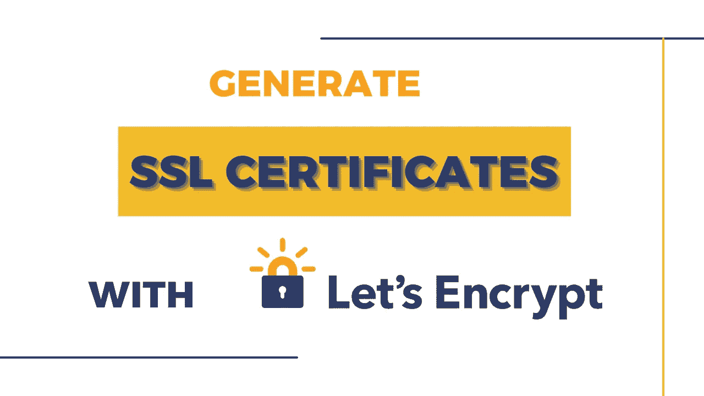
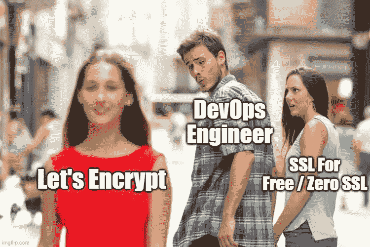
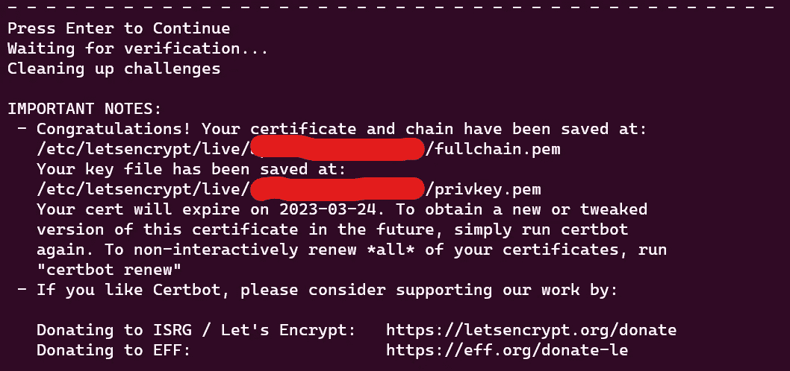

# 使用“让我们加密”生成 SSL 证书

> 原文：<https://levelup.gitconnected.com/generate-ssl-certificate-with-lets-encrypt-a8e26cf0a378>



谁会想到一个名为 *SSL For Free* 的服务会有非常有限的免费层🤷‍♂️…这也让我大吃一惊

在用完我的三个免费的 90 天证书后，我决定改用 Let's Encrypt 来生成我的 SSL 证书，我也会教你如何做



# 1 —您需要一个 Linux 终端

你首先需要的是一个 Linux 终端，如果你已经很好地运行了一个 Linux 操作系统，这对你很有好处。尽管如果你运行的是 Windows，你必须[建立一个 Linux 子系统(WSL)](https://www.youtube.com/watch?v=8Ev1aXl7TGY&list=PL4cUxeGkcC9hxjeEtdHFNYMtCpjNBm3h7&index=2)

# 2 —切换到根用户

您需要的命令需要管理权限，因此需要 root 权限。要切换到 WSL 上的根用户，您可以更改子系统的默认行为，默认使用根用户

记住你的其他用户的用户名，以防你想切换回来

```
ubuntu2004.exe config - default-user root
```

另外，用你运行的 Linux 版本替换“**Ubuntu 2004 . exe”**

**奖励积分🎊**

如果您在使用上面的命令切换到 root 用户后忘记了普通用户的密码，您可以通过运行下面的命令来重置密码

```
passwd <USERNAME>
```

# 3 —安装证书机器人

这个阶段非常简单，你所要做的就是用根用户**运行下面的命令**

```
sudo add-apt-repository ppa:certbot/certbot

sudo apt-get update

sudo apt-get install certbot
```

# 4 —生成您的证书

要生成您的证书，请运行以下命令

```
certbot certonly --manual
```

当提示您输入您的域名时，使用格式**mydopewebsite.com**，然后用[Y]接受任何其他提示

最后，为了得到你的证书，你必须上传一个文件到你的服务器来确认所有权。一旦完成，你的 SSL 证书的路径就会在屏幕上输出



**奖励积分🎊**

如果您正在运行 Node.js，并且您没有权限将文件直接上传到服务器上，(在我的例子中，我使用单实例 AWS Elastic Beanstalk 和 Node.js，该实例没有 SSH keypair)我不确定这是否是处理 acme 挑战的最佳方式，但是我就是这样做的

```
router.get("/.well-known/acme-challenge/<FILE_NAME>", (req, res) => {
    return res.status(200).send("<FILE_CONTENT>");
});
```

让我在评论中得到你的反馈🤞

# 5 —管理您的证书

如果您使用 WSL 并试图从文件资源管理器中打开证书文件，您将得到一个拒绝访问错误。要在终端中查看证书的内容，请运行命令

```
cat <PATH_TO_CERT>
```

在这个阶段，我祝贺您获得 SSL 证书🎊🎊

以下是一些有用命令

```
# List all your certificates
certbot certificates

# Delete a certificate
certbot delete

# Renew your cerificate, that was generated with "--manual"
certbot certonly --manual -d example.com
```

如果您有任何问题或想要合作，请联系我[这里](https://toluolatubosun.com/contact) 🖖