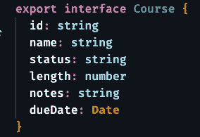
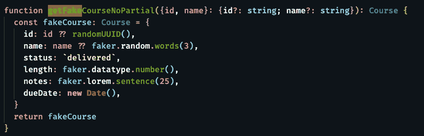
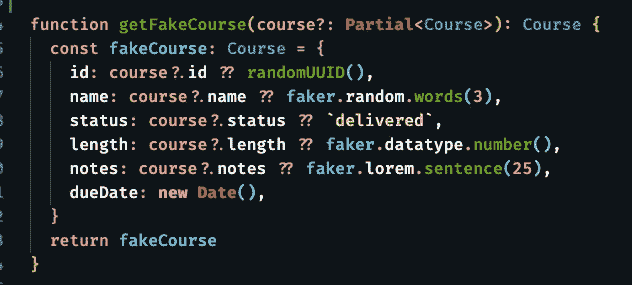

# 生成精确的测试数据

> 原文：<https://levelup.gitconnected.com/generate-surgically-precise-test-data-3e914c46d6b4>

## [JavaScript 和类型脚本测试](https://gentille.us/b3601fb73472?sk=0dc73c81df810c0f181c432c9db3e085)

## 通过让类型脚本测试生成器获取对象的一部分<type>，使它们更加灵活。</type>

在测试中，您经常认为您只需要修改一个标准对象的一个属性，或者最多修改几个属性。让我们使用一个具有这个接口的`Course`对象:

具有少量属性的典型界面

我经常看到程序员预期只改变 id 或名字的代码。创建的测试生成器如下所示:

指定可更改字段的测试生成器

id 和名称是可选的，但是如果它们没有被传递，则使用默认值。所有其他字段都有默认值。这没什么不好；除了生活很少会如你所愿。我的经验告诉我，在某些时候，状态、长度，或者更可能是所有的字段都需要被传递特定的值。一些改变可以使这个生成器更加灵活。

带有部分<course>的测试发生器</course>

通过采用指定部分`Course`的单个参数，我们现在可以修改主体以允许**的任何**属性被改变。如果你不熟悉实用程序类型`[Partial<Type>](https://developer.mozilla.org/en-US/docs/Web/JavaScript/Reference/Operators/Optional_chaining)`，它接受一个类型(又名接口)并使其所有属性可选。现在这个生成器要么不接受任何参数，要么接受任何具有一个或多个`Course`属性的对象。

如果无法读取所需的属性，[可选链接](https://developer.mozilla.org/en-US/docs/Web/JavaScript/Reference/Operators/Optional_chaining)操作符`?`将返回`undefined`。在链接操作符之后加上[零合并操作符](https://developer.mozilla.org/en-US/docs/Web/JavaScript/Reference/Operators/Nullish_coalescing_operator) `??`允许我们在没有提供值时指定我们想要的值。

当没有传递参数时，这与第一个示例的工作方式相同，并且使用所有默认值。但是，当**一个课程的任何**属性被传递时，该属性将被使用。

你可能会觉得你的问号键磨损了，但这将是一次性的花费，而且现在你很可能不会重新访问这个生成器，直到你改变了`Course`接口。

一旦你尝试了这种技术，我不认为你会回去猜测哪些属性可能会改变。我发现自己经常重温和增强测试文件。不必在数据生成器上浪费时间，这让我能够集中精力，提高工作效率。

还有更多 [JavaScript 和类型脚本测试](https://gentille.us/b3601fb73472?sk=0dc73c81df810c0f181c432c9db3e085)技巧文章。

平静地编码。