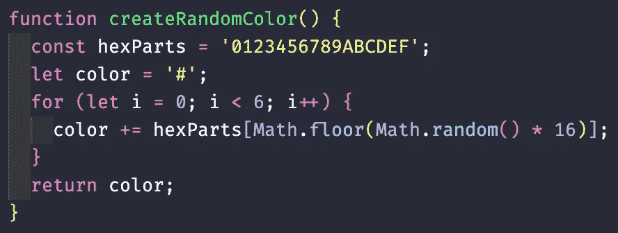

# 在 JavaScript 中生成随机颜色——给你的 dom 增加一点趣味

> 原文：<https://levelup.gitconnected.com/generating-a-random-color-in-javascript-spice-up-your-dom-with-a-bit-of-chance-e8b36061421c>

当了解了 JavaScript 的强大功能及其对 HTML 页面的动态影响后，作为一名初出茅庐的 web 开发人员，首先要做的事情之一就是能够向页面上对用户输入做出反应的元素添加监听器。突然间，一个强大的世界就在您——开发人员——的指尖。我应该让一个元素在鼠标悬停时消失吗？让图像在点击时旋转？或者我应该简单地改变颜色？

如果最后一行是你最感兴趣的，那么这篇博文中就有一个和你一样的人。JavaScript 让我们能够动态地将页面上的元素颜色更改为您最疯狂的设计梦想所能想到的颜色。

例如，假设我们的页面上有一个无序列表(一个`<ul>`元素):

其 HTML 代码如下所示:

在我们连接的 JavaScript 文件中，我们可以在`<ul>`元素上放置一个*事件监听器*，它将监听用户交互(在这个例子中我们使用一个简单的“click ”),然后动态地改变被点击的列表元素`<li>`的颜色，而不改变源 HTML:

当点击列表中的任何犬种(`<li>`元素)时，将会产生以下效果:

很酷，对吧？

但是如果在我们的应用程序中，我们认为仅仅用一种颜色硬编码是不够的呢？如果我们希望每次点击时颜色都是完全随机的呢？有了 JavaScript，(几乎)一切皆有可能！

在前面的代码中，我们分配给目标元素的颜色是一个字符串，它可以是一个名称*的颜色，也可以是一个十六进制代码的颜色。这个字符串可以手工输入，*或*是一个独立函数的返回值。我们将使用这种能力来创建一个全新的函数，该函数创建一个随机的十六进制代码并将其作为字符串返回:*

让我们来分解一下这里正在做的事情的各个部分:

1.  我们正在创建一个名为`hexParts`的变量，并给它分配一个包含数字 0-9 和字母 A 到 f 的字符串。十六进制代码由这些数字和字母的六个字符组合组成，因此这个集合将允许我们通过随机抽取它们来创建几乎任何颜色。
2.  我们创建了一个名为`color`的变量，并给它分配了一个包含英镑符号的字符串。所有的十六进制代码都是这样开始的，我们将在接下来的几行中添加一些代码。
3.  由于十六进制代码包含六个字符，我们将运行一个 *for 循环* 6 次，使用 JavaScript 的`Math.random`特性生成一个从 0 到 15 的数字。这个生成的数字将是我们在循环的那一步中从`hexParts`字符串中提取的字符，并添加到`color`字符串中。
4.  最后，我们显式返回`color`字符串，它将是十六进制代码，如“#5EF42A”、“4572AC”、“CD0C84”或任何其他组成字符的组合。

现在我们可以将这个`createRandomColor`函数添加到我们之前的处理函数中(在我们之前指定了特定颜色的地方),并在每次点击时调用它:

这为我们呈现的 HTML 页面提供了丰富多彩的效果:

瞧啊。触手可及的动态、随机生成的颜色。继续前进，随心所欲地设计你的页面。只是不要让这些新发现的力量冲昏了你的头脑。😁