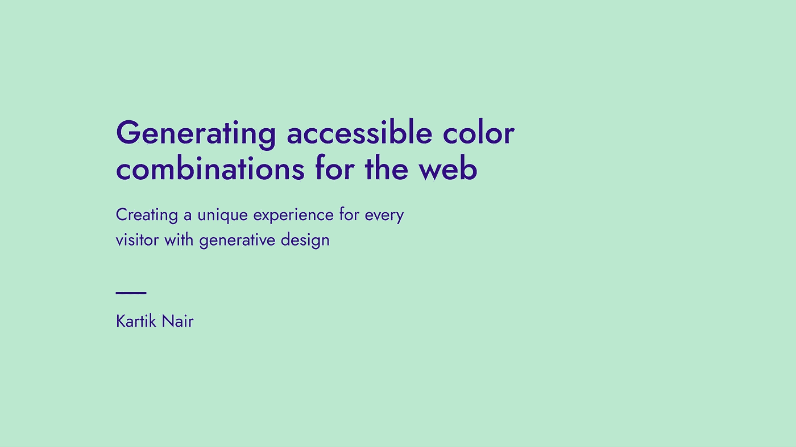
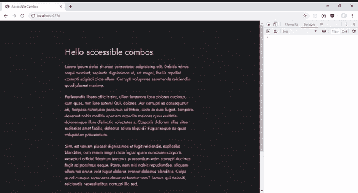
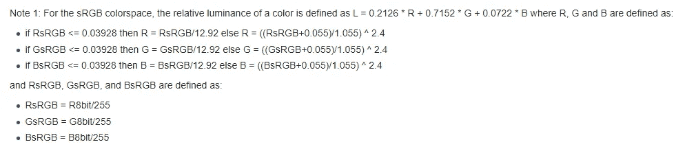

# 为网页生成可访问的颜色组合

> 原文：<https://levelup.gitconnected.com/generating-accessible-color-combinations-for-the-web-911fba08db89>

## 利用创成式设计为每位参观者创造独特的体验

嘿大家好！这将是一个简短的帖子，但是我想向你展示在客户端为你的网站随机生成配色方案是多么容易。对于用户来说，这是一个非常有趣的体验，但我认为这对大多数网站来说没有意义，因为大多数企业(甚至个人)都希望坚持更标准的配色方案，这样他们就可以与他们的品牌身份保持一致。然而，如果你发现这些可访问的组合很酷，请与我分享，我很乐意看到！

现在让我们来看看实际的代码。有几种方法可以做到这一点，我最近发现了一个名为 colors2k 的小(不到 2kb) npm 包，它提供了这一功能，但我也想向您展示只使用普通的 JS 也可以做到这一点，所以让我们先从最简单的方法开始。对于所有这些例子，我使用的是一个普通的 HTML 页面，它是用[包](https://parceljs.org/)捆绑的，并且还引入了一个修改版的 [grotesk](https://grotesk.now.sh) 来进行基本的样式设计。

# 设置

对于那些不熟悉的人，这是创建新地块项目的方法。其他想直接跳到组合生成的人[点击这里](https://gist.github.com/kartiknair/b3359ee9c54aab81bd3bccbd592077fa#generating-the-combos):

让我们创建一个`src`目录，并添加我们的 HTML 和 JavaScript 文件。我使用的只是普通的 HTML 样板文件，你可能已经看过无数次了:

然后向您的`package.json`添加以下脚本:

# 生成组合

太好了，我们都准备好了。现在我们可以实际安装我告诉你的软件包了:

现在让我们将它导入到我们的 JS 文件中，并使用它的对比度函数:

如你所见，这很酷。但是在十六进制提供的 1600 多万种颜色中循环是非常不必要的，而且看起来也不那么好。相反，一个更好的主意是找到一个看起来不错的颜色列表，并在列表中找到可访问的组合。这就是我所做的，经过一番搜索，我发现了两个很好的选项[cloud flare designs color pallete](https://cloudflare.design/colors)和颜色命名项目中的 [best。这两个列表都仍然很大，但 cloudflare 列表要小得多，所以我将选择它，但正如您所看到的，那里有更多的选项。](https://unpkg.com/color-name-list@5.23.0/dist/colornames.bestof.json)

我创建了一个`colors.js`文件，并从那里导出了颜色 json。因此，现在在我的索引文件中，我可以遍历它们中的每一个，以获得一个有效的组合(我所说的有效是指根据 WCAG 标准可以访问的组合，因此对比度大于 7.1)。一旦我得到一个有效的组合，我就用这些颜色创建一个样式元素，并把它附加到文档的头部:

很简单，对吧？结果看起来非常令人愉快:

# 学习如何自己去做

虽然使用一个库很棒(尤其是一个制作精良的库),但我们理解它是如何工作的也很重要。所以我决定我们可以自己学习如何做这件事。获得对比度的推荐方法是用较浅颜色的**相对亮度**除以较深颜色的相对亮度。你问什么是相对亮度？嗯，这是一种颜色的相对亮度——基本上是指如果图像是黑白的，它与黑色有多接近(0 表示纯白，一点也不接近，1 表示纯黑)。

那我们怎么计算呢？谢天谢地，WCAG 对此也有指导方针。要实现这个公式，你必须要有 RGB 格式的颜色，所以我们也需要实现十六进制→ RGB 转换。

这非常容易实现，因为我们只需要将字符串分成 2 个组，然后使用内置的`parseInt`函数转换它们的基数:

不错！这很简单。现在让我们用 WCAG 给出的公式来实现相对亮度公式。这是他们网站上的公式:

所以画出来会是这样的。从我们的 RGB 数组中取出每个值，除以 255，然后根据其大小，执行给出的两个公式之一。一旦我们有了每个通道的 3 个值，我们将做顶部给出的最终公式来得到我们的亮度。听起来不错？我们来编码一下:

我们已经非常接近结果了。我们所要做的就是实现最后的公式，比较两种颜色的亮度。具体来说，我们必须检查哪个是打火机，在这个公式中必须是 L1:`(L1 + 0.05) / (L2 + 0.05)`。让我们来实现它:

就这样，我们成功了！下面是我们的普通实现的完整代码，其执行方式与使用`colors2k`库完全相同:

酷，这就是这篇文章的内容。我希望你会发现这个小片段很有用，并用它做一些很酷的东西。你可以在[https://accessible-combos . now . sh](https://accessible-combos.now.sh)现场观看，或者在【https://github.com/kartiknair/accessible-combos】查看代码。感谢阅读，如果你想打招呼，请在推特上联系我，我是 [@kartikajitnair](https://twitter.com/kartikajitnair/) 。注意安全，✌.

*原载于*[*https://kartikn.me/writing/accessible-combos*](https://kartikn.me/writing/accessible-combos)*。*