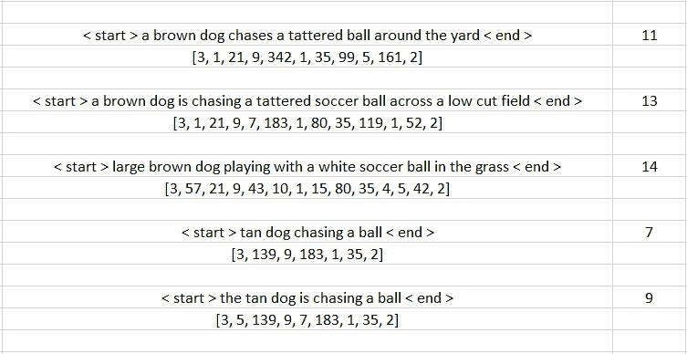

# 使用神经网络为图像生成字幕

> 原文：<https://levelup.gitconnected.com/generating-captions-for-images-using-neural-networks-2b0ecf657335>

我们都知道，在执行某些任务时，神经网络可以在复制人脑方面做很多事情。神经网络在计算机视觉和自然语言生成方面的应用确实令人瞩目。

本文将向读者介绍神经网络的一个这样的应用，并让读者了解我们如何使用 CNN 和 RNNs (LSTM)的混合网络来实际生成图像的标题(描述)。我们在这个任务中使用的数据集是流行的 *flickr 8k 图像数据集*，它是这个任务的基准数据，可以通过下面的链接*访问。*

https://www.kaggle.com/adityajn105/flickr8k

> 注意:我们将把数据集分成 7k 用于训练，1k 用于测试。

我们将首先讨论混合神经网络中的不同组件(层)及其功能。除此之外，我们还将看看使用 Tensorflow、Keras 和 Python 开发混合神经网络的实际实现。

# **神经网络的整体架构**

让我们看看我们将用于生成字幕的神经网络的整体架构。


神经网络架构(来源:谷歌图片)

简而言之，上述神经网络有 3 个主要组件(子网络)，每个组件都分配有一个特定的任务，即卷积网络(用于从图像中提取特征)、RNN (LSTM)(用于文本生成)和解码器(用于组合两个网络)。

现在让我们详细讨论每个组件并了解它们的工作原理。

# **图像特征提取器**

为了从图像中生成特征，我们将使用卷积神经网络，只需稍加修改。让我们看一个用于图像识别的 ConvNet。


CNN 架构(来源:Bing 图片)

如你所见，我们的 CNN 有两个子网络—

1.  **特征学习网络** —负责从图像生成特征图的网络(多重卷积&汇集层的网络)。
2.  **分类网络** —负责图像分类的全连接深度神经网络(多个密集层和单个输出层的网络)。

因为我们只对从图像中提取特征感兴趣，而不是对它们的分类感兴趣，所以我们只对 CNN 的特征学习部分感兴趣，这就是我们如何从图像中提取特征。

以下代码可用于从任何一组图像中提取特征-

设计自己的图像特征提取器

是的，任何人都可以使用上面的代码构建自己的图像特征提取器，但是有一个问题…

上面的模型太简单了，无法从我们的图像集中提取每个重要的细节，因此会影响我们整体模型的性能。此外，由于高性能 GPU 和系统的不可用性，使模型过于复杂(具有大量神经元的多个密集层)也具有挑战性。

为了解决这个问题，我们有非常流行的预训练 CNN 模型(VGG-16，ResNet50 等。由来自不同大学和组织的科学家开发)在 Tensorflow 中可用，并可用于从图像中提取特征。**在使用输出图层进行特征提取之前，请记住将其从模型中移除。**

以下代码将让您了解如何在 Tensorflow 中使用这些预训练的模型从图像中提取特征。

利用 ResNet50 模型进行图像特征提取

正如您在下面看到的，如果您执行上面的代码，您将会看到我们的图像特征只不过是 shape 的 numpy 数组— (18432，)

```
image_feature_dictionary[list(image_feature_dictionary. Keys())[0]].shape(18432,)
```

接下来，我们将开发我们的 LSTM 网络(RNN)为图像生成字幕。

# 用于生成字幕的 LSTM

文本生成是 LSTM 网络最流行的应用之一。LSTM 单元(LSTM 网络的基本构件)具有基于先前层的输出生成输出的能力，即它保留先前层的输出(存储器)并使用该存储器来生成(预测)序列中的下一个输出。

对于我们的数据集，每个图像有 5 个标题，即总共 40k 个标题。

让我们看看我们的数据集-


来自 Flickr8k 数据集的图像

**图像标题**

1.  一个穿着粉色连衣裙的孩子正在入口处爬上一组楼梯。
2.  ***一个女孩走进一栋木屋。***
3.  ***一个小女孩爬进一个木制玩具屋。***
4.  ***一个小女孩爬楼梯去她的玩具屋。***
5.  一个穿着粉红色连衣裙的小女孩走进一间木屋。

正如所见，所有的标题都很好地描述了这幅图像。我们现在的任务是设计一个 RNN，它可以对任何类似的图像集重复这项任务。

回到最初的任务，我们首先要看看 LSTM 网络是如何生成文本的。对于 LSTM 网络来说，字幕不过是一长串单独的单词(编码为数字)放在一起。利用这些信息，它试图根据前面的单词(记忆)来预测序列中的下一个单词。

在我们的例子中，由于标题可以有不同的长度，我们首先需要指定每个标题的开始和结束。让我们看看这到底意味着什么-


准备训练数据集

首先，我们将为数据集中的每个标题添加<start>和<end>。之后，在创建最终词汇之前，我们将对训练数据集中的每个标题进行标记。为了训练我们的模型，我们将从我们的词汇表中删除频率小于或等于 10 的 tokes(单词)。添加这一步是为了提高我们模型的一般性能，并防止它过度适应训练数据集。</end></start>

以下代码可用于实现这一点-

加载标题的代码

上述代码将生成以下输出—

```
train_image_captions[list(train_image_captions. Keys())[150]] ['<start> A brown dog chases a tattered ball around the yard . <end>',
 '<start> A brown dog is chasing a tattered soccer ball across a low cut field . <end>',
 '<start> Large brown dog playing with a white soccer ball in the grass . <end>',
 '<start> Tan dog chasing a ball . <end>',
 '<start> The tan dog is chasing a ball . <end>']
```

一旦我们加载了标题，我们将首先使用 spacy 和 Tokenizer(来自*tensor flow . preprocessing . text*类)对所有内容进行标记。

记号化就是把一个句子分解成不同的单词，同时去掉特殊字符，所有的都小写。结果是，我们在句子中有了一个有意义的单词(标记)的语料库，在将它用作我们的模型的输入之前，我们可以进一步对其进行编码。

用于标记字幕的代码

上面的代码将生成一个字典，其中每个标记都被编码为一个整数，反之亦然。示例输出如下所示—

```
tokenizer.word_index {'a': 1,
 'end': 2,
 'start': 3,
 'in': 4,
 'the': 5,
 'on': 6,
 'is': 7,
 'and': 8,
 'dog': 9,
 'with': 10,
 'man': 11,
 'of': 12,
 'two': 13,
 'black': 14,
 'white': 15,
 'boy': 16,
 'woman': 17,
 'girl': 18,
 'wearing': 19,
 'are': 20,
 'brown': 21.....}
```

在这之后，我们需要找到我们的词汇的**长度和最长字幕的长度。让我们来看看这两个度量在创建我们的模型中的重要性。**

1.  **词汇长度** →词汇长度基本上就是我们语料库中唯一词的计数。此外，我们输出层中的神经元将等于**词汇长度+ 1** *(+ 1 是由于填充序列而产生的额外空白)*因为在每次迭代中，我们需要我们的模型从我们的单词语料库中生成一个新单词。
2.  **最大字幕长度** →因为在我们的数据集中，即使是同一张图像，我们也有不同长度的字幕。让我们试着更详细地理解这一点



字幕序列长度

正如你所看到的，每个标题都有不同的长度，因此我们不能将它们作为 LSTM 模型的输入。为了解决这个问题，我们将每个标题填充到最大标题长度。


填充序列

请注意，每个序列都有一组额外的 0，以将其长度增加到最大序列长度。

查找词汇和最大字幕长度

接下来，我们需要为我们的模型创建训练数据集，指定输入和输出。对于我们的问题，我们有 2 个输入和 1 个输出。让我们看得更详细一点，以便理解-


训练数据集

对于我们拥有的每一幅图像-

1.  **输入图像特征(X1)** →使用 ResNet50 模型提取的 Numpy 形状数组(18432，)
2.  **输入序列(X2)** →这需要更多的解释。每个标题只是一个序列列表，我们的模型试图预测序列中的下一个最佳元素。因此，对于每个标题，我们将首先从序列中的第一个元素开始，该元素的相应输出将是下一个元素。在下一次迭代中，前一次迭代的输出将与前一次迭代的输入(内存)一起成为新的输入，这一直持续到我们到达序列的末尾。
3.  **输出(y)** →序列中的下一个单词。

以下代码可用于实现上述创建训练数据集的逻辑-

用于创建训练数据集的代码

# **合并两个子网络**

现在我们已经开发了两个子网络(图像特征提取器和用于生成字幕的 LSTM)，让我们结合这两个来创建我们的最终模型。


最终模型架构

对于任何新的图像(必须与训练中使用的图像相似)，我们的模型将根据它在训练相似的图像和标题集时获得的知识来生成标题。

> 注意:为了获得良好的结果，测试图像应该与培训期间使用的图像相似。

下面的代码创建了我们的最终模型

在编译模型之前，我们需要给我们的嵌入层添加权重。这是通过为我们的语料库(词汇表)中存在的每个标记创建单词嵌入(标记在高维向量空间中的表示)来完成的。有一些非常流行的单词嵌入模型可用于此目的(GloVe、Gensim 单词嵌入模型等。).

我们将使用 Spacy 内置的“en_core_web_lg”模型来创建令牌的向量表示(即，每个令牌将表示为一个(300，)numpy 数组)。

以下代码可用于创建单词嵌入，并将其添加到我们的模型嵌入层。

创建单词嵌入并添加到嵌入层

现在我们已经创建了所有的东西，我们只需要编译和训练我们的模型。

> **注意:由于我们任务的复杂性**，这个网络的训练时间将会非常长(具有大量的历元)

培训模式

为了生成新的标题，我们首先需要将图像转换为与训练数据集(18432)的图像具有相同维数的 numpy 数组，并使用<start>作为模型的输入。</start>

在序列生成过程中，我们会在输出中一遇到<end>就终止进程。</end>

用于生成字幕的方法

现在让我们检查模型的输出


正如你所看到的，我们的模型为一些图片生成了足够好的标题，但是对于一些图片来说，这些标题并不具有解释性。

这可以通过增加纪元、训练数据、向我们的最终模型添加层来改善，但所有这些都需要高端机器(GPU)来处理。

这就是我们如何使用自己的深度学习模型为图像生成标题。