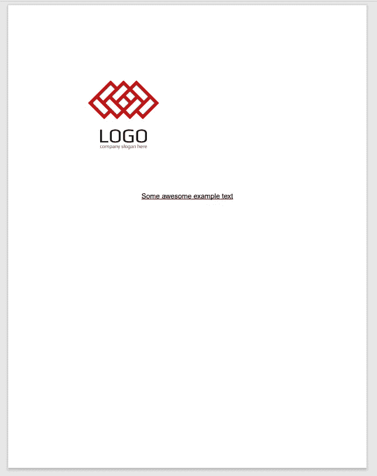
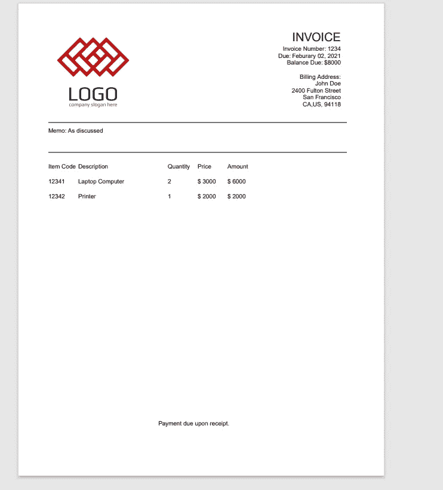

# 在 Nodejs 中生成 PDF

> 原文：<https://levelup.gitconnected.com/generating-pdf-in-nodejs-201e8d9fa3d8>


PDF 格式是传输静态信息最常用的文件格式之一。对于企业来说，能够将文档或数据导出为真正格式良好的 PDF 文件(无论是发票还是报告)是一个非常普遍的要求。

## 调查各种选择

从 Nodejs 创建 PDF 文件有两种主要方法。第一种方法是使用 pdf 生成库，它使用直接的 JavaScript/Nodejs，一切都是无模板的；另一种方法是使用 HTML 之类的语言中的模板，然后从中生成 PDF。

我通常更喜欢使用基于 HTML 的模板来创建 pdf 文件，因为这可能允许营销或业务用户进行一些必要的更改，而不一定需要更改代码。基本上，我下载现有的模板，销售或营销人员为我提供更新。我检查了文件，然后我们走了！

我们将同时讨论这两种方法，因为有时候我更喜欢写很多代码来实现它。在本帖中，我们将介绍如何使用 JavaScript 库生成 pdf。

## 使用 PDF 库

PDFKit 是一个库，我已经使用过几次，用于生成非常简单的发票，模板并不用于这些发票。在现有项目中使用 PDFKit 相当容易。

从命令行/终端我们需要添加它是一个依赖

```
npm i pdfkit
```

之后，我们可以通过简单地要求它，在我们的项目中将它作为一个模块使用。

```
const pdfGenerator = require('pdfkit')
```

之后，我们可以开始简单地将其与核心文件系统(俗称 fs)一起使用。然后，我们需要实例化库，然后通过管道将其传输到可写流。

```
const PDFGenerator = require('pdfkit')
const fs = require('fs')

// instantiate the library
let theOutput = new PDFGenerator 

// pipe to a writable stream which would save the result into the same directory
theOutput.pipe(fs.createWriteStream('TestDocument.pdf'))

// write out file
theOutput.end()
```

在这一点上，我们将有一个真正无用的 pdf 文件，不包含任何东西。它看起来就像这样:


我们可以像这样使用 text 方法添加文本:

```
const PDFGenerator = require('pdfkit')
const fs = require('fs')

// instantiate the library
let theOutput = new PDFGenerator 

// pipe to a writable stream which would save the result into the same directory
theOutput.pipe(fs.createWriteStream('TestDocument.pdf'))

**theOutput.text('Some awesome example text')**

// write out file
theOutput.end()
```

之后，我们会得到一个看起来像这样的 pdf:


再说一次，这仍然是相当乏味的。我们需要写更多的代码来格式化它。

text 方法实际上在字符串后面接受了一个可选的选项属性，它允许我们做诸如加粗、下划线、倾斜(“斜体”)或删除之类的事情。

```
const PDFGenerator = require('pdfkit')
const fs = require('fs')

// instantiate the library
let theOutput = new PDFGenerator 

// pipe to a writable stream which would save the result into the same directory
theOutput.pipe(fs.createWriteStream('TestDocument.pdf'))

theOutput.text('Some awesome example text', { bold: true,
    underline: true })

// write out file
theOutput.end()
```

这将生成如下所示的文档:


如果我们想将文本居中对齐，我们也可以进行定位。:) )先从居中对齐开始。

```
const PDFGenerator = require('pdfkit')
const fs = require('fs')

// instantiate the library
let theOutput = new PDFGenerator 

// pipe to a writable stream which would save the result into the same directory
theOutput.pipe(fs.createWriteStream('TestDocument.pdf'))

theOutput.text('Some awesome example text', { bold: true,
    underline: true,
    align: 'center'
})

// write out file
theOutput.end()
```


我们甚至可以使用 image 方法添加图像。当我们设置它的时候，我们应该设置“适合”的大小，这样我们就不会占用整个页面。这很容易做到:

```
const PDFGenerator = require('pdfkit')
const fs = require('fs')

// instantiate the library
let theOutput = new PDFGenerator 

// pipe to a writable stream which would save the result into the same directory
theOutput.pipe(fs.createWriteStream('TestDocument.pdf'))

// add in a local image and set it to be 250px by 250px
theOutput.image('./door-company-logo.jpg', { fit: [250,250] })

theOutput.text('Some awesome example text', { bold: true,
    underline: true,
    align: 'center'
})

// write out file
theOutput.end()
```

这将生成如下所示的 PDF 文档



你现在可能会说，好吧，布莱恩，这很酷，但让我们做一些我们实际上可能在工作中做的事情！

## 使用 PDFKit 生成 PDF 的实例

通过代码生成 PDF 的完美用例是类似发票的东西，其中您需要有很多控制，并且想要做一些真正具体的事情。

假设企业需要从我们令人敬畏的 Nodejs 系统生成一个基于 pdf 的发票。我们发票的示例数据如下所示:

```
const invoiceData = {
    addresses: {
        shipping: {
            name: 'John Doe',
            address: '2400 Fulton Street',
            city: 'San Francisco',
            state: 'CA',
            country: 'US',
            postalCode: 94118
        },
        billing: {
            name: 'John Doe',
            address: '2400 Fulton Street',
            city: 'San Francisco',
            state: 'CA',
            country: 'US',
            postalCode: 94118
        }
    },
    memo: 'As discussed',
    items: [{
            itemCode: 12341,
            description: 'Laptop Computer',
            quantity: 2,
            price: 3000,
            amount: 6000
    }, {
            itemCode: 12342,
            description: 'Printer',
            quantity: 1,
            price: 2000,
            amount: 2000
        }
    ],
    subtotal: 8000,
    paid: 0,
    invoiceNumber: 1234,
    dueDate: 'Feburary 02, 2021'
}
```

如您所见，这是一个相对简单的数据模型，用于循环创建文档。

为了鼓励可重用性，我们应该将我们的逻辑移到一个新的模块中，我方便地称之为“InvoiceGenerator”。这使得我们的索引文件非常简单:

```
'use strict'

const InvoiceGenerator = require('./InvoiceGenerator')

const invoiceData = {
    addresses: {
        shipping: {
            name: 'John Doe',
            address: '2400 Fulton Street',
            city: 'San Francisco',
            state: 'CA',
            country: 'US',
            postalCode: 94118
        },
        billing: {
            name: 'John Doe',
            address: '2400 Fulton Street',
            city: 'San Francisco',
            state: 'CA',
            country: 'US',
            postalCode: 94118
        }
    },
    memo: 'As discussed',
    items: [{
            itemCode: 12341,
            description: 'Laptop Computer',
            quantity: 2,
            price: 3000,
            amount: 6000
    }, {
            itemCode: 12342,
            description: 'Printer',
            quantity: 1,
            price: 2000,
            amount: 2000
        }
    ],
    subtotal: 8000,
    paid: 0,
    invoiceNumber: 1234,
    dueDate: 'Feburary 02, 2021'
}

const ig = new InvoiceGenerator(invoiceData)
ig.generate()
```

我们只需要我们的新 InvoiceGenerator 模块，它基本上完成了所有的工作。

我们的 InvoiceGenerator 模块被分成了几个方法，看起来像这样:

```
const PDFGenerator = require('pdfkit')
const fs = require('fs')

class InvoiceGenerator {
    constructor(invoice) {
        this.invoice = invoice
    }

    generateHeaders(doc) {
        // TO DO create a pretty header...
    }

    generateTable(doc) {
        // TODO: loop through and create a new row for each item
    }

    generateFooter(doc) {
        // TODO
    }

    generate() {
        let theOutput = new PDFGenerator 

        // TODO

        // write out file
        theOutput.end()
    }
}

module.exports = InvoiceGenerator
```

如你所见，这开始变得越来越大。完成后的文件将如下所示:

```
const PDFGenerator = require('pdfkit')
const fs = require('fs')

class InvoiceGenerator {
    constructor(invoice) {
        this.invoice = invoice
    }

    generateHeaders(doc) {
        const billingAddress = this.invoice.addresses.billing

        doc
            .image('./door-company-logo.jpg', 0, 0, { width: 250})
            .fillColor('#000')
            .fontSize(20)
            .text('INVOICE', 275, 50, {align: 'right'})
            .fontSize(10)
            .text(`Invoice Number: ${this.invoice.invoiceNumber}`, {align: 'right'})
            .text(`Due: ${this.invoice.dueDate}`, {align: 'right'})
            .text(`Balance Due: $${this.invoice.subtotal - this.invoice.paid}`, {align: 'right'})
            .moveDown()
            .text(`Billing Address:\n ${billingAddress.name}\n${billingAddress.address}\n${billingAddress.city}\n${billingAddress.state},${billingAddress.country}, ${billingAddress.postalCode}`, {align: 'right'})

        const beginningOfPage = 50
        const endOfPage = 550

        doc.moveTo(beginningOfPage,200)
            .lineTo(endOfPage,200)
            .stroke()

        doc.text(`Memo: ${this.invoice.memo || 'N/A'}`, 50, 210)

        doc.moveTo(beginningOfPage,250)
            .lineTo(endOfPage,250)
            .stroke()

    }

    generateTable(doc) {
        const tableTop = 270
        const itemCodeX = 50
        const descriptionX = 100
        const quantityX = 250
        const priceX = 300
        const amountX = 350

        doc
            .fontSize(10)
            .text('Item Code', itemCodeX, tableTop, {bold: true})
            .text('Description', descriptionX, tableTop)
            .text('Quantity', quantityX, tableTop)
            .text('Price', priceX, tableTop)
            .text('Amount', amountX, tableTop)

        const items = this.invoice.items
        let i = 0

        for (i = 0; i < items.length; i++) {
            const item = items[i]
            const y = tableTop + 25 + (i * 25)

            doc
                .fontSize(10)
                .text(item.itemCode, itemCodeX, y)
                .text(item.description, descriptionX, y)
                .text(item.quantity, quantityX, y)
                .text(`$ ${item.price}`, priceX, y)
                .text(`$ ${item.amount}`, amountX, y)
        }
    }

    generateFooter(doc) {
        doc
            .fontSize(10)
            .text(`Payment due upon receipt. `, 50, 700, {
                align: 'center'
            })
    }

    generate() {
        let theOutput = new PDFGenerator 

        console.log(this.invoice)

        const fileName = `Invoice ${this.invoice.invoiceNumber}.pdf`

        // pipe to a writable stream which would save the result into the same directory
        theOutput.pipe(fs.createWriteStream(fileName))

        this.generateHeaders(theOutput)

        theOutput.moveDown()

        this.generateTable(theOutput)

        this.generateFooter(theOutput)

        // write out file
        theOutput.end()

    }
}

module.exports = InvoiceGenerator
```

这将生成如下所示的发票:



通过代码进行格式化是相当复杂的，因为你需要记住很多数字。HTML 是现成的，因为它是标记语言。