# 从连续函数生成样本数据

> 原文：<https://levelup.gitconnected.com/generating-random-data-from-continuous-functions-f0d7e9a909df>

了解机器学习的一种方法是简单地摆弄一些模型。像 [scikit-learn](https://scikit-learn.org/stable/index.html) 这样的库包含了大量的预建模型，您可以在几行代码内实例化、拟合并开始预测这些模型。在将这些模型的参数和属性应用到您试图解决的问题之前，与它们一起嬉戏是一种让您接触代码的好方法。

从预定的函数中生成随机数据为您提供了一种以结构化的方式试验模型的方法。例如，您可以从对数函数生成数据，以观察决策树回归器的参数变化如何影响其拟合优度。您还可以在数据中加入一些噪声，以模糊模型试图逼近的基本函数。这篇文章将带你了解如何为一系列连续函数快速生成数据+噪声，这样你就可以尽快开始玩了🚀️.

# 二次函数

我们需要启动并运行以下两个库:NumPy 和 Matplotlib。编写一个方法，将您想要生成的数据点数量作为输入，并根据某个函数返回虚拟数据的 *(x，y)*-坐标。我们的方法将由三部分组成:x 平面坐标，一些噪声 *e* ，以及函数定义。在下面的要点中， *x* 由 0 和 1 之间均匀分布的 *n* 个随机值组成(默认情况下，高低范围为 0 和 1.0，更多信息参见[文档](https://docs.scipy.org/doc/numpy-1.15.0/reference/generated/numpy.random.uniform.html))。

通过从平均值为 0、标准偏差为 0.1 的正态分布中采样 *n* 个数据点，加入一些噪声。您可以通过调整 *e* 抽取的样本的标准偏差来增加或减少噪音量。增加标准偏差会产生更多噪声。最后，选择您选择的功能，并添加您选择的噪声水平。下面的每个要点都附有一个有噪声和无噪声的二次函数的散点图，这样你就可以辨别潜在函数的真实形状。

## y = x + x + 1

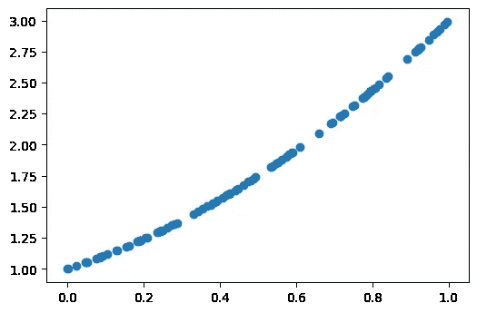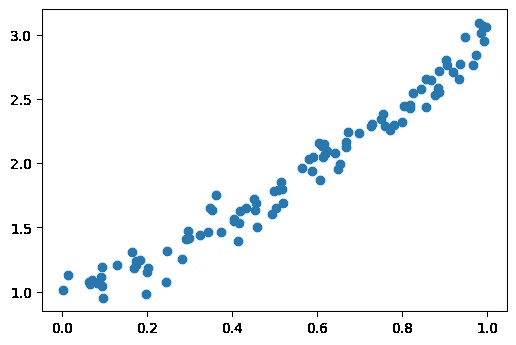

左:y = x + x + 1 |右:y = x + x + 1 +噪波

## y = -x - x - 1

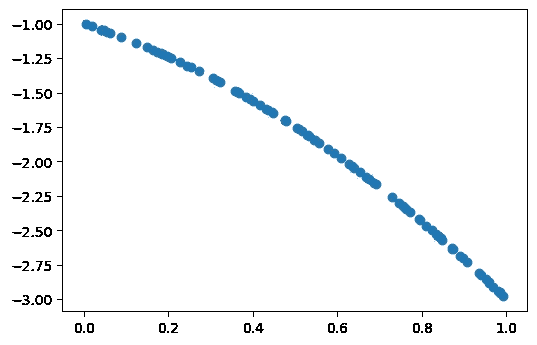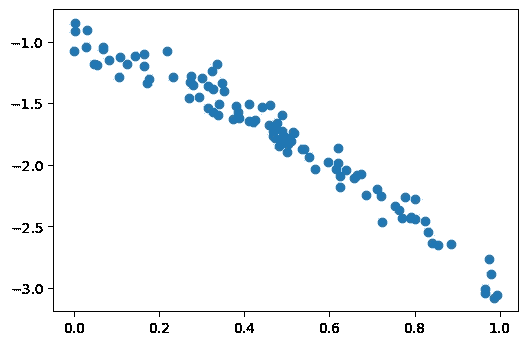

左:-x - x - 1 |右:-x - x - 1 +噪音

## y = x - x - 2

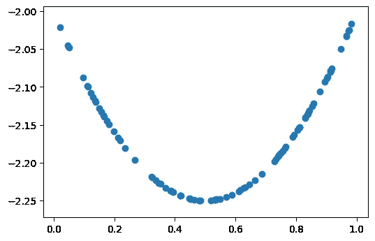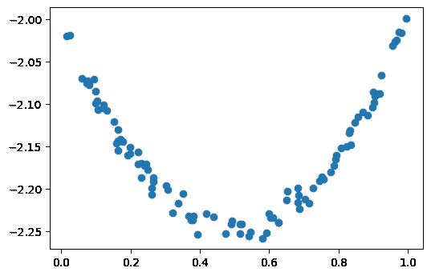

左:y = x - x - 2 |右:y = x - x - 2 +噪音

## y = -x + x + 2

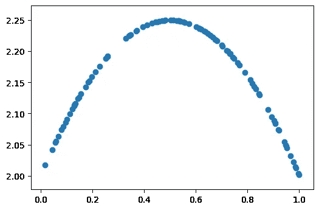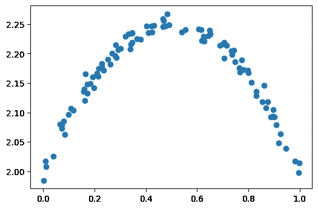

左:y = -x + x + 2 |右:y = -x + x + 2 +噪声

# 三角函数

为三角函数生成数据的过程没有太大的不同。生成您的*x*-值、*y*-值，并添加一些噪声。

## 正弦函数

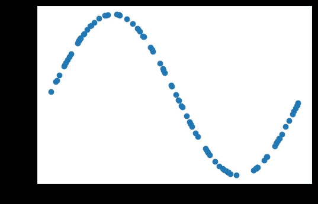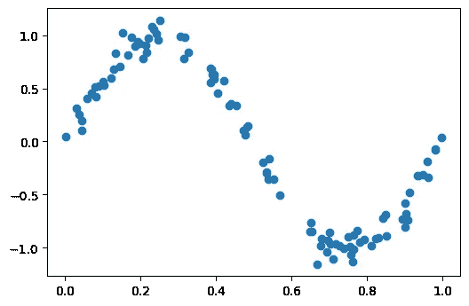

左:正弦(2 *π* x) |右:正弦(2 *π* x) +噪声

## 余弦函数

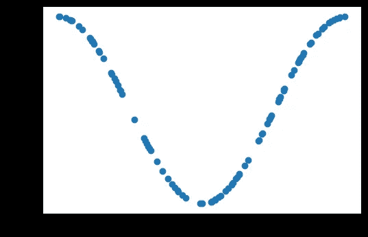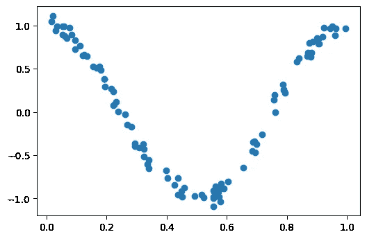

左:余弦(2 *π* x) |右:余弦(2 *π* x) +噪声

## 反正切函数

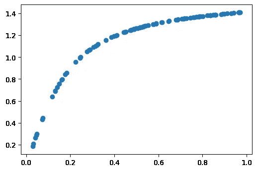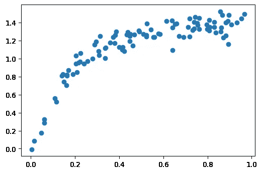

左:arctan(2 *π* x) |右:arctan(2 *π* x) +噪声

# 指数和对数函数

## 指数函数

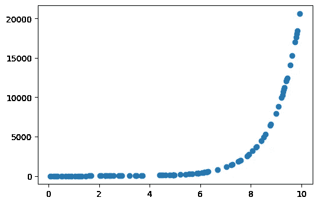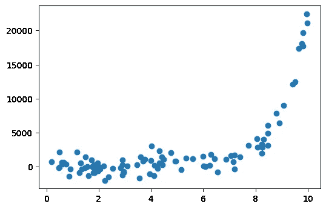

左:eˣ |右:eˣ +噪音

## 对数函数

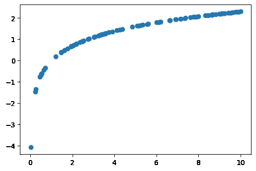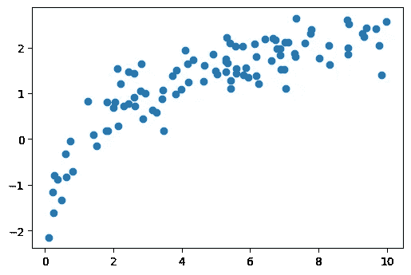

左:logₑ(x) |右:logₑ(x) +噪音

你可以在这里找到这篇文章[中提供的所有代码。](https://github.com/christam96/Generate-Random-Data)

厉害！现在您已经有了模拟数据，可以开始玩了🤸‍♂️