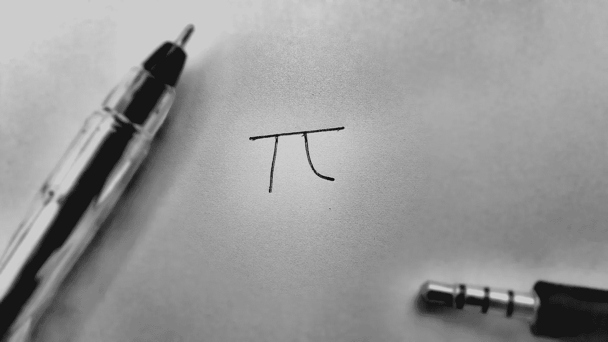
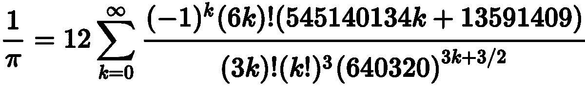

# 将圆周率的值生成到指定的小数位数

> 原文：<https://levelup.gitconnected.com/generating-the-value-of-pi-to-a-known-number-of-decimals-places-in-python-e93986bb474d>



乔舒亚·萨拉科的照片

**用 python 代码编写 Chudnovsky 算法的分步方法**

本文将解释如何使用 python 中的 Chudnovsky 算法编写一个将π的值生成到指定小数位数的算法。

> 丘德诺夫斯基算法由[丘德诺夫斯基兄弟](https://en.wikipedia.org/wiki/Chudnovsky_brothers)于 1988 年发表，作为一种基于 Ramanujan 的π公式计算π的数字的快速方法。

[**这里的**](https://pi-gen.streamlit.app/) 是一个 web 应用程序，它根据您指定的小数位数生成π，并且基于这篇文章的代码。

点击 [**此处**](https://en.wikipedia.org/wiki/Chudnovsky_algorithm) 了解更多关于 Chudnovsky 算法的信息，因为本文将直接将该算法翻译成 python 代码。



Chudnovsky 算法的公式

# 导入库

导入所需的库，以便能够编写算法。Decimal 将需要执行大数的运算并获得任何数学运算的高精度十进制值，math 将需要执行高级数学函数。

```
import decimal
import math
```

Python 有一个默认的 pi 值，我们可以用下面的代码显示它

```
print(math.pi)
>>> 3.141592653589793
```

π值的最大默认值为 15 位小数。

# 用 python 代码编写 Chudnovsky 算法

Chudnovsky 算法可以用如下代码编写:

使用以下代码参考功能，并在提示时输入小数位数

```
n = int(input("Please type number: "))
print(compute_pi(n))
```

# 将生成的数字保存到本地机器上的文本文件中

在当前目录下创建一个文本文件，并使用以下代码保存生成的π数字；

```
with open("pi_digits.txt"**,** mode='w') as file:
    file.write('Pi digits to ' + str(n) +' decimal place is:'\
    +'\n' + compute(n))
```

在机器中找到***pi _ digits . txt***文件，查看保存的文件。

# 执行时间

应该注意的是，由于不同系统的规格不同，这些代码的执行时间也不同。与低级编程语言相比，高级编程语言也较慢。

本程序使用了大约 36.4 s 的**来生成我机上的*10000 位十进制数的π。***

***输出:***

```
***Pi digits to 10000 decimal place is: 
3.14159265358979323846264338327950288419716939937510582097494459230781640628620899862803482534...........................................................................................................................944070469120914093870012645600162374288021092764579310657922955249887275846101264836999892256959688159205600101655256375678***
```

***这个程序可以用来生成尽可能多的π的十进制数。***