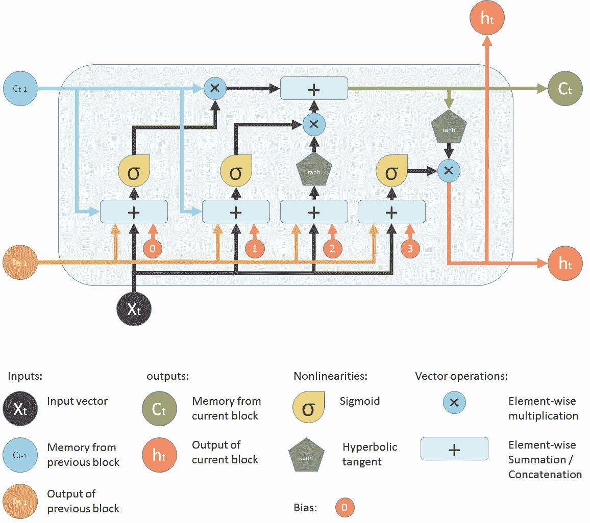

# 使用 LSTMs 生成 YouTube 视频标题

> 原文：<https://levelup.gitconnected.com/generating-youtube-titles-using-lstms-19baa1948088>


文本生成是一种语言建模问题，并且是包括文本摘要、语音到文本和会话系统在内的许多自然语言处理任务的核心问题。语言模型可以使用序列中先前出现的单词作为上下文来学习单词出现的可能性。在本文中，我将使用 YouTube 趋势视频数据集来训练一个使用递归神经网络的文本生成语言模型，该模型将用于生成 YouTube 视频标题。

## **生成 N 元符号序列**

语言建模需要输入数据作为一系列标记。数据清理和转换后的第一步是生成一系列 n 元语法标记。n 元语法是来自文本或语音语料库的给定样本的 n 个项目的相邻序列。这些项目可以是单词、音节、音素、字母或碱基对。在这种情况下，n-grams 是来自 YouTube 标题语料库的单词序列。标记化是从语料库中提取标记的过程。

```
tokenizer = Tokenizer()def get_sequence_of_tokens(corpus):
  #get tokens
  tokenizer.fit_on_texts(corpus)
  total_words = len(tokenizer.word_index) + 1

  #convert to sequence of tokens
  input_sequences = []
  for line in corpus:
  token_list = tokenizer.texts_to_sequences([line])[0]
  for i in range(1, len(token_list)):
  n_gram_sequence = token_list[:i+1]
  input_sequences.append(n_gram_sequence)

  return input_sequences, total_wordsinp_sequences, total_words = get_sequence_of_tokens(corpus)
```

从输出来看，标记[1，88]，[1，88，4064]，[1，88，4064，70]等表示从输入数据生成的 n 元短语。输出中的每个整数对应于文本词汇中的一个特定单词。例如

> 标题:我们想谈谈婚姻
> 
> (N 元语法:代币)
> 
> 我们想要:[1，88]
> 
> 我们想:[1，88，4064]
> 
> 我们想谈谈:[1，88，4064，70]
> 
> 我们想谈谈:[1，88，4064，70，368]
> 
> 我们想谈谈婚姻:[1，88，4064，70，368，1313]

## **填充序列并获得预测器和目标**

因为序列可以是可变长度的，所以使序列长度相等是很重要的。当使用神经网络时，我们通常将输入输入到网络中，期望得到输出。在实践中，批量处理数据比逐个处理更有效。这通过使用矩阵[批次大小 x 序列长度]来完成，其中序列长度对应于最长的序列。在这种情况下，我们用一个令牌(通常为 0)填充序列，以适应矩阵的大小。用记号填充序列的过程称为填充。为了将数据输入到学习模型中，我需要创建预测器和标签。我将创建 n-gram 序列作为预测器，并将 n-gram 的下一个单词作为标签。例如

> 标题:人人炸鸡食谱
> 
> (预测值:标签)
> 
> 油炸:鸡肉
> 
> 炸鸡:食谱
> 
> 炸鸡食谱:适合
> 
> 炸鸡食谱适合:所有人

```
def generate_padded_sequences(input_sequences):
  max_sequence_len = max([len(x) for x in input_sequences])
  input_sequences = np.array(pad_sequences(input_sequences,  maxlen=max_sequence_len, padding=’pre’))
  predictors, label = input_sequences[:,:-1], input_sequences[:, -1]
  label = ku.to_categorical(label, num_classes = total_words)
  return predictors, label, max_sequence_lenpredictors, label, max_sequence_len = generate_padded_sequences(inp_sequences)
```

## **长短期记忆(LSTM)**



LSTM

在递归神经网络中，激活输出在两个方向上传播，即从输入到输出和从输出到输入，这与激活输出仅在一个方向上传播的前馈神经网络不同。这在神经网络结构中产生了环路，充当神经元的“记忆状态”。因此，RNN 会在不同的时间步骤中保持某种状态，或者“记住”随着时间的推移所学到的东西。内存状态有其优点，但也有缺点。消失渐变就是其中之一。在这个问题中，当学习大量层时，网络学习和调整早期层的参数变得非常困难。为了解决这个问题，开发了一种新型 RNN；LSTM(长短期记忆)。

LSTM 包含一个附加状态(小区状态),该状态实质上使网络能够了解在长期状态中存储什么、丢弃什么以及从中读取什么。该模型中的 LSTM 包含三层

1.输入层:将单词序列作为输入

2.LSTM 图层:使用 lstm 单位计算输出。

3.脱落层:帮助防止过度拟合的调整层

4.输出层:计算下一个单词作为输出的概率

```
def create_model(max_sequence_len, total_words):
  input_len = max_sequence_len — 1
  model = Sequential()

  # Add Input Embedding Layer
  model.add(Embedding(total_words, 10, input_length=input_len))

  # Add Hidden Layer 1 — LSTM Layer
  model.add(LSTM(100))
  model.add(Dropout(0.1))

  # Add Output Layer
  model.add(Dense(total_words, activation=’softmax’)) model.compile(loss=’categorical_crossentropy’, optimizer=’adam’)

  return modelmodel = create_model(max_sequence_len, total_words)model.fit(predictors, label, epochs=20, verbose=5)
```

**生成文本**

既然模型架构已经准备好了，并且已经使用数据对其进行了训练，那么就该根据输入的单词来预测 YouTube 的标题了。首先对输入单词进行标记化，然后对序列进行填充，然后将其传递给训练好的模型，以返回预测的序列。

```
def generate_text(seed_text, next_words, model, max_sequence_len):
  for _ in range(next_words):
  token_list = tokenizer.texts_to_sequences([seed_text])[0]
  token_list = pad_sequences([token_list], maxlen=max_sequence_len-1,  padding=’pre’)
  predicted = model.predict_classes(token_list, verbose=0)

  output_word = “”
  for word,index in tokenizer.word_index.items():
  if index == predicted:
  output_word = word
  break
  seed_text += “ “+output_word return seed_text.title()
```

**结果**

是时候查看一些结果了。输入如下:

```
print(generate_text(“spiderman”, 5, model, max_sequence_len))print(generate_text(“lose”, 5, model, max_sequence_len))print(generate_text(“Dave”, 3, model, max_sequence_len))print(generate_text(“episode”, 4, model, max_sequence_len))print(generate_text(“fast”, 6, model, max_sequence_len))
```

其中整数表示除了输入单词之外的标题的期望长度。

以下是生成的标题:

```
Spiderman The Voice 2018 Blind AuditionLose The Item Behind The WallDave Chappelle Equanimity ClipEpisode 11 Albeet Alkebeer WoodsFast Food Restaurants To Get A Snowman
```

我得说这个模型做得很好。

(*完整代码和数据可用* [*此处*](https://github.com/obie-china/Generating-Youtube-Titles-with-LSTM) )