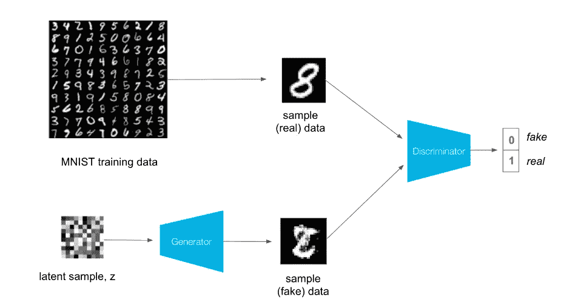
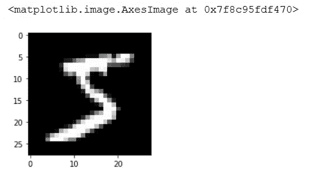
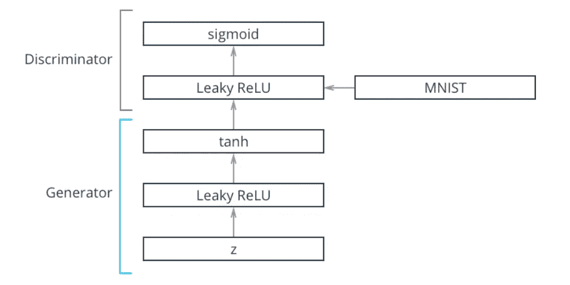
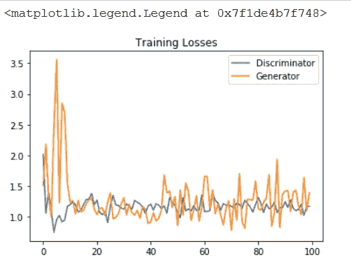
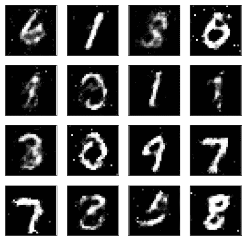

# 生成对抗网络

> 原文：<https://levelup.gitconnected.com/generative-adversarial-network-c34cbd25f07f>

2014 年，Ian Goodfellow 和其他人在 Yoshua Bengio 的实验室里首次报道了“生成敌对网络”。从那以后，GANs 开始流行起来。这里有几个例子可供参考:

*   [Pix2Pix](https://affinelayer.com/pixsrv/)
*   [朱俊彦 PyTorch 的 cycle gan&pix 2 pix](https://github.com/junyanz/pytorch-CycleGAN-and-pix2pix)
*   [生成模型列表](https://github.com/wiseodd/generative-models)

GANs 背后的想法是一个人有两个网络，一个生成器*𝐺*和一个鉴别器 *𝐷* ，相互竞争。生成器生成“假”数据传递给鉴别器。鉴别器还可以看到真实的训练数据，并预测它收到的数据是真是假。

*   生成器被训练来欺骗鉴别器，它想要输出看起来尽可能接近真实训练数据的数据。
*   鉴别器是一个分类器，它被训练来找出哪些数据是真实的，哪些是虚假的。

最终发生的情况是，生成器学习生成与鉴别器的真实数据无法区分的数据。



图片来源:Udacity

## 构建 GAN:

在这里，我们将尝试建立一个简单的甘产生新的手写图像的基础上 MNIST 数据集。

步骤 1:加载必要的库，我们将为这个模型使用 PyTorch。

```
%matplotlib inline
import numpy as np
import torch
import matplotlib.pyplot as plt
from torchvision import datasets
import torchvision.transforms as transforms
import torch.nn as nn
import torch.nn.functional as F
import torch.optim as optim
import pickle as pkl
```

步骤 2:现在我们将加载内置的 MNIST 数据集，并创建一个批量大小为 64 的 train_loader。

步骤 3:可视化数据

可视化数据的代码



上述代码的输出

## 定义模型

一个 GAN 由两个对立的网络组成，一个鉴别器和一个生成器。



## 鉴别器

鉴别器网络将会是一个非常典型的线性分类器。为了使这个网络成为一个通用的函数挪用器，我们至少需要一个隐藏层，并且这些隐藏层应该有一个关键属性。这里我们将定义 3 个隐藏层和 1 个全连接层。每一层都有一个漏重激活功能。泄漏的 ReLU 类似于普通的 ReLU，只是对于负输入值有一个小的非零输出，它是通过乘以一个小常数得到的。

我们还将采用在输出端使用数值上更稳定的损失函数的方法。回想一下，我们希望鉴别器输出一个 0–1 的值，表示一幅图像是*真的还是假的*。因此，我们的最终输出层不应该有任何激活功能应用于它。

```
class Discriminator(nn.Module):
 def __init__(self, input_size, hidden_dim, output_size):
  super(Discriminator, self).__init__()

    # define all layers

    #There are three hidden layers
    self.layer1=nn.Linear(input_size,hidden_dim*4)
    self.layer2=nn.Linear(hidden_dim*4,hidden_dim*2)
    self.layer3=nn.Linear(hidden_dim*2,hidden_dim)

    #This is the fully connected layer
    self.layer4=nn.Linear(hidden_dim,output_size)

    #A dropout with value 0.2 is added
    self.dropout=nn.Dropout(0.2)

 def forward(self, x):
    # flatten image
    x=x.view(-1,28*28)
    # pass x through all layers
    # apply leaky relu activation to all hidden layers
    x=F.leaky_relu(self.layer1(x),0.2)
    x=self.dropout(x)
    x=F.leaky_relu(self.layer2(x),0.2)
    x=self.dropout(x)
    x=F.leaky_relu(self.layer3(x),0.2)
    x=self.dropout(x)

    output=self.layer4(x)
    return output
```

## 发电机

发生器网络将与鉴别器网络几乎完全相同，除了我们将一个[双曲正切激活函数](https://pytorch.org/docs/stable/nn.html#tanh)应用到我们的输出层。已经发现，对于发电机输出来说，具有 *𝑡𝑎𝑛ℎ* 的发电机表现最佳，其将输出缩放到-1 和 1 之间，而不是 0 和 1。

```
class Generator(nn.Module): def __init__(self, input_size, hidden_dim, output_size):
   super(Generator, self).__init__()

     # define all layers

     #There are three hidden layers
     self.layer1=nn.Linear(input_size,hidden_dim)
     self.layer2=nn.Linear(hidden_dim,hidden_dim*2)
     self.layer3=nn.Linear(hidden_dim*2,hidden_dim*4)

     #This is the fully connected layer
     self.layer4=nn.Linear(hidden_dim*4,output_size)

     #A dropout with value 0.2 is added
     self.dropout=nn.Dropout(0.2) def forward(self, x):
     # pass x through all layers

     # final layer should have tanh applied
     x=F.leaky_relu(self.layer1(x),0.2)
     x=self.dropout(x)
     x=F.leaky_relu(self.layer2(x),0.2)
     x=self.dropout(x)
     x=F.leaky_relu(self.layer3(x),0.2)
     x=self.dropout(x)
     output=F.tanh(self.layer4(x))
     return output
```

下一步是为我们的模型设置超参数

现在我们将建立完整的模型。

输出将显示我们完整的模型架构，

```
Discriminator(
  (layer1): Linear(in_features=784, out_features=128, bias=True)
  (layer2): Linear(in_features=128, out_features=64, bias=True)
  (layer3): Linear(in_features=64, out_features=32, bias=True)
  (layer4): Linear(in_features=32, out_features=1, bias=True)
  (dropout): Dropout(p=0.2)
)

Generator(
  (layer1): Linear(in_features=100, out_features=32, bias=True)
  (layer2): Linear(in_features=32, out_features=64, bias=True)
  (layer3): Linear(in_features=64, out_features=128, bias=True)
  (layer4): Linear(in_features=128, out_features=784, bias=True)
  (dropout): Dropout(p=0.2)
)
```

## 鉴频器损耗

对于鉴别器，总损失是真实和伪造图像的损失之和，`d_loss = d_real_loss + d_fake_loss`。请记住，我们希望鉴频器为真实图像输出 1，为虚假图像输出 0，因此我们需要设置损耗来反映这一点。

损失将由二元交叉熵损失与 logits，我们可以得到与 [BCEWithLogitsLoss](https://pytorch.org/docs/stable/nn.html#bcewithlogitsloss) 。这将`sigmoid`激活函数**和**二元交叉熵损失结合在一个函数中。

## 发电机损耗

只有在标签翻转的情况下，发电机损耗才会看起来相似。生成器的目标是得到`D(fake_images) = 1`。在这种情况下，标签被**翻转**以表示生成器试图欺骗鉴别器，使其认为生成的图像(赝品)是真实的！

我们希望分别更新生成器和鉴别器变量。因此，我们将定义两个独立的 Adam 优化器。

# 培养

训练将包括交替训练鉴别器和发生器。我们将使用函数`real_loss`和`fake_loss`来帮助我们计算以下所有情况下的鉴频器损耗。

## 甄别训练

在真实的训练图像上计算鉴别器损失，然后生成假图像。最后，执行反向传播+优化来更新鉴别器的权重。

## 发电机培训

使用**翻转的**标签生成假图像并计算假图像的鉴别器损耗。执行反向传播+优化来更新生成器的权重。

```
num_epochs = 100
samples = []
losses = []
print_every = 400sample_size=16
fixed_z = np.random.uniform(-1, 1, size=(sample_size, z_size))
fixed_z = torch.from_numpy(fixed_z).float()D.train()
G.train()
for epoch in range(num_epochs):
   for batch_i, (real_images, _) in enumerate(train_loader):
        batch_size = real_images.size(0)
        real_images = real_images*2–1 
        d_optimizer.zero_grad()
        D_real = D(real_images)
        d_real_loss = real_loss(D_real, smooth=True)

        z = np.random.uniform(-1, 1, size=(batch_size, z_size))
        z = torch.from_numpy(z).float()
        fake_images = G(z)

        D_fake = D(fake_images)
        d_fake_loss = fake_loss(D_fake)

        d_loss = d_real_loss + d_fake_loss
        d_loss.backward()
        d_optimizer.step()

        g_optimizer.zero_grad()

        z = np.random.uniform(-1, 1, size=(batch_size, z_size))
        z = torch.from_numpy(z).float()
        fake_images = G(z)
        D_fake = D(fake_images)
        g_loss = real_loss(D_fake) 
        g_loss.backward()
        g_optimizer.step()
        if batch_i % print_every == 0:
             print(‘Epoch [{:5d}/{:5d}] | d_loss: {:6.4f} | g_loss:  
                   {:6.4f}’.format(epoch+1, num_epochs,  
                    d_loss.item(), g_loss.item()))## AFTER EACH EPOCH##
   losses.append((d_loss.item(), g_loss.item()))
   G.eval() 
   samples_z = G(fixed_z)
   samples.append(samples_z)
   G.train()with open(‘train_samples.pkl’, ‘wb’) as f:
   pkl.dump(samples, f)
```

## 培训损失

这里我们将绘制发生器和鉴别器的训练损耗，在每个时期后记录。



培训损失

最后，让我们测试生成的新图像。



新 MNIST 形象！！

Tada！这里使用 GAN，生成了新的手写图像。类似地，GANs 可用于从现有图像生成新图像。享受探索甘斯的乐趣。

编码快乐！

[](https://skilled.dev) [## 编写面试问题

### 一个完整的平台，在这里我会教你找到下一份工作所需的一切，以及…

技术开发](https://skilled.dev)