# 生成艺术——让你入门的 3 个基本概念

> 原文：<https://levelup.gitconnected.com/generative-art-3-fundamental-concepts-to-get-you-started-44205dae167b>

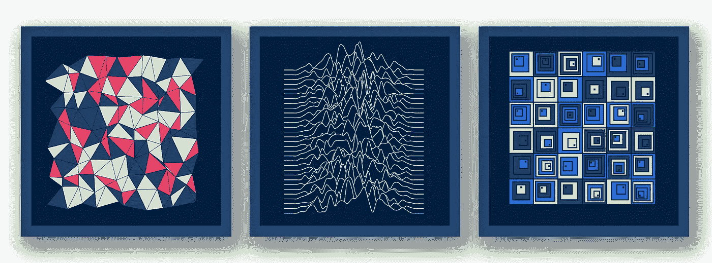

## 艺术与代码

## 是时候唤醒你内心的艺术家了

本文将不讲述如何使用**深度学习** & [**生成对抗网络**](https://developers.google.com/machine-learning/gan) 通过代码生成艺术。

别误会，我是**机器学习和 AI** 的大发烧友，很少有算法和网络架构能在文科 领域产生 [*惊人的成果，但不是今天的课题。*](https://aiartists.org/ai-generated-art-tools)

今天我们将谈论确定性的生成艺术，即 100%基于规则的绘画和草图。

这种艺术**不是由机器**产生的，我看到的一些例子让我大吃一惊，我决定开始学习**生成艺术**。

这里有 **3 pilar 概念图**、**插图**和**代码**，我希望能在你的数码艺术家眼中点燃一束光。您还将了解**我用来启动和运行**的资源，让我们开始吧。

# 第一个概念——随机性

> 我们科学地理解龙卷风，但它仍然感觉是超自然的。这种随机性让它看起来像是超自然的。迈克尔·科里塔

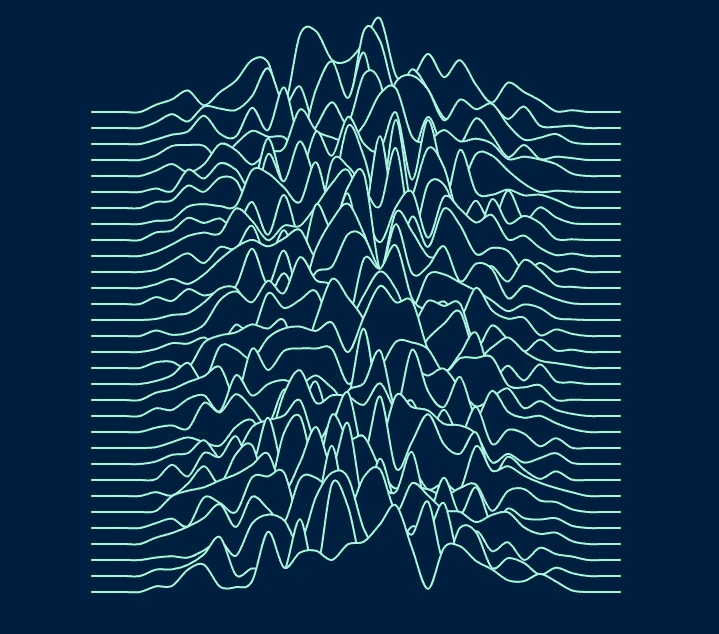

尽管看起来令人惊讶，但随机性是生成式设计中的一个关键因素，它与上面的引用密切相关。

尽管我刚刚写道，这种类型的艺术高度基于规则，但正是对随机性的巧妙运用使得它看起来几乎没有确定性。

完成这种设计的一个简单方法是从一个简单的系统开始，增加随机性，直到感觉正确为止。

让我们借助 [*p5.js*](https://p5js.org/) 来画横线，这是最值得推荐的生成艺术 Javascript 库之一:

```
const MAX_HEIGHT = 600;
const MAX_WIDTH = 600;
const STEP = 16;function setup(){
  createCanvas(MAX_HEIGHT, MAX_WIDTH);
  stroke(169, 251, 215);
  strokeWeight(2);
  noLoop();
}function draw(){  
    const lines = [];
    for(let i = STEP; i < MAX_HEIGHT - STEP; i += STEP){
      lines.push([{x: STEP, y: i}, {x: MAX_HEIGHT, y: i}]);
    }

    // draw
    for(let i = 0; i < lines.length; i++){
      for(let j = 0; j < lines[i].length; j+=2){
        line(lines[i][j].x, lines[i][j].y, lines[i][j+1].x, lines[i][j+1].y);
      }
    }
}
```

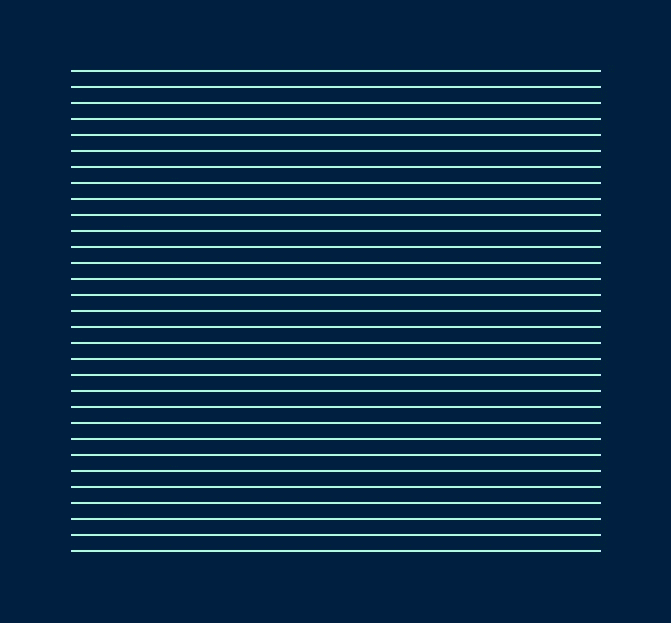

正如我所说的，把绘图想象成一个系统，并尽可能地使它具有可扩展性。

现在让我们给我们的初稿添加一些趣味，**随机性**。

我们将沿线添加更多的点**和**，并改变我们的绘制函数来渲染一条随机位移的曲线。

```
let distanceToCenter = Math.abs(j - MAX_HEIGHT / 2);
let variance = Math.max(MAX_HEIGHT / 2 - VARIANCE_FACTOR - distanceToCenter, 0);
let random = Math.random() * variance / 2 * -1;
let point = {x: j, y: i + random};
line.push(point);
```

这里有一个为您创建的代码笔，您可以用整个代码**来试验**:

在生成艺术中你会经常看到的一件事是**颜色变化**，它与随机性密切相关。您可以扩展代码来玩颜色:

```
const TONES_1 = [[238, 66, 102], [31, 64, 104], [242, 228, 181]];
const TONES_2 = [[37, 106, 220], [31, 64, 104], [169, 251, 215]];
const MONOCHROME = [[0, 32, 63]];
...
const random_index = Math.floor(Math.random() * TONES_1.length);
const [r, g, b] = TONES_1[random_index];
fill(r, g, b);
```

这里有一些例子，你可以通过**玩我的个人颜色:**

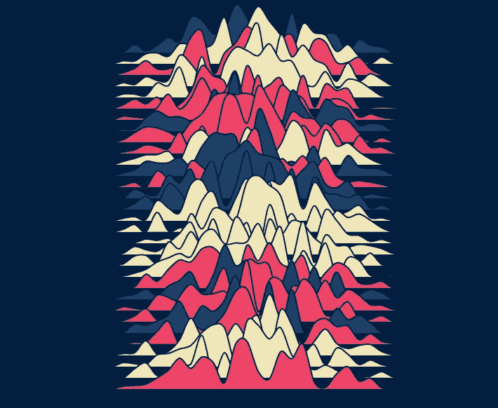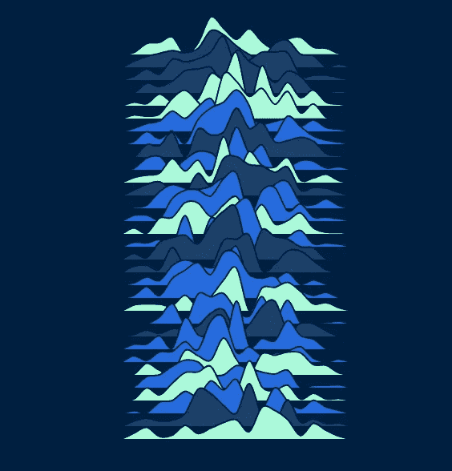

# 第二个概念——重复和结构

> 创造力是将秩序引入自然的随机性的能力。—埃里克·霍弗

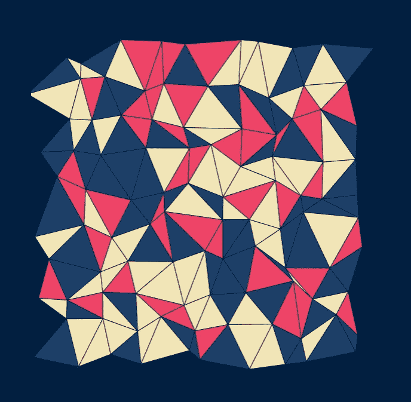

注意到这一点并不微妙，但是这个领域的很多甚至所有作品都是基于**的重复和结构。**

更重要的是，这个概念与随机性密切相关，因为没有随机因素的**结构和重复会产生沉闷的**和**无序的随机性，重复会产生混乱。**

对我们来说幸运的是，创造可再生艺术品的**程序化方式**使得这个概念相对容易实现。

**而用于**循环的和**与**有序数据结构**一起完成工作。对于更复杂的作品，你可能想玩更明显的数据结构和算法…或者不！**

看情况。有的需要 [*正态分布*](https://en.wikipedia.org/wiki/Normal_distribution) 、概率概念，甚至更高级的 CS，但有的通过使用基本算法和数据结构就能得到**漂亮的结果**。

让我们来看看如何生成三角网格。主要的技巧在于**重复**交替三角形。

```
const MAX_HEIGHT = window.innerHeight / 2;
const MAX_WIDTH = 2*window.innerWidth / 3;
const DENSITY = 8;
const GAP = MAX_HEIGHT / DENSITY;
const STROKE_COLOR = "#00203F";function setup(){
  createCanvas(MAX_HEIGHT, MAX_WIDTH);
  stroke(STROKE_COLOR);
  noLoop();
}function draw(){  
    const lines = [];
    let odd = false;
    for(let y = GAP / 2; y <= MAX_HEIGHT; y += GAP) {
        odd = !odd;
        const trait = [];
        const oddFactor = odd ? GAP/2 : 0;
        for(let x = GAP / 4; x <= MAX_HEIGHT; x += GAP) {
          trait.push({
            x: x + oddFactor,
            y: y
          });
        }
        lines.push(trait);
      }
    odd = true;
    for(let y = 0; y < lines.length - 1; y++) {
        odd = !odd;
        const dotLine = [];
        for(let i = 0; i < lines[y].length; i++) {
          dotLine.push(odd ? lines[y][i]   : lines[y+1][i]);
          dotLine.push(odd ? lines[y+1][i] : lines[y][i]);
        }
        for(let i = 0; i < dotLine.length - 2; i++) {
          triangle(pointA.x, pointA.y, pointB.x, pointB.y, pointC.x, pointC.y)
        }
      }
}
```

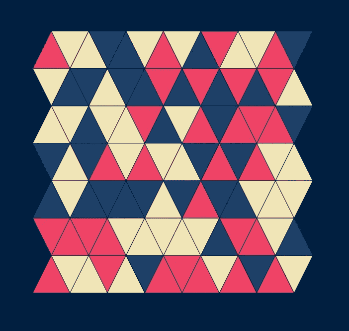

注意`odd`变量是如何控制三角形的**方向**的。相同的颜色系统已应用于`drawTriangle`功能。

只差一步就完成我们的 draxing 了，再来补充一个你现在应该很熟悉的概念，**随机性！**

```
trait.push({
    x: x + (Math.random()*.8 - 0.4) * GAP + oddFactor,
    y: y + (Math.random()*.8 - 0.4) * GAP
});
```

你可以自己选择随机因子**，但是我发现从-0.4 到 0.4 似乎已经足够好了。**

**以下是相关的 Codepen 及完整代码:**

**这里有一些你可以通过**调整参数实现的例子。****

**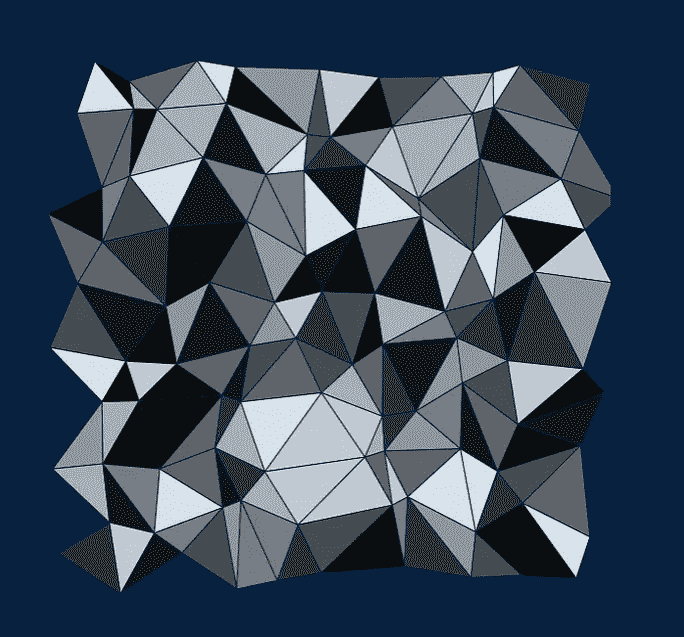****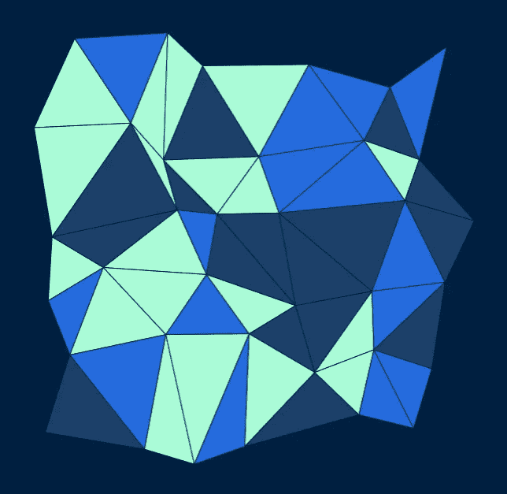****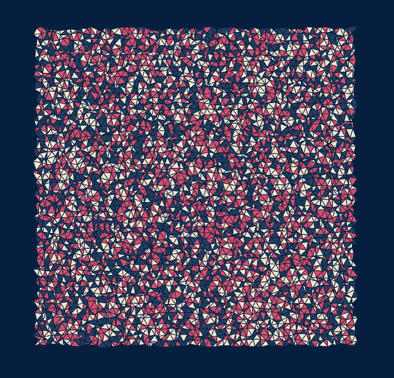**

# **第三个概念—递归**

> **要理解递归，首先必须理解递归。——斯蒂芬·霍金**

**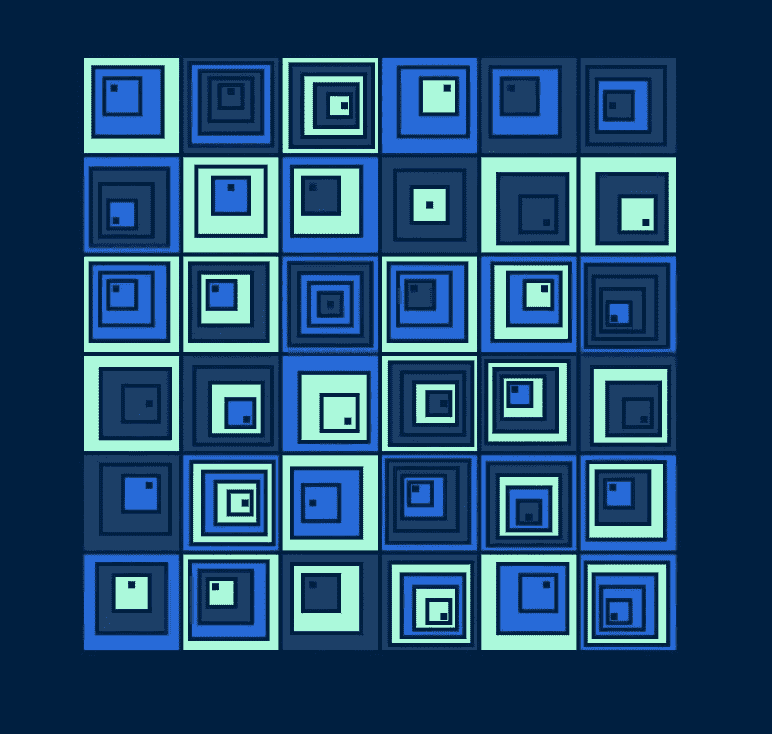**

**现在我们来看最后一个重要的概念，**递归。****

**在上面的草图中你几乎可以感觉到，但是在你的草图中有递归总是好的，或者至少在它的某些部分。**

**每一个像 [*分形*](https://fractalfoundation.org/resources/what-are-fractals/#:~:text=Fractals%20are%20infinitely%20complex%20patterns,systems%20%E2%80%93%20the%20pictures%20of%20Chaos.) 这样的生成艺术的例子，让我们看看在这里如何用它来画这些矩形。**

**让我们从第二个支柱**重复**和第一个支柱**随机性**开始，使用相同的调色板:**

```
const MAX_HEIGHT = 600;
const MAX_WIDTH = 600;
const step = 30;
let finalSize = 3;
let startSteps;
let offset = 2;
let tileStep = (MAX_HEIGHT - offset * 2) / 6;
let startSize = tileStep;
let directions = [-1, 0, 1];
const TONES_1 = [[238, 66, 102], [31, 64, 104], [242, 228, 181]];
const TONES_2 = [[37, 106, 220], [31, 64, 104], [169, 251, 215]];
const MONOCHROME = new Array(10).fill(0).map((_, i) => [i*24, i*25, i*26]);const BACKGROUND_COLOR = [0, 32, 63];function setup(){
  createCanvas(MAX_HEIGHT, MAX_WIDTH);
  background(BACKGROUND_COLOR[0], BACKGROUND_COLOR[1], BACKGROUND_COLOR[2]);
  stroke(0, 32, 63);
  noLoop();
  strokeWeight(4)
}drawRect = (x, y, width, height, xMovement, yMovement, steps) => {
  let random_index = Math.floor(Math.random() * TONES_2.length);
  const [r, g, b] = TONES_2[random_index];
  fill(r, g, b);
  rect(x, y, width, height);    
}function draw(){  

  for( let x = offset; x < MAX_WIDTH - offset; x += tileStep) {
    for( var y = offset; y < MAX_HEIGHT - offset; y += tileStep) {
      startSteps = 2 + Math.ceil(Math.random() * 3)
      let xDirection = directions[Math.floor(Math.random() * directions.length)]
      let yDirection = directions[Math.floor(Math.random() * directions.length)]
      drawRect(x, y, startSize, startSize, xDirection, yDirection, startSteps - 1);
    }
  }
}
```

**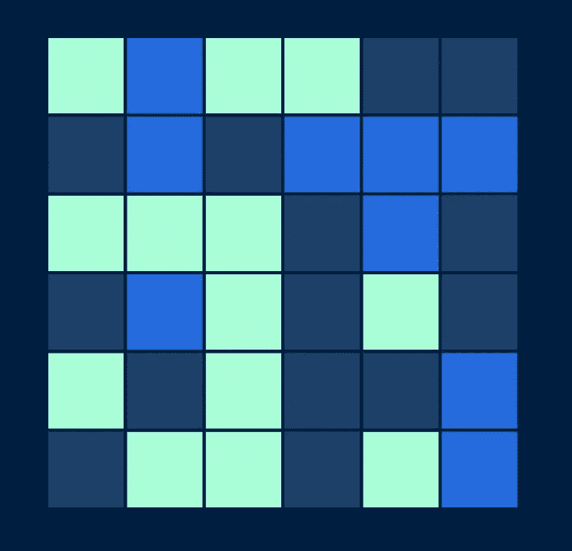**

**现在，如果我们改变绘制这些矩形的方式，我们将会得到我们想要的结果。**

**这里我在上面的代码中留下了一点提示:`steps`参数。**

**我们将绘制一个更小的矩形，如果我们没有碰到我们的**基本情况，**，这是当我们**没有任何步骤**要绘制到:**

```
if(steps >= 0) {
    let newSize = (startSize) * (steps / startSteps) + finalSize;
    let newX = x + (width - newSize) / 2
    let newY = y + (height - newSize) / 2
    newX = newX - ((x - newX) / (steps + 2)) * xMovement
    newY = newY - ((y - newY) / (steps + 2)) * yMovement
    drawRect(newX, newY, newSize, newSize, xMovement, yMovement, steps - 1);
  }
```

**下面是最后一笔全部代码:**

**这里有一些你可以通过**玩调色板和矩形大小来实现的例子。****

**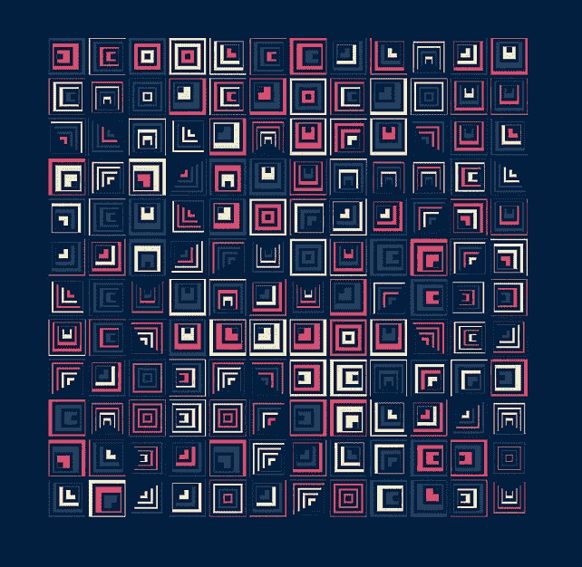****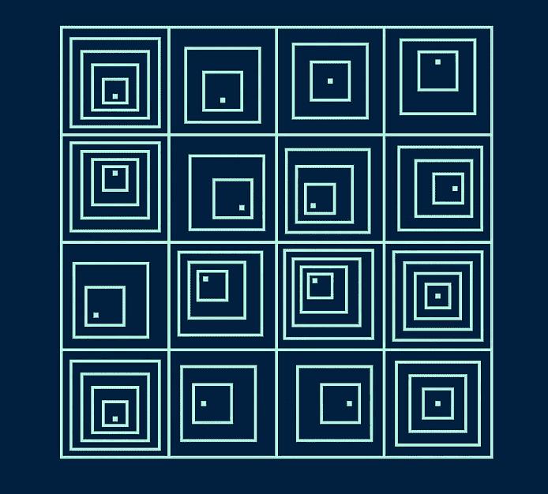****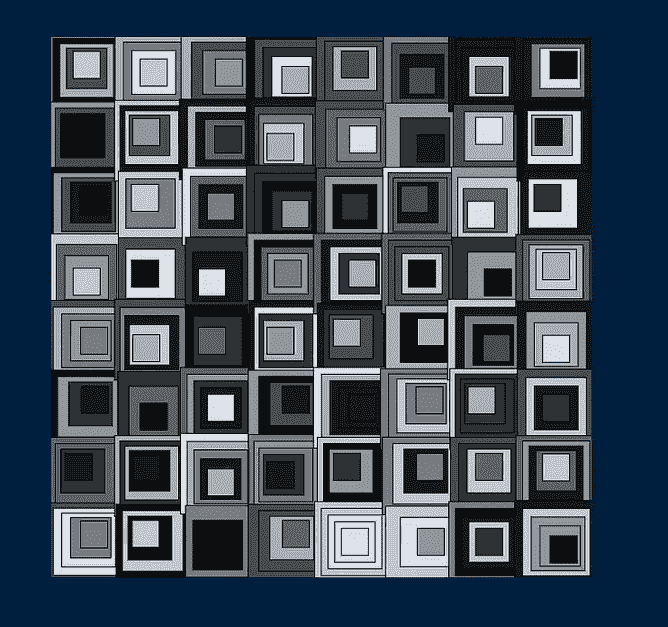**

# **供您学习的其他资源**

**我列了一个小清单，帮助我学习这些概念，并参与到底什么是生成艺术:**

*   **[*生成艺术*](https://generativeartistry.com/)——一个通过 8 个简单的例子(帮助我获得本文的例子)汇总和解释生成艺术的网站。**
*   **[*泰勒·霍布斯的网站*](https://tylerxhobbs.com/)——如果不是生成艺术的最佳灵感来源的话**
*   **[*这个 Youtube 教程系列*](https://www.youtube.com/user/matthewepler/videos)——说真的，你会学到制作艺术品的最佳实践和 Javascript 构图实践。**
*   **[*编码的火车 p5.js 系列*](https://www.youtube.com/playlist?list=PLRqwX-V7Uu6Zy51Q-x9tMWIv9cueOFTFA) —你将学会用 Javascript 绘图的基础。**
*   **马特·皮尔森生殖艺术书籍——如果你想深入研究，这是最好的书。**

**今天到此为止，伙计们！你可以随时发邮件给我[](mailto:dev@alexandrezajac.com)**联系我*[***Linkedin***](https://www.linkedin.com/in/alexandre-zajac/)*或者访问我的 [***GitHub 项目***](https://github.com/alexZajac) 。******

****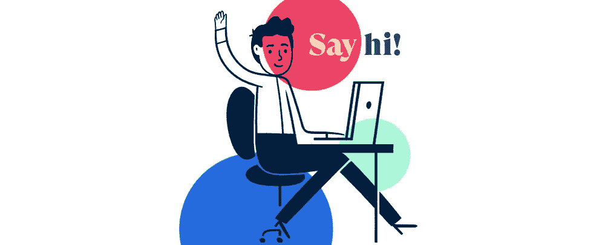****

****希望我唤醒了你内心的艺术家，快乐画画，最重要的是，快乐学习！****