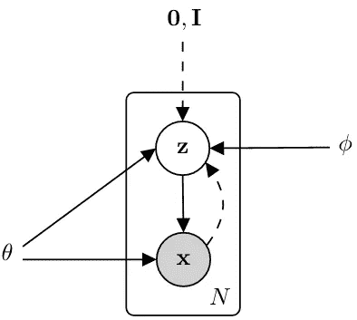
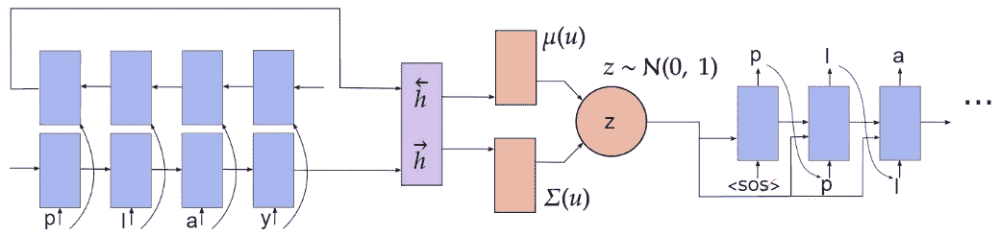
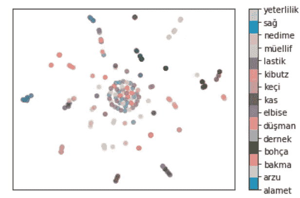
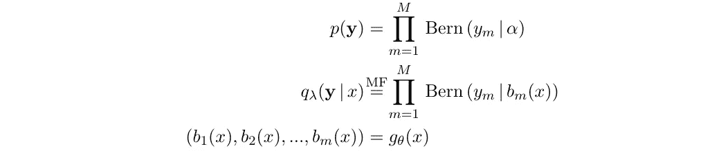
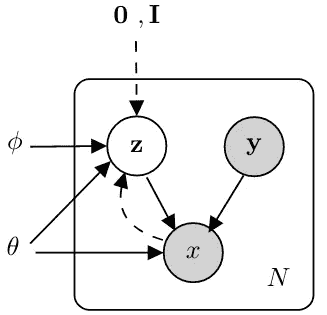
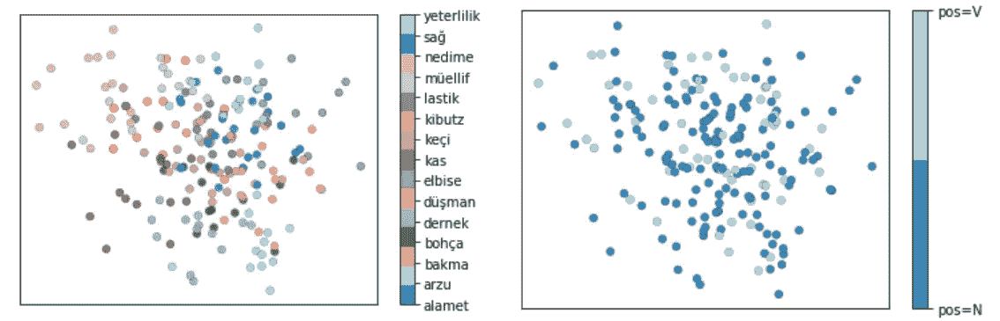
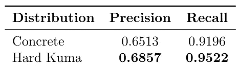
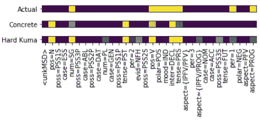

# 屈折词的生成模式

> 原文：<https://levelup.gitconnected.com/generative-model-of-inflected-words-a4076dac53d6>

在这个项目中，我们的目标是建立词形变化的模型。我们研究了两种生成模型，即，*字符 VAE，*仅具有连续变量的序列数据单序列变分自动编码器， *MSVAE* (多空间变分自动编码器)，一种具有连续和离散潜变量的生成模型。相关的实验可以在这个报告中找到:[阿克鲁蒂](https://github.com/akashrajkn/akruti)。

# **简介**

语言使用词缀来传达信息，如重音，语调和语法意义。这些实体是更一般的一类实体的子集，这些实体形成单词的有意义的子部分(语素)。形态学是指语素组合的规则和过程。单词变形是一个过程，通过该过程，单词被修改以表达各种语法类别(例如，时态、重音、性别、语气等)。).对于 NLP 系统来说，学习和理解这样的过程是至关重要的；已经表明，明确地对形态学建模有助于机器翻译、解析和单词嵌入等任务(Dyer 等人[1]；Cotterell 等人[2])。涉及词频的计算方法显然不能模拟这种看不见的词。另一方面，基于启发式的方法需要手工制定语言特定的规则。

## 我们能模拟屈折词的分布吗？

我们希望研究生成模型来描述屈折词形的分布。vanilla variable auto encoder 可用于编码字符序列。虽然它对于表示连续的潜在变量是有效的，但是我们不能对离散的形态特征进行编码。我们研究了一个生成模型，它可以在一个连续的潜在空间中对单词序列进行编码，在一个(近似)离散的潜在变量中对其形态特征进行编码。

字符变分自动编码器的生成过程。

# 人物 VAE

处理神经模型中连续潜变量的有效方法是采用变分自动编码器。设 *x* 表示一个字符序列(形成一个屈折词) *z* 表示潜在空间。给定潜在变量 *z* ，VAE 学习观察数据 *x* 概率的生成模型，同时使用识别模型估计特定数据点的潜在变量。侧面显示了图形模型。

类似于 Bowman 等人(2015) [3]为记号序列开发的 VAE，我们为字符序列构建了一个变分自动编码器。设 *q(。)*表示近似的后验。识别模型 *q(z|x)* 参数化潜在空间上的近似后验概率。我们对潜在变量的先验使用标准高斯分布，即*p(z)∞N(z | 0，I)* 。对于变分族，我们使用高斯分布。通过最大化数据的边际对数似然的变化下限来训练该模型:

其中θ和φ分别代表可训练网络和变分参数。接下来，我们讨论角色 VAE 模型的体系结构，

人物 VAE 建筑。<sos>是序列的开始字符。</sos>

对于编码器，我们使用双向门控循环单元。 *u = [h→;h←】*是输入序列 *x* 的隐藏表示，其中 *h→* 和 *h←* 分别代表编码器从正向和反向的最终隐藏状态。 *μ(u)* 和 *σ(u)* 是多层感知器，分别代表近似后验的均值和标准差， *q(z|x) = N (z|μ(u)，σ(u))* 。在每个时间步，解码器使用(a)*x*的潜在表示，(b)在前一时间步预测的字符和(c)当前隐藏状态，来预测序列中下一个最可能的字符。

人物 VAE 潜在空间的 t-SNE 情节。每个数据点都是一个屈折词。具有相同引理的单词颜色相似。

## 结果

图为人物
VAE 潜在空间的 t-SNE 图。图上的每个点代表一个屈折词，具有相同词条的词颜色相似。我们可以观察到共享相同引理的几个词彼此更接近。然而，我们看不到基于引理的明显聚类，因为潜在空间没有以任何方式受到限制。

# 使用宽松变量的基本原理

对于一个屈折词，神经网络应该学习是否存在形态特征。例如，单词“played”应该打开特征*时态=过去*。假设使用伯努利分布对每个形态特征进行建模。假设有*m*‘独立’形态特征，*(注:即使有些特征如*时态=现在*，*时态=过去*等。本质上是相关的，我们最初假设独立性，然后通过使用 make:Masked auto encoder 进行密度估计来诱导依赖性。为了进行推断，假设每个特征都有一个参数为α的伯努利先验。y 上的分布为:*

**

*这里， *x* 是具有形态学标签的观察序列，y 和λ表示变化参数。 *qλ* 是参数 *bᵢ* 的近似平均场伯努利后验。 *gθ(。)*是由 *θ* 参数化的多层感知器，以 *x* 为输入。使用平均场假设，学习目标 *L* 可以写成如下:*

**

*上式中，涉及 *KL* 散度的第二项可以解析计算，第一项相对于 *θ* 的梯度可以用蒙特卡罗样本估计，但是相对于 *λ* 的梯度是难以处理的，需要使用**加强**。在这种方法中，强化基线的选择会极大地影响收敛速度，因为它具有很高的方差。另一种加强方法是对分类变量进行**放松，并采用直通估计器。不幸的是，这种方法有缺点:使用直通估计器会导致有偏差的梯度，因为它在梯度评估期间忽略了似然性中的 Heaviside 函数，并且具体分布不能模拟离散结果的似然性。我们用**硬库马分布**描述[这个故事](https://medium.com/nerd-for-tech/a-note-on-hard-kumaraswamy-distribution-b74278dc6877)【4】。来模拟形态特征的分布。这种分布满足了一个需要:一个可微分的替代离散变量，使无偏梯度估计。***

# *多空间变分自动编码器*

*多空间变分自动编码器(MSVAE)是一种使用离散和连续隐变量的生成模型。MSVAE 可以看作是带有辅助变量和序列 VAE 的生成模型的组合。*

**

*(监督)MSVAE 模型的图形模型。灰色变量表示观察到了各自的标签。*

**符号*:用 *x* 表示一个字符序列(例如*玩*)。 *y* 是一个 *M* 维的二元向量； *yᵢ* 表示第 *i* 个特征是否存在，即 *yᵢ ∈ {0，1}* 。 *φ* 代表连续潜在空间 *z* 的变分参数，其上有一个标准的法线先验，即 *p(z) = N (z|0，I)* 。 *θ* 代表神经网络的可训练参数。 *λ* 表示形态学特征的近似后验概率的变分参数。 *N* 表示单词序列的个数。图中显示了受监督的( **y** 可用)MSVAE 的图形模型。我们可以定义生成模型， *pθ(x，* ***y*** *，****z****)*如下:*

**

*其中 *HK(a₀，b₀)* 是硬库玛先验， *fθ(。)*表示由 *θ* 参数化的递归神经网络。我们可以通过最大化以下目标来培训 MSVAE:*

**

## ***结果***

*我们使用一个类似的架构，如在字符 VAE 部分所述。我们使用 SIGMORPHON 2016 数据集[5] —土耳其任务 3 数据。在解码时，为了预测每一步最可能的字符，我们使用三种类型的信息:(a)当前解码器状态，(b)形态学标签嵌入，以及(c)潜在变量。我们没有忽略潜在变量，而是使用平均向量作为潜在代表。*

**

*潜在空间的 t-SNE 图。每个数据点都是土耳其语 task 3 数据集中的一个屈折词。(左)具有相同引理的单词颜色相同。(右)具有相同词性(pos)标签的单词颜色相同。*

*在左图中，具有相同词条的单词被相似地着色。我们可以看到，具有相同引理的单词被粗略地聚集在一起。然而，集群并不明显。在右边，我们将相同的(连续的)潜在空间可视化，但根据词性标签进行着色: *pos=V，pos=N* 分别代表动词和名词。潜在空间没有根据词性标签进行聚类；这是意料之中的，因为我们希望连续空间只编码关于引理的信息。*

## ***形态学标签上的分布***

**

*土耳其语(任务 3)测试数据的平均精度和召回率。*

*在推理时，形态学特征不能被给予完全离散的处理。为了对此建模，我们可以使用硬分布(硬库马分布)和具体的随机变量，离散随机变量的连续松弛(具体分布)作为可能的候选。使用变换值计算每个预测的精度和召回率。我们使用 MADE 来归纳形态特征分布之间的相关性。*

> *硬库马比混凝土分配表现更好:*
> 
> *1.硬库马可以模拟实际数据，即离散结果{0}和{1}，但具体的
> 2 却不是这样。由于无偏的梯度估计，训练可能更稳定。*

**

*来自土耳其数据集的示例单词( **koylar** )显示了形态特征预测。x 轴显示了不同的形态特征。第一行(实际)显示目标特征。*

# *结论*

*我们研究了两个生成模型来描述屈折词形的分布。字符 VAE 作为一个有效地表示连续潜在变量的积木。然而，它的潜在空间没有捕捉到任何有意义的表现，因为我们没有以任何方式对它进行调节。另一方面，MSVAE 从两个
潜在表示中对屈折词形进行建模:捕获字符序列的连续空间和表示形态特征的近似离散潜在空间。遵循周和 Neubig (2017) [6]，我们给它一个宽松的待遇。然而，我们使用硬库马，而不是通过有偏直通估计量使用具体分布。MSVAE 的潜在空间可以根据屈折词的引理进行粗略聚类，但我们无法从引理中完全理清词法标签信息。*

# *参考*

1.  *Dyer，c .，Muresan，s .，和 Resnik，P. (2008 年)。广义词格翻译。马里兰大学帕克学院高级计算机研究所技术报告。*
2.  *Cotterell、h . schütze 和 j . e isner(2016 年)。词嵌入的形态平滑和外推。《计算语言学协会第 54 届年会论文集》(第 1 卷:长篇论文)，第 1651-1660 页。*
3.  *Bowman，S. R .、Vilnis，l .、Vinyals，o .、Dai，A. M .、Jozefowicz，r .和 Bengio，S. (2015 年)。从连续空间生成句子。arXiv 预印本 arXiv:1511.06349。*
4.  *[https://medium . com/nerd-for-tech/a-note-on-hard-kumaraswamy-distribution-b 74278 DC 6877](https://medium.com/nerd-for-tech/a-note-on-hard-kumaraswamy-distribution-b74278dc6877)*
5.  *r .科特雷尔、c .基洛夫、Sylak-Glassman、j .亚罗斯基、d .艾斯纳和 M. (2016 年)。sigmorphon 2016 共享任务—形态学再反射。《第 14 届 SIGMORPHON 语音学、音韵学和形态学计算研究研讨会论文集》，第 10-22 页。*
6.  *周和纽比格(2017)。半监督标记序列转导的多空间变分编码解码器。arXiv 预印本 arXiv:1704.01691。*
7.  *代号:[https://github.com/akashrajkn/akruti](https://github.com/akashrajkn/akruti)*