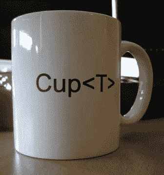

# 泛型和解析器前端

> 原文：<https://levelup.gitconnected.com/generics-and-the-parser-front-af9d957ef8da>

如果您有:

`F(G<A,B>(5));`

## 选项 1

这是否意味着用户想要调用一个带有两个参数的方法`F`，这两个参数是通过比较`G`和`A`，以及`B`和常量`5`得到的？

## 选项 2

还是说调用`F`的结果是使用类型参数`A`和`B`以及一个参数`5`调用泛型方法`G`？

为了测试这一点，使用了两个代码段，下面的代码段编译时没有任何错误:

但是，下面的代码会产生错误:

这些错误是:

1.*找不到类型或命名空间名称“A ”(是否缺少 using 指令或程序集引用？)*

2.*找不到类型或命名空间名称“B ”(是否缺少 using 指令或程序集引用？)*

3.*变量‘G’不是通用方法。如果你想要一个表达式列表，在<表达式两边使用圆括号。*

所以这个表达式被解释为一个通用的函数调用。

通过对第一个参数使用括号，或者根本不使用括号，可以强制编译器将其视为带有两个参数的单个函数调用:

`F((G<A), B>(5));`或`F(G<A, B>5)`

更多信息请阅读 [C#规范](http://msdn.microsoft.com/en-us/library/vstudio/ms228593.aspx)的 7.6.4.2 章节。