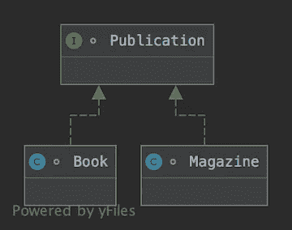

# Java 中的泛型和通配符

> 原文：<https://levelup.gitconnected.com/generics-and-wildcards-in-java-1e678f7792>

## 关于 Java 中的泛型和通配符(也称为参数多态性、类型界限、类型差异)


迪米特里·豪特曼在 [Unsplash](https://unsplash.com/s/photos/bounds?utm_source=unsplash&utm_medium=referral&utm_content=creditCopyText) 上拍摄的照片

**注:**本文改编自我的书 [*函数式与并发编程:核心概念与特性*](https://www.fcpbook.org) ，由 [Addison-Wesley](https://www.informit.com/store/functional-and-concurrent-programming-core-concepts-9780137466573) 出版。具体参见第 15 章*类型(及相关概念)*。

没有人想知道 Java 中的语法`<? extends T>`或`<? super T>`是干什么用的？我们为什么需要它？怎么用？如果是这样，这篇文章是给你的。它还将简要讨论支持协变和逆变类型的语言中的替代语言。

## 无商标消费品

在现代类型化编程语言中，一种类型可以被另一种类型参数化，这种特性有时被称为*参数多态性*。在 Java 中，这采用了所谓的*泛型的形式，在 Java 5 中引入了*。

例如，`List`可以被参数化为`List<String>`或`List<Number>`，使得编译器可以检查一个数字是否被插入到一个字符串列表中，或者一个字符串是否被插入到一个数字列表中。这样，代码中就不需要类型转换(和潜在的`ClassCastException`)。

## 类型不变性

在 Java 中，`Integer`是`Number`的一个子类型。然而，你知道`List<Integer>`是*而不是*是`List<Number>`的一个子类型吗？更重要的是，你知道为什么吗？

请看下图。假设一个简单的类型层次结构:



简单的类型层次结构。

其中`Publication`定义为:

```
interface Publication {
  String title();
}
```

而`Book`和`Magazine`是实现接口的两个类。

因为所有类型为`Publication`的对象都有一个`title`方法，所以可以编写代码来打印出版物列表的所有标题，如下所示:

```
void printTitles(List<Publication> *collection*) {
  for (Publication *p* : *collection*)
    System.*out*.println(*p*.title());
}
```

现在假设一个图书馆的内容已经存储为一个图书列表:

```
List<Book> library = ...
```

使用方法`printTitles`来打印图书馆中书籍的标题似乎是很自然的，因为书籍是出版物。

然而，调用`printTitles(library)`失败，并出现以下错误:

```
Error:(57, 22) java: incompatible types: java.util.List<Book> cannot be converted to java.util.List<Publication>
```

即使`Book` *是*的一个子类型`Publication`，但是`List<Book>`是*而不是*的一个子类型`List<Publication>`。

## 利斯科夫替代原理

替换原则规定，如果类型`T`是类型`U`的子类型，那么只要需要类型`U`的值，就可以替换类型`T`的值。换句话说，子类型必须提供父类型的所有服务。

这里的问题是类型为`List<Book>`的值不能提供类型为`List<Publication>`的值的所有服务。调用`printTitles(library)`可能看起来无害，但是考虑打印方法的这个变体:

```
void printTitlesAndAddMagazine(List<Publication> *collection*) {
  for (Publication *p* : *collection*)
    System.*out*.println(*p*.title());
  *collection*.add(new Magazine(...));
}
```

如果调用`printTitles(library)`有效，那么调用`printTitlesAndAddMagazine(library)`也有效，因为两个方法具有相同的签名。但是后者会在书单上增加一本杂志！由于`Magazine`不是`Book`的子类型，这将破坏类型安全。添加杂志是一项由`List<Publication>`支持而不由`List<Book>`支持的服务。

## 类型界限

由于`printTitles`不关心向集合中添加杂志，因此可以修改其签名来启用调用`printTitles(library)`:

```
void printTitles(List<? extends Publication> *collection*) {
  for (Publication *p* : *collection*)
    System.*out*.println(*p*.title());
}
```

`List<? extends Publication>`是列表的类型，其中的元素具有未指定的类型，该类型是`Publication`(或`Publication`本身)的子类型。特别是，`List<Book>` *是`List<? extends Publication>`的一个子类型*，呼叫`printTitles(library)`现在有效。因为列表中的元素`p`必须是`Publication`的子类型，所以它也有类型`Publication`和`title`方法。

此时，敏锐的读者可能会想:是什么阻止我在`printTitlesAndAddMagazine`中使用相同的技巧来启用调用`printTitlesAndAddMagazine(library)`，这会破坏类型安全？

```
void printTitlesAndAddMagazine(List<? extends Publication> *collection*) {
  for (Publication *p* : *collection*)
    System.*out*.println(*p*.title());
  *collection*.add(new Magazine(...)); // rejected at compile-time
}
```

无法编译该方法的最后一行。列表元素的类型是`Publication`的未知子类型，并且不能保证该类型可以包含类型`Magazine`的值。要将杂志添加到列表中，我们需要知道列表元素的类型是`Magazine`的*超类型*(或者类型`Magazine`本身)。Java 有一个语法。方法`addMagazine`可以写成如下形式:

```
void addMagazine(List<? super Magazine> *collection*) {
  *collection*.add(new Magazine(...));
}
```

方法`addMagazine`可以在`List<Magazine>`或`List<Publication>`上调用，甚至可以在`List<Object>`上调用。

语法`? extends T`指定了类型*上限* —该类型必须是`T`的子类型；语法`? super T`指定了类型*下限* —该类型必须是`T`的超类型。Java 不允许同时指定上限和下限(尽管有些语言允许，例如 Scala)。方法`printTitlesAndAddMagazine`必须在其签名中准确使用`List<Publication>`。

## 命名类型

在到目前为止的例子中，列表元素的类型还没有命名。它也可以被命名，而保持未指定。方法`printTitles`的这种变体是可能的:

```
<A extends Publication> void printTitles(List<A> *collection*) {
  for (Publication *p* : *collection*)
    System.*out*.println(*p*.title());
}
```

这里，列表元素的类型变成了方法的类型参数，名为`A`(但是它仍然是未指定的，有一个上限)。

除了可读性之外，以这种方式命名类型还有几个优点。首先，它可以使编译器的类型推断任务更容易。无法编译以下方法:

```
void dupFirst(List<? extends Publication> collection) {
  if (!collection.isEmpty())
    collection.add(0, collection.get(0));
```

由`collection.get(0)`返回的值有一个明显与列表兼容的类型，但是编译器失去了对这个信息的跟踪并拒绝了对`add`的调用。相反，该方法需要命名类型，并写成:

```
<A extends Publication> void dupFirst(List<A> *collection*) {
  if (!*collection*.isEmpty())
    *collection*.add(0, *collection*.get(0));
}
```

尽管这种情况并不常见，但另一个好处是一个命名类型可以有多个边界。例如，一个通过网络存储发布列表的方法可能要求发布是*可序列化的*:

```
<A extends Publication & Serializable>
  void storePublications(List<A> *collection*) {...}
```

语法`<? extends T & U>`是不可能的。命名还支持更复杂的类型，如在此方法中，它要求对发布进行排序:

```
<A extends Publication & Comparable<A>>
  void printTitlesInOrder(List<A> *collection*) {...}
```

关于翻转大小，在 Java 中只能命名上类型边界，而不能命名下类型边界。换句话说，这些是可能的:

*   `<? extends U>`
*   `<? super T>`
*   `<T extends U>`

但是没有`<U super T>`语法。

## 数组的情况

在 Java 中，`Book[]` *是*的一个子类型`Publication[]`。更一般的，如果`T`是`U`的子类型，`T[]`就是`U[]`的子类型。这是 Java 的早期设计决策，允许用`Object[]`签名编写一般的排序或搜索方法，并在`String[]`或`Book[]`上调用它们。

因此，这种方法:

```
void printTitlesAndReplaceFirst(Publication[] *collection*) {
  for (Publication *p* : *collection*)
    System.*out*.println(*p*.title());
  *collection*[0] = new Magazine(...);
}
```

可以在类型为`Book[]`的值上调用。该方法的最后一行需要将杂志存储在书籍数组中，将在运行时抛出一个`ArrayStoreException`。

## 协方差和逆变

Java 中的数组被称为*协变*:如果`T`是`U`的子类型，`T[]`是`U[]`的子类型。在 Java 中，数组是唯一的协变类型，但在其他语言中并非如此。例如，在 Scala 中，`List`是协变的，`List[Book]` *是`List[Publication]`的一个子类型*(Scala 列表是不可变的，并且没有向图书列表中添加杂志的危险)。其他语言，如 C#和 Kotlin，有协变类型。

*逆变*是对称的:如果，当`T`是`U`的子类型，`X[T]`是`X[U]`的超类型，`X`被称为逆变。作为一个例子，考虑一个类型`Consumer[T]`可以“消费”类型`T`的值。显然，`Consumer[Publication]`可以消费一本书(因为它可以消费一个出版物)，因此`Consumer[Publication]`应该是`Consumer[Book]`的一个子类型。

基本上，让值*出*的类型可以成为协变的，而在中取值*的类型可以成为逆变的(`in`和`out`是 C#和 Kotlin 中用来定义逆变和协变类型的关键字)。需要两者的类型通常不能是协变的或逆变的；它们必须保持*不变*(或*不变*)，就像 Java 中的集合一样。例如，Scala 中的数组是不可变的，并且`Array[Book]`和`Array[Publication]`之间没有关系。(在 Kotlin 中，数组也是不可变的，但是在 C#中，它们是协变的，具有潜在的`ArrayTypeMismatchException`。)由多个类型参数化的类型可以混合协方差和逆变。例如，在 Scala 中，函数的输出类型是协变的，输入类型是逆变的。*

## 使用

当设计可重用的库代码时，考虑使用类型边界以获得灵活性。例如，一个获取任务列表(指定为`Callable`的实例)并产生结果列表的 Java 方法，可能在一个线程池上并行执行任务，可以有这样的签名:

```
<A> List<A> execute(List<Callable<A>> *tasks*) {...}
```

然而，拥有图书检索和杂志检索任务列表的用户将不能使用这种方法来生成出版物列表。一个更加用户友好的方法可以在其签名中使用类型界限:

```
<A> List<A> execute(List<? extends Callable<? extends A>> *tasks*) {...}
```

这个方法可以用在`List<BookTask>`上，其中`BookTask`是`Callable<Book>`的一个子类型，并产生一个`List<Publication>`。

如果您使用的不是 Java，而是支持协变和逆变类型的语言，那么您可以利用它们。例如，使用任务的`Unit => A`函数，Scala 中灵活的`execute`方法可以简单到:

```
def execute[A](tasks: List[Unit => A]): List[A] = ...
```

这与使用类型界限的 Java 方法一样灵活，因为在 Scala 中，`List`是协变的，函数在其返回类型中也是协变的。

## 结论

`<? extends T>`、`<T extends U>`和`<? super T>`用于指定类型界限，这是一种机制，通过这种机制，代码可以由类型参数化，同时保持对该类型的约束。在 Java 中使用它们通常是必要的，因为该语言不支持类型差异。其他更现代的语言提供了额外的特性，比如方差注释或组合的下限/上限。