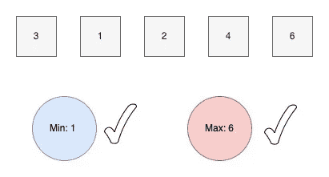

# Go - MinMax 中的泛型示例

> 原文：<https://levelup.gitconnected.com/generics-example-in-go-minmax-40593f0adaa8>

## 仿制药太牛逼了！为什么不试一个例子呢

泛型编程支持以泛型形式表示函数和数据结构，并去掉了类型。

这是什么意思？

这篇文章用一个例子来说明为什么以及如何在 Go 中使用泛型。

# 最小-最大问题

给定一系列类型都为整数(浮点或字符串)的值，返回最小值/最大值。



最小-最大问题

在 Go1.18 之前，处理这个问题非常不方便，因为你必须为不同的类型定义单独的 min/max 函数。

还好！随着 Go 1.18 中[新的被接受的提议](https://go.googlesource.com/proposal/+/refs/heads/master/design/43651-type-parameters.md)，我们终于可以通过使用泛型来简化我们的生活了。

# 泛型概念概述

*   函数可以有一个额外的**类型参数列表**，它使用方括号，但看起来像一个普通的参数列表:`func Function**[**T any**]**(p T) { ... }`。
*   这些类型参数可以由常规参数和函数体使用。
*   类型也可以有一个类型参数列表:`type M[T any] []T`。
*   每个类型参数都有一个**类型约束**，就像每个普通参数都有一个类型:`func Function[T **Constraint**](p T) { ... }`。
*   类型约束是接口类型。
*   新的预声明名称`any`是一个允许任何类型的类型约束。
*   泛型函数只能使用约束所允许的所有类型支持的操作。
*   使用泛型函数或类型需要传递类型参数。
*   **类型推断**允许在一般情况下省略函数调用的类型参数。

# 泛型函数声明示例

## 说明

## 第 6 行

包`constraints`定义了一组与类型参数一起使用的有用约束。

## 第 9 行

`Ordered`是一个约束，允许任何支持运算符< < = > = >的有序类型，例如`int` `float` `string`

参数`args`被称为*可变参数*,因为它可以用任意数量的 t 类型尾随参数调用

记住在函数实现中可变参数的类型是[]T；但是，可变参数的类型是...函数声明中的 t。

# 泛型功能测试

测试上面的代码非常容易；你需要运行代码。

```
go test -v
```

我希望你喜欢读这篇文章😄。如果你想支持我☕作为一个作家，考虑注册[成为一个媒体成员](https://jerryan.medium.com/membership)。你还可以无限制地访问媒体上的每个故事。

## 资源

*   [https://go . Google source . com/proposal/+/refs/heads/master/design/43651-type-parameters . MD](https://go.googlesource.com/proposal/+/refs/heads/master/design/43651-type-parameters.md)
*   [Go 仿制药的例子](https://github.com/mattn/go-generics-example)
*   [走仿制药这条路](https://github.com/akutz/go-generics-the-hard-way)
*   [泛型编程替代品—在 Go 1.18 之前](https://codilime.com/blog/generics-in-go-definition-history-and-examples-of-use/)
*   [https://it next . io/generics-in-golang-1-18-no-need-to-write-max-min-more-maybe-d79f 3392 ca 38](https://itnext.io/generics-in-golang-1-18-no-need-to-write-max-min-anymore-maybe-d79f3392ca38)