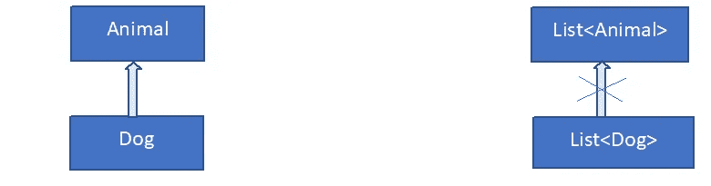

# Kotlin 中的泛型

> 原文：<https://levelup.gitconnected.com/generics-in-kotlin-49da16031de4>

泛型是泛型编程的工具，允许类、接口和方法对各种类型的对象进行操作。它基本上允许类型作为方法、类和接口的参数。

泛型通过限制可接受的类型来消除类型转换的需要，从而保证运行时类型安全。

**类型参数**

类型参数用于实现泛型。类型参数是与类、接口或方法一起使用的实际类型的占位符。

保存字符串类型变量的容器类示例:

**类**String container {
var item:String？=**null
fun**set(item:String){
this。**项目** =项目
}
}

现在假设，我们想要一个类似的类，它可以保存 Int 类型的项，而不是 String。然后，我们将不得不为 Int 创建类似的类。

**class**Int container {
**var item**:Int？=**null
fun**set(item:Int){
**this**。**项目** =项目
}
}

这使得我们为每个这样的需求创建一个新的类型。这就是泛型的用武之地。我们可以如下创建一个泛型类，并通过放置实际类型来代替类型参数(在本例中为 T)来实现各种类型的功能，如 String、Int 等，如下所示

**val**Container = Container<Int>()或 val Container = Container<String>等。

**类**容器<T>{
**var item**:T？=**null
fun**set(item:T){
**this**。**项目** =项目
}
}

**泛型类型的不变性**

像 Java 一样，Kotlin 中的泛型类型是不变的。这意味着超类型列表不是其子类型列表的超类型。例如，列表<animal>不是列表<dog>的超类型。同样，列表<any>也不是列表<string>的超类型。</string></any></dog></animal>



列表<dog>不是列表<animal>的子类型</animal></dog>

```
**val** listString : ArrayList<String> = ArrayList()

**val** listObjects : ArrayList<Any> = listString;     // A compile time error – Type mismatch, occurs here and saves from runtime exception
```

上面的第 2 行引发了一个编译时错误，禁止将字符串列表赋值给对象列表。如果不是这种情况，那么当用户试图分配给错误的类型时，可能会出现运行时异常，如下所示:

```
listObjects.add(1);

**var** firstItem : String = listObjects.get(0);  // Class Cast exception - Cannot cast Integer to String
```

因此，不变性保证了运行时的安全性。然而，这禁止了安全和直观的操作，例如将字符串列表复制到对象列表中，因为列表<string>不是列表的子类型。</string>

**差异**

Kotlin 中的 Variance 解决了由于泛型类型的不变性而引发的问题。它与 Java 中的通配符类型相同。下面给出了一个在 Java 中使用通配符的例子:

接口集合 <e>… {</e>

void addAll(集合 extends E>项)；

}

？扩展 E 称为通配符类型参数。这里的 addAll 方法有一个 E 对象或 E 子类型对象的集合作为参数。

现在这克服了上面提到的限制。列表<string>是列表 extends Object>的子类型。集合 extends E>是一个生产者，我们只能读取它，不能写入它，也就是说，我们不能对它调用 add()或 set()。</string>

另一方面，列表 super String>是列表<对象>的**超类型**，因为它表示字符串对象的列表或者是字符串超类型的对象的列表。

集合 Super String>是一个消费者，我们只能写入它，不能从中读取。

前者称为协方差，后者称为逆变。

在 KotlIn 中，我们可以分别使用 out 和 in 关键字实现协方差和逆变。

举个例子，

接口样本生成器 <out e="">{</out>

fun getE(): E

}

在这里，SampleProducer 是 E 的生产者，因为它只生产 E，不消费 E。SampleProducer 类在参数 e 中是协变的。

接口样本消费者 <in e="">{</in>

有趣的 takeE

}

在这里，SampleConsumer 是 E 的消费者，因为它只消费 E 而不生产。

SampleConsumer 类在 e。

“出”和“入”修饰符称为方差注释。和什么一样？在 Java 中扩展 E，如果类/接口也使用 E，我们就不能使用 out。至于用什么？在 Java 中，如果类/接口也产生 E，我们就不能使用 in。

**申报场地差异和使用场地差异**

在 Kotlin 中，可以通过两种不同的方式使用 out 和 in 修饰符来实现变化。上面显示的第一个例子称为声明站点方差，因为它用在类型参数的声明站点。

使用位置差异是通过在参数的使用位置使用输出和输入修改器实现的。

举个例子，

趣味副本(to: List <in string="">，item: String){}</in>

在这里，我们可以传递一个字符串列表、一个 CharSequence 列表或一个对象列表，因为如上所述，<in string="">对应于 Java 的 super String>。</in>

**星形投影:*代替原始类型**

Java 允许使用原始类型。比如 ArrayList list = new ArrayList()；

这可能导致运行时出现 ClassCastException。

```
list.add(**"Hello"**);list.add(1); 

Integer first = (Integer) collection.get(0);  // ClassCastException
```

Kotlin 不允许使用原始类型参数。然而，类似于原始类型，然而安全，科特林有星形投影。

举个例子，

```
**val** listAlphabet : ArrayList<String> = *arrayListOf*(**"A"**,**"B"**)

**val** listCode     : ArrayList<Int>    = *arrayListOf*(65,66)

**val** list : List<*> =

 **if**(showCode)

     listAlphabet

**else** listCode
```

由于 ArrayList 等同于 ArrayList <out any="">，所以可以从 star projected list 中读取。但是不可能在一个星型链表中写任何东西，因为它相当于数组列表<in nothing="">。简单地说，由于我们对实际类型一无所知，我们可以从列表中读取对 any 类的对象执行的任何操作，因为 Any 是 Kotlin 中所有对象的超类型。并且我们不能在 star projected 列表中写入任何内容，因为我们不知道实际使用的类型。</in></out>

**类型擦除**

在运行时，任何关于泛型类实例使用的实际类型参数的信息都会被删除，并简化为*。类型安全检查已经在编译时执行了。例如，在 Kotlin 中，ArrayList <string>在运行时被简化为 ArrayList 。因此，我们不能在运行时执行 is 检查。对于上述例子，</string>

if(list 是 ArrayList <string>) //编译器报错:无法检查擦除类型的实例。</string>

因此，我们只能使用*进行检查，即，

list 是 ArrayList 是合法的。

**参考文献**

[https://kotlinlang.org/docs/reference/generics.html](https://kotlinlang.org/docs/reference/generics.html)