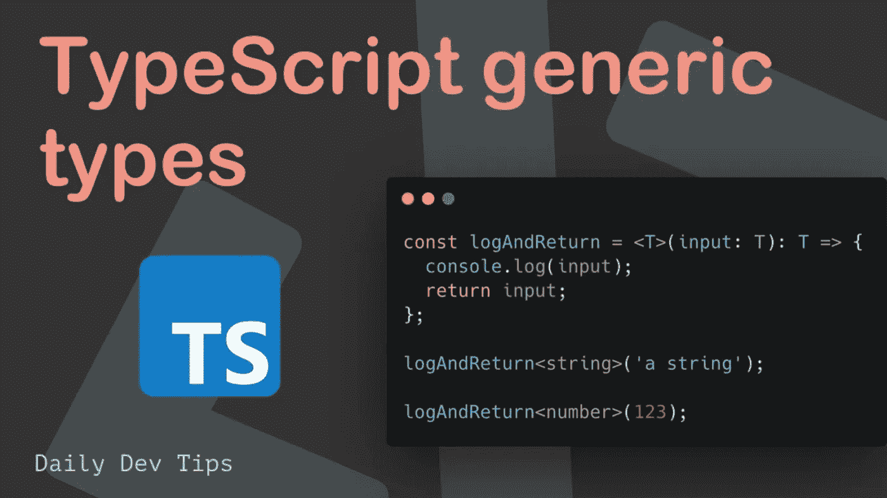

# TypeScript 中的泛型——愚蠢地简化了的基础知识

> 原文：<https://levelup.gitconnected.com/generics-in-typescript-must-know-fundamentals-stupidly-simplified-e7b4d7ffc0e3>

本文旨在通过应用于**函数的参数**、应用于**函数的** **返回类型**以及应用于**类字段或方法**的示例，以简单实用的方式解释和演示 typescript 泛型。



TL；这里的[博士码回购](https://github.com/caopengau/typescript-generics-demo)。让我们开始吧…

## 没有泛型的问题

```
function getArray(items : any[] ) : any[] {
    return new Array().concat(items);
}

let myNumArr = getArray([100, 200, 300]);
let myStrArr = getArray(["Hello", "World"]);

myNumArr.push(400); // OK
myStrArr.push("Hello TypeScript"); // OK

myNumArr.push("Hi"); // OK
myStrArr.push(500); // OK

console.log(myNumArr); // [100, 200, 300, 400, "Hi"]
console.log(myStrArr); // ["Hello", "World", "Hello TypeScript", 500]
```

在上面的例子中，`getArray()`函数接受 any 类型的数组。它创建一个 any 类型的新数组，将项连接到该数组，并返回新数组。因为我们使用了类型`any`作为参数，所以我们可以将任何类型的数组传递给函数。但是，这可能不是我们想要的行为。我们可能希望将数字添加到数字数组中，或者将字符串添加到字符串数组中，而不是将数字添加到字符串数组中，反之亦然。

## 解决办法

泛型使用类型变量`<T>`，一种特殊的表示类型的变量。type 变量记住用户提供的类型，并且只使用该特定类型。这被称为保留类型信息。

```
function getArray<T>(items : T[] ) : T[] {
    return new Array<T>().concat(items);
}

let myNumArr = getArray<number>([100, 200, 300]);
let myStrArr = getArray<string>(["Hello", "World"]);

myNumArr.push(400); // OK
myStrArr.push("Hello TypeScript"); // OK

myNumArr.push("Hi"); // Compiler Error
myStrArr.push(500); // Compiler Error
```

在上面的例子中，类型变量`T`是用尖括号`getArray<T>`中的函数指定的。类型变量`T`也用于指定参数和返回值的类型。这意味着在函数调用时指定的数据类型也将是参数和返回值的数据类型。

我们调用通用函数`getArray()`并传递数字数组和字符串数组。例如，调用函数为`getArray<number>([100, 200, 300])`会将`T`替换为`number`，因此，参数和返回值的类型将是一个数字数组。同理，对于`getArray<string>(["Hello", "World"])`，参数的类型和返回值都将是字符串数组。所以现在，如果你试图在`myNumArr`中添加一个字符串或者在`myStrArr`数组中添加一个数字，编译器会显示一个错误。因此，您获得了类型检查的优势。

简而言之，泛型提供了一种创建可重用组件的方法，并提供了一种使组件与任何数据类型一起工作而不局限于一种数据类型的方法。因此，组件可以被多种数据类型调用或使用。

# 在 API 返回类型中使用泛型的示例

假设我们将两个外部数据源(随机电影和银行详细信息)集成到我们的系统中。

没有泛型

```
import axios from "axios";
const movieUrl = "[https://k2maan-moviehut.herokuapp.com/api/random](https://k2maan-moviehut.herokuapp.com/api/random)";
const bankUrl = "[https://random-data-api.com/api/v2/banks](https://random-data-api.com/api/v2/banks)";const mainWithoutType = async () => {
  const movieRes = await axios.get(movieUrl);
  console.log(movieRes.data); // no way of knowing its data type
  const bankRes = await axios.get(bankUrl);
  console.log(bankRes.data); // no way of knowing its data type
};
mainWithoutType();
```

有了泛型，我们可以在开发过程中更好地防止 Typescript 的错误。首先让我们创建一个文件`types.ts`并定义类型`Movie`和`Bank`

```
export type Movie = {
  _id: string;
  name: string;
  releaseYear: number;
  certificate: string;
  runtime: string;
  genre: string;
  imdbRating: number;
  overview: string;
  metaScore: number;
  director: string;
};export type Bank = {
  id: number;
  uid: string;
  account_number: string;
  iban: string;
  bank_name: string;
  routing_number: string;
  swift_bic: string;
};
```

然后让我们定义一个助手函数来包装 API 调用

```
import { Bank, Movie } from "./types";const getDataWithType = async <T>(
  url: string
): Promise<AxiosResponse<T>> => {
  const response = await axios.get<T>(url);
  return response;
};
```

然后，我们可以在调用每个 API 时确定数据的类型。

```
...const main = async () => {
    const { data: movie } = await getDataWithType<Movie>(movieUrl);
    const { data: bank } = await getDataWithType<Bank>(bankUrl);
    console.log(movie); // Typing movie. hints Movie properties
    console.log(bank); // Typing bank. hints Bank properties
};
...
```

# 在 API 参数类型中使用泛型的示例

假设我们有一个 util 函数来帮助我们从`movie`或`bank`中提取名字

```
const extractName = <T extends { name?: string, bank_name?: string}>(
  obj: T
) => {
 if('name' in obj) return obj.name;
 if('bank_name' in obj) return obj.bank_name;
 return 'No name found';
};
```

现在我们可以在我们的主函数中使用它

```
const main = async () => {
  const { data: movie } = await getDataWithType<Movie>(movieUrl);
  const { data: bank } = await getDataWithType<Bank>(bankUrl); console.log(extractName(movie));
  console.log(extractName(bank));
};
```

# 在类字段和方法中使用泛型的示例

TypeScript 支持泛型类。泛型类型参数在类名后的尖括号中指定。泛型类可以有泛型字段(成员变量)或方法。

```
class KeyValueProcessor<T,U>
{
    // adding ! to avoid TS2564 error
    private key!: T;
    private val!: U;

    setKeyValue(key: T, val: U): void { 
        this.key = key;
        this.val = val;
    }

    display():void { 
        console.log(`Key = ${this.key}, val = ${this.val}`);
    }
}

let kvp1 = new KeyValuePair<number, string>();
kvp1.setKeyValue(1, "Steve");
kvp1.display(); //Output: Key = 1, Val = Steve 

let kvp2 = new KayValuePair<string, string>();
kvp2.SetKeyValue("CEO", "Bill"); 
kvp2.display(); //Output: Key = CEO, Val = Bill
```

## 延伸阅读:

*   [TypeScript 必备基础知识—类型别名和接口](/typescript-must-know-fundamentals-for-your-next-tech-interview-or-project-255ae70df0a3)
*   [像专业人士一样使用 Typescript keyof】](/use-typescript-keyof-like-a-pro-56f3a3d06b73)
*   [打字稿类——从零到英雄](/typescript-classes-from-zero-to-hero-a429a3c96189)
*   [使用类和装饰器的下一级 Typescript 运行时类型验证](/next-level-your-typescript-runtime-type-validation-using-class-and-decorators-ddd2ce3c86f3)
*   [掌握类型脚本泛型:终极指南](/mastering-typescript-generics-the-ultimate-guide-3a62afeff44)
*   [打字技巧和提示:立即成为专业人士](https://bootcamp.uxdesign.cc/typescript-tricks-and-tips-become-a-pro-in-no-time-5390aba151be)
*   [Typescript 遗漏了这一点，但你不应该—运行时类型验证](/typescript-missed-this-but-you-shouldnt-runtime-type-validation-aa8a81ce4289)
*   [Typescript 枚举陷阱和解决方案必须知道](/typescript-enum-pitfalls-and-solutions-must-know-bb971cb0f7d2)
*   [掌握打字稿泛型—终极指南—基本接口技术](https://bootcamp.uxdesign.cc/mastering-typescript-generics-the-ultimate-guide-essential-interface-techniques-86e793cf1fc)
*   Javascript 开发人员经常忽略的 Typescript 特性
*   [掌握打字稿中的交集和并集类型:终极指南和基本技巧](/mastering-intersection-and-union-types-in-typescript-the-ultimate-guide-essential-techniques-49aa9f6a188a)

如果你觉得这个指南有帮助，请鼓掌并跟我来。通过[这个链接](https://medium.com/@caopengau/membership)加入 medium，你可以在 medium 上看到我和所有其他优秀作家的优质文章。

# 分级编码

感谢您成为我们社区的一员！在你离开之前:

*   👏为故事鼓掌，跟着作者走👉
*   📰查看[升级编码出版物](https://levelup.gitconnected.com/?utm_source=pub&utm_medium=post)中的更多内容
*   🔔关注我们:[Twitter](https://twitter.com/gitconnected)|[LinkedIn](https://www.linkedin.com/company/gitconnected)|[时事通讯](https://newsletter.levelup.dev)

🚀👉 [**加入升级人才集体，找到一份神奇的工作**](https://jobs.levelup.dev/talent/welcome?referral=true)