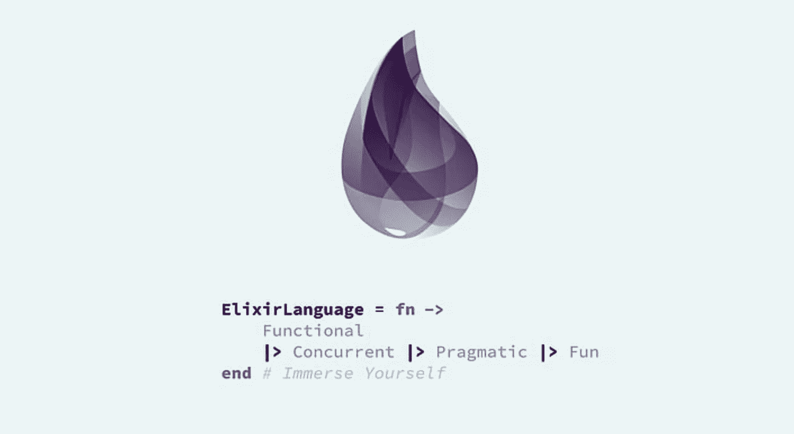
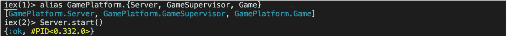
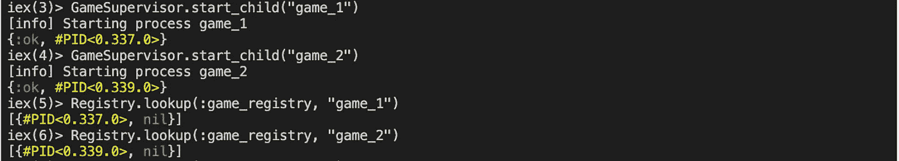
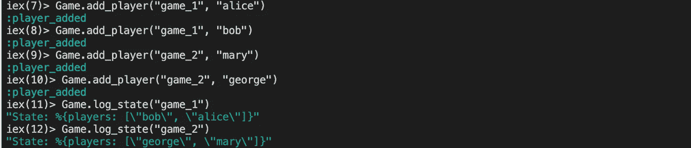
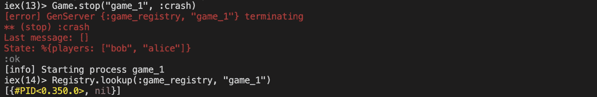

# GenServer、DynamicSupervisor 和 Registry:管理进程的灵丹妙药

> 原文：<https://levelup.gitconnected.com/genserver-dynamicsupervisor-and-registry-the-elixir-triad-to-manage-processes-a65d4c3351c1>

原载[壁纸耀斑](https://www.wallpaperflare.com/code-elixir-programming-wallpaper-hhryp)

在过去的一年里，我的程序员之旅将我带到了 Elixir 的领域，这是一种可以编译成 Erlang VM 的函数式编程语言。虽然 Elixir 提供了语法上的乐趣，如[模式匹配](https://elixir-lang.org/getting-started/pattern-matching.html)和[管道操作符](https://elixirschool.com/en/lessons/basics/pipe-operator/)，但它通常被认为是高度并发和容错应用程序的理想选择。

这在实践中意味着什么，我困惑了一段时间，直到我理解了三个本机模块——*gen server、DynamicSupervisor* 和*Registry*——如何协同工作。

想象一下多人游戏的场景。在构建过程中，您可能需要:

*   同时运行大量动态游戏的能力。
*   能够查找正在运行的游戏，例如，玩家可以加入游戏。
*   如果游戏因任何原因崩溃，可以自动重启。

虽然上述逻辑完全属于软件开发的范畴，但对其进行编程可能会带来巨大的开销，而且没有产品价值。然而，使用 Elixir，您可以通过使用三个核心模块来解决这个问题:

> [**gen server**](https://hexdocs.pm/elixir/GenServer.html)**。**这抽象了并发流程的实现，并带有一个标准接口来管理状态和执行逻辑。每个游戏实例对应一个 GenServer 进程。
> 
> [**动态监控器**](https://hexdocs.pm/elixir/DynamicSupervisor.html) **。**它管理任意数量和不断变化的游戏，按需将它们作为子进程启动，并在它们崩溃时重启。
> 
> [**注册表**](https://hexdocs.pm/elixir/Registry.html) **。这为进程提供了一个键值存储，允许我们很容易地查找一个正在运行的游戏。**

令人惊讶的是，只用几行代码就可以做到这一点。

首先，你需要一个*监控器*监控*动态监控器*和*注册表。你可以把它想象成应用入口点，有两个子进程负责单独的游戏。*

然后，*号动态监控器。*`start_child/1`方法将用给定参数设置的自定义名称开始一个新游戏。

最后但同样重要的是，一个定义游戏实例的 *GenServer* 。

这里的关键元素是在`start_link/1`中使用的`via_tuple/1`方法，这个调用启动了 *GenServer* 进程。`:via`选项允许我们将进程映射到*注册表*中的自定义名称，然后可以重用该名称与给定的进程进行交互。

*详见* [*文档*](https://hexdocs.pm/elixir/GenServer.html#module-name-registration) *。*

现在，您可以想象这在交互式 shell 中是如何工作的。

创建方便的别名并启动管理程序。这也将启动注册表和游戏管理员作为子进程。

启动单独的游戏进程，并使用给定的名称在*注册表中查找它们。*

使用给定的名称单独与游戏交互—在本例中，添加玩家。检查游戏状态。

以一个非正常的原因使一个游戏崩溃，并看到它已经用一个新的进程 ID (#PID)但相同的名称重新启动。

这就是了。你知道其他管理并发进程的好方法吗？我洗耳恭听。

快乐编码🚀

*特别感谢*[*OMG networking*](http://omg.network/)*k 的同事们为仙丹之旅。*