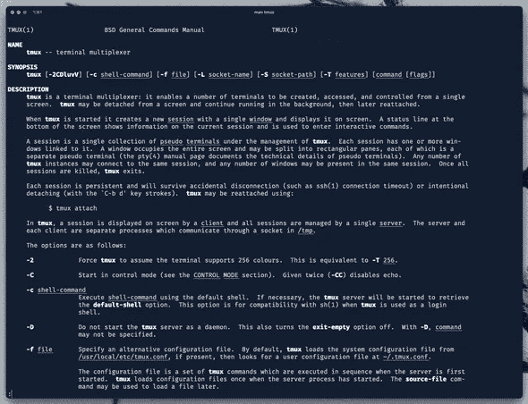

# tmux 入门简明指南

> 原文：<https://levelup.gitconnected.com/gentle-guide-to-get-started-with-tmux-2d4edded19ab>

您最终来到这里可能是因为您希望提高您的命令行技能。没关系，这正是我写这篇博客的原因。自从我开始学习如何编程，我就成了一名终端居民，这很棒。当我登录到我的 shell 时，我总是感觉像在家里一样。今天，我们的终端体验会感觉更好。我们将用一个叫做 tmux 的伟大工具来提升我们的知识和工具带。


*照片由* [*大卫*](https://unsplash.com/@diskander?utm_source=unsplash&utm_medium=referral&utm_content=creditCopyText) *上* [*下*](https://unsplash.com/s/photos/get-started?utm_source=unsplash&utm_medium=referral&utm_content=creditCopyText)

# tmux 是什么？

tmux 是一个终端多路复用器，这意味着它是终端中的一个窗口管理器。它允许您在一个终端窗口(会话)中打开多个窗口(会话)。所以它允许其他程序从它上面运行，让你可以很容易地操作它们。大多数人发现每天使用 tmux 的一个特点是。

但是，除了作为一个窗口管理器，tmux 还可以做以下事情:通过在 tmux 内部运行程序，保护远程服务器上正在运行的程序免受连接中断的影响。我们都遇到过这种情况—您连接到服务器，去买咖啡/午餐，回来后，会话被冻结或没有响应。允许用户从多台不同的本地计算机访问远程服务器上运行的程序。

今天，我们将关注 tmux 的窗口管理器方面。在以后的博客文章中，我们将介绍 tmux 的一些高级用法，以及它如何为您带来好处。

# 安装

您可以在所有主要平台上使用包管理器安装 tmux，但是让我们来介绍一些最著名的平台。在 Debian 或 Ubuntu 上，您可以执行以下操作:

在 Mac OS 上，您可以使用 brew:

为了检查安装是否成功，让我们试着阅读 tmux 的手册页:

如果你得到这样的东西:



你可以走了。

# 正在启动 tmux

我们可以在终端中使用`tmux`命令来启动 tmux，看看这是怎么回事。之后，你可以看到一切都保持不变，除了底部的绿线。这里发生的事情是，我们作为客户端连接到一个 tmux 服务器。tmux 在后台运行特定 PID 上的服务器，当我们键入`tmux`时，我们自动运行服务器。

因此，我们从名为 0 的会话连接到 tmux 服务器，正如您在屏幕的`[0]`部分看到的。所以 tmux 充当标准终端会话的中转。让我们看看当您进入 tmux 会话时会得到什么:


在左下角，您会看到代表会话的`[0]`。紧挨着它的是`0:zsh`,显示哪个窗口是打开的，哪个程序正在那里运行。我们刚刚开始这个会话，所以我们只打开了一个窗口，zsh 正在那里运行。

您可以继续使用终端，就像您通常使用它一样，但是那样会很无聊，对吗？让我们学习一两件我们作为 tmux 初学者可以做的事情。我想让我们经历一下在 tmux 中创建和移动窗格的过程。

# 窗格管理

如果你使用过 iTerm2 并在那里使用了窗格分割，你会非常喜欢这个特性。在 tmux 中几乎是一样的，唯一的区别是用来创建新窗格的快捷方式。在 iTerm2 中，你可以使用`cmd + d`和`cmd + shift + d`来垂直和水平分割窗格。

## 创建窗格

在 tmux 中，你可以用`Ctrl-b %`进行垂直分割，用`Ctrl-b "`进行水平分割。你会看到所有的快捷方式都是以`Ctrl-b`或者简称`C-b`开头的。要让`C-b`快捷键起作用，需要同时按下 control 键和 b 键，然后可以按下后面的字符或者类似`"`的符号进行水平拆分。比如说。`C-b`向 tmux 发出信号，表示您将向其发送一个快捷方式。下面让我们一起来试试这个功能:


如果出于某种原因你不喜欢快捷方式，你可以键入`tmux split-window -h`来进行水平分割，键入`tmux split-window -v`来进行垂直分割。

## 在窗格周围移动

在上面的 GIF 中，我们可能把它推得太多了，但是你已经明白了。现在，对于最重要的部分——如何走动？别担心，默认情况下比 iTerm2 中更容易。你使用`C-b`和左、右、上、下箭头。于是`C-b Arrow-Left` `C-b Arrow-Right`以此类推。

## 关闭窗格

如果您完成了一个窗格，只需按下`Ctrl-d`，它就会关闭。

现在让我们试着创建一个新窗口。

# 窗口管理

tmux 中的窗口与 iTerm2 中的选项卡非常相似。这是一个新的画布，您可以将它分成多个窗格并运行命令。您一定会问——我如何创建一个？

## 创建窗口

只要做`C-b c`，一个新的窗口就形成了。你可以尝试几次。我做了类似的事情，除了在每个窗口中打开一个程序来一起查看不同之处。下面我们来看看:


您可以在 tmux 状态行看到以下文本:

```
0:zsh 1:vim* 2:ed- 3:ruby
```

`0:zsh`显示第一个窗口，其中只有 zsh 在运行。`1:vim*`让我们不要在第二个窗口中，我们有 Vim 运行，星号`*`显示它是活动窗口。`2:ed-`做同样的事情，除了破折号`-`告诉我们这是最后一个窗口。另一个问题现在出现了——我们如何改变窗口？

# 在窗口中导航

别担心，我抓住你了。你可以用多种方式改变窗口，但我发现这是最有效的。您可以使用`C-b`和窗口索引的组合，例如`C-b 1`来转到 tmux 状态行中标记为 1 的窗口。所以在我们的例子中,`C-b 0`将打开窗口，同时打开 zsh，因为它像`0:zsh`一样显示在屏幕底部的 tmux 状态行中。

您还可以使用`C-b p`来显示上一个窗口，`C-b n`来显示下一个窗口，`C-b l`来显示最后一个窗口(这是前面部分中破折号`-`的位置)。

# tmux 会话

tmux 的灵活会话不会很好。您可以随时连接和分离会话。大多数人称赞 tmux 的会话管理。想象会议是你工作的不同领域。例如，一个会话可以与您运行前端、后端、编辑器、测试等的私有 web 项目相关。另一个会话可以是某个服务器上的 SSH 会话，您可以在那里摆弄基础设施。

## 从会话中附加和分离

要感受会话的强大功能，您可以在另一个终端窗口或选项卡中启动 tmux(假设您有一个会话在运行，如上例所示)。如果您现在按下`C-b d`，您应该会看到以下内容:

```
$ tmux 
[detached (from session 1 ) ]
```

酷，我们从刚刚创建的会话中分离出来。现在，在同一个终端窗口中，键入`tmux ls`:

```
$ tmux ls 
0: 4 windows (created Thu Aug 12 20:08:22 2021 ) (attached) 
1: 1 windows (created Thu Aug 12 20:15:03 2021 )
```

标记为 0 的第一个会话显示我们有四个打开的窗口，并且我们连接到它。但标记为 1(一)的第二个会话未附加。使用`C-b d`，我们从标记为 1 的会话中分离出来，并使用`tmux ls`列出所有可用的会话。多好啊，现在我们可以更好地组织我们的工作了。

如果您不喜欢用 0 和 1 这样的数字作为会话的默认命名，您可以使用`tmux new -s heythere`来给会话命名。现在，创建的会话将获得`heythere`名称。通过分离(`C-b d`)并再次运行`tmux ls`，我们可以看到:

```
$ tmux ls 
0: 4 windows (created Thu Aug 12 20:08:22 2021 ) (attached) 
1: 1 windows (created Thu Aug 12 20:15:03 2021 ) 
heythere: 1 windows (created Thu Aug 12 20:21:09 2021 )
```

然后，我们可以通过以下方式轻松地连接到`heythere`会话:

```
tmux attach -t heythere
```

我们又回到了`heythere`环节。很酷，对吧？我想这对一个人来说足够了。我们的终端有很多需要处理和使用的东西。我决定我们聚在一起，试着用几天或几周的时间。

# 最后的想法

这应该就是 tmux 入门的全部内容。在下一篇博文之前，我想提一件可能对你我有所帮助的事情。如果你迷路了或者忘记了快捷键，有一个`C-b ?`快捷键显示了你可以使用的命令列表。它看起来是这样的:


此外，如果您正在使用 iTerm2，另一个值得注意的事情是它与 tmux 的集成。更多信息请阅读 [iTerm2 文档](https://gitlab.com/gnachman/iterm2/-/wikis/TmuxIntegration)。

我打算写一篇后续博文，介绍一些 tmux 的高级用法。如果你喜欢这篇文章并想看另一篇博文，考虑加入[时事通讯](https://pragmaticpineapple.com/gentle-guide-to-get-started-with-tmux/newsletter)，它会在发布时通知你。

一如既往，不要忘记与你的朋友或同事分享。这里有一条推文，你可以发消息，比如，转发，忽略，或者做任何你想做的事情:

感谢你的加入，我期待着在下一部中见到你。

干杯。

*原载于 2021 年 8 月 16 日 https://pragmaticpineapple.com*[](https://pragmaticpineapple.com/gentle-guide-to-get-started-with-tmux/)**。**