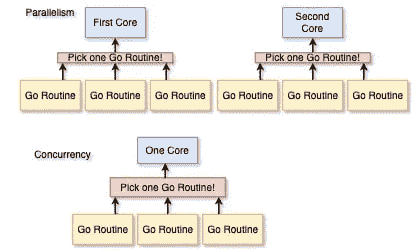
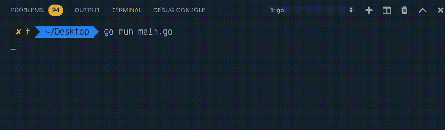
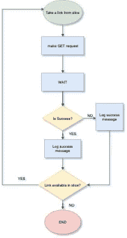
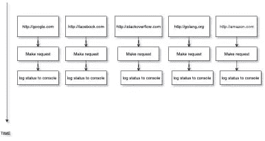
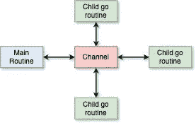

# 体验 Go 中的并发性

> 原文：<https://levelup.gitconnected.com/get-a-taste-of-concurrency-in-go-625e4301810f>


2006 年，英特尔发布了首款双核 CPU。不久之后，一种能够从多核中获益的语言( [Go](https://golang.org/doc/faq) )诞生了。

# 介绍

并发性是指以任意不确定的顺序执行一组指令，并且仍然能够产生与顺序执行功能相同的程序输出。

在现代程序中，指令的同时执行随处可见。例如，我们可以在服务于多个 web 请求的 web 服务器中看到它，或者在我们的 IDE 中编译代码，同时仍然能够编辑它。这个术语经常与*排比*混淆。

假设你有一个三明治和一杯奶昔，你需要在 3 分钟内吃完。你可以做两件事:

**选择 1:**
1。要么咬一口三明治，咀嚼。
2。喝一口奶昔，喝一口。
3。重复这个过程，直到你在 3 分钟内完成。

**选择二:**
1。你可以把整个三明治放进嘴里，喝光奶昔。
2。试着把它们一起吞下去。
3。等到你在 3 分钟内完成这两个问题。


我的饮食超能力

选择 1 是并发，选择 2 是并行。并发是“同时进行”，并行是“同时执行”。你可以根据时间、地点和朋友之间的距离来选择任何一种方式，以充分利用每一种方式。😛

> 两个功能可能能够同时运行，但它们可能不是*并行*。并行执行意味着同时评估两个或更多独立的指令，这只有在有多个内核可用于运行这些指令的情况下才有可能。并发是指同时处理许多事情。并行意味着同时做那些事情。

**并发不是并行，但它确实启用了并行。如果你有一个处理器，你的代码不能是并行的，但是可以是并发的。如果有多个处理器可用，Go 可以并行运行你的并发代码。**

# 可视化 1，并行和并发



*并行性和并发性*

为了理解并发性，我们将首先看到一个以*序列*运行指令集的程序。让我们考虑一个简单的程序，它通过调用一个网站的主页来检查这个网站是否已经打开。

*向每个链接发出 http GET 请求时循环的一段字符串*

1.  在第 9 行，我们声明了一个字符串的[切片](https://blog.golang.org/slices)(比如说*数组*)
2.  在第 16 行，我们声明了一个[范围](https://tour.golang.org/moretypes/16)来循环遍历字符串切片，并为切片中的每个元素(即链接)调用`checkLink`函数。
3.  在第 22 行，`checkLink`函数向链接发出`GET`请求，**等待响应返回**，然后记录成功或错误响应。

# 输出:



正如在输出中观察到的那样，在调用每个链接后都有明显的延迟。对于每个请求，我们等待请求返回响应。在每个`fetch`之间没有其他*执行路径*可以执行。这使得它成为一个*顺序*程序。

# 可视化 2，程序流程



程序流程

> 一段代码的 ***执行路径*** 称为 ***例程*** 。在围棋中，它们被称为 goroutines。每个 Go 程序都至少有一个 goroutine，这是程序开始执行的主要函数。

等待的时间阻碍了我们的日常工作继续进行。这是对我们拥有的多核资源的浪费。让我们使用 goroutine 来解决这个问题。

# 戈罗廷

Go 中的 goroutine 为我们的程序提供了一条新的执行路径。这些可以认为类似于类似于 **C#** 和 **Java** 这样的语言中的线程(它们其实是不同的但是我们在这里画一些图)。goroutine 对系统的影响更小。由于较大的堆栈大小，一个线程消耗 1MB 的内存，而一个 goroutine 开始时只有其中的一小部分(2KB ),因为它的堆栈是可调整大小的。

> 可以把 goroutines 想象成应用级线程。正如操作系统在硬件内核上切换操作系统线程一样，goroutines 也在每个分配的操作系统线程上进行上下文切换。

您可以使用以下方法获得程序可用的 CPU 内核数量:

```
 // NumCPU returns the number of logical
    // CPUs usable by the current process.
    fmt.Println(runtime.NumCPU())
```

Goroutines 没有返回唯一的标识符、名称或数据结构，它们只是匿名的工人。如果有兴趣，经验丰富的地鼠可以在这里阅读。

# 使用 Goroutine

一个新的程序可以通过使用关键字`go`后接一个函数调用来启动。参数在主 goroutine 中计算，但函数在新的 goroutine 中执行。

```
for _, link := range links {
    go checkLink(link)
}
```

现在，每个`checkLink`函数在新的 goroutine(执行路径)中执行，并且*主 goroutine* 未被**阻塞**

## 输出:


如您所见，控制台上没有记录任何内容。主 goroutine 为每个链接触发新的 go routine，但它不等待它们完成。
由于在触发 goroutines 的循环之后没有要执行的东西，程序退出。

# 视觉 3，多个 Goroutines 同时运行



*多个 goroutines 同时运行*

这在下面的代码中显而易见:

## **输出**:


> 生成更多的 goroutines 不一定会提高程序的性能，因为它们可能不会同时执行。我们将在这篇文章的结尾了解它。

我们需要一种方法在不同的 goroutine 之间进行通信(在本例中，通知主 go routine 它们的执行情况)并同步它们的任务。为了让一个 goroutine 向另一个 goroutine 发布消息，我们需要一个*管道*。在一端，goroutine 可以发布消息，而在另一端，另一个 goroutine 可以使用我们所知的**通道**进行监听。

# 频道

通道就是这些管道，不同的例程可以通过它们在不同的 goroutines 之间发送和接收某种类型的值。

# 视觉 4，多个 Goroutines 通信



*多个 goroutines 借助通道进行通信*

引自 golang 官方巡演:

> [通道](https://tour.golang.org/concurrency/2)是一个类型化的管道，通过它你可以用通道操作符`<-`发送和接收值。

要声明一个通道，我们使用:

```
c := make(chan int)

go func() {
    c <- 42 // Send data to channel
}()

fmt.Println(<-c) // Receive data from channel
```

[在这里播放](https://play.golang.org/p/SHr3lpX4so)

1.  在通道`c`中，我们可以发送和接收整数值。**注**:数据按箭头方向流动
2.  一旦一个例程向通道发送一些东西，代码执行例程就会被阻塞(默认情况下)，直到发送给通道的值在**同一时间**被另一端接收。
3.  所谓“同一时间”，我们是指当数据在通道上发送时，通道预期接收的例程应该准备好同时接收。[参见此处的](https://play.golang.org/p/wBq5C2K9lsR)，我们不能在同一个 goroutine 中发送和接收，因为要发送到一个通道，接收端将在不同的时间激活。这时代码执行到达接收通道的语句(`<-c`)。
4.  如果没有接收者，例程将永远阻塞，并最终导致 Go 中的致命错误。你可以试试[这里](https://play.golang.org/p/XPgsj2xS0F)

让我们将`goroutines`和`channels`应用到我们的程序中。

## 输出:


> 注意:输出将根据互联网速度和 [GOMAXPROCS](https://golang.org/doc/faq#number_cpus) 的数量而变化，GOMAXPROCS 是可以一次执行的 goroutines 的数量。

我们可以使用传统的`for loop`的熟悉语法从通道接收，或者使用 Golang 的`range`循环。

```
for index := 0; index < len(links); index++ {
    fmt.Println(<-c)
}
```

传统的循环是阻塞的，因为它不能完成迭代，直到它从任何通道接收到一些东西。

另一方面，来自 Go 的范围循环重复地从通道接收值，直到它被关闭。

```
for msg := range c {
    fmt.Println(msg)
}
```

**注意**:要走出范围循环，我们应该始终关闭发送通道，否则它将永远等待。

下面是最终的代码:

产生比 OS 线程实际数量更多的 goroutines 可能会降低程序的速度。在某些情况下，编写并发程序显然是有益的。记得你的三明治和奶昔吗？当你赌上你的饮食超能力时，遵循第二种情况可能是个好主意，但当你第一次和你喜欢的人约会时，可能就不是了。😛

要深入了解 Go 并发，可以看下面的视频:

# 总结

通过了解你的程序将要处理的工作类型，我们可以做出明智的决定。对于 CPU 繁重的工作(比如一个非常大的`for`循环或者计算一个相当大的数字的斐波纳契数)，线程永远不会空闲。在这种情况下，在多个操作系统/硬件线程上并行运行 goroutines 将产生性能提升。

如果您的 goroutines 多于可用的 OS/硬件线程，那么在每个线程上打开和关闭 goroutines 将会产生延迟成本。更多的例行程序将不得不等待。

对于 IO 繁重的工作(如访问文件系统或进行网络调用)，线程必须等待操作系统完成任务。在这种情况下，OS/硬件将变得空闲，而其他 goroutines 将有机会执行。因此，没有并行执行的并发性将在这里受益。


你做得很好😇

**感谢你坚持到现在。重要的事情，比如渠道之间的沟通机制的类型，围绕它的一些设计模式，以及一个真实世界的例子，都留待单独讨论。你可以说出你的疑问，或者在我的推特上打个招呼。请考虑一些反馈或分享文章给那些可能从中受益的人。**

[](https://gitconnected.com/learn/golang) [## 学习围棋-最佳围棋教程(2019) | gitconnected

### Go 是一种静态类型的命令式编译语言。然而，与许多编译编程语言不同，Go 是…

gitconnected.com](https://gitconnected.com/learn/golang)