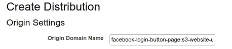

# 熟悉脸书登录和图形 API

> 原文：<https://levelup.gitconnected.com/get-acquainted-with-facebook-login-and-the-graph-api-d1e951e0a1da>


Kaboompics.com 摄于 Pexels

## 新技能沙盒

## 一个快速入门教程，设置脸书登录，并开始向脸书的图形 API 发出请求

每当我遇到一项我以前没有接触过的技术时，我总是会感到害怕——无论是云服务、API 还是库包。阅读文档或营销文案可能会让我变得熟悉甚至兴奋…但它很少让我感到舒适或自信。你知道是什么吗？**在沙盒里玩耍。**

随着越来越多的公司寻找能够将现有服务(如脸书和谷歌)与他们的产品集成的开发者，你可以通过熟悉[脸书登录](https://developers.facebook.com/docs/facebook-login/)和[脸书图形 API](https://developers.facebook.com/docs/graph-api) 来增加你的市场价值。

> 本教程将引导您完成设置脸书登录的步骤，这样您就可以获得一个长期的用户访问令牌，用于向脸书的 Graph API 发送请求。

最后，我们将使用 Postman 来演示几个 Graph API 请求。这应该足够让你独自在沙盒里玩耍了。

> 使用脸书登录有两种常见的使用情形:
> 
> 首先，您的应用程序可以将 ***认证*** 委托给脸书。一个想登录你的应用程序的用户说，“*脸书会为我担保，说我真的是约翰·史密斯。这里，看到了吗？”*并且，根据脸书的说法，这个用户确实是约翰·史密斯，您可以将这个用户作为约翰·史密斯登录到您的应用程序中。
> 
> 其次，您的应用程序可以从一个脸书用户那里获得 ***授权*** 来代表该用户执行与脸书相关的(或者说，与 Instagram 相关的)操作。也许你的用户希望你为他们将内容发布到脸书或 Instagram，或者他们希望你对喜欢或关注做一些分析。

## 我们开始吧

这里是你需要的所有沙子玩具:

1.  一个 [**脸书开发商的账号**](https://developers.facebook.com/) 。您将需要设置一个简单的脸书应用程序，这样您将拥有一个应用程序 ID 和秘密，这是进行 API 请求所需的。
2.  一个你可以**用 HTTPS** 部署单个网页的地方。如果你还没有，我们将带你快速部署到 AWS S3 和 CloudFront。
3.  访问`curl`或[邮递员](https://www.postman.com/downloads/)。Postman 非常适合玩 API。这就是我们将在本教程中使用的。

这些是我们将要经历的步骤:

1.  创建使用脸书登录的脸书应用程序。
2.  编写一个简单的网页，使用脸书的 Javascript SDK 来生成一个有效的“用脸书登录”按钮。
3.  将我们的网页部署到网上，以便通过 HTTPS 访问。
4.  使用网站 URL 更新我们的脸书应用程序设置，并创建一个测试用户。
5.  请访问我们的网页，并以测试用户的身份继续“使用脸书登录”工作流程。
6.  完成登录工作流后，获取短期用户访问令牌。
7.  使用 Postman 将短期用户访问令牌交换为长期用户访问令牌。
8.  演示其他几个脸书图形 API 请求，现在我们有了一个长期用户访问令牌。

## 步骤 1:使用脸书登录创建一个脸书应用程序

登录脸书开发者网站后，点击**创建应用**。完成表格并点击**创建应用 ID** 。


创建应用程序后，您可能会进入将脸书产品添加到应用程序的页面。如果您没有到达那里，您可以点击左侧菜单中的*产品*。

您将看到脸书登录列为产品之一。这是我们需要添加的。点击**设置**。


**为您的应用程序设置**脸书登录产品。

我们将使用他们的“快速入门”来设置该产品。您将被要求为您的应用程序选择平台。选择**网页**。


选择 **Web** 作为您应用的平台。

首先，您将被要求输入一个站点 URL——这是将托管我们带有“用脸书登录”按钮的简单网页的域。请记住，我们需要部署这个页面，以便它可以通过 HTTPS 访问。这是我们在本教程中的下一步。所以，让我们暂时跳过这个。一旦我们弄清楚我们的站点 URL 将会是什么，我们将会回来。

顺便说一下，在设置页面的下方，有进一步的说明和示例代码，用于将脸书 Javascript SDK 和脸书登录按钮插入到应用程序的登录页面。您可以随时参考这个示例代码，但是我们在本教程中使用的代码几乎是一样的。

前进！

## 步骤 2:创建一个使用脸书 Javascript SDK 的网页

在一个典型的 web 应用程序中——在登录页面上——我们包含了用于 Javascript 的脸书 SDK，并添加了一个“用脸书登录”按钮。这就是我们要在这里建造的。

在本地机器上打开一个名为`index.html`的文件。粘贴以下要点中的代码:

带有脸书登录按钮的基本网页

首先，用你的脸书应用 ID 替换`FACEBOOK-APP-ID`。这可以在您的脸书应用程序页面的顶部找到:


让我们简单地看一下这段代码做了什么。如果您对此不感兴趣，请跳到下一部分。

第 4–10 行在`<head>`的开头插入一个`<script>`标签。这个插入的`<script>`是脸书 Javascript SDK 的代码。

接下来，在第 12–16 行，我们定义了一个`checkLoginState()`函数。这个函数调用 SDK —特别是`FB.getLoginStatus()`。对 SDK 的调用返回一个响应对象，我们将该对象输出到控制台。

第 18–27 行包含初始化代码，一旦加载 SDK 就会执行。SDK 使用您唯一的应用 ID 进行初始化。然后，调用`logPageView()`将该页面视图记录到您的[应用的事件中，用于分析目的](https://developers.facebook.com/docs/reference/javascript/FB.AppEvents.LogEvent/)。最后，我们调用`checkLoginState()`，立即查看该用户是否已经登录到您的应用程序。

最后，页面的实际`<body>`显示了用于插入脸书登录按钮的标记。该按钮的样式是[可配置的](https://developers.facebook.com/docs/facebook-login/web/login-button/)。当用户点击这个按钮时，会弹出一个窗口，显示“用脸书登录”的工作流程。这包括要求用户登录，然后授权您的应用程序访问他们的脸书数据或代表他们执行操作。

你的应用程序需要什么样的权限？这完全取决于您在按钮的属性中为`scope`指定了什么。

在本教程中，我们将要求`public_profile`、`email`、`user_birthday`、`user_friends`、`user_posts`、`user_likes`。所有可能的范围都可以在[这里找到](https://developers.facebook.com/docs/facebook-login/permissions/)。

好了，让我们部署我们的网页。

## 步骤 3:为 HTTPS 访问部署我们的网页

你可能想知道为什么不能在你的浏览器中打开这个本地页面，立即开始使用脸书登录按钮。如果您尝试一下，您会在浏览器的开发人员工具控制台中注意到 SDK 输出了一个错误:`The Login Button plugin no longer works on http pages.`

没错:我们必须使用 HTTPS。用 HTTPS 访问`localhost`实际上是一项不小的工作量，所以我们最好部署到云的某个地方。

如果您已经有了一台服务器，可以用 HTTPS 部署这一个网页，那么尽一切办法——使用那个选项。一旦你完成了，就直接跳到本教程的下一步。

如果你*没有一个快捷方便的地方来为 HTTPS 访问部署网页，那么我们将与 AWS S3 和 CloudFront 一起做这件事。下面的步骤是我为另一个关于部署 Vue 的教程[所写的一部分。和 HTTPS 一起去 S3](https://medium.com/@alvinslee/deploying-vue-js-to-aws-with-https-and-a-custom-domain-name-3ae1f79fe188)。*

我们的方法将是使用一个 S3 桶作为静态网站托管。这使用 HTTP 提供了您的 bucket 的内容(在我们的例子中，只有`index.html`)。为了获得 HTTP *S* ，我们使用 CloudFront 来提供我们的内容。

首先，你需要一个 [AWS 开发者账户](https://aws.amazon.com/)。登录后，导航到 S3。在那里，点击**创建存储桶**。为您的时段选择一个名称(它需要在全球所有 S3 时段中是唯一的)，然后选择一个地区。*取消勾选*标记为“阻止所有公共访问”的框，并勾选下方的框，确认这确实是您想要做的。


创建您的 S3 存储桶时，确保 ***而不是*** 阻止所有公共访问。

点击**创建桶**。现在，您将看到您新创建的存储桶被列出。点击它打开它。首先，我们将从本地机器上传我们的`index.html`文件，然后我们将把 bucket 配置为一个静态网站。

点击**上传**按钮。在随后的模态上，点击**添加文件**，然后选择我们上面创建的`index.html`文件。您可以点击**下一步**浏览剩余的配置页面，因为所有的默认设置都足以满足我们的需求。最后，点击**上传**。

现在，我们将设置用于托管的存储桶。点击*属性的*标签，然后点击*静态网站托管*卡。选择“使用此存储桶托管网站”并输入`input.html`作为索引文档。点击**保存**。


我们还有最后一件事要做，然后我们的网页就可以上线了。我们需要更新存储桶策略。单击您的存储桶的*权限*选项卡，然后单击**存储桶策略**。粘贴下面的要点，用你的桶的名字替换`BUCKET-NAME-GOES-HERE`。

这个存储桶策略明确允许公众访问您的存储桶中的对象，也就是说，它允许全世界访问您的网页。

我们的网页现在已经建立并运行了，尽管它还没有被 HTTPS 提供。如果您单击*属性*选项卡上的返回，并再次单击*静态网站托管*，您将看到您的存储桶的端点 URL。将该 URL 复制到剪贴板。

事实上，如果您在单独的浏览器选项卡中打开该端点，您将看到显示的脸书登录按钮。然而，查看一下您的开发人员控制台，将会显示与我们前面遇到的相同的错误消息，即这在 HTTP 页面上不起作用。

要部署 HTTPS，我们需要使用 AWS CloudFront。从 AWS 控制台，导航到 CloudFront。点击**创建分销**。我们的内容交付方式将是 *Web* 。在该部分下，点击**开始**。

现在我们在“创建分布”设置页面。对于“源域名”，粘贴到我们托管的 S3 桶的端点 URL。输入可能会弹出一些建议的选项，但是不要选择其中的任何一个。它们看起来类似于我们的端点 URL，但并不精确。你贴进去的正是你需要的。



在“查看器协议策略”下，选择“将 HTTP 重定向到 HTTPS”


所有其他默认设置可以保持不变。在页面底部，点击**创建分销**。您将看到您的发行版列表，新创建的发行版显示为“进行中”状态。部署您的发行版可能需要 5-10 分钟。

同时，单击您的分销 ID 查看其详细信息。在“域名”下，您应该会看到一个以`cloudfront.net`结尾的域名。这是域，你可以访问 HTTPS 查看您的 S3 桶网页。将此域复制到您的剪贴板。

## 步骤 4:更新我们的脸书应用程序设置，并创建一个测试用户。

还记得在第 1 步中，当我们设置附加到脸书应用程序的脸书登录“产品”时，我们被要求输入应用程序的网站 URL 吗？我们当时并不知道。

现在你知道了。如果您部署了 S3/CloudFront，那么这就是您刚刚复制到剪贴板的`cloudfront.net`域。如果您将带有 HTTPS 的网页部署到其他服务器上，那么您将需要该位置的域。无论哪种方式，让我们返回到脸书应用程序设置，并设置这一点。


输入网站 URL(确保以`https://`开头)，然后点击**保存**。

现在，假设您的 CloudFront 发行版已经部署完毕，您可以在浏览器中访问这个 URL。


我们开始运行了！

我们需要的最后一项配置是创建一个脸书测试用户。通常情况下，你的脸书应用程序需要经过一个审查过程，然后你才能访问脸书用户的 ID、姓名和电子邮件之外的任何内容。你可以从`index.html`中回忆起，我们还会要求`user_birthday`、`user_friends`、`user_posts`和`user_likes`。通过创建一个脸书测试用户，我们以那个用户*的身份登录脸书，在我们的脸书应用程序通过审查之前，我们就可以使用这个 API 了。*

在左侧菜单中的“角色”下，单击“测试用户”然后，点击**添加**。

我们将使用提供的默认值创建一个测试用户。点击**创建测试用户**。


您将看到新创建的测试用户出现在显示的列表中。点击**编辑**，然后“更改该测试用户的名称或密码”


为此测试用户设置一个容易记忆的密码。

现在，该登录了！

## 步骤 5:继续完成脸书登录工作流

如果您在浏览器中打开开发人员控制台，您会看到加载上面的页面会导致一个对象的日志记录。你应该看到`{authResponse: null, status: "unknown"}`。这是调用`FB.getLoginStatus()`后发出的控制台日志语句。您会记得，在 Javascript SDK 加载后，我们会立即调用`checkLoginState()`。

响应的`status: "unknown"`值告诉我们，用户目前没有登录脸书，或者没有授权我们的应用程序了解您的用户及其脸书帐户的任何信息。

如果您已经在浏览器的不同选项卡中登录到脸书，请先注销。

点击**继续脸书**按钮。您的浏览器将打开一个单独的窗口，要求您使用脸书凭据登录。输入您创建的脸书测试用户的电子邮件和密码。


你会注意到，对话框要求你的测试用户授权脸书应用程序访问他们的姓名、个人资料图片、好友列表、时间线帖子、生日、页面赞和电子邮件地址。这与我们在`index.html`页面中设置的权限`scope`完全对应。如果我们列出了其他范围，那么脸书用户将被要求授权应用程序访问他们的脸书数据的这些方面。

点击**继续**按钮，授权访问脸书应用程序。

浏览器窗口将关闭。你完了。现在，我们可以获得这个短暂的用户访问令牌。

## 步骤 6:获取短期用户访问令牌

您将从我们的`index.html`页面中回忆起，脸书登录按钮被设置为在登录时调用`checkLoginState()`。这个函数调用`FB.getLoginStatus()`，然后将响应输出到控制台。

回到浏览器，在带有脸书登录按钮的网页上，打开开发人员控制台。您应该会看到来自`FB.getLoginStatus()`的响应的日志输出。它看起来会像这样:

```
authResponse:
  accessToken: "**EAAJxgLBc51kBALVSymJ**..."
  userID: "100422674979410"
  expiresIn: 3701
  signedRequest: "QdVV-j7IlCaUUMnhYh..."
  graphDomain: "facebook"
  data_access_expiration_time: 1594598299
status: "connected"
```

这个响应不同于我们在上面看到的页面初始加载时的响应，它有一个`status: "connected"`值——这意味着用户登录到脸书*和*用户已经授权与你的脸书应用共享他们的一些脸书数据。

最重要的是，你会看到`accessToken`。这是我们需要开始调用脸书图形 API 的最重要的令牌。将此令牌复制到剪贴板。

## 步骤 7:将短期令牌交换为长期令牌

请记住，这个访问令牌是一个*短期*用户访问令牌。那意味着它只在一个小时内有效。我们想用这个来交换一个*长期*用户访问令牌，它的[有效期至少为 60 天](https://developers.facebook.com/docs/facebook-login/access-tokens/refreshing)。

在本教程中，我们将使用[邮递员](https://www.postman.com/downloads/)来演示 API 调用。首先，我们需要向 Graph API 发送一个请求，将短期用户访问令牌换成长期用户访问令牌。通常，长期令牌会安全存储，供您的脸书应用程序将来使用。

[脸书的文档](https://developers.facebook.com/docs/facebook-login/access-tokens/refreshing)告诉我们，我们还需要我们的脸书应用 ID 和应用密码。

在 Postman 中，让我们建立一个名为“脸书图形 API”的新工作区


在 Postman 中建立新的工作空间

我们将为`https://graph.facebook.com/v6.0/oauth/access_token`创建一个新的 GET 请求。注意，`v6.0`对应于我们在`index.html`的初始化代码中设置的 API 版本。在撰写本教程时，Graph API 的最新版本是`v6.0`。

我们有几个参数与这个请求一起发送:

*   `grant_type` : `fb_exchange_token`
*   `client_id`:脸书 App ID
*   `client_secret`:脸书 App 秘密
*   `fb_exchange_token`:短期用户访问令牌，来自上一步

你可以通过返回你的脸书应用的*设置(基本)*找到你的脸书应用 ID 和密码:


将这 4 个 GET 查询参数添加到您的邮递员请求设置中:


**发送**请求。响应将是一个 JSON，其中包含一个新的`access_token`:


交换短期用户访问令牌时的响应:60 天后到期的长期令牌

这个是我们的长期用户访问令牌！从`expires_in`值(以秒为单位)可以看出，这个令牌的有效期是 60 天。现在，有了这个令牌，您就可以开始使用 Graph API 了。

在我们继续之前，让我们稍微干燥一下我们的 Postman 工作空间，以便重复使用我们将反复需要的值。点击右上角的设置齿轮。这将打开一个管理环境的对话框。然后点击**全局**。


我们将添加 4 个全局变量:

*   `API_ROOT`:图形 API 的根 URL:`https://graph.facebook.com/v6.0`
*   `APP_ID`:脸书 App ID
*   `APP_SECRET`:脸书 App 秘密
*   `LONG_TOKEN`:我们刚刚获得的长期用户访问令牌


**保存**这些变量。现在，让我们更新 GET 请求以使用这些变量。

利用我们的`API_ROOT`变量，请求 URL 可以被替换。现在，应该只是`{{API_ROOT}}/oauth/access_token`。

`client_id`参数的*值*可以替换为`{{APP_ID}}`。

`client_secret`参数的*值*可以替换为`{{APP_SECRET}}`。

我们将在 Postman 中保存我们的请求，称之为“用短期令牌交换长期令牌”


干涸我们的邮差请求使用变量

## 第 8 步:为了熟悉，做一些其他的图形 API 请求

有了长期用户访问令牌和 [Graph API 参考文档](https://developers.facebook.com/docs/graph-api/using-graph-api/common-scenarios)，您就拥有了开始游戏所需的一切。我们来演示一下。

1.  **检索脸书用户的基本资料信息**

对于这个 GET 请求，我们的端点是`{{API_ROOT}}/me`。我们需要发送的唯一参数是`access_token`，它的值是我们的长期用户访问令牌。我们已经将它保存为一个邮差变量:`{{LONG_TOKEN}}`


当您**发送**这个请求时，响应将是一个带有我们脸书测试用户的`name`和`id`的 JSON:


现在，你可能会问:“*等等，我怎么能在不发送我的脸书应用 ID 和应用密码的情况下访问它呢？Graph API 怎么知道我在询问哪个脸书用户呢？*

您发送的唯一一条身份验证数据是长期用户访问令牌；但是，您应该记得，我们需要发送我们的应用 ID 和应用密码才能获得这个令牌。API 的`/me`端点指的是与这个令牌相关联的用户——我们的测试用户。因此，这个**令牌本身**就足以与图形 API 服务器通信:

*   您代表您的特定脸书应用程序访问数据。
*   特定脸书用户授权您访问某些数据。

这就是为什么安全地存储这些访问令牌非常重要。谁拥有这个令牌，谁就可以造成很大的伤害(或者很厉害)。

默认情况下，我们上面的查询返回`name`和`id`。然而，我们可以通过添加一个带有逗号分隔的字段列表的`fields`查询参数来指定我们想要的字段。例如，假设我们还想检索用户的名字、姓氏、电子邮件和朋友数量。然后，我们将向我们的 Postman 请求添加一个`fields`参数:


返回的 JSON 包括您请求的所有字段，只要脸书用户有这些字段的值:


2.**检索关于脸书用户帖子的信息**

目前，我们的脸书测试用户没有帖子。在使用 API 检索这些帖子之前，让我们先写几篇简短的帖子。

由于您仍应以测试用户的身份登录脸书，因此在浏览器中打开另一个选项卡，导航至[https://www.facebook.com/](https://www.facebook.com/)。您应该看到您作为测试用户登录。向该用户的新闻订阅源添加几篇文章。

现在，在 Postman 中，我们将向`/me/posts`发送一个请求:


这一次，我们在`data`中接收回一个对象数组，每个对象代表我们的测试用户的一篇文章:


3.**检索关于脸书用户喜好的信息**

对于我们的最后一个技巧，我们将使用 API 来检索我们的测试用户的*like*。唯一的问题是，由于这是一个脸书测试用户，该用户不允许喜欢任何真正存在的页面。解决方法是让脸书测试用户为自己创建一个页面，然后喜欢它。

在脸书主页的浏览器中，导航至左侧菜单中的“页面”。然后，点击**创建页面**。快速创建一个“社区或公众人物”页面，跳过所有可选字段。

你会发现自己在新创建的脸书页面上。点击**像**按钮将*像*像一下。现在，你的脸书测试用户有一个页面和一个赞。

回到 Postman，让我们为`/me/likes`端点创建一个新的 GET 请求:


响应是`data`中的一个对象数组，第一个(也是唯一一个)对象是关于这个用户喜欢的页面的信息:


这包括脸书页面的`name`和`id`。

## 总结和结论

你做到了！你在沙盒里，准备好玩了。在研究 Graph API 文档时，您将能够创建其他请求来检索数据、代表脸书用户发布或进行其他更新。只要确保你的脸书应用已经通过你的脸书登录按钮的`scope`设置请求了必要的权限。

以下是我们共同经历的快速回顾:

1.  建立一个脸书应用程序，与脸书登录公司。
2.  创建了一个简单的`index.html`页面，包含脸书 Javascript SDK 并显示脸书登录按钮。
3.  部署该网页，使其可以通过 HTTPS 访问。我们使用 AWS S3 和 CloudFront 来完成这项工作。
4.  用 HTTPS 网站的 URL 更新了我们的脸书应用程序设置，并创建了一个脸书测试用户。
5.  从网页，继续通过脸书登录工作流程。
6.  已获得短期用户访问令牌。
7.  使用 Postman 向 Graph API 发送请求，将短期令牌交换为长期用户访问令牌。
8.  使用新获得的长期令牌，向 Graph API 发出额外的请求，以检索关于我们的脸书用户的信息。

感谢您跟随我们一起培养技能。我希望这篇教程能给你一些你需要的东西，让你开始对脸书图形 API 感到舒服——而不是害怕。

*阿尔文·李*是亚利桑那州凤凰城的一名全栈开发人员和远程工作者。他专门从事 web 开发、技术咨询以及为初创公司和小型企业构建原型。他在月光网上有空，在那里你可以[查看他的个人资料](https://www.moonlightwork.com/app/users/2862/profile)或者[请求雇佣他提供服务](https://www.moonlightwork.com/r/2862)。