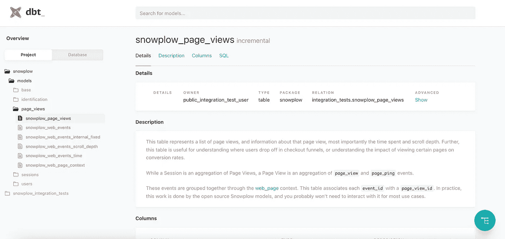
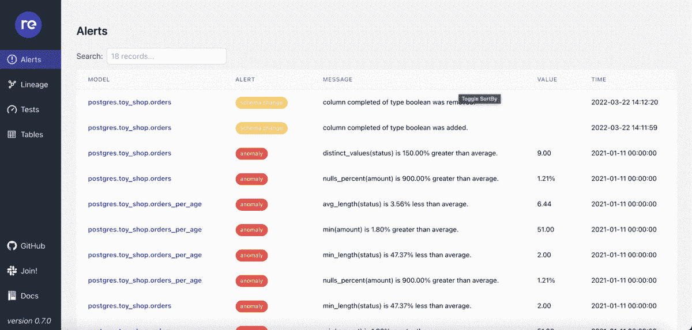

# 使用这个免费的软件包监控您的数据质量，取得成功

> 原文：<https://levelup.gitconnected.com/get-ahead-by-monitoring-your-data-quality-with-this-free-package-2553bdc26f77>

通过实施 re_data 作为数据质量管理的一部分来防止数据和质量损失。


在 [Unsplash](https://unsplash.com?utm_source=medium&utm_medium=referral) 上由 [Austin Distel](https://unsplash.com/@austindistel?utm_source=medium&utm_medium=referral) 拍摄的照片

作为一名数据工程师，我负责数据质量管理，并在数据质量问题发生之前，至少在它们发生时，理想地捕捉它们。

数据构建工具(dbt)允许我查看数据库中正在发生的事情。但是，如果我可以立即得到关于数据库异常的警报，那会怎么样呢？这就是 re_data 发挥作用的地方。

将 dbt 与 re_data 结合起来，可以为您提供一个监控解决方案，帮助您识别问题、修复问题，并为将来划定界限。

在本文中，我首先讨论数据质量管理，为什么持续监控是必要的，最后，实现 re_data。

*不知道 dbt 是什么？了解更多* [*这里*](https://pub.towardsai.net/one-tool-to-rule-them-all-2083371c1618) *。*

# **目录**

1.  [什么是数据质量管理？](#d8da)
2.  [为什么持续监控数据质量很重要？](#c7cf)
3.  [re _ data 简介](#cb85)
4.  [用 dbt 实现 re _ data](#1234)
5.  我如何确保我的数据是准确的？

# 什么是数据质量管理？

数据质量是指数据没有错误和有效使用的程度。一个组织的数据质量可以描述为其获取和使用支持其信息需求的准确可靠数据的有效性的指标。

有两种方法可以实现数据质量管理。另一方面，反应式方法更侧重于在事件发生后发现，而不是在事件发生前发现。它还倾向于更多地关注解决眼前问题，而不是长期问题。

同时，主动方法将数据质量视为一个持续的过程，而不仅仅是一个孤立的事件。它包括对整个数据管道的持续监控，从源头到使用的终点。这种积极主动的方法对于数据对其业务或生存至关重要的组织(如医院、金融机构、情报机构和零售商)至关重要。

# 为什么持续监控数据质量很重要

数据质量对公司的成功至关重要。如今，数据质量管理比以往任何时候都更加重要，因为我们生活在一个大数据时代，数据生成的数量和速度都是前所未有的。数据质量管理有助于我们识别数据集中的错误，修复差异并确保准确性。检测坏数据，然后对其做出响应，有助于降低或消除下游业务风险。

成功的数据管理策略有四个组成部分:监控、建模、测量和改进。监控是通过查找数据集中的异常来检测现有数据问题的过程，这些异常可能表明数据的收集或存储方式存在错误或问题。建模包括检测这些异常，诊断它们为什么会出现，然后做出改变，使它们不再发生。度量包括跟踪这些变化对数据的影响，改进是一个持续的、迭代的过程。

# re_data 简介

dbt 已经提供了一个文档 UI，但是这个要好得多。让我们来看看所涉及的不同部分。

1.  re_data 概览用户界面

这与 dbt 已经提供的非常相似，但是更多。

让我们看看 dbt 文档提供了什么。注意，我说的不是 dbt 云 UI。



我拍摄的[示例](https://www.getdbt.com/example-documentation/#!/model/model.snowplow.snowplow_page_views)的截图

在 UI 中，显示了四个关键特性。首先是细节，说明谁拥有，什么类型，包，关系等。然后，我们还有一个选项来查看 SQL 代码，我们也可以对其进行调整。最后，有一个按钮将显示关系。

尽管 dbt 提供的东西令人惊叹，但 re_data 的 ui 中还有更多。

这里有一个由 re_data 提供的 UI [示例](https://docs.getre.io/ui-latest)。



UI 示例的屏幕截图。由作者创建。

re_data 添加了异常、表度量和列度量，这些可以在 Lineage 选项卡上看到。

**指标**

对于每个被主动监控的表，都计算了某些基本指标。有一组基本表级别，如 row_count、freshness、schema_changes，以及可以包括的基本列级别度量，如 min、max、average、variance、nulls_percent 等。这些指标的完整列表位于[基表级指标](https://docs.getre.io/latest/docs/reference/metrics/base_metrics#base-table-level-metrics)和[基列级指标](https://docs.getre.io/latest/docs/reference/metrics/base_metrics#base-column-level-metrics)中。

找不到您想要查看的指标？别担心。Re_data 使您能够通过将指标添加到 dbt 项目中的 macros 文件夹来创建自己的指标。唯一的警告是，您必须按照以下模式命名它们:`re_data_metric_(your_name)`

**异常检测**

re_data 支持对监控数据进行异常检测。通过使用 Z 分数可以很容易地识别数据是否异常。z 得分衡量给定观察值与平均值之间的标准偏差。

类似地，re_data 使用箱线图，因此我们可以用许多不同的方式来表征变化。使用箱线图，我们可以通过数字数据的四分位数来识别它们的局部性、分布性和偏斜度组。通过计算上限和下限，我们可以识别异常值。

2.re_data 通知

re_data notify 命令用于发送通知，每当附加到 re_data_alerts 的行被触发时，就会触发该命令。这可能是最好的部分，它会将这些通知发送到 slack，这意味着您将实时知道您的数据是什么，您的数据看起来是什么样的。

# 用 dbt 实现 re_data

将包添加到 dbt 文件夹中的 packages.yml 中

```
#packages.yml
packages:
    ***

    - package: re-data/re_data
      version: [">=0.7.0", "<0.8.0"]
```

然后，在环境中安装新的库。

```
dbt deps
```

最后，通过向每个模型的 sql 文件添加一个 config 来配置您想要在 UI 中检查的表，至少是您想要监视的那些表。

```
{{
    config(
      re_data_monitored=true,
      re_data_time_filter='timestamp',
    )
}}
select ...
```

如果您还没有 dbt 项目，请确保运行:

```
re_data init <your_project_name>
```

这将启动一个包含必要文件的 dbt 项目。

否则，您可以通过运行以下命令来开始计算

```
re_data run --start-date <your_date> --end-date <your date> --interval <the interval at which calculations are run>
```

注意，该命令只进行创建或重新填充数据的计算。

# 我如何确保我的数据是准确的？

如果你想要最新的数据，你必须重新运行计算。您可以利用 dbt 云并在那里运行作业，或者使用另一个工具，如 Prefect 或 Airflow。

我在日常工作中使用 Prefect，所以对我来说，添加类似

```
dbt_task(command=’dbt run -m re_data’, task_args={“name”: “re_data monitoring”})
```

是一件非常容易的事情。您将把它添加到您为 Prefect 创建的其他 dbt 任务文件中。

# **结论**

re_data 和 dbt 为数据工程师提供了对他们领域的洞察力(字面上和象征性的)，这种实现成为了主动数据质量管理的关键部分。